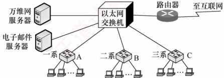
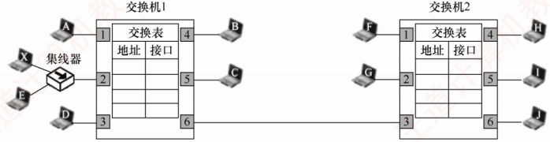
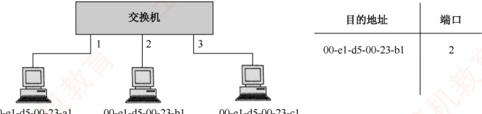
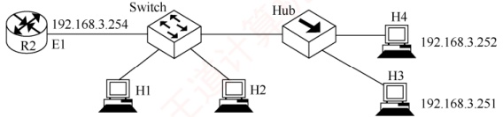

### 3.8.4 本节习题精选

#### 一、 单项选择题

##### 01

下列网络连接设备都工作在数据链路层的是（）。

A. 中继器和集线器

B. 集线器和网桥

C. 网桥和局域网交换机

D. 集线器和局域网交换机
##### 02

下列关于数据链路层设备的叙述中，错误的是（）。

A. 交换机将网络划分成多个网段，一个网段的故障不会影响到另一个网段的运行

B. 交换机可互连不同的物理层、不同的 MAC 子层及不同速率的以太网

C. 交换机的每个接口节点所占用的带宽不会因为接口节点数量的增加而减少，且整个交换机的总带宽会随着接口节点的增加而增加

D. 利用交换机可以实现虚拟局域网（VLAN），VLAN 可以隔离冲突域，但不能隔离广播域

##### 03

下列（）不是使用交换机分割网络所带来的好处。

A. 减少冲突域的范围

B. 在一定条件下增加了网络的带宽

C. 过滤网段之间的数据

D. 缩小了广播域的范围

##### 04

下列不能分割冲突域的设备是（）。

A. 集线器 B. 交换机 C. 路由器 D. 网桥

##### 05

局域网交换机实现的主要功能在（）。

A. 物理层和数据链路层

B. 数据链路层和网络层

C. 物理层和网络层

D. 数据链路层和应用层

##### 06

交换机能比集线器提供更好的网络性能的原因是（）。

A. 交换机支持多对用户同时通信 B. 交换机使用差错控制减少出错率

C. 交换机使网络的覆盖范围更大 D. 交换机无须设置，使用更方便

##### 07

通过交换机连接的一组工作站（）。

A. 组成一个冲突域，但不是一个广播域

B. 组成一个广播域，但不是一个冲突域

C. 既是一个冲突域，又是一个广播域

D. 既不是冲突域，又不是广播域

##### 08

一个16接口的集线器的冲突域和广播域的个数分别是（）。

A. 16,1

B. 16,16

C. 1,1

D. 1,16

##### 09

一个16个接口的以太网交换机，冲突域和广播域的个数分别是（）。

A. 1,1 B. 16,16 C. 1,16 D. 16,1

##### 10

下列关于用集线器连接的共享式以太网的说法中，正确的是（）.

A. 以太网的物理拓扑是总线形结构

B. 以太网提供有确认的无连接服务

C. 以太网参考模型一般只包括物理层和数据链路层

D. 以太网不一定使用 CSMA/CD 协议

##### 11

下列关于广播式网络的说法中，错误的是（）。

A. 共享广播信道

B. 不存在路由选择问题

C. 可以不要网络层

D. 不需要服务接入点

##### 12

对于由交换机连接的 10Mb/s 以太网，若有 10 个用户，则每个用户能占有的带宽为（）。

A. 1Mb/s B. 2Mb/s C. 10Mb/s D. 100Mb/s

##### 13

如下图所示，某学院的以太网交换机有3个接口分别和3个系的以太网相连，另外3个接口分别和万维网服务器、电子邮件服务器以及一个连接互联网的路由器相连，A、B和C都是100Mb/s以太网交换机。假设所有链路的速率都是100Mb/s，且图中9台主机中的任何一台都可以与任何一台服务器或主机通信。这9台主机和2台服务器产生的总吞吐量最大为（）。若把3个系的以太网交换机都换成100Mb/s集线器，则这9台主
机和2台服务器产生的总吞吐量最大为（）。若把所有以太网交换机都换成100Mb/s集线器，则这9台主机和2台服务器产生的总吞吐量最大为（）。

A. 1100Mb/s, 500Mb/s, 100Mb/s

B. 500Mb/s, 500Mb/s, 100Mb/s

C. 1100Mb/s, 1100Mb/s, 500Mb/s

D. 500Mb/s, 1100Mb/s, 500Mb/s

##### 14

假设以太网 A 中 80% 的通信量在本局域网内进行，其余 20% 在本局域网与因特网之间进行，而以太网 B 正好相反。在这两个局域网中，一个使用集线器，另一个使用交换机，则交换机应放置的局域网是（）。

A. 以太网 A B. 以太网 B C. 任意以太网 D. 都不合适

##### 15

在使用以太网交换机的局域网中，以下（）是正确的。

A. 局域网中只包含一个冲突域

B. 交换机的多个接口可以并行传输

C. 交换机可以隔离广播域

D. 交换机根据 LLC 目的地址转发

##### 16

以太网交换机的自学习功能是指（）。

A. 记录帧的源 MAC 地址与该帧进入交换机的接口号

B. 记录帧的目的 MAC 地址与该帧进入交换机的接口号

C. 记录分组的源 IP 地址与该分组进入交换机的接口号

D. 记录分组的目的 IP 地址与该分组进入交换机的接口号

##### 17

当以太网交换机某接口收到帧时，若在交换表中未找到目的 MAC 地址，则（）。

A. 将帧发送到特定接口进行 ARP 查询

B. 丢弃该帧

C. 将帧发送到除本接口外的所有接口

D. 将帧发送给 DHCP 服务器

##### 18

某以太网如下图所示，假设交换机1和交换机2的交换表初始为空，各主机之间依次进行以下通信：A→B、H→A、E→X、X→E，则关于上述通信过程叙述错误的是（）。

A. 当 A→B 时，除 A 外的全部主机都能收到 A 发送的帧

B. 当 H→A 时，仅 A 能收到 H 发送的帧

C. 当 E→X 时，仅 X 能收到 E 发送的帧

D. 当 X→E 时，交换机 2 收不到 X 发送的帧

##### 19

【2009 统考真题】以太网交换机进行转发决策时使用的 PDU 地址是（）。

A. 目的物理地址

B. 目的IP地址

C. 源物理地址

D. 源IP地址

##### 20

【2013 统考真题】对于 100Mb/s 的以太网交换机，当输出端口无排队，以直通交换方式
转发一个以太网帧（不包括前导码）时，引入的转发时延至少是（）。

A.  $0\mu s$ B.  $0.48\mu s$ C.  $5.12\mu s$ D.  $121.44\mu s$

##### 21

【2014 统考真题】某以太网拓扑及交换机的当前转发表如下图所示，主机 00-e1-d5-00-23-a1 向主机 00-e1-d5-00-23-c1 发送一个数据帧，主机 00-e1-d5-00-23-c1 收到该帧后，向主机 00-e1-d5-00-23-a1 发送一个确认帧，交换机对这两个帧的转发端口分别是（）。

00-e1-d5-00-23-a1

00-e1-d5-00-23-b1

A.  $\{3\}$和 $\{1\}$ B.  $\{2,3\}$和 $\{1\}$ C.  $\{2,3\}$和 $\{1,2\}$ D.  $\{1,2,3\}$和 $\{1\}$

##### 22

【2015 统考真题】下列关于交换机的叙述中，正确的是（）。

A. 以太网交换机本质上是一种多端口网桥

B. 通过交换机互连的一组工作站构成一个冲突域

C. 交换机每个接口所连的网络构成一个独立的广播域

D. 以太网交换机可实现采用不同网络层协议的网络互连

##### 23

【2016 统考真题】若主机 H2 向主机 H4 发送一个数据帧，主机 H4 向主机 H2 立即发送一个确认帧，则除 H4 外，从物理层上能够收到该确认帧的主机还有（）。

192.168.3.2

192.168.3.3

A. 仅  $H_{2}$ B. 仅  $H_{3}$ C. 仅  $H_{1}$、 $H_{2}$ D. 仅  $H_{2}$、 $H_{3}$

### 3.8.5 答案与解析

#### 一、 单项选择题

##### 01

C

中继器和集线器都属于物理层设备，网桥和局域网交换机属于数据链路层设备。

##### 02

D

交换机的优点是每个接口节点所占用的带宽不会因为接口节点数量的增加而减少，且整个交换机的总带宽会随着接口节点的增加而增加。另外，利用交换机可以实现虚拟局域网（VLAN），VLAN不仅可以隔离冲突域，还可以隔离广播域。因此选项 C 正确，选项 D 错误。

##### 03

D

交换机可以隔离信息，将网络划分成多个网段，隔离出安全网段，防止其他网段内的用户非法访问。因为网络分段，各网段相对独立，所以一个网段的故障不影响另一个网段的运行。因此B、C正确。根据交换机的特点可知A正确，D错误。

##### 04

A

冲突域是指共享同一信道的各个站点可能发生冲突的范围。物理层设备集线器不能分割冲突
域，数据链路层设备交换机和网桥可以分割冲突域，但不能分割广播域，而网络层设备路由器既可分割冲突域，又可分割广播域。

##### 05

A

局域网交换机是数据链路层设备，能实现数据链路层和物理层的功能。

##### 06

A

交换机能隔离冲突域，在全双工方式下支持多对节点同时通信，从而提高了网络的效率。

##### 07

B

交换机是数据链路层的设备，数据链路层的设备可以隔离冲突域，但不能隔离广播域，因此本题选 B。另外，物理层设备（集线器等）既不能隔离冲突域，又不能隔离广播域；网络层设备（路由器）既可以隔离冲突域，又可以隔离广播域。

##### 08

C

物理层设备（中继器和集线器）既不能分割冲突域，又不能分割广播域。

##### 09

D

以太网交换机的各接口之间都是冲突域的终止点，但 LAN 交换机不隔离广播，所以冲突域的个数是 16，广播域的个数是 1。

##### 10

C

用集线器连接的以太网逻辑上是总线形结构，物理上是星形结构，选项 A 错误。以太网设计的原则是简化通信，因此采用的是无确认、无连接的服务，选项 B 错误。以太网属于局域网的一种设计标准，只包括物理层和数据链路层，比如在物理层以太网规定采用曼彻斯特编码，在数据链路层规定采用 CSMA/CD 协议，选项 C 正确。用集线器连接的以太网一定工作在半双工方式下，因此一定要采用 CSMA/CD 协议，选项 D 错误。

##### 11

D

广播式网络使用共享的广播信道进行通信，通常是局域网的一种通信方式（局域网工作在数据链路层），因此可以不需要网络层，也就不存在路由选择问题。但数据链路层使用物理层的服务必须通过服务接入点，数据链路层向高层提供服务也必须通过服务接入点。

##### 12

C

对于集线器连接的 10Mb/s 共享式以太网，若有 N 个用户，则每个用户的平均带宽仅为总带宽的 1/N。当采用交换机连接时，虽然从每个接口到主机的带宽还是 10Mb/s，但因为一个用户通信时是独占带宽的，而不是和其他用户共享带宽的，所以每个用户仍可得到 10Mb/s 的带宽。

##### 13

A

9 台主机和 2 台服务器都全速工作时的总吞吐量为  $900 + 200 = 1100 Mb/s$。若把 3 个系的以太网交换机都换成 100 Mb/s 集线器，则每个系是一个碰撞域，最大吞吐量为 100 Mb/s，加上每台服务器 100 Mb/s 的吞吐量，得出总吞吐量最大为  $500 Mb/s$。若把所有的以太网交换机都换成 100 Mb/s 集线器，则整个网络是一个碰撞域，因此吞吐量最大为  $100 Mb/s$。

##### 14

A

交换机能将网络分成较小的冲突域，而集线器连接的设备属于同一个冲突域。当一个局域网中80%的通信量在本局域网内进行时，若使用集线器，则会增加冲突和延迟，降低整个网络的效率，而若使用交换机将不同网段的通信隔开，则可以提高网络性能。

##### 15

B

交换机可以隔离冲突域，因此它的每个接口所连接的网段都属于不同的冲突域，选项 A 错误。交换机可在同一时段内支持多个接口之间的并行通信，而不会相互干扰，这是因为交换机内部有
一条高带宽的背部总线和一个内部交换矩阵，可以根据帧的目的 MAC 地址快速地将帧转发到相应的接口。交换机不能隔离广播域，选项 C 错误。LLC 是逻辑链路控制，它在 MAC 层上，用于向网络提供一个接口，以隐藏各种 802 网络之间的差异，交换机是按 MAC 地址转发的，选项 D 错误。

##### 16

A

以太网交换机的自学习功能是指记录帧的源 MAC 地址与该帧进入交换机的接口号，并将这些信息存储在交换机的交换表中，以便于后续的转发决策。

##### 17

C

当以太网交换机的某个接口收到帧时，若在交换表中未找到目的 MAC 地址，则将该帧从除本接口外的所有接口发送出去，这种发送方法也称洪泛法。

##### 18

C

当 A→B 时，交换表都为空，交换机 1 和交换机 2 都进行洪泛发送，因此除 A 外的全部主机都能收到 A 发送的帧。当 H→A 时，因为交换机 2 已登记 A 所在的接口为 3，所以只向接口 3 转发，交换机 1 收到帧后，因为交换机 1 已登记 A 所在的接口为 1，所以只向接口 1 转发，因此仅 A 能收到 H 发送的帧。当 E→X 时，集线器向除输入接口外的所有接口转发该帧，交换机 1 和交换机 2 也进行洪泛发送，因此除 E 外的全部主机都能收到 A 发送的帧。当 X→E 时，因为交换机 1 已登记 E 所在的接口为 2，所以仅登记 X 所在的接口，并丢弃该帧。

##### 19

A

交换机实质上是一个多接口网桥，工作在数据链路层，数据链路层使用物理地址进行转发，而转发到目的地需要使用目的地址。因此PDU地址是目的物理地址。

##### 20

B\

直通交换方式的输入接口接收到一个帧时，只检查帧的目的 MAC 地址决定输出接口，引入的转发时延至少为读取目的 MAC 地址所需的时间。目的 MAC 地址共 6B，引入的转发时延至少为  $6 \times 8\text{bit} = 100\text{Mb/s} = 0.48\mu\text{s}$。存储转发方式引入的转发时延则至少为读取整个帧的时间。

##### 21

B

当 00-e1-d5-00-23-a1 向 00-e1-d5-00-23-c1 发送数据帧时，交换机转发表中没有 00-e1-d5-00-23-c1 这一项，所以向除接口 1 外的所有接口广播这个帧，即接口 2、3 会转发这个帧，同时交换机会把（目的地址 00-e1-d5-00-23-a1，接口 1）这一项加入转发表。而当 00-e1-d5-00-23-c1 向 00-e1-d5-00-23-a1 发送确认帧时，因为转发表中已有 00-e1-d5-00-23-a1 这一项，所以交换机只向接口 1 转发。

##### 22

A

本质上说，交换机就是一个多接口的网桥（选项 A 正确），工作在数据链路层（因此不能实现不同网络层协议的网络互连，选项 D 错误），交换机能经济地将网络分成小的冲突域（选项 B 错误）。广播域属于网络层概念，只有网络层设备（如路由器）才能分割广播域（选项 C 错误）。

##### 23

D

交换机（Switch）可以隔离冲突域。若 H2 向 H4 发送数据帧，则 H2 及其对应接口就写入交换表。当 H4 向 H2 发送确认帧时，交换机查找交换表后，将该确认帧从 H2 对应的接口转发出去。集线器（Hub）无法隔离冲突域，因此 Hub 会向所有接口（除输入接口外）广播该确认帧的数据信号。因此，从物理层上能够收到该确认帧的主机有 H2 和 H3。
