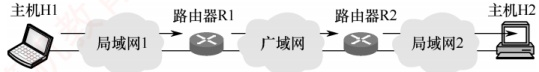
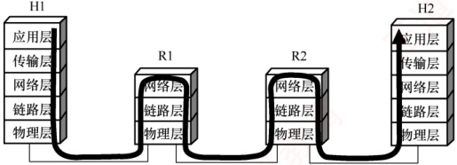
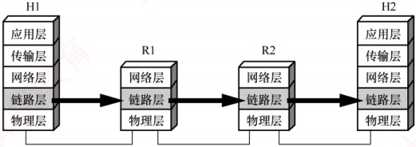
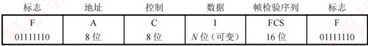

## 3.1 数据链路层的功能

数据链路层的主要任务是让帧在一段链路或一个网络中传输。尽管数据链路层协议种类繁多，但它们都需解决三个基本问题：封装成帧、透明传输和差错检测。

数据链路层使用的信道主要有两种：

1）点对点信道：一对一通信，通常通过一条专用物理链路连接两个节点。
2）广播信道：一对多通信，单个节点发送的数据可被连接在同信道上的所有节点接收。

### 3.1.1 数据链路层所处的地位

以两台主机通过互联网通信为例（见图3.1）：局域网1中的主机H1经路由器R1、广域网及路由器R2，连接到局域网2中的主机H2。

主机 H1 和 H2 均具备完整的五层协议栈；路由器在转发分组时仅使用协议栈的下三层。当H1向H2发送数据时，数据在各节点的协议栈中多次上下流动（见图3.2）：进入路由器后，先从物理层上至网络层，在转发表中确定下一跳地址，再下至物理层转发出去。

图 3.1 主机 H1 向 H2 发送数据

图3.2 从协议的层次上看数据的流动

然而，在学习数据链路层时，我们通常聚焦于水平方向的数据链路层交互。此时可将通信过程简化为：H1 的链路层→R1 的链路层→R2 的链路层→H2 的链路层（见图 3.3）。这三段链路可能采用不同的数据链路层协议，但每一段都独立完成帧的传输任务。

图3.3 只考虑数据在数据链路层的流动

下面介绍点对点信道的基本概念，其中部分也适用于广播信道。

1）链路。指从一个节点到相邻节点的一段物理线路，是通信路径的组成部分。

2）数据链路。在物理链路上添加实现通信协议的软硬件后所形成的逻辑通信通道。

3）帧。数据链路层对等实体间通信的协议数据单元。发送方将网络层交下的数据封装为帧发送；接收方从帧中提取数据并上交网络层。

### 3.1.2 链路管理

链路管理是指数据链路层连接的建立、维持和释放过程，主要用于面向连接的服务。

通信双方必须首先确认对方处于就绪状态，并交换必要信息（如初始化帧序号），才能建立
连接：传输过程中需维持连接状态；通信结束后则释放连接。

### 3.1.3 封装成帧与透明传输

封装成帧是指在数据前后分别添加首部和尾部，构成一个完整的帧。帧长等于帧的数据部分长度加上首部和尾部的长度。首部和尾部包含控制信息，其核心作用是帧定界——帮助接收方从比特流中准确识别帧的起始与结束。例如，在 HDLC 协议中，使用标识字段 F（01111110）标识帧的开始和结束。接收方将第一个 F 视为帧的开始，下一个 F 标志该帧的结束，如图 3.4 所示。为提高传输效率，应使数据部分尽可能长，但帧过长会增加差错概率和重传开销。因此，各类链路层协议均规定了最大传送单元（MTU），即帧数据部分的长度上限。

图 3.4 HDLC 帧格式

透明是计算机领域的一个重要概念，意指某事物虽存在，但对上层不可见。

透明传输是数据链路层的重要特性。“透明”在此意为：即使数据中恰好出现与帧定界符相同的比特组合，也不会被误判为帧边界。若不处理此问题，接收方可能提前结束帧解析，导致后续数据丢失。实现透明传输后，接收方能将帧完整恢复为原始SDU（服务数据单元），使网络层“感知不到”底层的帧封装过程——即数据链路层对上层是透明的。

### 3.1.4 流量控制

由于链路两端节点的处理速率或缓存能力存在差异，若发送方速率过高，接收方可能因来不及处理而导致帧丢失。因此，流量控制旨在限制发送方的发送速率，使其不超过接收方的接收能力。该过程通常依赖反馈机制：发送方根据接收方的确认或窗口信息，决定是否继续发送。

在 OSI 模型中，流量控制由数据链路层实现，用于调节相邻节点间的流量；而在 TCP/IP 模型中，该功能主要由传输层（如 TCP）承担，负责端到端的流量控制。

### 3.1.5 差错检测与可靠传输

由于信道噪声等因素，帧在传输过程中可能出现两类错误。

1）位错：帧中某些比特发生翻转，通常通过循环冗余检验检测。

2）帧错：包括帧丢失、重复或失序等，属于更高层的传输差错。

早期 OSI 模型认为，数据链路层必须向上提供可靠传输服务。因此，在 CRC 检错基础上，引入了帧编号、确认与重传机制：接收方收到正确帧后需发送确认；发送方若在规定时间内未收到确认，则判定为出错并重传，直至收到确认为止。

如今，是否采用可靠传输机制取决于信道质量：在通信质量较差的无线链路中，数据链路层仍使用确认与重传机制，以提供可靠服务；而在高质量的有线链路中，数据链路层仅进行 CRC 检错，将出错帧直接丢弃，不再负责重传。此时，重传任务由高层协议（如传输层 TCP）完成。核心原则是，数据链路层确保上交的帧无差错，但不保证所有帧都被成功交付。
