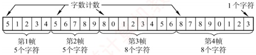
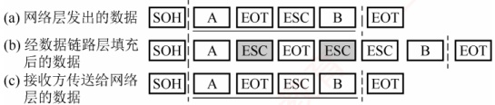
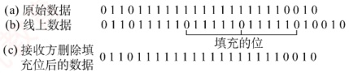

## 3.2 组帧

发送方依据特定规则，将网络层递交的分组封装成帧（也称组帧）。数据链路层以帧为单位传输数据，主要目的是：一旦出错，只需重发出错的帧，而不必重传全部数据，从而提高传输效率。组帧需解决帧定界、帧同步和透明传输等问题。常见的组帧方法主要有以下四种。

**注意**

组帧时通常 **既要添加首部**， **也要添加尾部**。原因在于，网络中信息以帧为最小传输单位，接收方必须能准确识别一帧在比特流中的 **起始与结束位置**，否则无法正确解析帧内容。

### 3.2.1 字符计数法

字符计数法在帧首部设置一个计数字段，用于记录该帧包含的总字节数（包括计数字段自身占用的1B），如图3.5所示。接收方读取该计数值后，即可确定后续数据的长度，从而定位帧的结束位置；由于帧是连续传输的，下一帧的起始位置也随之确定。

图 3.5 字符计数的过程示例

字符计数法的主要缺陷是：当计数字段在传输过程中出错时，接收方将无法正确识别帧的边界，导致收发双方失去同步，可能引发灾难性后果。

### 3.2.2 字节填充法

字节填充法通过特定控制字符实现帧定界。在图3.6中，控制字符SOH表示帧的起始，EOT表示帧的结束。为避免数据中出现的SOH或EOT被误判为帧的定界符，发送方会在这些特殊字符前插入一个ESC字符（注意，ESC是ASCII码中的一个单字节控制字符），以实现透明传输。若数据中原本就包含ESC，则同样在其前再插入一个ESC。接收方收到ESC后，会将其丢弃，并将紧随其后的字符视为普通数据（而非控制字符），从而还原出原始数据。

图3.6 字节填充的过程示例

当帧的数据部分中出现 ESC、EOT 或 SOH 时 [见图 3.6(a)]，发送方在每个 ESC、EOT 或 SOH 之前插入一个 ESC 字符 [见图 3.6(b)]，接收方处理后恢复原数据 [见图 3.6(c)]。
### 3.2.3 零比特填充法

### 考点追踪 HDLC 的比特填充规则（2013）

零比特填充法允许数据帧包含任意数量的比特，并用固定比特串01111110作为帧的起始和结束标志，如图3.7所示。为防止数据字段中出现与标志相同的比特序列，发送方在扫描数据时，每遇到5个连续的“1”，就在其后自动插入一个“0”，确保数据字段中不会出现6个连续的“1”，避免与帧标志混淆。接收方执行逆操作：每收到5个连续的“1”，就自动删除其后的“0”，以恢复原始数据。早期的HDLC协议正是采用这种方法来实现透明传输。

图3.7 比特填充过程示例

零比特填充法易于硬件实现，性能优于字节填充法。

### 3.2.4 违规编码法

违规编码法利用物理层编码的冗余特性实现帧定界。例如，在曼彻斯特编码中：比特“1”编码为“高-低”电平对，比特“0”编码为“低-高”电平对。而“高-高”或“低-低”电平对在数据比特中是违规的（未被采用），因此可借用这些违规编码序列来标识帧的起始或终止。局域网 IEEE 802 标准采用了这种方法（更多介绍见 3.6.2 节）。违规编码法无须任何填充技术即可实现透明传输，但仅适用于采用冗余编码的特殊编码环境。

由于字符计数法对计数字段错误极为敏感，而字节填充法在实现上较为复杂且存在兼容性问题，因此目前更常用的组帧方法是零比特填充法和违规编码法。
