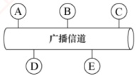
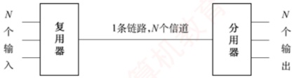
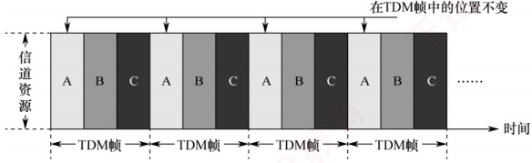
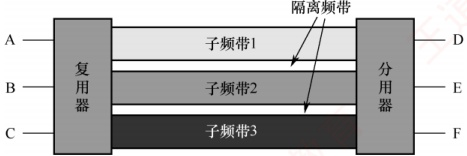
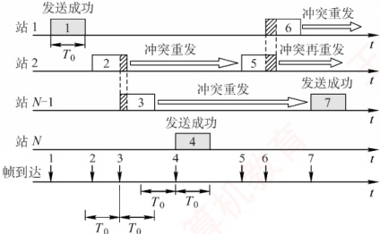
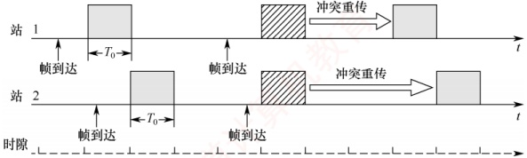

## 3.5 介质访问控制

介质访问控制的主要任务是协调共享同一信道的各节点的传输行为，以避免彼此之间的信号
冲突。如图3.15所示，在广播信道中，节点A、B、C、D和E共享同一信道。若A与C、B与D同时通信且未加控制，则可能因信号干扰而通信失败。用于决定广播信道资源分配的协议属于数据链路层的介质访问控制（Medium Access Control，MAC）子层。

常见的介质访问控制方法包括：信道划分介质访问控制、随机访问介质访问控制和轮询访问介质访问控制。其中，前者采用静态划分信道的方式，后两者则属于动态分配信道的方法。

图 3.15 广播信道的通信方式

### 3.5.1 信道划分介质访问控制

信道划分介质访问控制通过复用技术，将同一传输介质上的多个设备通信隔离开来，合理分配时域或频域资源。所谓复用，是指在发送端将多个发送方的信号组合到一条物理信道上传输，在接收端再将复用信号分离，并交付给对应的接收方，如图3.16所示。当传输介质的带宽超过单个信号所需带宽时，复用技术还能有效提高传输系统的利用率。

图 3.16 复用原理示意图

信道划分的实质是通过分时、分频、分码等方式，将一个广播信道在逻辑上划分为若干互不干扰的子信道，从而实现多个点对点通信。信道划分介质访问控制主要包括以下四种方式。

#### 1. 时分复用（TDM）

### 考点追踪 ▶ 时分复用的概念（2013）

时分复用（Time Division Multiplexing，TDM）将信道的传输时间划分为等长的时间片，构成一个TDM帧。每个用户在每个TDM帧中占用固定序号的时隙，且该时隙周期性出现（周期即为TDM帧长度）。所有用户在不同时间共享相同的信道资源，如图3.17所示。需注意，TDM帧是一段固定长度的时间间隔，与数据链路层的“帧”概念不同。

图 3.17 时分复用的原理示意图

从某一时刻看，信道上传送的是某对用户之间的信号；从一段时间看，则是按时间分割的复用信号。由于 TDM 按固定次序分配时隙，当某用户暂无数据发送时，其分配的时隙仍被保留，
无法被其他用户利用，因此信道利用率较低。统计时分复用（Statistic TDM，STDM）也称异步时分复用，是对 TDM 的改进。STDM 不固定分配时隙，而是按需动态分配：仅当用户有数据要发送时，才为其分配 STDM 帧中的时隙，从而显著提高线路利用率。例如，假设线路数据速率为 6000b/s，3 个用户的平均速率均为 2000b/s。采用 TDM 时，每个用户固定分配 2000b/s 的带宽；而在 STDM 下，各用户可动态共享全部带宽。当其他用户无数据发送时，某一用户可利用接近线路总速率（此处为 6000b/s）的带宽进行突发传输，进而显著提高线路的平均利用率。

#### 2. 频分复用（FDM）

### 考点追踪 频分复用的概念（2013）

频分复用（Frequency Division Multiplexing，FDM）将信道的总频带划分为多个子频带，每个子频带作为一个独立子信道，供一对用户通信使用，如图3.18所示。所有用户在同一时间占用不同的频带资源。各子信道分配的带宽可以不同，但总和不得超过信道的总带宽。为防止相邻子信道间相互干扰，实际应用中通常还需在它们之间设置“隔离频带”。

图 3.18 频分复用的原理示意图

频分复用的优点在于能充分利用传输介质的带宽，系统效率较高，且实现相对简单。

#### 3. 波分复用（WDM）

波分复用（Wavelength Division Multiplexing，WDM）即光的频分复用。它在一根光纤中同时传输多种不同波长的光信号。由于波长不同，各路光信号互不干扰，接收端通过光分用器将各波长分离出来。由于光波位于电磁频谱的高频段，具有极大的带宽，因此可支持多路的波分复用。

#### 4. 码分复用（CDM）

### 考点追踪 ▶ 码分复用的概念（2013）

码分复用（Code Division Multiplexing，CDM）是一种采用不同编码来区分各路原始信号的复用方式。与FDM和TDM不同，CDM既共享信道的频率，又共享时间。

实际上，更常用的名词是码分多址（Code Division Multiple Access，CDMA），其原理是将每个比特时间进一步划分为 m 个短的时间槽，称为码片（Chip），通常 m 的值为 64 或 128，为了简化说明，下例中设 m = 8。每个站点指派一个唯一的 m 位码片序列。发送 1 时，站点发送其码片序列；发送 0 时，站点发送该码片序列的反码。当两个或多个站点同时发送时，各路数据在信道中线性相加。为了从信道中分离出各路信号，各个站点的码片序列应相互正交。

简单理解就是，A 站向 C 站发出的信号用一个向量表示，B 站向 C 站发出的信号用另一个向量表示，这两个向量要求相互正交。向量中的分量即所谓的码片。

下面举例说明 CDMA 的原理。

令向量 S 表示 A 站的码片向量，T 表示 B 站的码片向量。假设 A 站的码片序列被指派为 00011011，则 A 站发送 00011011 表示发送比特 1，发送 11100100 表示发送比特 0。为便于计算，将码片中的 0 写为 -1，1 写为 +1，因此 A 站的码片序列是  $(-1 -1 -1 +1 +1 -1 +1 +1)$。

不同站点的码片序列相互正交，即向量 S 和 T 的规格化内积为 0:
 $$\boldsymbol{S}\bullet\boldsymbol{T}=\frac{1}{m}\sum_{i=1}^{m}S_{i}T_{i}=0$$

任何站点的码片向量和该码片向量自身的规格化内积都是1：

 $$S\bullet S=\frac{1}{m}\sum_{i=1}^{m}S_{i}S_{i}=\frac{1}{m}\sum_{i=1}^{m}S_{i}^{2}=\frac{1}{m}\sum_{i=1}^{m}(\pm1)^{2}=1$$

任何站点的码片向量和该码片反码的向量的规格化内积都是-1：

 $$S\bullet\overline{S}=\frac{1}{m}\sum_{i=1}^{m}S_{i}\overline{S_{i}}=-\frac{1}{m}\sum_{i=1}^{m}S_{i}^{2}=-1$$

令向量 T 为  $(-1-1+1-1+1+1+1-1)$。

当A站向C站发送数据1时，就发送了向量 $(-1-1-1+1+1-1+1+1)$。

当 B 站向 C 站发送数据 0 时，就发送了向量  $(+1+1-1+1-1-1-1+1)$。

两个向量在公共信道上叠加，实际上是线性相加，得到

 $$\boldsymbol{S}+\overline{\boldsymbol{T}}=(0\quad0\quad-2\quad2\quad0\quad-2\quad0\quad2)$$

### 考点追踪 CDMA 中的数据恢复计算（2014）

到达 C 站后，进行数据分离。若要提取来自 A 站的数据，则 C 站需知道 A 站的码片向量 S，并计算 S 与  $S + \overline{T}$ 的规格化内积。根据叠加原理，其他站点的信号都在内积结果中被过滤掉，内积的相关项都是 0，而保留 A 站发送的信号，得到

 $$S\bullet(S+\overline{T})=1$$

因此，A 站发出的数据是 1。同理，若要提取来自 B 站的数据，则

 $$T\bullet(S+T)=-1$$

因此，从 B 站发送过来的信号向量是一个反码向量，代表 0。

规格化内积是线性代数的内容，它在计算两个向量的内积后，再除以向量的分量个数。

下面举一个直观的例子来理解频分复用、时分复用和码分复用。

假设 A 站要向 C 站运送黄豆，B 站要向 C 站运送绿豆，A 站、B 站与 C 站之间有一条公共道路，可类比为广播信道。在频分复用方式下，公共道路被划分为两个车道，分别供 A 站到 C 站、B 站到 C 站的车通行，两类车可以同时通行，但都只使用了一半的道路，因此频分复用（波分复用也类似）共享时间而不共享空间。在时分复用方式下，先让 A 站到 C 站的车走一趟，再让 B 站到 C 站的车走一趟，两类车交替使用道路，因此时分复用共享空间，但不共享时间。码分复用与另外两种信道划分方式极为不同，在这种方式下，黄豆与绿豆放在同一辆车上运送，到达 C 站后，由 C 站负责把车上的黄豆和绿豆分开，因此码分复用既共享空间，又共享时间。

码分复用技术具有频谱利用率高、抗干扰能力强、保密性好、语音质量好等优点，还可以减少投资及降低运行成本，广泛应用于无线通信系统，特别是移动通信系统。

### 3.5.2 随机访问介质访问控制

### 考点追踪 信道划分与随机访问介质访问控制的特点（2014）

在随机访问协议中，不采用集中控制方式来协调各站点的发送次序，而是允许所有用户根据自身意愿随机发送信息，并可占用信道的全部带宽。在总线形网络中，当两个或多个用户同时发送信息时，就会产生冲突（也称碰撞），导致所有冲突用户的发送均以失败告终。为解决此类冲突，每个用户需按照特定规则反复重传帧，直至该帧无冲突地成功传输。随机访问介质访问控制的核心思想是：通过争用获得信道使用权，胜者方可发送数据。
可见，若采用信道划分机制，节点之间的通信要么共享时间，要么共享空间，要么两者兼有；而若采用随机访问控制机制，则节点在发送时既不预留时间，也不独占频段。因此，随机介质访问控制实质上是将广播信道动态地转化为点到点信道的机制。

#### 1. ALOHA 协议

ALOHA 协议分为纯 ALOHA 协议和时隙 ALOHA 协议两种。

##### （1） 纯 ALOHA 协议

纯 ALOHA 协议的基本思想：当总线形网络中的任一站点需要发送数据时，可立即发送，无须事先检测信道状态。若在一段时间内未收到确认，则认为传输过程中发生了冲突。此时，该站点需等待一段随机时间后重传，直至发送成功。

图 3.19 展示了纯 ALOHA 协议的工作原理。假设所有帧长度固定，帧长不用比特数表示，而用发送该帧所需的时间表示，图中以  $T_{0}$ 表示这一时间。

图 3.19 一个纯 ALOHA 协议的工作原理

在图3.19的示例中，站1发送帧1时，其他站点均未发送数据，因此帧1成功传输。但随后站2和站N-1发送的帧2与帧3在时间上部分重叠，发生冲突。发生冲突的各站必须重传，但不能立即重传（否则会再次冲突），而是等待一段随机时间后再尝试。若重传仍冲突，则重复此过程，直至成功。图中其他帧的发送情况为：帧4成功，帧5与帧6发生冲突。

由于冲突概率较高，该协议的吞吐量很低。为克服这一缺点，提出了时隙 ALOHA 协议。

##### （2） 时隙 ALOHA 协议

时隙 ALOHA 协议将时间划分为等长的时隙（Slot），并要求所有站点同步时钟。站点只能在每个时隙的起始时刻发送帧，且一帧的发送时间必须小于或等于一个时隙长度。这种约束减少了发送的随意性，从而降低了冲突概率，提高了信道利用率。

图 3.20 展示了两个站点的时隙 ALOHA 协议工作原理。每个帧到达后，通常需在缓存中等待不足一个时隙的时间，才能在下一个时隙开始时发送。若在一个时隙内有两个或更多帧待发，则它们将在下一可用时隙同时发送，导致冲突。冲突后的重传策略与纯 ALOHA 协议类似。

图 3.20 两个站的时隙 ALOHA 协议的工作原理

#### 2. CSMA 协议

### 考点追踪 基本 CSMA 协议的概念（2013）

ALOHA 协议网络的冲突概率较高。若每个站点在发送前先监听信道，仅在信道空闲时才发送，则可显著降低冲突概率，提高信道利用率。载波监听多路访问（Carrier Sense Multiple Access，CSMA）协议正是基于这一思想，在 ALOHA 协议基础上引入了载波监听机制。

根据监听策略及信道忙时的处理方式不同，CSMA协议可分为以下三种类型。

#### （1） 1-坚持 CSMA 协议

1-坚持 CSMA 协议的基本思想：站点欲发送数据时，先监听信道；若信道空闲，则立即发送；若信道忙，则持续监听，直至信道变为空闲。“1-坚持”中的“1”表示信道空闲时，以概率1立即发送，“坚持”指信道忙时持续监听。

#### （2） 非坚持 CSMA 协议

非坚持 CSMA 协议的基本思想：站点欲发送数据时，先监听信道；若信道空闲，则立即发送；若信道忙，则不再监听，而是等待一段随机时间后重新尝试监听。该策略避免了多个站点在信道刚空闲时同时发送而导致的冲突，但因随机等待增加了平均传输时延。

#### （3） p-坚持 CSMA 协议

p-坚持 CSMA 协议适用于时隙化信道，基本思想：站点在时隙开始时监听信道；若信道忙，则等到下一时隙再监听；若信道空闲，则以概率 p 发送数据，以概率 1-p 推迟到下一时隙再尝试。

该机制通过概率延迟，降低了多个站点同时发送的冲突概率；通过持续监听（而非随机退避），又避免了非坚持 CSMA 协议的过长延迟。因此，p-坚持 CSMA 协议是 1-坚持与非坚持 CSMA 协议的折中。

三种不同类型的 CSMA 协议比较如表 3.1 所示。

表3.1 三种不同类型的 CSMA 协议比较

| 信道状态 | 1-坚持 | 非 坚 持 | p-坚持 |
| --- | --- | --- | --- |
| 空闲 | 立即发送 | 立即发送 | 以概率 p 发送，以概率 1 - p 推迟到下一个时隙 |
| 忙 | 持续监听 | 放弃监听，等待随机时间后再监听 | 持续监听（等到下一时隙） |

介绍 ALOHA 协议和基本 CSMA 协议后，自然会引出两种重要的改进方案：CSMA/CD（载波监听多路访问/冲突检测）协议和 CSMA/CA（载波监听多路访问/冲突避免）协议。二者均在 CSMA 协议的基础上引入了冲突处理机制，但针对不同物理介质的特点采用了差异化策略：CSMA/CD 协议适用于有线总线形以太网，通过实时检测冲突并在发生后立即中止发送、执行退避重传，有效提升了通信效率；而 CSMA/CA 协议则专为无线局域网设计，由于无线环境难以有效检测冲突，因此转而采用主动避免机制来降低冲突概率。这两种协议将分别在 3.6.2 节和 3.6.3 节中展开介绍。

### 3.5.3 轮询访问：令牌传递协议

在轮询访问机制中，各站点不能随机发送信息，而是通过一个集中控制的监控站，以循环方式轮询每个节点，来决定信道的分配。典型的轮询访问控制协议是令牌传递协议。

在令牌传递协议中，一个令牌（Token）沿着环形网络在各站点之间依次传递。令牌是一个特殊的控制帧，本身并不包含数据，仅用于控制信道的使用，确保同一时刻只有一个站点独占信道。当环上的某个站点希望发送帧时，必须等待令牌。只有取得令牌后，该站点才能发送帧，因此令牌环网络不会发生冲突（因为令牌只有一个）。站点发送完一帧后，应释放令牌，以便其他
站点使用。由于令牌按顺序依次传递，所有联网计算机对信道的访问权是公平的。

IEEE 802.5 令牌环网络中令牌和数据的传递过程如下：

1）当网络空闲时，环路中只有令牌帧在循环传递。

2）当令牌传递到有数据要发送的站点时，该站点修改令牌中的一个标志位，并在令牌中附加需要传输的数据，从而将令牌转换为一个数据帧，并将其发送出去。

3）数据帧沿着环路传输，各中间站点一边转发该帧，一边检查其目的地址。若目的地址与本站地址相同，则复制该数据帧用于本地处理，但仍继续转发。

4）数据帧沿环路继续传输，直至返回源站。源站识别出这是自己发出的帧后，便不再转发，并通过检验返回的帧判断传输过程中是否出错；若出错，则安排重传。

5）源站完成数据发送后，重新生成一个令牌，并传递给下一站点，交出信道控制权。

令牌传递协议非常适合高负载的广播信道（多个节点在同一时刻发送数据的概率较大），若采用随机介质访问控制，则冲突概率显著升高。令牌传递协议既不依赖时间分割，也不依赖空间隔离；它通过严格限制同一时刻仅有一个站点拥有发送权限，从根本上避免了冲突。

即使是广播信道，也可通过介质访问控制机制，将其转换为逻辑上的点对点信道。
