## 3.6 局域网

### 3.6.1 局域网的基本概念和体系结构

局域网（Local Area Network，LAN）是指在一个较小的地理范围（如一所学校）内，将各种计算机、外部设备和数据库系统等通过双绞线、同轴电缆或光纤等传输介质互连起来，构成一个可实现资源与信息共享的计算机网络。其主要特点如下：

1）通常为一个单位所拥有，地理范围和站点数量均有限。

2）所有站点共享较高的总带宽（较高的数据传输速率）。

3）具有较低的传输时延和较低的误码率。

4）各站点地位平等，不存在主从关系。

5）支持广播和多播通信。

局域网的特性主要由三个要素决定：拓扑结构、传输介质和介质访问控制方式，其中介质访问控制方式最为关键，它直接决定局域网的技术特性。常见的局域网拓扑结构主要有四类：① 星形结构；② 环形结构；③ 总线形结构；④ 星形和总线形结合的复合型结构。局域网可采用铜缆、双绞线、同轴电缆和光纤等多种传输介质，其中双绞线是目前的主流选择。局域网的介质访问控制方法主要包括：CSMA/CD 协议、令牌总线协议和令牌环协议。其中，CSMA/CD 协议和令牌总线协议主要用于总线形局域网，而令牌环协议则主要用于环形局域网。

三种典型的局域网实现及其逻辑与物理拓扑如下：

以太网（目前使用范围最广）。逻辑拓扑为总线形结构，物理拓扑为星形结构。

令牌环（Token Ring，IEEE 802.5）。逻辑拓扑为环形结构，物理拓扑为星形结构。

光纤分布数字接口（FDDI，IEEE 802.8）。逻辑拓扑为环形结构，物理拓扑为双环结构。

IEEE 802 标准定义的局域网参考模型仅对应于 OSI 参考模型的数据链路层和物理层，并将数据链路层进一步拆分为两个子层：逻辑链路控制（LLC）子层和介质访问控制（MAC）子层。与接入传输介质有关的内容都放在 MAC 子层，它向上层屏蔽对物理层访问的各种差异，主要功能包括：组帧和拆卸帧、比特传输差错检测、透明传输。LLC 子层与传输介质无关，它向网络层提供无确认无连接服务、面向连接服务、带确认无连接服务等多种服务类型。

由于以太网在局域网市场中的主导地位，它几乎成为局域网的代名词。与此同时，IEEE 802
委员会定义的 LLC 子层在实际应用中作用已显著弱化，因此现代许多网卡仅实现 MAC 协议，而不包含 LLC 协议。IEEE 802 协议层与 OSI 参考模型的对比关系如图 3.21 所示。

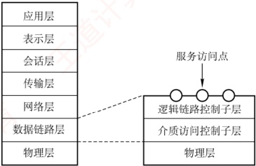

图 3.21 IEEE 802 协议层与 OSI 参考模型的比较

### 3.6.2 以太网与 IEEE 802.3

以太网是目前最流行的有线局域网技术。

以太网规约的第一个版本是 DIX V1，由 DEC、Intel 和 Xerox 联合提出。随后，它被修订为第二版规约 DIX Ethernet V2，成为世界上首个局域网产品的规范。在此基础上，IEEE 802委员会的 IEEE 802.3 工作组制定了第一个 IEEE 以太网标准——IEEE 802.3。

严格来说，以太网指符合 DIX Ethernet V2 标准的局域网。但由于 DIX Ethernet V2 与 IEEE 802.3 标准差异极小，因此也常将 IEEE 802.3 局域网简称为以太网。

### 考点追踪 以太网 MAC 协议的服务模型（2012）

以太网采用两项措施来简化通信：① 采用无连接的工作方式，既不对发送的数据帧编号，也不要求接收方返回确认。因此，以太网提供的是不可靠的尽最大努力交付服务，差错纠正由高层协议（如 TCP）完成；② 所有发送的数据均使用曼彻斯特编码，每个码元中间有一次电压跳变，接收方可利用该跳变方便地提取位同步信号。

#### 1. 以太网的传输介质与网卡

以太网常用的传输介质有四种：粗缆、细缆、双绞线和光纤，其适用情况见表3.2。

表3.2 各种传输介质的适用情况

| 标准名称 | 10Base-5 | 10Base-2 | 10Base-T | 10Base-F |
| --- | --- | --- | --- | --- |
| 传输介质 | 同轴电缆（粗缆） | 同轴电缆（细缆） | 非屏蔽双绞线 | 光纤对（850nm） |
| 编码 | 曼彻斯特编码 | 曼彻斯特编码 | 曼彻斯特编码 | 曼彻斯特编码 |
| 拓扑结构 | 总线形 | 总线形 | 星形 | 点对点 |
| 最大段长 | 500m | 185m | 100m | 2000m |
| 最多节点数量 | 100 | 30 | 2 | 2 |

**注意**

在上述标准中，“10”表示速率为10Mb/s；“Base”表示基带以太网；早期标准中，“Base”后的“5”或“2”分别表示单段最大传输距离约为500m或185m，“T”代表双绞线，“F”代表光纤。

计算机与外界局域网的连接通过主板上嵌入的网络适配器（Adapter）实现，也称网络接口卡（NIC）。适配器内置处理器和存储器，工作在数据链路层。适配器与局域网之间通过电缆或双绞
线以串行方式通信；适配器与计算机之间则通过 I/O 总线以并行方式通信。因此，适配器的重要功能之一是进行串行与并行数据的转换。此外，适配器还负责：物理连接与电信号匹配、帧的发送与接收、帧的封装与拆封、介质访问控制、数据的编码与解码，以及数据缓存等。当适配器收到正确的帧时，会通过中断通知主机，并将数据交付给协议栈的网络层；当主机要发送 IP 数据报时，协议栈将其向下传递给适配器，由适配器封装成帧后发送至局域网。

#### 2. 以太网 MAC 地址

IEEE 802 标准为局域网规定了一种 48 位的全球唯一地址，固化在网络适配器的 ROM 中，称为物理地址或 MAC 地址，用于控制主机在网络上的数据通信。全球所有局域网适配器的 MAC 地址均不重复；一台计算机只要未更换适配器，无论地理位置如何变化，其 MAC 地址保持不变。

### 考点追踪 MAC 地址的特性（2013）

MAC 地址长 6B（48 位），通常用 12 个十六进制数字表示，以连字符或冒号分隔，例如 02-60-8c-e4-b1-21。高 24 位为厂商代码，低 24 位为厂商自行分配的适配器序列号。

当路由器通过适配器接入局域网时，该适配器的 MAC 地址用于标识路由器的对应接口。若路由器连接多个网络，则需配备多个适配器，每个接口拥有独立的 MAC 地址。

适配器从网络上每收到一个 MAC 帧，首先用硬件检查其目的地址。若为发往本站的帧，则接收；否则丢弃。这里“发往本站的帧”包括以下三种帧：

1）单播帧（一对一），目的地址与本站 MAC 地址相同。

2）广播帧（一对全体），目的地址为全1（FF-FF-FF-FF-FF）。

3）多播帧（一对多），目的地址为某个多播组地址，发送给局域网中部分站点。

#### 3. CSMA/CD 协议

由于总线在同一时间只允许一个站点发送数据，否则各站之间会互相干扰，导致所发送的数据被破坏。因此，如何协调总线上各站点的发送行为，是以太网必须解决的关键问题。

### 考点追踪 CSMA/CD 协议的特性（2015）

载波监听多路访问/冲突检测（CSMA/CD）协议是 CSMA 协议的重要改进，适用于总线形网络或半双工网络环境。对于全双工网络，由于其采用两条独立信道分别用于发送和接收，通信双方可同时收发数据，不会产生冲突，因此无须使用 CSMA/CD 协议。

载波监听是指每个站点在发送前和发送过程中都必须持续检测信道：发送前监听是为了确认信道空闲以获取发送权；发送中监听则是为了及时发现是否发生冲突。具体而言，站点在发送数据前先监听信道，只有当信道空闲时才开始发送。冲突检测（Collision Detection）即边发送边检测，适配器在发送数据的同时监测信道上的电压变化；当检测到电压变化幅度超过特定门限值时，即判定发生冲突，立即停止发送，并等待一段随机时间后重试。

CSMA/CD 协议的工作流程可简单概括为 “先听后发，边听边发，冲突停发，随机重发”。

### 考点追踪 CSMA/CD 协议中的冲突时间分析（2010）

电磁波在总线上的传播速率是有限的。因此，某时刻发送站检测到信道空闲，并不意味着信道真正空闲。如图 3.22 所示，设  $\tau$ 为单程传播时延。在 t=0 时，A 站开始发送数据。在  $t=\tau-\delta$ 时，A 站的数据尚未到达 B 站，B 站因检测到信道空闲也开始发送。经过  $\delta/2$ 时间（ $t=\tau-\delta/2$ 时），A 站和 B 站的数据在信道上发生冲突，但此时两个站点均未察觉。直到  $t=\tau$ 时，B 站检测到冲突并停止发送。在  $t=2\tau-\delta$ 时，A 站也检测到冲突并停止发送。至此，两个站点的发送均失败，都需推迟一段时间后重传。

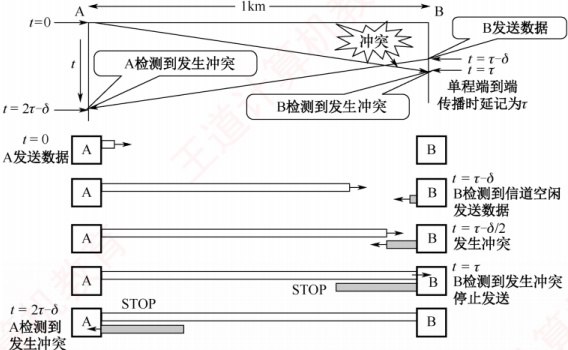

图 3.22 传播时延对载波监听的影响

从图 3.22 可见，A 站在开始发送后最多经过  $2\tau$（端到端往返传播时延）即可确认是否发生冲突（当  $\delta \to 0$ 时）。因此，将以太网的端到端往返传播时延  $2\tau$ 称为争用期（也称冲突窗口）。每个站点在发送数据后的一小段时间内，存在冲突的可能；只有在争用期结束仍未检测到冲突，才能确定本次发送成功。

### 考点追踪 CSMA/CD 协议中最短帧长的原理与计算（2009、2016、2019、2022）

现在考虑一种情况：某站发送一个很短的帧，在发送完成前未检测到冲突。但该帧在传播途中与其他帧发生冲突，导致目的站收到错误帧（并丢弃），而发送站却不知情，也不会重传。为避免此类问题，以太网规定了最短帧长，即争用期内可发送的数据量。若在争用期内检测到冲突，发送将中止，此时已发送的数据长度必小于最短帧长；因此，任何长度小于最短帧长的帧均为因冲突而异常中止的无效帧，应被丢弃。最短帧长的计算公式为

 $$最短帧长 =2 \times 最大单向传播时延 \times 数据传输速率$$

例如，以太网规定争用期为  $51.2\mu s$。对于  $10Mb/s$ 的以太网，争用期内可发送  $512bit$（64B）。这意味着：若某站点在发送前  $64B$ 未发生冲突，则后续数据也不会冲突（表示已成功抢占信道）；反之，若发生冲突，必定发生在前  $64B$ 内。由于检测到冲突后立即停止发送，实际发出的数据量必然小于  $64B$。因此，以太网规定最短帧长为  $64B$。若实际要发送的帧小于  $64B$（如仅  $40B$），则需在数据字段后添加若干整数字节的填充字段，确保整个 MAC 帧长度不小于  $64B$。

### 考点追踪 CSMA/CD 协议中的退避算法机制（2023）

一旦发生冲突，若站点立即重传，极易再次冲突。CSMA/CD采用截断二进制指数退避算法来确定重传时机：冲突站点在停止发送后，推迟一个随机时间再重试。算法要点如下：

1）确定基本退避时间为一个争议期（端到端往返传播时延 $2\tau$）。

2）从整数集合$[0,1,\cdots,(2^k-1)]$中随机选取一个数$r$，推迟时间为$r$倍争用期，即$2r\tau$。其中k=\min[\text{重传次数},10]，即重传次数≤10时，$k$等于重传次数；超过10次后，$k$不再增大，恒为10。

3）若重传达16次仍失败，则判定网络过于拥塞，放弃该帧并向高层报告错误。

例如，首次冲突后（第1次重传），k=1，随机数r从集合{0,1}中选取，推迟时间为0或2τ；若再次冲突（第2次重传），k=2，r从集合{0,1,2,3}中选取，推迟时间为0,2τ,4τ或6τ，以此类推。该机制使重传平均等待时间随冲突次数增加而动态增长（称为动态退避），有效降低
再次冲突概率，提升系统稳定性。

此外，以太网规定：一旦检测到冲突，站点除立即停止发送数据外，还需继续发送32比特或48比特的人为干扰信号，以确保所有站点都能感知到冲突，这被称为强化碰撞机制。

以太网还规定帧间最小间隔为  $9.6\mu s$（相当于 96 比特的发送时间）。以便接收站有足够时间清空缓存，为接收下一帧做好准备。

CSMA/CD 协议的归纳如下：

① 准备发送：适配器从网络层获取分组，封装成帧，放入适配器的缓存。

② 检测信道：若信道忙，则持续监听直至空闲；若信道在  $9.6\mu s$ 时间内保持空闲（满足帧间最小间隔），则开始发送该帧。

③ 发送过程中持续检测信道，可能出现两种情况：

发送成功：争用期内未检测到冲突，帧发送成功。

发送失败：争用期内检测到冲突，立即停止发送，执行退避算法，等待随机时间后返回步骤②；若重传16次仍未成功，则放弃发送并向高层报告出错。

#### 4. 以太网的 MAC 帧

以太网 MAC 帧格式有两种标准：DIX Ethernet V2 标准（以太网 V2）和 IEEE 802.3 标准。此处仅介绍最常用的以太网 V2 标准的帧格式，如图 3.23 所示。

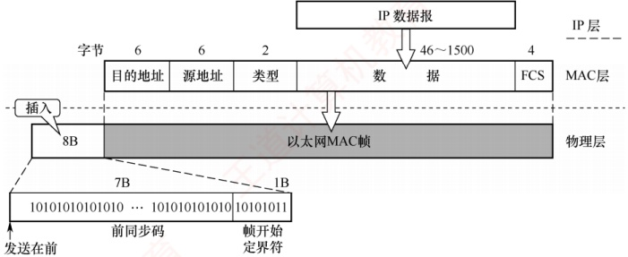

图 3.23 以太网 V2 标准的 MAC 帧格式

### 考点追踪 以太网 MAC 帧的格式（2010、2011）

1）帧前插入的8B前导码分为两个字段：第一个字段是7B的前同步码，用于实现比特同步；第二个字段是1B的帧开始定界符，标志MAC帧的开始。

**注意**

以太网帧 **不需要帧结束定界符**。因为当以太网传送帧时，各帧之间必须保持至少 **96比特时间**的间隙，因此，接收方只要找到帧开始定界符，其后连续到达的比特流即属于同一帧。此外，以太网采用了违规编码法的思想，这种编码（曼彻斯特编码）的特点是在每个码元中间都有一次电压跳变。当发送方把一个帧发送完毕后，就不再发送其他码元，因此发送方网络接口上的电压也不再变化，这样接收方就能很容易地找到帧的结束位置，这个位置往前数4B就是FCS字段，从而确定数据字段的结束位置。。

2）目的地址：6B，帧在局域网中的目的适配器的 MAC 地址。
3）源地址：6B，发送该帧的源适配器的 MAC 地址。

4）类型：2B，标识上一层使用的是什么协议，以便将收到的 MAC 帧的数据交给相应的上层协议。例如，当类型字段的值是 0x0800 时，表示上层使用的是 IP。

### 考点追踪 以太网帧填充与最小帧长的关系（2012）

5）数据：46～1500B，承载上层的协议数据单元（如IP数据报）。以太网的最大传输单元为1500B，若IP数据报超过此长度，则需在网络层进行分片。此外，由于CSMA/CD协议算法限制，以太网帧必须满足最小长度为64B，当IP数据报不足46B时，MAC子层会在数据字段后面添加整数字节的填充字段，以确保帧长达到64B。

**注意**

“46是怎么来的？”——由CSMA/CD协议可知，以太网帧的最短帧长为64B，而MAC帧的首部和尾部的长度为18B，因此数据字段最少为64-18=46B。

6）检验码（FCS）：4B，采用32位CRC码，检验范围从目的地址到数据字段（含目的地址、源地址、类型和数据），但不检验前导码。

IEEE 802.3 帧格式与以太网 V2 帧格式的区别在于：用长度字段替代了 V2 帧中的类型字段，指示数据字段的长度。在实践中，这两种机制可以并存，由于 IEEE 802.3 数据字段的最大长度为 1500B，故长度字段的值  $\leq 1500$；从而 1501 到 65535 的值则被解释为类型标识符。

#### 5. 高速以太网

速率达到或超过100Mb/s的以太网称为高速以太网，其主要类型如表3.3所示。

表3.3 几种高速以太网技术

| 标准名称 | 100Base-T 以太网 | 吉比特以太网 | 10 吉比特以太网 |
| --- | --- | --- | --- |
| 传输速率 | 100Mb/s | 1Gb/s | 10Gb/s |
| 传输介质 | 双绞线 | 双绞线或光纤 | 双绞线或光纤 |
| 通信方式 | 支持半双工和全双工 |   | 只支持全双工 |
| 介质访问控制协议 | 半双工模式下使用 CSMA/CD 协议 |   | 无 |

##### （1） 100Base-T以太网（快速以太网）

### 考点追踪 100Base-T 的传输介质类型（2019）

100Base-T 以太网是在双绞线上以 100Mb/s 速率传输基带信号的星形以太网，支持全双工和半双工两种工作模式。当使用以太网交换机组网时，通常运行在全双工模式而无冲突发生，因此无须使用 CSMA/CD 协议。但在半双工模式下，仍需依赖 CSMA/CD 协议来处理冲突。

其帧格式仍遵循 IEEE 802.3 标准，保持最小帧长为 64B 不变，但将单个网段的最大长度缩短至 100m。同时，帧间最小间隔从 9.6μs 减为 0.96μs，以适应更高的传输速率。

#### （2） 吉比特以太网（千兆以太网）

吉比特以太网支持 1Gb/s 的传输速率，兼容全双工和半双工模式。它使用 IEEE 802.3 标准的帧格式。使用双绞线或光纤作为传输介质。在半双工模式下使用 CSMA/CD 协议（很少部署）；而在全双工模式下不使用 CSMA/CD 协议。与 10Base-T 和 100Base-T 技术向后兼容。

#### （3） 10吉比特以太网

10 吉比特以太网的帧格式与 10Mb/s、100Mb/s 和 1Gb/s 以太网完全相同，并保留 IEEE 802.3 规定的最小和最大帧长。仅工作在全双工模式，无争用问题，因此无须使用 CSMA/CD 协议。
以太网从 10Mb/s 到 10Gb/s 的演进充分证明了其可扩展性（速率从 10Mb/s 到 10Gb/s）、灵活性（多种介质、全/半双工模式、共享/交换构架）、易部署性和稳健性。

### 3.6.3 IEEE 802.11 无线局域网

#### 1. 无线局域网的组成

无线局域网可分为两大类：有固定基础设施的无线局域网和无固定基础设施的移动自组织网络。所谓“固定基础设施”，是指预先部署、能覆盖一定地理范围的固定基站。

##### （1） 有固定基础设施无线局域网

对于有固定基础设施的无线局域网，IEEE 制定了 802.11 系列协议标准，包括 802.11a/b/g/n 等。802.11 协议采用星形拓扑，其中心节点称为接入点（Access Point，AP），在 MAC 层使用 CSMA/CA 协议。采用 802.11 系列协议的局域网通常也称 Wi-Fi。

802.11 协议规定，无线局域网的最小构件是基本服务集（Basic Service Set，BSS）。一个 BSS 包含一个 AP 和若干移动站。站内通信或与外部站点的通信都必须通过该 BSS 的 AP。此处的 AP 即为 BSS 中的基站（base station）。配置 AP 时，需要为其分配一个不超过 32B 的服务集标识符（Service Set IDentifier，SSID）和一个工作信道。SSID 即为该无线局域网的名称。BSS 覆盖的地理范围称为基本服务区（Basic Service Area，BSA），其直径一般不超过 100 米。

一个 BSS 可以是孤立的，也可通过 AP 连接到分配系统（Distribution System，DS），再与其他 BSS 互连，从而构成扩展的服务集（Extended Service Set，ESS）。分配系统的作用是使整个 ESS 对上层呈现为一个单一的 BSS。ESS 还可通过一种称为 Portal（门户）的设备，为无线用户提供接入有线以太网的能力。Portal 的功能相当于网桥。在图 3.24 中，若移动站 A 要与另一 BSS 中的移动站 B 通信，则数据流动路径为  $A \rightarrow AP1 \rightarrow AP2 \rightarrow B$，其中 AP1 与 AP2 的通信通过有线链路完成。

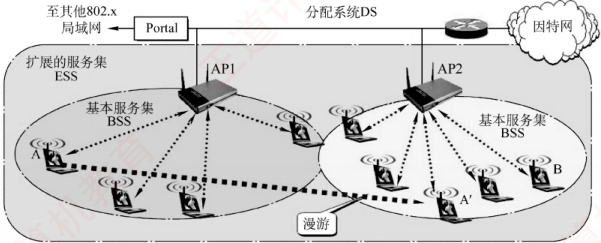

图3.24 基本服务集和扩展服务集

当移动站 A 从一个 BSS 漫游到另一个 BSS 时（图 3.24 中的 A'），仍可保持与 B 的通信。但所使用的 AP 会发生改变。

##### （2） 无固定基础设施的移动自组织网络

另一种无线局域网是无固定基础设施的自组织网络，也称自组网络（ad hoc network）。此类网络不包含 AP，而是由若干处于平等地位的移动站临时组成的对等网络（见图 3.25）。各节点地位平等，中间节点需转发其他节点的数据，因此兼具终端与路由器的功能。

自组网络通常这样形成：若干可移动设备彼此邻近且存在通信需求时，会自发组建一个网络。在此类网络中，每个移动站都需主动参与路由的发现与维护。由于节点位置不断变化，网络拓扑可能频繁且快速地改变，因此传统在固定网络中有效的路由协议往往难以适用于自组网络，必须采用专门为其设计的路由机制。

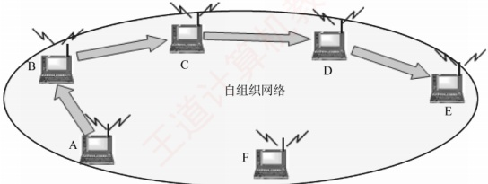

图 3.25 由若干处于平等地位的移动站临时组成的对等网络

需要注意的是，自组网络与移动 IP 有本质区别：移动 IP 旨在支持主机在不同网络间漫游并接入互联网，其底层仍依赖固定网络的路由基础设施；而自组网络是一种分布式的无线自治系统，不仅拥有专用的路由协议，还能独立于互联网运行，无须依赖任何预设的固定基础设施。

#### 2. CSMA/CA 协议

CSMA/CD 协议已成功用于有线局域网，但无线局域网不能简单照搬 CSMA/CD 协议。无线局域网仍使用 CSMA 协议，但无法实现冲突检测，主要有两个原因：

1）适配器接收到的信号强度通常远小于其发送信号的强度，且无线信道中信号强度的动态范围极大，若要实现冲突检测，硬件上的成本将会过高。

2）在无线通信中，并非所有站点都能互相侦听到对方（却可能产生冲突），即存在隐蔽站问题，导致冲突检测机制无法发现所有冲突。

在图3.26中，A站和B站均在AP的覆盖范围内，但彼此距离较远，无法侦听到对方。当A站和B站同时检测到信道空闲时，都向AP发送数据，导致发生冲突，而双方均无法察觉，这就是隐蔽站问题。这里A站和B站互为隐蔽站，它们检测不到彼此的信号，却能产生冲突。

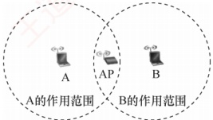

图 3.26 A 站和 B 站同时向 AP 发送数据，发生冲突

为此，802.11 协议定义了广泛应用于无线局域网的 CSMA/CA 协议。它对 CSMA/CD 协议进行改进，将“冲突检测”改为“冲突避免”（Collision Avoidance，CA）。“冲突避免”并不是指协议可以完全避免冲突，而是要尽量降低冲突发生的概率。由于 802.11 协议不支持冲突检测，一旦站点开始发送帧，就必须完整发送该帧；若在冲突存在时，仍发送整个帧（尤其是长数据帧），将严重降低网络效率，因此必须采用冲突避免技术来降低冲突概率。

### 考点追踪 CSMA/CA 协议的确认机制（2011）

鉴于无线信道的通信质量远不如有线信道，802.11 协议在数据链路层引入确认/重传（ARQ）机制：站点每发送完一帧后，必须收到接收方的确认帧（ACK），才能继续发送下一帧。因此，802.11 无线局域网采用的是一种停止-等待式可靠传输协议。

802.11 协议在 MAC 子层定义了两种介质访问控制方式。

1）分布式协调功能（DCF）。不采用任何中心控制，各站通过争用信道获得发送权。这是802.11协议必须实现的方式，也是目前广泛使用的方式。
2）点协调功能（PCF）。使用 AP 集中控制，用类似于探询的方法将发送权轮流分配给各站，从而避免冲突。它是 802.11 协议的可选方式，实际很少使用。

802.11 协议规定，各站在发送数据前必须检测信道，若信道忙，则禁止发送。为进一步减少冲突，802.11 协议还要求：即使检测到信道空闲，也需再等待一段短暂时间（确保信道持续空闲），方可发送帧。该时间称为帧间间隔（InterFrame Space, IFS），其长度取决于帧的类型。

### 考点追踪 $\rightarrow$ CSMA/CA 协议的帧间间隔类型与功能（2020）

1）DIFS（分布式协调 IFS）：最长的 IFS，在 DCF 方式下用来发送数据帧和管理帧。

2）PIFS（点协调 IFS）：中等长度的 IFS，在 PCF 方式中使用。

3）SIFS（短 IFS）：最短的 IFS，用于分隔同一对话中的连续帧，如 ACK 帧、CTS 帧、分片后的数据帧，以及对 AP 探询的响应帧等。

当信道由忙变为空闲时，在有多个站点同时等待发送的情况下，若它们都在时间 DIFS 后立即发送数据，则必然导致冲突。因此，CSMA/CA 协议规定：当检测到信道从忙变为空闲时，任何站点要发送数据，必须先等待时间 DIFS，再进入争用期，并执行随机退避，即随机选择一个退避时隙数，并在每个空闲时隙将其减 1，直至减为 0 后才发送。当且仅当检测到信道空闲且这个数据帧是要发送的第一个数据帧时，才不使用退避算法，其他所有情况都必须使用退避算法，具体为：① 要发送第一个数据帧之前检测到信道忙；② 未收到确认，要重传数据帧；③ 每次确认成功后要发送下一个数据帧。CSMA/CA 协议的退避算法与 CSMA/CD 协议类似，第 i 次退避在[0, …, (2^{4+k} - 1)]个时隙中随机选择一个，当时隙范围最大达到 1023 时（对应第 6 次重传），就不再增加。

CSMA/CA 协议算法归纳如下：

1）若站点首次尝试发送数据（非因重传而发送），且检测到信道空闲，则在等待时间 DIFS 后（信道持续空闲），立即发送整个数据帧。否则执行步骤2）。

2）站点选取一个随机数，设置退避计时器。计时器运行的规则是：若信道忙，则冻结计时器（暂停递减），并继续等待，直至信道变为空闲（称为推迟接入）；若信道空闲，且在时间DIFS内持续空闲，则开始争用信道，进行倒计时。当计时器减至0时（仅可能发生在信道持续空闲期间），站点立即发送整个数据帧并等待确认。

3）发送站收到确认后，若仍有后续帧待发送，则转到步骤2）。若在规定时间（由重传计时器控制）内未收到确认，则按二进制指数退避规则增大竞争窗口，再转到步骤2）重新尝试。

**注意**

 **推迟接入**和 **退避**的区别。推迟接入发生在信道忙时，为的是等待争用期的到来，此时退避计时器处于冻结状态。而退避是争用期各站点执行的算法，此时信道是空闲的，退避总出现在DIFS之后。

802.11 协议还规定各站采用虚拟载波监听机制：源站在发送数据前，通过帧首部的持续期字段，向所有能接收到该帧的站点通告其将占用信道的总时长（包括目的站回复 ACK 所需的时间）。其他站点收到后，将据此设置自身的网络分配向量（Network Allocation Vector，NAV），并在 NAV 计时期间暂停发送，进而显著降低冲突概率。所谓虚拟载波监听，是指这些站点并未实际监听物理信道，而基于接收到的通知主动避让，效果等同于持续监听信道。

### 考点追踪 CSMA/CA 协议的信道预约机制（2018）

为了缓解隐蔽站的问题，802.11 协议允许发送站对信道进行预约。在图 3.26 中，A 站和 B 站互为隐蔽站，下面以 A 站和 AP 通信为例，介绍信道预约的方法（见图 3.27）。
1）在 A 站向 AP 发送数据帧 DATA 前，先检测信道。若信道空闲，则等待时间 DIFS 后，广播一个请求发送 RTS（Request To Send）控制帧，目的是告诉所有能够收到 RTS 帧的站：“我要占用信道一段时间[SIFS+CTS+SIFS+DATA + SIFS+ACK]”，即从成功收到 RTS 帧起，到 AP 完成 ACK 发送为止的时间。这个时间被写入 RTS 帧首部。

2）若 AP 正确收到 RTS 帧且信道空闲，则等待时间 SIFS 后，广播一个允许发送 CTS（Clear To Send）控制帧。目的不仅是告诉源站“可以发送数据了”，同时也是告诉所有能收到 CTS 帧的站“我要占用信道一段时间[SIFS+DATA + SIFS+ACK]”，即从成功收到 CTS 帧起，到 AP 完成 ACK 发送为止的时间。该时间同样被写入 CTS 帧首部。

3）A 站收到 CTS 帧后，再等待时间 SIFS，即可发送数据帧。其首部写入时间[DATA + SIFS + ACK]，即从开始接收数据帧起 $^{①}$，到 AP 完成 ACK 发送为止的时间。

### 考点追踪 NAV 的工作原理（2024）

任何站点只要收到 RTS 帧、CTS 帧或数据帧之一，就会根据其首部的持续期字段设置自己的 NAV，如图 3.27 所示。虽然 B 站收不到 A 站发送给 AP 的 RTS 帧，但能收到 AP 广播的 CTS 帧，B 站根据 CTS 帧首部的内容设置自己的 NAV，因此在这段时间内不会发送数据、干扰信道。因此，虚拟载波监听机制能够有效减少由隐蔽站引发的冲突问题。

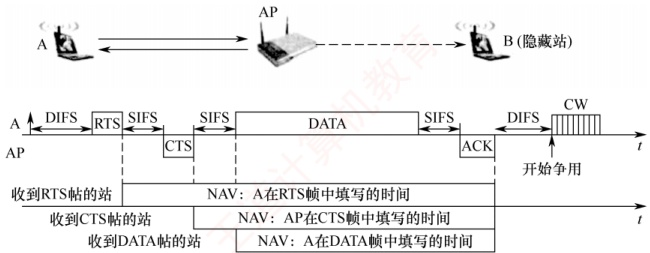

图 3.27 使用 RTS 和 CTS 帧的冲突避免

显然，使用 RTS/CTS 帧会使网络的通信效率有所下降，但这两种控制帧都很短，与数据帧相比开销不算大。相反，若不使用这种控制帧，则一旦发生冲突而导致数据帧重传，浪费的时间往往更多。信道预约并非强制要求，各站点可自行决定是否启用。或仅当待发送的数据帧长度超过某一阈值时才使用 RTS/CTS 帧，从而在可靠与效率之间取得平衡。

CSMA/CD 协议与 CSMA/CA 协议的主要区别如下：

1）冲突处理机制不同。CSMA/CD 协议能在发送过程中检测冲突，但无法避免冲突；CSMA/CA 协议无法在发送时检测冲突（尤其是发生在接收端的冲突），因此只能尽量避免冲突。

2）传输介质不同。CSMA/CD协议用于总线形有线以太网，CSMA/CA协议则用于无线局域网。

3）检测方式不同。CSMA/CD 协议通过检测线路中的电压变化来判断是否冲突；而CSMA/CA 协议只能在发送前通过能量检测、载波侦听或两者的混合方式，综合判断信道是否空闲。

总结：CSMA/CA 协议的思想是 “先打招呼，再发数据”，发送前先广播通知其他站点，在
其指定的时段内暂时发送，以预防冲突；而 CSMA/CD 协议则是“边发边听，撞了就停”，发送前先监听信道，发送过程中持续检测信号，一旦发现冲突，就立即停发，并启动退避重传机制。

#### 3. 802.11 局域网的 MAC 帧

802.11 局域网的帧共有三种类型：数据帧、控制帧和管理帧。其中，数据帧以及三种常用的控制帧（RTS帧、CTS帧和ACK帧）的格式如图3.28所示。

802.11 帧由以下三部分组成：

1）MAC 首部，共 30B。帧的复杂性主要体现在 MAC 首部。

2）帧主体，即数据部分，最大长度不超过2312B，远大于以太网帧的数据载荷。

3）帧检验序列（FCS），作为MAC尾部，共4B。

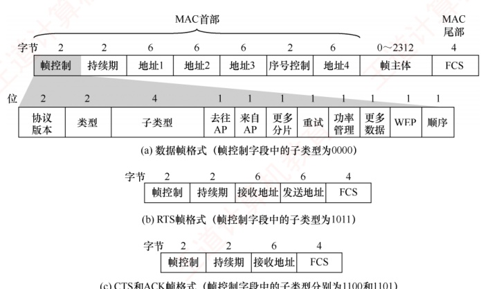

(a) 数据帧格式（帧控制字段中的子类型为0000）

(b) RTS 帧格式（帧控制字段中的子类型为1011）

(c) CTS和ACK帧格式（帧控制字段中的子类型分别为1100和1101）

图 3.28 数据帧以及三种常用的控制帧（RTS 帧、CTS 帧和 ACK 帧）的格式

### 考点追踪 802.11 帧前三地址字段的作用（2017、2022）

802.11 帧首部中最关键的部分是四个地址字段（均为 MAC 地址），此处仅讨论前三个（地址 4 用于自组网络）。这三个地址的具体含义由帧控制字段中的两个标志位 “去往 AP” 和 “来自 AP” 共同决定。表 3.4 列出了 802.11 帧的地址字段最常用的两种情况。

表 3.4 802.11 帧的地址字段最常用的两种情况

| 去往 AP | 来自 AP | 地址 1 | 地址 2 | 地址 3 | 地址 4 |
| --- | --- | --- | --- | --- | --- |
| 0 | 1 | 接收地址 = 目的地址 | 发送地址 = AP 地址 | 源地址 | —— |
| 1 | 0 | 接收地址 = AP 地址 | 发送地址 = 源地址 | 目的地址 | —— |

其中，地址1是直接接收该帧的节点地址，地址2是实际发送该帧的节点地址。

现假定在同一个BSS中，A站向B站发送数据，该过程分可为两个阶段。

第一阶段：A站→AP

A 站构造一个 802.11 帧发送给 AP。该帧首部字段设置如下：

“去往 AP=1” 而 “来自 AP=0”

地址 1 为 AP 的 MAC 地址。地址 2 为 A 站的 MAC 地址。地址 3 为 B 站的 MAC 地址。
第二阶段：AP→B站

AP 收到该帧后，将其转发给 B 站。此时构造的新 802.11 帧首部字段设置如下：

“去往 AP=0” 而 “来自 AP=1”；

地址 1 为 B 站的 MAC 地址，地址 2 为 AP 的 MAC 地址，地址 3 为 A 站的 MAC 地址。

理解这三个地址的关键：地址1和地址2始终表示当前无线传输的两端，即直接接收方和直接发送方。当主机发往AP时，接收方是AP，但最终目的不是AP，因此用地址3存放实际目的地址；当AP发往主机时，发送方是AP，但原始源不是AP，因此用地址3存放实际源地址。

下面讨论一种更复杂的情况。如图3.29所示，两个AP通过有线链路连接到同一个路由器R，A站和B站分别位于两个不同的子网中。现分析A站向B站发送数据的完整过程。由于A站与B站不在同一个子网内，该通信需经由路由器R转发，整个过程也可分为两个阶段。

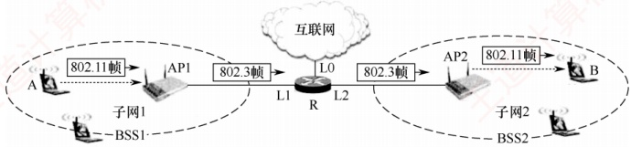

图 3.29 链路上的 802.11 帧和 802.3 帧

第一阶段：A站→路由器R

A 站先判断 B 站的目的 IP 地址不在本地子网内，因此将数据发送给默认网关，即 R 的接口 L1。为此，A 站通过 ARP 获取接口 L1 的 MAC 地址，随后构造一个 802.11 帧发送给 AP1。

该 802.11 帧的首部字段设置如下：

“去往 AP=1”而“来自 AP=0”；

地址 1 为 AP1 的 MAC 地址，地址 2 为 A 站的 MAC 地址，地址 3 为接口 L1 的 MAC 地址。

AP1 收到该帧后，将其转换为 802.3 帧（仅包含源和目的两个 MAC 地址），其中源地址为 A 站的 MAC 地址，目的地址为接口 L1 的 MAC 地址，并通过有线链路传送给路由器 R。

第二阶段：路由器 R→B 站

路由器 R 收到 802.3 帧后，解封装并提取出 IP 数据报。根据其中的目的 IP 地址，路由器 R 查询转发表，确定下一跳出口为连接 B 站所在子网的接口 L2。接着，路由器 R 通过 ARP 获取 B 站的 MAC 地址，并将该 IP 数据报重新封装为一个新的 802.3 帧，其中源地址为接口 L2 的 MAC 地址，目的地址为 B 站的 MAC 地址。AP2 收到此 802.3 帧后，将其转换为 802.11 帧并发往 B 站。

该 802.11 帧的首部字段设置如下：

“去往 AP=0” 而 “来自 AP=1”；

地址 1 为 B 站的 MAC 地址，地址 2 为 AP2 的 MAC 地址，地址 3 为接口 L2 的 MAC 地址。

上述两个阶段共同构成 A 站向 B 站发送数据的完整路径。从网络层视角看，IP 数据报从子网 1 经路由器 R 转发至子网 2；而链路层则通过 802.11 帧中的地址 3 字段，在无线与有线介质转换过程中保留了原始源或目的 MAC 地址，确保了通信语义正确。这一机制涉及网络层的路由器转发功能，学完相关内容后，读者将能更深入理解本例所述的跨网通信过程。

下面介绍 802.11 帧中的持续期字段和帧控制字段。

1）持续期字段。在前面的 CSMA/CA 协议中提到，发送站点可对信道预约一段时间，并将该时间写入持续期字段，用于虚拟载波监听。
2）帧控制字段。其中较重要的是类型和子类型字段，用于区分帧的功能。802.11 帧分为三大类型，每种类型又分为若干子类型，如控制帧包括 RTS、CTS、ACK 等子类型。

### 3.6.4 VLAN 基本概念与基本原理

一个以太网构成一个广播域。当网络中包含的计算机数量过多时，往往会导致：

网络中出现大量广播帧，尤其是频繁使用的 ARP 和 DHCP 报文（见第 4 章）。

同一单位的不同部门共享一个局域网，不利于信息保密与安全隔离。

通过虚拟局域网（Virtual LAN，VLAN），可将一个大型局域网划分为若干与地理位置无关的逻辑上的 VLAN，每个 VLAN 构成一个独立且较小的广播域。同一 VLAN 内的主机可以直接通信，而不同 VLAN 之间的主机则无法直接通信。

目前主要有以下三种 VLAN 划分方式：

1）基于端口（接口）。将交换机的若干物理接口划归同一个逻辑组。该方法最简单、最常用。若主机更换了接入端口，则可能被划分到新的 VLAN（新子网）。

2）基于 MAC 地址。根据主机的 MAC 地址划分 VLAN。当主机从一个交换机移动到另一个交换机时，它仍属于原 VLAN。

3）基于 IP 地址。根据网络层地址或协议类型划分 VLAN。此类 VLAN 可跨越路由器进行扩展，将多个物理局域网中的主机纳入同一逻辑 VLAN。

IEEE 802.1Q 标准定义了支持 VLAN 的以太网帧格式扩展。它在标准以太网帧的源地址字段与类型字段之间插入一个 4B 的 VLAN 标签，用于标识该帧所属的 VLAN。插入标签后的帧称为 802.1Q 帧，如图 3.30 所示。由于帧首部增加了 4B，为保持最小帧长 64B 不变，数据字段的最小长度由 46B 减少为 42B，最大长度仍为 1500B，因此最大帧长从 1518B 增至 1522B。

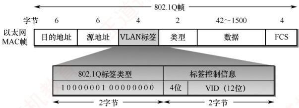

图 3.30 插入 VLAN 标签后变成了 802.1Q 帧

VLAN 标签的前两个字节固定为 0x8100，表示这是一个 802.1Q 帧。后两个字节中，前 4 位保留未用，后 12 位为 VLAN 标识符（VID），用于唯一标识该帧所属的 VLAN。12 位 VID 最多可支持 4096 个 VLAN。插入 VLAN 标签后，帧尾的 FCS 必须重新计算。

如图 3.31 所示，交换机 1 连接 7 台计算机，被划分为两个 VLAN：VLAN-10 和 VLAN-20（10 和 20 即 VID 值，由管理员配置）。各主机并不知道自身的 VID（但交换机必须知道），主机与交换机之间交互的仍是标准以太网帧。VLAN 的范围可跨越多个交换机，前提是这些交换机均支持 VLAN 功能。交换机 2 连接 5 台计算机，并与交换机 1 相连，其中 2 台属于 VLAN-10，3 台属于 VLAN-20。尽管这两个 VLAN 跨越了两台交换机，但各自仍保持为独立的广播域。

连接两台交换机的链路称为汇聚链路（Trunk Link），也称干线链路。

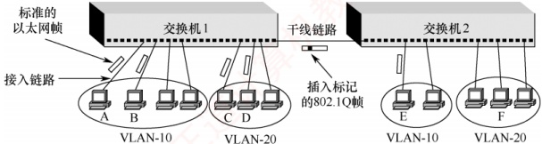

图 3.31 利用以太网交换机构成虚拟局域网

### 考点追踪 虚拟局域网的特性（2024）

假定 A 站向 B 站发送帧，交换机 1 根据目的 MAC 地址，识别出 B 属于本交换机管理的 VLAN-10，于是将该帧当作普通以太网帧直接转发。若 A 站向 E 站发送帧，交换机 1 必须将帧转发到交换机 2，此时必须先插入 VLAN 标签，再通过干线链路传输。否则，交换机 2 无法判断该帧应归属哪个 VLAN。因此，干线链路上传输的是 802.1Q 帧。交换机 2 在向 E 站转发前，会剥离 VLAN 标签，确保 E 站收到的是标准以太网帧。若 A 站向 C 站发送帧（虽同属交换机 1，但分属 VLAN-10 与 VLAN-20），则因二者处于不同的广播域，无法直接通信。此时需借助上层路由器实现跨 VLAN 通信，或通过支持三层功能的交换机完成第 3 层转发。

虚拟局域网只是局域网为用户提供的一种逻辑服务，并不是一种新型局域网。
