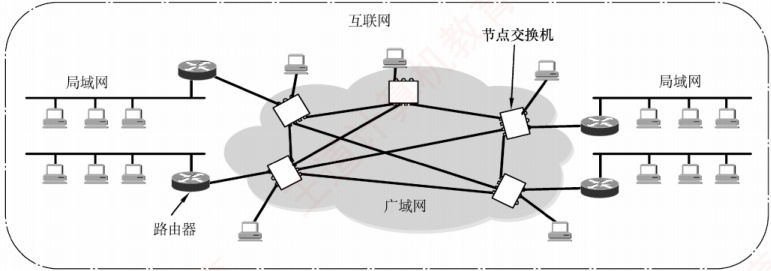
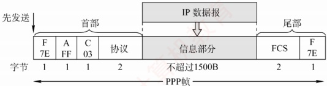
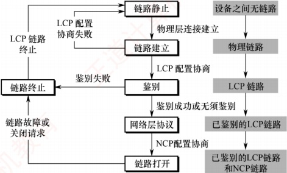

## 3.7 广域网

### 3.7.1 广域网的基本概念

广域网（Wide Area Network，WAN）通常指覆盖范围很广（远超一个城市）的长距离网络，其主要任务是长距离运送主机所发送的数据。连接广域网中各节点交换机的链路均为高速链路，因此广域网首要考虑的问题是通信容量是否足够大，以支持日益增长的通信需求。

广域网不等于互联网。互联网可以连接不同类型的网络，通常通过路由器实现互联。如图3.32所示，多个相距较远的局域网可通过路由器接入广域网，从而构成一个覆盖范围广泛的互联网。因此，一个局域网可通过广域网与另一个远程局域网通信。

图 3.32 由相距较远的局域网通过路由器与广域网相连而成的互联网

广域网由若干节点交换机（注意不是路由器）及连接这些交换机的链路组成。节点交换机与路由器都用于转发分组，工作原理相似；但节点交换机工作在单个网络内部，而路由器用于连接多个网络构成的互联网。节点交换机的核心功能是存储并转发分组。广域网中节点之间采用点到点连接，但为提高网络可靠性，一个节点交换机通常与多个其他交换机相连。

广域网和局域网的区别与联系见表3.5。

表3.5 广域网和局域网的区别与联系

| 项 目 | 广 域 网 | 局 域 网 |
| --- | --- | --- |
| 覆盖范围 | 很广，通常跨区域 | 较小，通常在一个区域内 |
| 连接方式 | 通常采用点对点连接 | 普遍使用广播信道 |
| OSI 层次 | 三层：物理层，数据链路层，网络层 | 两层：物理层，数据链路层 |
| 联系与相似点 | 1. 广域网和局域网都是互联网的重要构件，从互联网角度看，两者地位平等（不存在包含关系） 2. 当主机在所属广域网或局域网的内部通信时，仅需使用该网络的物理地址 |   |
| 着重点 | 强调资源共享 | 强调数据传输 |

在通信线路质量较差的年代，高级数据链路控制（HDLC）因其可靠的传输机制而成为主流的数据链路层协议。如今，在误码率极低的点对点有线链路上，更简单的点对点协议（PPP）则成为使用最广泛的数据链路层协议。最新大纲已将 HDLC 删除，故本书不再介绍。

### 3.7.2 点对点协议

点对点协议（Point-to-Point Protocol，PPP）是目前最流行的点对点链路控制协议。主要有两种应用场景：用户接入互联网时与ISP之间的通信；两台网络设备之间通过直连专线通信。

在以太网中运行的 PPP 称为 PPPoE（PPP over Ethernet），它是对 PPP 的扩展。PPPoE 将 PPP 帧封装在以太网帧中，用户通过 ADSL 宽带上网时使用的就是 PPPoE。

PPP 由以下三个部分组成：

1）一个链路控制协议（LCP）。用来建立、配置、测试数据链路连接，及协商一些选项。

2）一套网络控制协议（NCP）。PPP 支持多种网络层协议（如 IP、IPX 等），每种网络层协议需通过对应的 NCP 进行配置，以建立和管理其逻辑连接。

3）一种将 IP 数据报封装到串行链路的方法。IP 数据报作为 PPP 帧的信息部分被封装在 PPP 帧中传输，其长度受最大传送单元（MTU）限制。

PPP 帧的格式如图 3.33 所示，首部包含 4 个字段，尾部包含 2 个字段。

图 3.33 PPP 帧的格式

1）标志字段（F）。首部和尾部各有一个，占1B，规定为0x7E（01111110），用作帧的定界符，标识帧的开始与结束。为实现透明传输，当信息段中出现与标志字段相同的比特模式时，需要采取填充措施：当PPP使用异步传输时，采用字节填充法，使用的转义字符为0x7D（01111101）；当PPP使用同步传输时，采用零比特填充法。

2）地址字段（A）。占1B，规定为0xFF，其意义暂未定义。

3）控制字段（C）。占1B，规定为0x03，其意义也暂未定义。

4）协议字段。占2B，用于标识信息字段所承载的分组类型。若为0x0021，表示信息字段为IP数据报；若为0xC021，表示信息字段为LCP分组。

5）信息字段。长度可变，范围为0～1500B。

**注意**

由于 PPP 是点对点链路上（而非总线形网络），无须使用 CSMA/CD 协议，因此 **不存在最短帧长**的限制，其信息字段最小可为 OB（相比之下，以太网帧的数据部分至少需 46B）。

6）帧检验序列（FCS）。占2B，采用CRC校验生成的冗余码，用于差错检测。

以用户拨号接入 ISP 的过程为例：用户拨号后，首先建立一条从用户到 ISP 的物理层连接；随后，用户向 ISP 发送一系列 LCP 分组（封装为 PPP 帧），协商链路参数并建立 LCP 连接；接着通过 NCP 配置网络层，ISP 为用户分配一个临时 IP 地址；通信结束后，依次释放网络层、数
据链路层和物理层连接。PPP的状态转换如图3.34所示。

图 3.34 PPP 的状态图

具体解释如下：

1）PPP 链路的起始和终止均为链路静止状态，此时用户与 ISP 之间无物理层连接。

2）当检测到调制解调器的载波信号并成功建立物理层连接后，PPP进入链路建立状态。

3）在链路建立状态下，LCP开始协商配置选项（如最大帧长、鉴别协议等）。若协商成功，则LCP链路建立完成，PPP进入鉴别状态。若协商失败，则退回到链路静止状态。

4）在鉴别状态下，若通信双方无须鉴别或身份鉴别成功，则进入网络层协议状态。若鉴别失败，则直接进入链路终止状态。

5）在网络层协议状态下，双方通过 NCP 配置网络层参数（如分配 IP 地址），配置完成后，PPP 进入链路打开状态，双方即可开始数据通信。

6）数据通信结束后，若一方发送终止请求并在收到确认后，或链路发生故障，PPP 将进入链路终止状态；待调制解调器的载波信号停止后，最终返回链路静止状态。

PPP 的主要特点如下：

1）PPP 在链路建立阶段使用确认机制，但在数据传输阶段仅提供无差错接收（通过 CRC 检验），不使用序号与确认机制，因此提供的是不可靠服务。

2）PPP仅支持全双工的点对点链路，不支持多点线路。

3）PPP 链路两端可运行不同的网络层协议，但仍能通过同一 PPP 链路进行通信。

4）PPP 是面向字节的协议，所有 PPP 帧的长度均为整数个字节。
