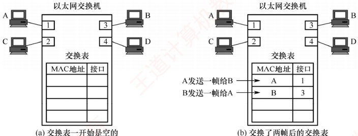

## 3.8 数据链路层设备

### 3.8.1 网桥的基本概念

使用集线器在物理层扩展以太网会形成更大的冲突域 $^{①}$。为避免这一问题，早期采用网桥在数据链路层扩展以太网，此时原来的每个以太网称为一个网段。使用网桥扩展时，不会将原本独立的两个冲突域合并成一个更大的冲突域。这是因为网桥具有识别帧和转发帧的能力：
它根据帧首部的目的地址及自身的帧转发表，决定是转发还是丢弃所收到的帧，从而有效过滤通信量。网桥是早期的数据链路层设备，现已被以太网交换机取代，最新大纲中已将其删除。

### 3.8.2 以太网交换机

#### 1. 交换机的原理和特点

以太网交换机也称二层交换机，其中“二层”指其工作在数据链路层。从实质上讲，它是一个多端口的网桥，能够将网络划分为多个较小的冲突域，从而为每个用户提供更高的带宽。

在使用集线器构建的传统共享式以太网中，所有用户共享同一传输介质。例如，在 10Mb/s 网络中，若有 N 个用户，则每个用户的平均可用带宽仅为总带宽的 1/N，且在通信过程中极易发生冲突。而使用以太网交换机构建的交换式以太网则完全不同：每个端口提供独立的信道，主机通信时独占端口带宽（如 10Mb/s），无须与其他用户竞争介质。因此，一台有 N 个端口的交换机的总吞吐容量可达  $N \times 10Mb/s$，这正是交换机的最大优势所在。

### 考点追踪 以太网交换机的特点（2015）

以太网交换机的特点：

1）当交换机端口直接连接主机或其他交换机时，通常工作在全双工方式。

2）交换机具有并行性，可同时连通多对端口，使每对通信主机都能无冲突地传输数据，因此无须使用 CSMA/CD 协议。

3）当交换机端口连接集线器时，由于集线器连接的所有设备均处于同一冲突域中，必须使用 CSMA/CD 协议，且只能工作在半双工方式。

4）交换机是一种即插即用设备，其内部的帧转发表是通过自学习算法，基于网络中各主机间的实际通信自动建立和更新。

5）交换机采用专用交换结构芯片，因此交换速率较高。

### 考点追踪 直通交换的转发时延分析（2013）

以太网交换机主要采用两种交换模式：

1）直通交换方式。接收到帧的目的 MAC 地址后，立即决定转发端口，无须等待整个帧接收完毕。该方式的转发时延非常小，缺点是不进行差错检测，因此可能将一些无效帧转发给其他站。因此，直通交换不适用于需要速率匹配、协议转换或差错检测的场景。

2）存储转发交换方式。先完整接收并缓存整个帧，然后检查帧是否正确（可能还需要进行速率匹配或协议转换），若帧正确，则根据目的 MAC 地址转发；若帧出错，则直接丢弃。其优点是可靠性高，且支持不同速率端口之间的通信；缺点是转发时延较大。交换机通常配备多种速率的端口，如 10Mb/s、100Mb/s 端口，以及多速率自适应端口。

#### 2. 交换机的自学习功能

### 考点追踪 以太网交换机基于 MAC 地址的转发机制（2009）

以太网交换机的转发和过滤决策基于帧的 MAC 地址。其中，过滤是指决定是否丢弃一个帧，而转发则是指决定将帧从哪个端口送出。这两项功能依赖于交换机的交换表。每个表项至少包含两个字段：主机的 MAC 地址；该主机所连接的交换机端口号。例如，在图 3.35 中，一台 4 端口的交换机分别连接四台计算机，其 MAC 地址分别为 A、B、C 和 D。交换表初始为空。

图 3.35 以太网交换机中的交换表

### 考点追踪 交换机的 MAC 地址学习过程（2014、2016、2021）

交换机通过自学习算法动态构建并维护转发表，收到数据帧后，执行以下步骤。

1）学习源 MAC 地址：交换机读取帧的源 MAC 地址，并将 {MAC 地址，入端口} 写入或更新到交换表。这一过程称为自学习，可使交换机动态掌握各主机的连接位置。

2）查看目的 MAC 地址：交换机解析帧的目的 MAC 地址，并根据其类型（单播、广播或组播）采取相应的转发策略。

3）决策与转发：

为单播帧（目的 MAC 地址为普通主机地址）时，交换机在交换表中查找该目的地址：若找到对应表项（已知目的地址），则仅从该表项所指端口转发，实现精准交付；若未找到对应表项（未知目的地址），则执行未知单播帧泛洪（或称洪泛），即将帧从除接收端口外的所有其他活动端口转发出去，确保目标主机能收到。

为广播帧（目的 MAC 地址为 FF:FF:FF:FF:FF:FF）时，交换机不查询转发表，直接将帧泛洪到除接收端口外的所有其他活动端口。

为组播帧（目的地址为组播 MAC 地址）时，交换机通常也默认执行泛洪处理。

假设主机 A 从端口 1 向主机 B 发送帧。交换机收到后，学习源地址：将{A, 1}写入交换表，此后任何发往主机 A 的帧都将从端口 1 转发。执行未知目的地址泛洪：未找到主机 B 的对应表项，将帧发送至端口 2、3、4（除端口 1 外）。主机 C 和 D 收到帧后，发现目的地址非自身，丢弃该帧；仅主机 B 接收。

随后，假设主机 B 从端口 3 向主机 A 回复帧。交换机收到后，学习源地址：将 {B, 3} 写入交换表。执行已知目的地址精准交付：查表发现主机 A 对应端口 1，于是直接从端口 1 单播转发该帧。

至此，交换机已通过“A→B”和“B→A”的通信，完整学习了主机A与B的位置信息。随着时间的推移，只要主机C和D也主动发送帧，交换机便会逐步学习其MAC地址与端口的映射关系。最终，交换表将包含所有活跃主机的信息，实现高效、精准的转发。

由于网络中的主机会动态变化，交换表必须具备自动更新的能力。为此，每个表项均设有老化时间，超时未更新的表项会被自动删除，以确保表项始终反映当前网络的实际连接状态。

为了提高可靠性，以太网交换机组网中常引入冗余链路，但可能形成环路，导致广播风暴和帧无限循环。为此，交换机采用生成树协议（STP），在不改变物理拓扑的前提下，通过逻辑阻塞部分冗余端口，构建一棵覆盖所有交换机的无环生成树，确保任意两台主机间仅有一条有效路径，进而消除环路。同时，当主链路出现故障时，STP可重新激活被阻塞端口，恢复连通性，实现自动容错。
### 3.8.3 共享式以太网

#### 1. 共享式以太网的基本特点

### 考点追踪 共享式与交换式以太网的区别（2016）

共享式以太网是指以集线器（Hub）为中心连接设备构建的局域网。所有主机通过双绞线接入集线器，共享同一物理传输介质和总带宽。从逻辑上看，整个网络构成单一的局域网段，所有通信均发生在同一个冲突域和广播域中。共享式以太网的主要特点如下。

1）工作在物理层：集线器仅对电信号进行放大和再生，不具备帧解析能力，无法识别 MAC 地址，也无任何智能转发或过滤功能。

2）采用半双工通信和 CSMA/CD 协议：由于介质共享，任意时刻只能有一对主机成功通信，其他发送尝试将引发冲突，必须依赖 CSMA/CD 协议进行冲突检测与退避。

3）单一冲突域与广播域：所有主机处于同一个冲突域和同一个广播域内。

4）带宽共享，效率低下：若网络中有N台主机，则每台主机的平均带宽仅为总带宽的1/N。

5）盲目广播所有帧：集线器将收到的帧无差别地转发至所有其他端口，各主机需自行判断是否接收，不仅浪费带宽，还存在通信隐私泄露的风险。

正由于上述缺陷，共享式以太网早已于20世纪末退出历史舞台，现代网络不再部署。

#### 2. 共享式与交换式以太网的转发行为对比

假设交换机已建立完整的转发表，以下从三种典型场景分析两类网络的处理差异：

1）主机发送普通帧。对于共享式以太网，集线器将帧转发到除接收端口外的所有端口，各主机网卡根据帧的目的 MAC 地址决定是否接收。对于交换式以太网，交换机查询转发表后，仅将帧从目标主机所在的端口转发，其他主机完全无感知。

2）主机发送广播帧。对于共享式以太网，集线器将帧转发到除接收端口外的所有端口，各主机网卡识别目的 MAC 地址为广播地址后接收该帧。对于交换式以太网，交换机识别目的 MAC 地址为广播地址，执行泛洪处理，各主机收到该广播帧后予以接收。两种情况效果相同，但原理不同：前者是物理层盲目复制，后者是数据链路层有意识洪泛。

3）多对主机同时通信。对于共享式以太网，必然发生冲突，需执行 CSMA/CD 协议的退避重传机制。对于交换式以太网，支持多对端口并行交互，各对通信互不干扰。

### 考点追踪 各类网络设备对冲突域和广播域的影响（2020、2022）

可见，集线器既不隔离广播域，也不隔离冲突域，而交换机不隔离广播域，但隔离冲突域。共享式以太网与交换式以太网的特性对比如表3.6所示。

表3.6 共享式以太网与交换式以太网的特性对比

| 网络类型 | 工作层次 | 通信模式 | 带宽分配 | 使用 CSMA/CD 协议？ | 安全性 |
| --- | --- | --- | --- | --- | --- |
| 共享式以太网 | 物理层 | 半双工 | 共享 | 是 | 低 |
| 交换式以太网 | 数据链路层 | 全双工（默认） | 独占 | 否（全双工下） | 较高 |

