### 4.2.8 本节习题精选

#### 一、 单项选择题

##### 01

Internet 的网络层含有 4 个重要的协议，分别为（）。

A. IP, ICMP, ARP, UDP

B. TCP, ICMP, UDP, ARP

C. IP, ICMP, ARP, RARP

D. UDP, IP, ICMP, RARP

##### 02

下列关于 IPv4 分组结构的描述中，错误的是（）。

A. IP 分组头的长度是可变的

B. 协议字段表示 IP 的版本，值为 4 表示 IPv4

C. IP 分组首部长度字段以 4B 为单位，总长度字段以字节为单位

D. 生存时间字段值表示一个分组可以经过的最多的跳数

##### 03

IPv4 分组首部中有两个有关长度的字段：首部长度和总长度，其中（）。

A. 首部长度字段和总长度字段都以 8 比特为计数单位

B. 首部长度字段以 8 比特为计数单位，总长度字段以 32 比特为计数单位

C. 首部长度字段以 32 比特为计数单位，总长度字段以 8 比特为计数单位

D. 首部长度字段和总长度字段都以 32 比特为计数单位

##### 04

下列关于 IP 分组的首部检验和字段的说法中，正确的是（）。

A. 检验和字段检查的范围是整个 IP 分组

B. 计算检验和的方法是对首部的每个 16 比特按反码运算求和再取反码

C. 若网络层发现检验和错误，则丢弃该 IP 分组并发送 ICMP 差错报文

D. IP 分组检验和的计算需要加入一个伪首部

##### 05

当数据报到达目的网络后，要传送到目的主机，需要知道IP地址对应的（）。

A. 逻辑地址 B. 动态地址 C. 域名 D. 物理地址

##### 06

若 IPv4 的分组太大，会在传输中被分片，则在（）处将对分片后的数据报重组。

A. 中间路由器 B. 下一跳路由器 C. 核心路由器 D. 目的主机

##### 07

在 IP 首部的字段中，与分片和重组无关的字段是（）。
A. 总长度 B. 标识 C. 标志 D. 片偏移

##### 08

下列关于 IP 分组的分片与组装的描述中，错误的是（）。

A. IP 分组头中与分片和组装相关的字段是：标识、标志与片偏移

B. IP 分组规定的最大长度为 65535B

C. 以太网的 MTU 为 1500B

D. 片偏移的单位是 4B

##### 09

若一个IP分组的片偏移字段的值为100，则意味着（）。

A. 该IP分组没有分片

B. 该IP分组的长度为100B

C. 该IP分组的第一个字节是分片前的第100个字节

D. 该IP分组的第一个字节是分片前的第800个字节

##### 10

下列关于 IP 分组分片基本方法的描述中，错误的是（）。

A. IP 分组长度大于 MTU 时，就必须对其进行分片

B. DF=1，分组的长度又超过 MTU 时，则丢弃该分组，不需要向源主机报告

C. 分片的 MF 值为 1 表示接收到的分片不是最后一个分片

D. 属于同一原始 IP 分组的分片具有相同的标识

##### 11

某 IP 分组的片偏移字段值为 100，首部长度字段值为 5，总长度字段值为 100，则该 IP 分组的数据部分的第一个字节的编号与最后一个字节的编号是（）。

A. 100,200 B. 100,500 C. 800,879 D. 800,900

##### 12

路由器 R0 的路由表见下表。若进入路由器 R0 的分组的目的地址为 132.19.237.5，则该分组应该被转发到（）下一跳路由器。

A. R1 B. R2 C. R3 D. R4

| 目的网络 | 下一跳路由器 |
| --- | --- |
| 132.0.0.0/8 | R1 |
| 132.0.0.0/11 | R2 |
| 132.19.232.0/22 | R3 |
| 0.0.0.0/0 | R4 |

##### 13

IP 规定每个 C 类网络最多可以有 ___ 台主机或路由器。

A. 254 B. 256 C. 32 D. 1024

##### 14

在下列4个地址中，属于子网86.32.0.0/12的地址是（）。

A. 86.33.224.123 B. 86.79.65.126 C. 86.79.65.216 D. 86.68.206.154

##### 15

在下列 4 个地址中，属于单播地址的是（）。

A. 172.31.128.255/18

B. 10.255.255.255

C. 192.168.24.59/30

D. 224.105.5.211

##### 16

在下列 4 个地址中，属于本地回路地址的是（）。

A. 10.10.10.1 B. 255.255.255.0 C. 192.0.0.1 D. 127.0.0.1

##### 17

访问互联网的每台主机都需要分配 IP 地址（假定采用默认子网掩码），下列可以分配给主机的 IP 地址是（）。

A. 192.46.10.0 B. 110.47.10.0 C. 127.10.10.17 D. 211.60.256.21

##### 18

IP 规定，一些特殊的 IP 地址一般是不会被指派的，下列说法错误的是（）。

A. 0.0.0.0 可以作为 DHCP 客户的源 IP 地址
B. 路由器不会转发目的 IP 地址是 255.255.255.255 的 IP 数据报

C. 127.0.0.1 可以作为目的 IP 地址，但不能作为源 IP 地址

D. 路由器可以转发目的 IP 地址的主机号为全 1 的 IP 数据报

##### 19

为了提供更多的子网，为一个 B 类地址指定了子网掩码 255.255.240.0，则每个子网最多可以有的主机数是（）。

A. 16 B. 256 C. 4094 D. 4096

##### 20

不考虑 NAT，在 Internet 中，IP 数据报从源节点到目的节点可能需要经过多个网络和路由器。在整个传输过程中，IP 数据报首部中的（）。

A. 源地址和目的地址都不会发生变化

B. 源地址有可能发生变化而目的地址不会发生变化

C. 源地址不会发生变化而目的地址有可能发生变化

D. 源地址和目的地址都有可能发生变化

##### 21

把 IP 网络划分成子网，这样做的好处是（）。

A. 增加冲突域的大小

B. 增加主机的数量

C. 减少广播域的大小

D. 增加网络的数量

##### 22

一个网段的网络号为 198.90.10.0/27，最多可以分成（ ）个子网；此网段划分成若干子网后，每个子网最多具有（ ）个可分配给主机的 IP 地址。

A. 8, 30 B. 4, 62 C. 16, 14 D. 32, 6

##### 23

一台主机有两个IP地址，一个地址是192.168.11.25，另一个地址可能是（）。

A. 192.168.11.0    B. 192.168.11.26    C. 192.168.13.25    D. 192.168.11.24

##### 24

CIDR 技术的主要作用是（）。

A. 有效分配 IP 地址空间，并减少路由表的数量

B. 把大的网络划分成小的子网

C. 彻底解决 IP 地址资源不足的问题

D. 由多台主机共享同一个网络地址

##### 25

某个 CIDR 表示的 IPv4 地址为 126.166.66.99/22，则下面的描述中错误的是（）。

A. 网络前缀占用 22 比特

B. 主机编号占用 10 比特

C. 所在地址块包含的地址数为  $2^{10}$

D. 126.166.66.99 是所在地址块的第一个

##### 26

某网络的一台主机的 IP 地址是 200.15.10.6/29，其配置的默认网关地址是 200.15.10.7，这样配置后发现主机无法 PING 通任何远程设备，原因是（）。

A. 默认网关的地址不属于这个子网

B. 默认网关的地址是子网中的广播地址

C. 路由器接口的地址是子网的广播地址

D. 路由器接口的地址是多播地址

##### 27

CIDR 地址块 192.168.10.0/20 所包含的 IP 地址范围是 (①)。与地址 192.16.0.19/28 同属于一个子网的主机地址是 (②)。

① A. 192.168.0.0 ~ 192.168.12.255 B. 192.168.10.0 ~ 192.168.13.255

C. 192.168.10.0 ~ 192.168.14.255 D. 192.168.0.0 ~ 192.168.15.255

② A. 192.16.0.17 B. 192.16.0.31 C. 192.16.0.15 D. 192.16.0.14

##### 28

路由表错误和软件故障都可能使得网络中的数据形成传输环路而无限转发环路的分组，IPv4协议解决该问题的方法是（）。
A. 报文分片 B. 设定生命期 C. 增加检验和 D. 增加选项字段

##### 29

当下列 IP 地址作为 IP 数据报的目的地址时，互联网上的路由器不会正常转发的是（）。

A. 192.172.56.23 B. 172.15.34.128 C. 192.168.32.17 D. 172.128.45.34

##### 30

为了解决 IP 地址耗尽的问题，可以采用以下措施，其中治本的是（）。

A. 划分子网

B. 采用无类比编址 CIDR

C. 采用网络地址转换 NAT

D. 采用 IPv6

##### 31

下列对 IP 分组的分片和重组的描述中，正确的是（）。

A. IP 分组可以被源主机分片，并在中间路由器进行重组

B. IP 分组可以被路径中的路由器分片，并在目的主机进行重组

C. IP 分组可以被路径中的路由器分片，并在中间路由器上进行重组

D. IP 分组可以被路径中的路由器分片，并在最后一跳的路由器上进行重组

##### 32

一个网络中有几个子网，其中一个已分配了子网号 74.178.247.96/29，则下列网络前缀中不能再分配给其他子网的是（）。

A. 74.178.247.120/29 B. 74.178.247.64/29

C. 74.178.247.96/28 D. 74.178.247.104/29

##### 33

主机 A 和主机 B 的 IP 地址分别为 216.12.31.20 和 216.13.32.21，要想让 A 和 B 工作在同一个 IP 子网内，应该给它们分配的子网掩码是（）。

A. 255.255.255.0 B. 255.255.0.0 C. 255.255.255.255 D. 255.0.0.0

##### 34

某单位分配了1个B类地址，计划将内部网络划分成35个子网，将来可能增加16个子网，每个子网的主机数量接近800台，则可行的掩码方案是（）。

A. 255.255.248.0

B. 255.255.252.0

C. 255.255.254.0

D. 255.255.255.0

##### 35

设有4条路由172.18.129.0/24、172.18.130.0/24、172.18.132.0/24和172.18.133.0/24，若进行路由聚合，则能覆盖这4条路由的地址是（）。

A. 172.18.128.0/21

B. 172.18.128.0/22

C. 172.18.130.0/22

D. 172.18.132.0/23

##### 36

下列4个地址块中，与地址块192.168.6.192/26不重叠且与192.168.6.192/26聚合后的地址块不会引入多余地址的是（）。

A. 192.168.6.0/25 B. 192.168.6.0/26 C. 192.168.6.128/26 D. 192.168.6.192/27

##### 37

在一条点对点链路上，为了减少 IP 地址的浪费，子网掩码应指定为（）。

A. 255.255.255.252

B. 255.255.255.248

C. 255.255.255.240

D. 255.255.255.196

##### 38

某子网的子网掩码为255.255.255.224，共给4台主机分配了IP地址，其中一台因IP地址分配不当而存在通信故障。这一台主机的IP地址是（）。

A. 202.3.1.33 B. 202.3.1.65 C. 202.3.1.44 D. 202.3.1.55

##### 39

某主机的 IP 地址是 166.66.66.66，子网掩码为 255.255.192.0，若该主机向其所在子网发送广播分组，则目的 IP 地址应该是（）。

A. 166.66.66.255 B. 166.66.255.255 C. 166.255.255.255 D. 166.66.127.255

##### 40

现将一个 IP 网络划分为 4 个子网，若其中一个子网是 192.168.1.130/26，则下列网络中不可能是另外 3 个子网之一的是（）。
A. 192.168.1.0/25 B. 192.168.1.64/26 C. 192.168.1.96/27 D. 192.168.1.224/27

##### 41

位于不同子网的主机之间相互通信时，下列说法中正确的是（）。

A. 路由器在转发 IP 数据报时，重新封装源硬件地址和目的硬件地址

B. 路由器在转发 IP 数据报时，重新封装源 IP 地址和目的 IP 地址

C. 路由器在转发 IP 数据报时，重新封装目的硬件地址和目的 IP 地址

D. 源站点可以直接进行 ARP 广播得到目的站点的硬件地址

##### 42

路由器收到目的 IP 地址为 255.255.255.255 的分组，则路由器的操作是（）。

A. 丢弃该 IP 分组

B. 从所有其他接口转发该 IP 分组

C. 通过路由表中的默认路由转发该 IP 分组

D. 通过路由表中的特定主机路由转发该 IP 分组

##### 43

某以太网中，甲的 IP 地址为 211.71.136.23，子网掩码为 255.255.240.0，已知网关地址为 211.71.136.1。若甲向乙（IP 地址为 211.71.130.25）发送一个 IP 分组，则（）。

A. 该分组封装成帧后直接发送给乙，帧中目的 MAC 地址为网关的 MAC 地址

B. 该分组封装成帧后直接发送给乙，帧中目的 MAC 地址为乙的 MAC 地址

C. 该分组封装成帧后交由网关转发，帧中目的 MAC 地址为网关的 MAC 地址

D. 该分组封装成帧后交由网关转发，帧中目的 MAC 地址为乙的 MAC 地址

##### 44

下列情况需要启动 ARP 请求的是（）。

A. 主机需要接收信息，但 ARP 表中没有源 IP 地址与 MAC 地址的映射关系

B. 主机需要接收信息，但 ARP 表中已有源 IP 地址与 MAC 地址的映射关系

C. 主机需要发送信息，但 ARP 表中没有目的 IP 地址与 MAC 地址的映射关系

D. 主机需要发送信息，但 ARP 表中已有目的 IP 地址与 MAC 地址的映射关系

##### 45

某网络拓扑如下图所示，H1 与 H2 的默认网关和子网掩码都分别配置为 192.168.3.1 和 255.255.255.0，H3 和 H4 的默认网关和子网掩码都分别配置为 192.168.3.254 和 255.255.255.128，初始时所有设备的 ARP 缓存均为空。则下列说法中错误的是（）。

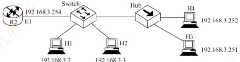

A. 若 H1 向 H3 发送数据，则 H2、H3、H4 都能收到 H1 发来的 ARP 请求报文

B. 若 H3 向 H1 发送数据，则 H3 能收到 H1 发来的 ARP 响应报文

C. 若 H1 向 H2 发送数据，则 H2、H3、H4 都能收到 H1 发来的 ARP 请求报文

D. 若 H3 向 H4 发送数据，则 H3 能收到 H4 发来的 ARP 响应报文

##### 46

可以动态为主机配置 IP 地址的协议是（）。

A. ARP B. RARP C. DHCP D. NAT

##### 47

若某路由器收到一个 TTL 值为 1 的 IP 数据报，则路由器的操作是（）。

A. 转发该 IP 数据报

B. 仅仅丢弃该 IP 数据报

C. 丢弃该 IP 数据报并向源主机发送类型为终点不可达的 ICMP 差错报告报文

D. 丢弃该 IP 数据报并向源主机发送类型为时间超过的 ICMP 差错报告报文
##### 48

下列关于 ICMP 报文的说法中，错误的是（）。

A. ICMP 报文封装在数据链路层帧中发送

B. ICMP 报文可以用于报告 IP 数据报发送错误

C. ICMP 报文封装在 IP 数据报中发送

D. 对于已经携带 ICMP 差错报文的分组，不再产生 ICMP 差错报

##### 49

下列关于 ICMP 差错报文的描述中，错误的是（）。

A. ICMP 报文分为差错报告报文和询问报文两类

B. 对于已经分片的分组，只对第一个分片产生 ICMP 差错报文

C. PING 使用了 ICMP 差错报文

D. 对于多播的分组，不产生 ICMP 差错报文

##### 50

【2010 统考真题】某网络的 IP 地址空间为 192.168.5.0/24，采用定长子网划分，子网掩码为 255.255.255.248，则该网络中的最大子网个数、每个子网内的最大可分配地址个数分别是（）。

A. 32, 8

B. 32, 6

C. 8, 32

D. 8, 30

##### 51

【2010 统考真题】若路由器 R 因为拥塞丢弃 IP 分组，则此时 R 可向发出该 IP 分组的源主机发送的 ICMP 报文类型是（）。

A. 路由重定向 B. 目的不可达 C. 源点抑制 D. 超时

##### 52

【2011 统考真题】在子网 192.168.4.0/30 中，能接收目的地址为 192.168.4.3 的 IP 分组的最大主机数是()。

A. 0 B. 1 C. 2 D. 4

##### 53

【2011 统考真题】某网络拓扑如下图所示，路由器 R1 只有到达子网 192.168.1.0/24 的路由。为使 R1 可以将 IP 分组正确地路由到图中的所有子网，在 R1 中需要增加的一条路由（目的网络，子网掩码，下一跳）是（）。

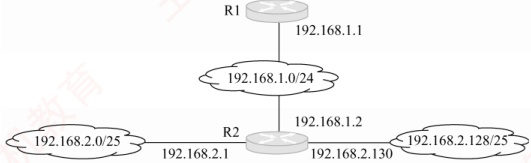

A. 192.168.2.0 255.255.255.128 192.168.1.1

B. 192.168.2.0 255.255.255.0 192.168.1.1

C. 192.168.2.0 255.255.255.128 192.168.1.2

D. 192.168.2.0 255.255.255.0 192.168.1.2

##### 54

【2012 统考真题】某主机的 IP 地址为 180.80.77.55，子网掩码为 255.255.252.0。若该主机向其所在子网发送广播分组，则目的地址可以是（）。

A. 180.80.76.0 B. 180.80.76.255 C. 180.80.77.255 D. 180.80.79.255

##### 55

【2012 统考真题】ARP 的功能是（）。

A. 根据 IP 地址查询 MAC 地址

B. 根据 MAC 地址查询 IP 地址

C. 根据域名查询 IP 地址

D. 根据 IP 地址查询域名

##### 56

【2012 统考真题】在 TCP/IP 体系结构中，直接为 ICMP 提供服务的协议是（）。

A. PPP          B. IP           C. UDP         D. TCP
##### 57

【2015 统考真题】某路由器的路由表如下所示：

| 目的网络 | 下一跳 | 接口 |
| --- | --- | --- |
| 169.96.40.0/23 | 176.1.1.1 | S1 |
| 169.96.40.0/25 | 176.2.2.2 | S2 |
| 169.96.40.0/27 | 176.3.3.3 | S3 |
| 0.0.0.0/0 | 176.4.4.4 | S4 |

若路由器收到一个目的地址为 169.96.40.5 的 IP 分组，则转发该 IP 分组的接口是（）。

A. S1 B. S2 C. S3 D. S4

##### 58

【2016 统考真题】如下图所示，假设 H1 与 H2 的默认网关和子网掩码均分别配置为 192.168.3.1 和 255.255.255.128，H3 和 H4 的默认网关和子网掩码均分别配置为 192.168.3.254 和 255.255.255.128，则下列现象中可能发生的是（）。

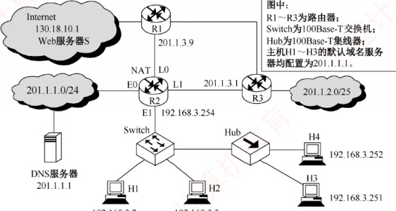

192.168.3.2

A.  $H_{1}$ 不能与  $H_{2}$ 进行正常 IP 通信 B.  $H_{2}$ 与  $H_{4}$ 均不能访问 Internet

C. H1 不能与 H3 进行正常 IP 通信 D. H3 不能与 H4 进行正常 IP 通信

##### 59

【2016 统考真题】在上题的图中，假设连接 R1、R2 和 R3 之间的点对点链路使用地址 201.1.3.x/30，当 H3 访问 Web 服务器 S 时，R2 转发出去的封装 HTTP 请求报文的 IP 分组是源 IP 地址和目的 IP 地址，它们分别是（）。

A. 192.168.3.251, 130.18.10.1

B. 192.168.3.251, 201.1.3.9

C. 201.1.3.8, 130.18.10.1

D. 201.1.3.10, 130.18.10.1

##### 60

【2017 统考真题】若将网络 21.3.0.0/16 划分为 128 个规模相同的子网，则每个子网可分配的最大 IP 地址个数是（）。

A. 254 B. 256 C. 510 D. 512

##### 61

【2017 统考真题】下列 IP 地址中，只能作为 IP 分组的源 IP 地址但不能作为目的 IP 地址的是（）。

A. 0.0.0.0 B. 127.0.0.1 C. 200.10.10.3 D. 255.255.255.255

##### 62

【2018 统考真题】某路由表中有转发接口相同的4条路由表项，其目的网络地址分别为35.230.32.0/21、35.230.40.0/21、35.230.48.0/21和35.230.56.0/21，将该4条路由聚合后的目的网络地址为（）。

A. 35.230.0.0/19 B. 35.230.0.0/20 C. 35.230.32.0/19 D. 35.230.32.0/20

##### 63

【2018 统考真题】路由器 R 通过以太网交换机 S1 和 S2 连接两个网络，R 的接口、主机 H1 和 H2 的 IP 地址与 MAC 地址如下图所示。若 H1 向 H2 发送一个 IP 分组 P，则
H1 发出的封装 P 的以太网帧的目的 MAC 地址、H2 收到的封装 P 的以太网帧的源 MAC 地址分别是（）。

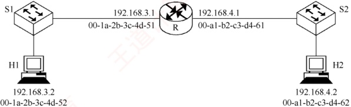

A. 00-a1-b2-c3-d4-62, 00-1a-2b-3c-4d-52 B. 00-a1-b2-c3-d4-62, 00-a1-b2-c3-d4-61 C. 00-1a-2b-3c-4d-51, 00-1a-2b-3c-4d-52 D. 00-1a-2b-3c-4d-51, 00-a1-b2-c3-d4-61

##### 64

【2019 统考真题】若将 101.200.16.0/20 划分为 5 个子网，则可能的最小子网的可分配 IP 地址数是（）。

A. 126 B. 254 C. 510 D. 1022

##### 65

【2021 统考真题】现将一个 IP 网络划分为 3 个子网，若其中一个子网是 192.168.9.128/26，则下列网络中不可能是另外两个子网之一的是（）。

A. 192.168.9.0/25

B. 192.168.9.0/26

C. 192.168.9.192/26

D. 192.168.9.192/27

##### 66

【2021 统考真题】若路由器向 MTU=800B 的链路转发一个总长度为 1580B 的 IP 数据报（首部长度为 20B）时进行了分片，且每个分片尽可能大，则第 2 个分片的总长度字段和 MF 标志位的值分别是（）。

A. 796,0 B. 796,1 C. 800,0 D. 800,1

##### 67

【2022 统考真题】若某主机的 IP 地址是 183.80.72.48，子网掩码是 255.255.192.0，则该主机所在网络的网络地址是（）。

A. 183.80.0.0 B. 183.80.64.0 C. 183.80.72.0 D. 183.80.192.0

##### 68

【2022 统考真题】下图所示网络中的主机 H 的子网掩码与默认网关分别是（）。

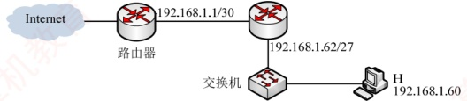

A. 255.255.255.192,192.168.1.1 B. 255.255.255.192,192.168.1.62 C. 255.255.255.224,192.168.1.1 D. 255.255.255.224,192.168.1.62

##### 69

【2023 统考真题】某网络拓扑如下图所示，其中路由器 R2 实现 NAT 功能。若主机 H 向 Internet 发送 1 个 IP 分组，则经过 R2 转发后，该 IP 分组的源 IP 地址是（）。

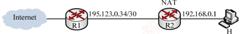

192.168.03

A. 195.123.0.33 B. 195.123.0.35 C. 192.168.0.1 D. 192.168.0.3

##### 70

【2023 统考真题】主机 168.16.84.24/20 所在子网的最小可分配 IP 地址和最大可分配 IP 地址分别是（）。
A. 168.16.80.1, 168.16.84.254 B. 168.16.80.1, 168.16.95.254 C. 168.16.84.1, 168.16.84.254 D. 168.16.84.1, 168.16.95.254

##### 71

【2024统考真题】如下图所示的支持VLAN划分的交换机，已按端口划分了3个VLAN，部分端口连接主机的IP地址和MAC地址如图中所示，ARP表结构为<IP地址，MAC地址，TTL>。下列选项中，不会出现在H4的ARP表中的是（）。

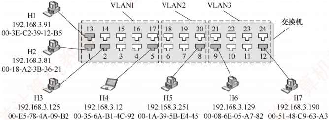

A. 192.168.3.81, 00-18-A2-3B-36-21, 14:32:00

B. 192.168.3.91, 00-3E-C2-39-12-B5, 14:37:00

C. 192.168.3.125, 00-E5-78-4A-09-B2, 14:45:00

D. 192.168.3.129, 00-08-6E-05-A7-82, 14:52:00

##### 72

【2025 统考真题】一台新接入网络的主机 H 在通过 DHCP 服务器动态请求 IP 地址的过程中，与 DHCP 服务器交换 DHCP 报文的部分过程如下图所示。封装 DHCP REQUEST 报文的 IP 数据报的目的 IP 地址和源 IP 地址分别是（）。

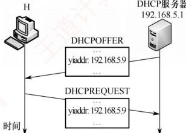

A. 192.168.5.1, 0.0.0.0

B. 192.168.5.1, 192.168.5.9

C. 255.255.255.255, 0.0.0.0

D. 255.255.255.255, 192.168.5.9

#### 二、 综合应用题

##### 01

一个数据报长度为4000B（首部长度固定为20B）。现经过一个网络传送，但此网络能够传送的最大数据长度为1500B。IP分片时，首部长度不变。试问应当划分为几个短一些的数据报片？各数据报片的数据字段长度、片段偏移字段和MF标志应为何值？

##### 02

某网络的一台主机产生了一个IP数据报，首部长度为20B，数据部分长度为2000B。该数据报需要经过两个网络到达目的主机，这两个网络所允许的数据链路层的最大传输单位（MTU）分别为1500B和576B。问原IP数据报到达目的主机时分成了几个IP小报文？每个报文的数据部分长度分别是多少？

##### 03

到达的分组的片偏移值为100，分组首部中的首部长度字段值为5，总长度字段值为100，数据部分第一个字节的编号是多少？能确定数据部分最后一个字节的编号吗？
##### 04

在4个“/24”地址块中进行最大可能的聚合：212.56.132.0/24、212.56.133.0/24、212.56.134.0/24、212.56.135.0/24。

##### 05

现有一公司需要创建内部网络，该公司包括工程技术部、市场部、售后部、财务部和办公室5个部门，每个部门有20~30台计算机。试问：

1）若要将几个部门从网络上分开，且分配给该公司使用的地址为一个 C 类地址，网络地址为 192.168.161.0，则如何划分网络？可以将几个部门分开？

2）确定各部门的网络地址和子网掩码，并写出分配给每个部门网络中的主机IP地址范围。

##### 06

某路由器具有右表所示的路由表项。

1）假设路由器收到两个分组：分组 A 的目的地址为 131.128.55.33，分组 B 的目的地址

为 131.128.55.38。确定路由器为这两个分组选择的下一跳，并加以说明。

2）在路由表中增加一个路由表项，它使以131.128.55.33为目的地址的 IP 分组选择“A”作为下一跳，而不影响其他目的地址的 IP 分组的转发。

3）在路由表中增加一个路由表项，使所有目的地址与该路由表中任何路由表项都不匹配的IP分组被转发到下一跳“E”。

| 网络前缀 | 下一跳 |
| --- | --- |
| 131.128.56.0/24 | A |
| 131.128.55.32/28 | B |
| 131.128.55.32/30 | C |
| 131.128.0.0/16 | D |

4）将131.128.56.0/24划分为4个规模尽可能大的等长子网，给出子网掩码及每个子网的可分配地址范围。

##### 07

下表是使用无类别域间路由选择（CIDR）的路由选择表，地址字段是用十六进制表示的，试指出具有下列目标地址的 IP 分组将被投递到哪个下一站？

| 网络/掩码长度 | 下一站地 |
| --- | --- |
| C4.50.0.0/12 | A |
| C4.5E.10.0/20 | B |
| C4.60.0.0/12 | C |

| C4.68.0.0/14 | D |
| --- | --- |
| 80.0.0.0/1 | E |
| 40.0.0.0/2 | F |
| 00.0.0.0/2 | G |

1）C4.5E.13.87 2）C4.5E.22.09 3）C3.41.80.02 4）5E.43.91.12

##### 08

一个自治系统有5个局域网，如下图所示，LAN2至LAN5上的主机数分别为91、150、3和15，该自治系统分配到的IP地址块为30.138.118.0/23，试给出每个局域网的地址块（包括前缀）。

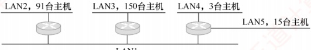

LANI

##### 09

某个网络地址块 192.168.75.0 中有 5 台主机 A、B、C、D 和 E，主机 A 的 IP 地址为 192.168.75.18，主机 B 的 IP 地址为 192.168.75.146，主机 C 的 IP 地址为 192.168.75.158，主机 D 的 IP 地址为 192.168.75.161，主机 E 的 IP 地址为 192.168.75.173，共同的子网掩码是 255.255.255.240。请回答：

1）5台主机A、B、C、D、E分属几个网段？哪些主机位于同一网段？主机D的网络地址为多少？

2）若要加入第6台主机F，使它能与主机A属于同一网段，则其IP地址范围是多少？

3）若在网络中另加入一台主机，其IP地址为192.168.75.164，则它的广播地址是多少？
哪些主机能够收到？

##### 10

一个 IPv4 分组到达一个节点时，其首部信息（以十六进制表示）为：0x45 00 00 54 00 03 58 50 20 06 FF F0 7C 4E 03 02 B4 0E 0F 02。IP 分组的首部格式见图 4.5。请回答：

1）分组的源 IP 地址和目的 IP 地址各是什么（点分十进制表示法）？

2）该分组数据部分的长度是多少？

3）该分组是否已经分片？若有分片，则偏移量是多少？

##### 11

主机 A 的 IP 地址为 218.207.61.211，MAC 地址为 00:1d:72:98:1d:fc。A 收到一个帧，该帧的前 64 个字节的十六进制形式和 ASCII 形式如下图所示。

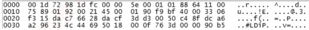

IP 分组的首部格式见图 4.5，以太网帧的格式参见 3.6.2 节。问：

1）主机 A 所在网络的网关路由器的相应端口的 MAC 地址是多少？

2）该 IP 分组所携带的数据量为多少字节？

3）若该分组需要被路由器转发到一条 MTU 为 380B 的链路上，则路由器将做何种操作？

##### 12

某网络拓扑见下图，R1 和 R2 为路由器，R2 实现了 NAT 功能，Switch 为交换机，Hub 为集线器，Web 服务器 S、主机 H1～H4 和路由器各接口的 IP 地址配置见图中标注。

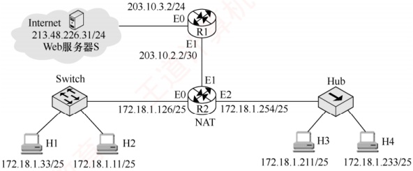

回答下列问题：

1）R2的E1接口的IP地址是什么？H1配置的默认网关是什么？

2）假设 H1 和 R2 的 ARP 缓存初始均为空，交换机的交换表初始也为空，H1 向 H3 发送一个 IP 分组 A，H3 收到 A 后向 H1 发送一个响应 IP 分组 B，则能收到封装 A 的以太网帧的主机有哪些？能收到封装 B 的以太网帧的主机有哪些？

3）H1 发出的封装有 HTTP 请求报文的 IP 分组 C，首部中的源 IP 地址和目的 IP 地址分别是什么？当 C 从 R2 转发出去时，首部中的源 IP 地址和目的 IP 地址分别是什么？

##### 13

【2009 统考真题】某网络拓扑图如下图所示，路由器 R1 通过接口 E1、E2 分别连接局域网 1、局域网 2，通过接口 L0 连接路由器 R2，并通过路由器 R2 连接域名服务器与互联网。R1 的 L0 接口的 IP 地址是 202.118.2.1；R2 的 L0 接口的 IP 地址是 202.118.2.2，L1 接口的 IP 地址是 130.11.120.1，E0 接口的 IP 地址是 202.118.3.1；域名服务器的 IP 地址是 202.118.3.2。

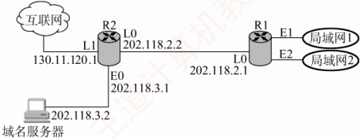

R1 和 R2 的路由表结构如下:

| 目的网络 IP 地址 | 子网掩码 | 下一跳 IP 地址 | 接口 |
| --- | --- | --- | --- |

1）将 IP 地址空间 202.118.1.0/24 划分为两个子网，分别分配给局域网 1 和局域网 2，每个局域网需分配的 IP 地址数不少于 120 个。请给出子网划分结果，说明理由或给出必要的计算过程。

2）请给出 R1 的路由表，使其明确包括到局域网 1 的路由、到局域网 2 的路由、域名服务器的主机路由和互联网的路由。

3）请采用路由聚合技术，给出 R2 到局域网 1 和局域网 2 的路由。

##### 14

【2015 统考真题】某网络拓扑如下图所示，其中路由器内网接口、DHCP 服务器、WWW 服务器与主机1均采用静态IP地址配置，相关地址信息见图中标注；主机2～主机N通过DHCP服务器动态获取IP地址等配置信息。

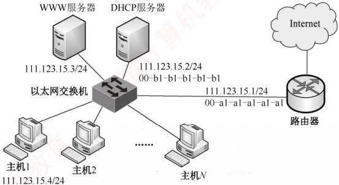

回答下列问题：

1）DHCP 服务器可为主机  $2 \sim N$ 动态分配 IP 地址的最大范围是什么？主机 2 使用 DHCP 获取 IP 地址的过程中，发送的封装 DHCP Discover 报文的 IP 分组的源 IP 地址和目的 IP 地址分别是多少？

2）若主机2的ARP表为空，则该主机访问Internet时，发出的第一个以太网帧的目的MAC地址是什么？封装主机2发往Internet的IP分组的以太网帧的目的MAC地址是什么？

3）若主机1的子网掩码和默认网关分别配置为255.255.255.0和111.123.15.2，则该主机是否能访问WWW服务器？是否能访问Internet？请说明理由。

##### 15

【2018 统考真题】某公司的网络如下图所示。IP 地址空间 192.168.1.0/24 均分给销售部和技术部两个子网，并已分别为部分主机和路由器接口分配了 IP 地址，销售部子网的 MTU=1500B，技术部子网的 MTU=800B。

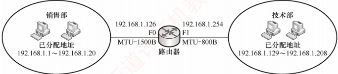

回答下列问题：

1）销售部子网的广播地址是什么？技术部子网的子网地址是什么？若每台主机仅分配一个IP地址，则技术部子网还可以连接多少台主机？

2）假设主机192.168.1.1向主机192.168.1.208发送一个总长度为1500B的IP分组，IP分组的首部长度为20B，路由器在通过接口F1转发该IP分组时进行了分片。若分片时尽可能分为最大片，则一个最大IP分片封装数据的字节数是多少？至少需要分为几个分片？每个分片的片偏移量是多少？

##### 16

【2020 统考真题】某校园网有两个局域网，通过路由器 R1、R2 和 R3 互连后接入 Internet，S1 和 S2 为以太网交换机。局域网采用静态 IP 地址配置，路由器部分接口以及各主机的 IP 地址如下图所示。

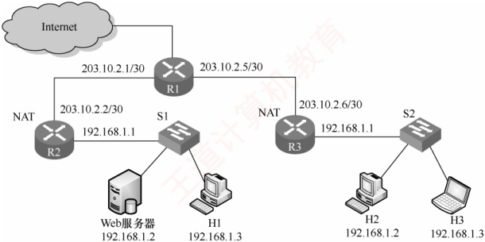

假设 NAT 转换表结构为

| 外网 |   | 内网 |   |
| --- | --- | --- | --- |
| IP 地址 | 端口号 | IP 地址 | 端口号 |
|   |   |   |   |

请回答下列问题：

1）为使 H2 和 H3 能够访问 Web 服务器（使用默认端口号），需要进行什么配置？

2）若 H2 主动访问 Web 服务器时，将 HTTP 请求报文封装到 IP 数据报 P 中发送，则 H2 发送的 P 的源 IP 地址和目的 IP 地址分别是什么？经过 R3 转发后，P 的源 IP 地址和目的 IP 地址分别是什么？经过 R2 转发后，P 的源 IP 地址和目的 IP 地址分别是什么？

##### 17

【2022 统考真题】某网络拓扑如下图所示，R 为路由器，S 为以太网交换机，AP 是 802.11 接入点，路由器的 E0 接口和 DHCP 服务器的 IP 地址配置如图中所示；H1 与 H2 属于同一个广播域，但不属于同一个冲突域；H2 和 H3 属于同一个冲突域；H4 和 H5 已经接入网络，并通过 DHCP 动态获取了 IP 地址。现有路由器、100Base-T 以太网交换机和 100Base-T 集线器（Hub）三类设备各若干。

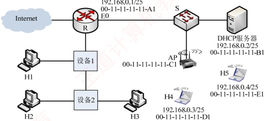

请回答下列问题。

1）设备1和设备2应该分别选择哪类设备？

2）若信号传播速度为  $2 \times 10^8 \, \text{m/s}$，以太网最小帧长为  $64 \, \text{B}$，信号通过设备 2 时会产生额外的  $1.51 \, \mu\text{s}$ 的时延，则 H2 与 H3 之间可以相距的最远距离是多少？

3）在 H4 通过 DHCP 动态获取 IP 地址过程中，H4 首先发送了 DHCP 报文 M，M 是哪种 DHCP 报文？路由器 E0 接口能否收到封装 M 的以太网帧？S 向 DHCP 服务器转发的封装 M 的以太网帧的目的 MAC 地址是什么？

4）若 H4 向 H5 发送一个 IP 分组 P，则 H5 收到的封装 P 的 802.11 帧的地址 1、地址 2 和地址 3 分别是什么？

##### 18

【2025 统考真题】某公司在承建国家重大工程项目时，工程部需要较长时间驻扎在偏远山区，工程部网络需要连接公司总部网络。假设综合考虑方案的技术可行性、安全性与经济成本等因素后，决定租用我国自主建设的天通一号卫星通信链路，连接工程部网络的路由器 R1 和公司总部网络的路由器 R2，如下图所示。S1 和 S2 为千兆以太网交换机；TR1 和 TR2 是卫星信号地面收发设备，实现全双工调制解调。天通一号卫星轨道高度是 36000km，电磁波信号传播速度为 300000km/s。租用的卫星链路为 R1 和 R2 之间提供对称全双工信道，每个方向的数据传输速率为 200kb/s。

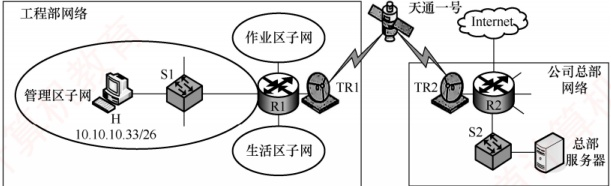

请回答下列问题。

1）若忽略卫星信号中继以及 TR1 和 TR2 调制解调的时间开销，则 R1 到 R2 之间卫星链路的单向传播时延是多少？主机 H 向总部服务器传输数据时可以达到的最大吞吐量是多少？若忽略各层协议数据包的首部开销以及以太网内的传播时延，则主机 H 向总部服务器上传一个 4000B 大小的工程进度报告文件，至少需要多长时间？

2）现需要基于 GBN 滑动窗口协议为卫星链路设计单向可靠的数据链路层协议 SLP，支持 R1 向 R2 发送数据，SLP 数据帧长为 1500B，忽略 ACK 帧长度。若要求 SLP 的单向信道利用率不低于 80%，则 SLP 的发送窗口至少为多少？SLP 帧的序号字段至少需要多少位？
3）若公司总部为工程部网络分配的 IP 地址空间是 10.10.10.0/24，工程部进一步将该 IP 地址空间分配给 3 个子网，其中生活区子网可分配 IP 地址数不少于 120 个，作业区子网和管理区子网可分配 IP 地址数均不少于 60 个，且主机 H 已正确配置了 IP 地址，则作业区子网、管理区子网和生活区子网的子网地址分别是什么（给出 CIDR 形式）？

### 4.2.9 答案与解析

#### 一、 单项选择题

##### 01

C

TCP 和 UDP 是传输层协议，IP、ICMP、ARP、RARP（逆地址解析协议）是网络层协议。

##### 02

B

协议字段表示使用 IP 的上层协议，如值为 6 表示 TCP，值为 17 表示 UDP。版本字段表示 IP 的版本，值为 4 表示 IPv4，值为 6 表示 IPv6。

##### 03

C

在首部中有三个关于长度的标记：首部长度、总长度和片偏移，基本单位分别为4B、1B和8B。IP分组的首部长度必须是4B的整数倍，取值范围是5～15（默认值是5）。因为IP分组的首部长度是可变的，所以首部长度字段必不可少。总长度字段给出IP分组的总长度，单位是字节，包括分组首部和数据部分的长度。数据部分的长度可以从总长度减去分组首部长度计算。

##### 04

B

检验和字段只检查 IP 数据报的首部，不包括数据部分，选项 A 错误。计算检验和的方法是：先把 IP 数据报的首部划分为许多 16 比特的序列，用反码算术运算把所有 16 比特相加后，将得到的和的反码写入检验和字段，选项 B 正确。IP 并不要求源主机重传有差错的 IP 数据报，保证无差错传输是由 TCP 完成的。另一方面，首部检验和只能检验 IP 数据报的首部是否出错，但不知道首部中的源地址字段是否出错，若源地址出现差错，则将差错报文传送到错误的地址是没有任何意义的，因此接收方的网络层发现检验和出错后，就丢弃该数据报，但不会发送差错报文，选项 C 错误。IP 数据报的检验和的计算不需要加入伪首部，伪首部用于计算 UDP 或 TCP 检验和，选项 D 错误。

##### 05

D

在数据链路层，MAC地址用来标识主机或路由器，数据报到达具体的目的网络后，需要知道目的主机的MAC地址才能成功送达，因此需要将IP地址转换成对应的MAC地址，即物理地址。

##### 06

D

数据报被分片后，每个分片都将独立地传输到目的地，其间有可能会经过不同的路径，而最后在目的端主机分组才能被重组。

##### 07

A

在 IP 首部中，标识字段的用途是让目标机器确认一个新到达的分片是否属于同一个数据报，用于重组分片后的 IP 数据报。标志字段中的 DF 表示是否允许分片，MF 表示后面是否还有分片。片偏移则指出分组在分片后某片在原分组中的相对位置。

##### 08

D

片偏移标识该分片所携带数据在原始分组所携带数据中的相对位置，以8B为单位。

##### 09

D

片偏移以 8B 为偏移单位，它指出数据报在分片后，某片在原数据报中的相对位置。若片偏
移值为0，则表示该数据报片是原数据报的第1片，或者该数据报没有分片。若片偏移值为100，则表示该数据报片的第1个字节是原数据报的第800个字节。

##### 10

B

若分组长度超过 MTU，则当 DF=1 时，丢弃该分组，并且要用 ICMP（终点不可达报文）向源主机报告差错；当 DF=0 时，进行分片，MF=1 表示后面还有分片。

##### 11

C

片偏移、首部长度、总长度的单位分别为8B、4B、1B。片偏移值为100，表示该分片的数据部分的第1个字节的编号是800。分组的总长度为100B，首部长度为4B×5=20B，所以数据部分的长度为80B。因此，该分片的数据部分的最后一个字节的编号是879。

##### 12

B

对于选项 A，132.19.237.5 的前 8 位与 132.0.0.0/8 匹配。而 B 选项中，132.19.237.5 的前 11 位与 132.0.0.0/11 匹配。C 选项中，132.19.237.5 的前 22 位与 132.19.232.0/22 不匹配。根据 “最长前缀匹配原则”，该分组应该被转发到 R2。选项 D 为默认路由，只有当前面的所有目的网络都不能和分组的目的 IP 地址匹配时才使用。

##### 13

A

在分类的 IP 网络中，C 类地址的前 24 位为网络位，后 8 位为主机位，主机位全 “0” 表示网络号，主机位全 “1” 表示广播地址，因此最多可以有  $2^{8}-2=254$ 台主机或路由器。

##### 14

A

CIDR 地址块 86.32.0.0/12 的网络前缀为 12 位，说明第 2 个字节的前 4 位在前缀中，第 2 个字节 32 的二进制形式为 00100000。给出的 4 个地址的前 8 位均相同，而第 2 个字节的前 4 位分别是 0010, 0100, 0100, 0100，所以本题答案为选项 A。

##### 15

A

10.255.255.255为A类地址，主机号全1，代表网络广播，为广播地址。192.168.24.59/30为CIDR地址，只有后面2位为主机号，而59用二进制表示为00111011，可知主机号全1，代表网络广播，为广播地址。224.105.5.211为D类多播地址。

##### 16

D

所有形如 127.xx.yy.zz 的 IP 地址，都作为保留地址，用于回路测试。

##### 17

B

选项 A 是 C 类地址，掩码为 255.255.255.0，由此得知 A 地址的主机号为全 0（未使用 CIDR），因此不能作为主机地址。选项 C 是为回环测试保留的地址。选项 D 是语法错误的地址，不允许有 256。选项 B 为 A 类地址，其网络号是 110，主机号是 47.10.0。

##### 18

C

127.x.x.x 用于本地软件的环回测试，既可作为源 IP 地址，又可作为目的 IP 地址，选项 C 错误。0.0.0.0 可作为源 IP 地址，表示本网络上的本主机，通常作为 DHCP 客户的源 IP 地址。255.255.255.255 可作为目的 IP 地址，表示在本网络上进行广播（各路由器均不转发）。网络号为特定网络，主机号为全 1 的目的 IP 地址表示直接广播地址，可对特定网络上的所有主机进行广播。

##### 19

C

因为  $240_{10}=11110000_{2}$，所以共有12比特位用于主机地址，且主机位全0和全1不能使用，所以最多可以有的主机数为  $2^{12}-2=4094$。

##### 20

A

在 Internet 中，IP 数据报从源节点到目的节点可能需要经过多个网络和路由器。当一个路由器
接收到一个 IP 数据报时，路由器根据 IP 数据报首部的目的 IP 地址进行路由选择，并不改变源 IP 地址的取值。即使 IP 数据报被分片，原 IP 数据报的源 IP 地址和目的 IP 地址也将复制到每个分片的首部，因此在整个传输过程中，IP 数据报首部的源 IP 地址和目的 IP 地址都不发生变化。

##### 21

C

划分子网可以增加子网的数量（把一个大的网络划分成许多小的网络，这是子网划分的结果，并不是目的），子网之间的数据传输需要通过路由器进行，因此减少了广播域的大小，提高了网络的效率和安全性。划分子网后，因为各子网中主机号全0和全1的地址不能使用，所以会减少总的主机数量，但划分子网提高了IP地址的利用率。

##### 22

A

由题可知，主机号有5位，若主机号只占1位，则没有有效的IP地址可供分配（除去0和1），因此最少2位表示主机号，还剩3位表示子网号，所以最多可以分成8个子网。而当5位都表示主机数，即只有1个子网时，每个子网最多具有30个有效的IP地址（除去全0和全1）。

##### 23

C

在网络中，允许一台主机有两个或两个以上的 IP 地址，若一台主机有两个或两个以上 IP 地址，则说明这台主机属于两个或两个以上的网络。IP 地址 192.168.11.25 属于 C 类 IP 地址，所以与 A、B 和 D 属于同一个网络；只有 C 的网络号不同，表明它属于不同的网络。

##### 24

A

CIDR 可以更合理地分配 IP 地址空间，缓解 IP 地址消耗的速度，但无法彻底解决 IP 地址耗尽的问题。CIDR 通过路由聚合可减少路由表数量，从而减少路由器之间的信息交换，提高了网络性能。把大的网络划分成小的子网，这是 CIDR 划分子网的结果，并不是作用。

##### 25

D

CIDR 表示法是一种用斜线 “/” 后面加上网络前缀所占的位数来表示 IP 地址的方法。网络前缀所占的位数是网络号部分，剩下的位数是主机号部分。所在地址块包含的地址数是  $2^{10} = 1024$。令主机号全为 0，所以 126.166.66.99/22 所在地址块的第一个地址是 126.166.64.0。

##### 26

B

200.15.10.7的最后一个字节展开成二进制为00000111，该地址是200.15.10.6/29所在地址块的广播地址，不能使用。若将默认网关设置为广播地址，则导致无法识别网关，而被当作一个广播目标，导致分组无法正确地转发给其他网络，而被分发给本网络上的所有主机。

##### 27

D, A

CIDR 地址由网络前缀和主机号两部分组成，CIDR 将网络前缀都相同的连续 IP 地址组成 “CIDR 地址块”。网络前缀的长度为 20 位，主机号为 12 位，因此 192.168.0.0/20 地址块中的地址数为  $2^{12}$ 个。其中，当主机号为全 0 时，取最小地址 192.168.0.0。当主机号全为 1 时，取最大地址 192.168.15.255。注意，这里并不是指可分配的主机地址。

对于 192.16.0.19/28，表示子网掩码为 255.255.255.240。IP 地址 192.16.0.19 与 IP 地址 192.16.0.17 所对应的前 28 位数相同，都是 11000000 00010000 00000000 0001，所以 IP 地址 192.16.0.17 是子网 192.16.0.19/28 的一台主机地址。注意，主机号全 0 和全 1 的地址不使用。

##### 28

B

为每个 IP 分组设定生存时间（TTL），每经过一个路由器，TTL 减 1，TTL 为 0 时，路由器就不再转发该分组。因此可以避免分组在网络中无限循环下去。

##### 29

C

互联网的路由器对目的地址是私有地址的 IP 数据报一律不进行转发。有 3 个私有地址段：
10.0.0.0/8，即10.0.0.0～10.255.255.255，相当于1个A类网络。

172.16.0.0/12，即172.16.0.0～172.31.255.255，相当于16个连续的B类网络。

192.168.0.0/16，即192.168.0.0～192.168.255.255，相当于256个连续的C类网络。

所以只有选项 C 是内部地址，不允许出现在互联网（公网）上。

##### 30

D

最初设计的分类 IP 地址，因为每类地址所能连接的主机数大大超过一般单位的需求量，所以造成了 IP 地址的浪费。划分子网通过从网络的主机号借用若干比特作为子网号，从而使原来较大规模的网络细分为几个规模较小的网络，提高了 IP 地址的利用率。

与划分子网相比，CIDR 是一种更灵活的手段，它消除了 A、B、C 类地址及划分子网的概念。使用各种长度的网络前缀来代替分类地址中的网络号和子网号，将网络前缀都相同的 IP 地址组成 “CIDR 地址块”。网络前缀越短，地址块越大。互联网服务提供者再根据客户的具体情况，分配合适大小的 CIDR 地址块，从而更加有效地利用 IPv4 的地址空间。

采用网络地址转换（NAT），可以使一些使用本地地址的专用网连接到互联网上，进而使得一些机构的内部主机可以使用专用地址，只需给该机构分配一个IP地址即可，并且这些专用地址是可重用的——其他机构也可使用，所以大大节省了IP地址的消耗。

尽管以上三种方法可以在一定阶段内有效缓解 IP 地址耗尽的危机，但无论是从计算机本身发展来看还是从互联网的规模和传输速率来看，现在的 IPv4 地址已很不适用，所以治本的方法还是使用 128 比特编址的 IPv6 地址。

##### 31

B

当路由器准备将 IP 分组发送到网络上，而该网络又无法将整个分组一次发送时，路由器必须将该分组分片，使其长度能满足这一网络对分组长度的限制。IP 分片可以独立地通过各个路径发送，而且在传输过程中仍然存在分片的可能（不同网络的 MTU 可能不同），因此不能由中间路由器进行重组。分片后的 IP 分组直至到达目的主机后才能汇集在一起，并且甚至不一定以原先的次序到达。这样，进行接收的主机都要求支持重组能力。

##### 32

C

“/29”表明前29位是网络号，4个选项的前3个字节均相同。A中第4个字节120为01111000，前5位为01111；B中第4个字节64为01000000，前5位为01000；C中第4个字节96为01100000，前4位为0110；D中第4个字节104为01101000，前5位为01101。因为已经分配的子网74.178.247.96/29的第4个字节的前5位为01100，这与C中第4个字节的前4位重叠，所以C中的网络前缀不能再分配给其他子网。

##### 33

D

本题实际上就是要求找一个子网掩码，使得 A 和 B 的 IP 地址与该子网掩码逐位 “与” 之后得到相同的结果。选项 D 与 A、B 相 “与” 的结果均为 216.0.0.0。

##### 34

B

未进行子网划分时，B类地址有16位作为主机位。因为共需要划分51个子网， $2^{5}<51<2^{6}$，所以需要从主机位划出6位作为子网号，剩下的10位可容纳的主机数为1022（ $2^{10}-2$）台主机，满足题目要求。因此子网掩码为255.255.252.0。

##### 35

A

4 条路由的前 24 位（3 个字节）为网络前缀，前 2 个字节都一样，因此只需要比较第 3 个字节即可，129 = 10000001，130 = 10000010，132 = 10000100，133 = 10000101。前 5 位是完全相同的，因此聚合后的网络的掩码中，1 的数量应该是  $8 + 8 + 5 = 21$，聚合后的网络的第 3 个字节应该
是 10000000 = 128，因此答案为 172.18.128.0/21。

##### 36

C

选项 A 与 192.168.6.192/26 不重叠，聚合后的地址块为 192.168.6.0/24，聚合后的地址块会引入多余地址。选项 B 与 192.168.6.192/26 不重叠，聚合后的地址块为 192.168.6.0/24，聚合后的地址块会引入多余地址；选项 C 与 192.168.6.192/26 不重叠，聚合后的地址块为 192.168.6.128/25，聚合后的地址块未引入多余地址；选项 D 在 192.168.6.192/26 内，有重叠。

##### 37

A

在一条点对点链路中，只需要两个主机 IP 地址、一个网络地址和一个广播地址的 4 种组合，主机号只需 2 位，因此子网掩码应指定为 255.255.255.252 或用 CIDR 表示为 “/30”。

 **注意，在新标准中，该题设的子网掩码可指定为255.255.255.254，或用CIDR表示为“/31”。**

##### 38

B

本题中，某主机不能正常通信意味着它与其他三台主机不在同一个子网，只需判断哪个选项和其他选项不在同一个子网即可。子网掩码为255.255.255.224表示前27位是网络号，可以看出选项B属于子网202.3.1.64/27，其他三项属于子网202.3.1.32/27。或者，后5位是主机号，前3个子网的地址范围为202.3.1.1～30，33～62，65～94（排除全0或全1），据此也能选出答案。

##### 39

D

由子网掩码 255.255.192.0，可知网络号占 18 位，主机号占 14 位，置 166.66.66.66 的后 14 位主机号为全 1，目的 IP 地址为 166.66.127.255。

##### 40

C

类似于哈夫曼编码的思想，可用高度为32的满二叉树来表示整个IP地址空间，因此每个分支节点都可表示成一个地址块，该分支节点下的所有叶节点的编码都是属于该地址块的IP地址。下图是以地址块“/24”为根的二叉树表示，为了简洁，图中省略了共同前缀192.168.1。

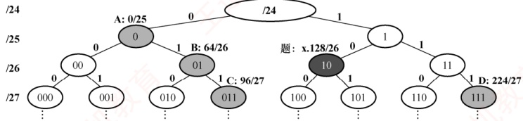

本题要求找出 3 个子网与题中的子网构成一个更大的网络，对应到二叉树中，需满足两个条件：① 4 个子网的地址空间互不重叠，即 4 个分支节点不存在任何祖先或双亲关系；② 4 个子网刚好能构成一个新的地址空间，即存在一个节点刚好能覆盖这 4 个节点下的所有子孙。现结合选项分析：选项 A、D 和 110/27 可与题中子网聚合成/24 网络；选项 B、00/26、11/26 可与题中子网聚合成/24 网络；选项 C 若要与题中子网聚合成一个更大的网络，则至少还需要 00/26、010/27、11/26，共 5 个子网，与题意不符。注意，上述对子网号的分析都是用二进制表示的。

##### 41

A

IP 数据报的首部既有源 IP 地址，又有目的 IP 地址，但在通信中，路由器只会根据目的 IP 地址进行路由选择。IP 数据报在通信过程中，首部的源 IP 地址和目的 IP 地址在经过路由器时不会发生改变。ARP 广播只在子网中传播，因为相互通信的主机不在同一个子网内，所以不可以直接通过 ARP 广播得到目的站的硬件地址。硬件地址只具有本地意义，因此每当路由器将 IP 数据报转发到一个具体的网络时，都需要重新封装源硬件地址和目的硬件地址。
**注意**

路由器接收到分组后，剥离该分组的数据链路层协议头，然后在分组被转发之前，给分组加上一个新的链路层协议头。

##### 42

A

255.255.255.255是受限的广播地址，仅用于主机配置过程中IP分组的目的地址。在任何情况下，路由器都不转发目的地址为受限广播地址的IP分组，这种IP分组仅出现在本地网络中。

##### 43

B

先判断乙和甲是否在同一个子网内，用 IP 地址和子网掩码进行按位 “与” 运算，然后检查它们的网络前缀是否相同。若乙和甲在同一个子网内，则直接交付，无须经过网关，因此将乙的 MAC 地址作为帧的目的 MAC 地址。若乙和甲不在同一个子网内，则要通过网关转发，因此将网关的 MAC 地址作为帧的目的 MAC 地址。经计算，甲的网络前缀为 211.71.128.0/20，乙的网络前缀为 211.71.128.0/20，乙和甲在同一个子网内，因此帧的目的 MAC 地址为乙的 MAC 地址。

##### 44

C

当源主机向本地局域网上的某主机发送 IP 数据报时，先在其 ARP 高速缓存中查看有无目的 IP 地址与 MAC 地址的映射。若有，就把这个硬件地址写入 MAC 帧，然后通过局域网把该 MAC 帧发往此硬件地址；若没有，则先通过广播 ARP 请求分组，在获得目的主机的 ARP 响应分组后，将目的主机的 IP 地址与硬件地址的映射写入 ARP 高速缓存。若目的主机不在本局域网上，则将 IP 分组发送给本局域网上的路由器，当然要先通过同样的方法获得路由器的 IP 地址和硬件地址的映射关系。

##### 45

B

H3 向 H1 友达数据：① H3 用目的 IP 地址、子网掩码逐位“与”，192.168.5.2 & 255.255.255.128 = 192.168.3.0，因为与 H3 自身的网络前缀不同，所以判定 H3 和 H1 不属于同一个网络。② H3 使用 ARP 获得默认网关 E1 的 MAC 地址，并将发往 H1 的 IP 数据报封装成 MAC 帧（H3 判定和 H1 不属于同一个网络，因此目的 MAC 地址是默认网关 E1），该帧经过集线器、交换机的转发，最终被默认网关 E1 接收（H1 收不到这个帧），路由器不再向入口 E1 转发 IP 数据报。综上，H3 不会向 H1 发送 ARP 响应报文，选项 B 错误。读者可尝试分析其他选项的通信过程。

##### 46

C

DHCP 提供了一种机制，使得使用 DHCP 可自动获得 IP 的配置信息而无须手工干预。

##### 47

D

若路由器收到一个 TTL 值为 1 的 IP 数据报，则它先将 TTL 值减 1，然后判断是否为 0。若为 0，则丢弃该 IP 数据报并向源主机发送类型为时间超过的 ICMP 差错报告报文。

##### 48

A

ICMP 属于网络层协议，ICMP 报文被封装在 IP 数据报中发送，但 ICMP 不是高层协议。

##### 49

C

PING 命令使用了 ICMP 的询问报文中的回送请求和回答报文。

##### 50

B

因为该网络的 IP 地址为 192.168.5.0/24，所以网络号为前 24 位，后 8 位为子网号 + 主机号。子网掩码为 255.255.255.248，第 4 个字节 248 转换成二进制为 11111000，因此后 8 位中，前 5 位
用于子网号，在 CIDR 中可以表示  $2^{5}=32$ 个子网；后 3 位用于主机号，除去全 0 和全 1 的情况，可以表示  $2^{3}-2=6$ 台主机地址。

##### 51

C

ICMP 差错报告报文有 5 种：终点不可达、源点抑制、时间超过、参数问题、改变路由。其中源点抑制是指当路由器或主机因拥塞而丢弃数据报时，向源点发送源点抑制报文，使源点知道应当把数据报的发送速率放慢。注意，最新的 ICMP 标准已不再使用源点抑制报文。

##### 52

C

首先分析 192.168.4.0/30 这个网络，主机号占 2 位，地址范围为 192.168.4.0～192.168.4.3，主机号全 1 时是广播地址、全 0 时是本网络地址，因此可容纳 4-2=2 台主机。

##### 53

D

要使 R1 能正确地将分组路由到所有子网，R1 中需要有到 192.168.2.0/25 和 192.168.2.128/25 的路由，分别转换成二进制如下：

192.168.2.0:  $**11000000 10101000 00000010**$ 00000000

192.168.2.128:  $**11000000 10101000 00000010**$ 10000000

前24位都相同，于是可以聚合成超网192.168.2.0/24，子网掩码为前24位，即255.255.255.0。下一跳是与R1直接相连的R2的地址，因此是192.168.1.2。

##### 54

D

子网掩码的第3个字节为11111100，可知前22位为子网号、后10位为主机号。IP地址的第3个字节为 $**01001101**$（下划线为子网号的一部分），将主机号（后10位）全置为1，可以得到广播地址为180.80.79.255。

##### 55

A

在实际网络的数据链路层上传送数据时，最终必须使用硬件地址，ARP 将网络层的 IP 地址解析为数据链路层的 MAC 地址。

##### 56

B

ICMP 报文作为数据字段封装在 IP 分组中，因此 IP 直接为 ICMP 提供服务。UDP 和 TCP 都是传输层协议，为应用层提供服务。PPP 是数据链路层协议，为网络层提供服务。

##### 57

C

根据 “最长前缀匹配原则”，169.96.40.5 与 169.96.40.0 的前 27 位匹配最长，因此选 C。选项 D 为默认路由，只有当前面的所有目的网络都不能和分组的目的 IP 地址匹配时才使用。

##### 58

C

从子网掩码可知 H1 和 H2 处于同一网络，H3 和 H4 处于同一网络，因此 H1 和 H2、H3 和 H4 分别可以进行正常的 IP 通信。H1 和 H2、H3 和 H4 处于不同的网络，因此需要通过路由器才能进行正常的 IP 通信，当 H1 向 H3 发送 IP 分组时，H1 用目的 IP 地址、子网掩码逐位 “与” H1 自身的网络前缀不同，于是判定 H3 与 H1 属于不同的网络，需要将该 IP 分组发送到默认网关，而 H1 配置的默认网关为 192.168.3.1，但 R2 的 E1 接口的 IP 地址为 192.168.3.254，因此 H1 不能与 H3 进行正常的 IP 通信。注意，即使 H1 的默认网关配置正确，但因为路由器不会从分组入口进行转发，所以 H1 和 H3 也无法进行正常的 IP 通信。H2 的默认网关为 192.168.3.1，因此 H2 也不能访问 Internet；H4 的默认网关为 192.168.3.254，因此 H4 可以正常访问 Internet。

##### 59

D

当内网用户向公网发送 IP 分组时，NAT 路由器会更改 IP 分组的源地址，因此下一步就是求 R1 的公网 IP 地址。连接 R1、R2 和 R3 之间的点对点链路使用 201.1.3.x/30 地址，可知该地址块
的 IP 地址的后两位为主机号，而主机号全 0 和全 1 的 IP 地址不能分配，因此若已知路由器之间的点对点链路中的一个路由器接口的 IP 地址，就可求出另一路由器接口的 IP 地址。在 R1 和 R2 相连的链路中，已知 R1 端接口的 IP 地址为 201.1.3.9/30，将其后 8 位展开成二进制为  $**0000 10**$01，所以可分配给 R2 的 L0 接口的 IP 地址为 201.1.3.10。同理，也可求出 R2 的 L1 接口的 IP 地址为 201.1.3.2。访问 Web 服务器，只能通过 R2 的接口 L0 或 L1 转发，所以经过 R2 转发后，IP 分组的源地址可能为 201.1.3.10 或 201.1.3.2，目的地址为 Web 服务器的 IP 地址 130.18.10.1。

##### 60

C

这个网络有16位的主机号，平均分成128个规模相同的子网，每个子网有7位的子网号，9位的主机号。除去一个网络地址和广播地址，可分配的最大IP地址个数是 $2^{9}-2=512-2=510$。

##### 61

A

0.0.0.0/32 可以作为本主机在本网络上的源地址。127.0.0.1 是回送地址，以它为目的 IP 地址的数据将被立即返回本机。200.10.10.3 是 C 类 IP 地址。255.255.255.255 是广播地址。

##### 62

C

对于此类题目，先分析需要聚合的 IP 地址。观察发现，题中的 4 个路由地址，前 16 位完全相同，不同之处在于第 3 段的 8 位中，将这 8 位展开写成二进制，分别如下：

|   | 7 | 6 | 5 | 4 | 3 | 2 | 1 | 0 |
| --- | --- | --- | --- | --- | --- | --- | --- | --- |
| 32 | 0 | 0 | 1 | 0 | 0 | 0 | 0 | 0 |
| 40 | 0 | 0 | 1 | 0 | 1 | 0 | 0 | 0 |
| 48 | 0 | 0 | 1 | 1 | 0 | 0 | 0 | 0 |
| 56 | 0 | 0 | 1 | 1 | 1 | 0 | 0 | 0 |

观察发现，在4个地址的第3段中，从前向后最多有3位相同，因此这3位是能聚合的最大位数。将这些相同的位都保留，将第3段第3位后的所有位都置0，就得到了聚合后的IP地址：35.230.32.0，其网络前缀为16+3，即前19位，因此聚合后的网络地址为35.230.32.0/19。

##### 63

D

在网络的数据传送中，会经常用到两个地址：MAC 地址和 IP 地址。其中，MAC 地址会随着数据被发往不同的网络而改变，但 IP 地址当且仅当数据在私有网络与外部网络之间传递时才会改变。分组 P 在如题图所示的网络中传递时，首先由主机 H1 将分组发往路由器 R，这时源 MAC 地址为 H1 主机本身的 MAC 地址，即 00-1a-2b-3c-4d-52，目的 MAC 地址为路由器 R 的 MAC 地址，即 00-1a-2b-3c-4d-51。路由器 R 收到分组 P 后，根据分组 P 的目的 IP 地址，得知应将分组从另一个端口转发出去，于是会给分组 P 更换新的 MAC 地址，此时因为从另外的端口转发出去，所以 P 的新 MAC 地址变为负责转发的端口 MAC 地址，即 00-a1-b2-c3-d4-61，目的 MAC 地址应为主机 H2 的 MAC 地址，即 00-a1-b2-c3-d4-62。根据分析过程，题目所问的 MAC 地址应为路由器 R 两个端口的 MAC 地址，因此选 D。

##### 64

B

网络前缀为20位，将101.200.16.0/20划分为5个子网，为了保证有子网的可分配IP地址数尽可能小，即要让其他子网的可分配IP地址数尽可能大，不能采用平均划分的方法，而要采用变长的子网划分方法，也就是最大子网用1位子网号，第二大子网用2位子网号，以此类推。

子网1：101.200.00010000.00000001～101.200.00010111.11111110；地址范围为101.200.16.1/21～101.200.23.254/21；可分配的IP地址数为2046个。

子网2：101.200.00011000.00000001～101.200.00011011.11111110；地址范围为101.200.24.1/22～
101.200.27.254/22；可分配的IP地址数为1022个。

子网3：101.200.0001 $\underline{110}$0.00000001～101.200.0001 $\underline{110}$1.111111110；地址范围为101.200.28.1/23～101.200.29.254/23；可分配的IP地址数为510个。

于网4：101.200.0001 $**1110**$.00000001～101.200.0001 $**1110**$.11111110；地址范围为101.200.30.1/24～101.200.30.254/24；可分配的IP地址数为254个。

子网5：101.200.0001 $**1111**$.00000001～101.200.0001 $**1111**$.11111110；地址范围为101.200.31.1/24～101.200.31.254/24；可分配的IP地址数为254个。

综上所述，可能的最小子网的可分配IP地址数是254个。

##### 65

B

划分子网的原则是要求划分出来的子网的 IP 地址空间互不重叠，且原来的 IP 地址空间不遗漏，求解本题最好的方法是代入选项，观察是否可将原 IP 地址空间分割为 3 个互不重叠的子网。根据题意，将 IP 网络划分为 3 个子网。其中一个是 192.168.9.128/26。可简写成 10/26（省略前面相同的 24 位前缀，其中 10 是 128 的二进制 1000 0000 的前两位，因为 26-24=2）。同理，A 可简写成 0/25；B 可简写成 0/26；C 可简写成 11/26；D 可以简写成 110/27。采用二叉树形式画出这些子网的地址空间如下图所示。

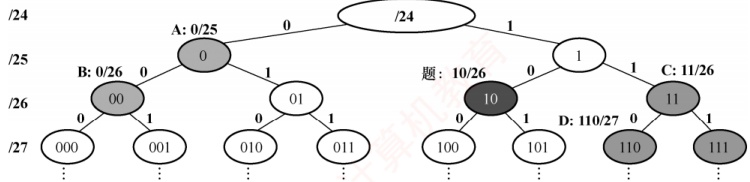

对于 A 和 C，可以组成 0/25、10/26、11/26 这 3 个互不重叠的子网。对于 D，可以组成 10/26、110/27、111/27 这 3 个互不重叠的子网。但对于 B，要想将一个 IP 网络划分为几个互不重叠的子网，3 个是不够的，至少需要划分为 4 个子网：00/26、01/26、10/26、11/26。

##### 66

B

链路层 MTU = 800B。IP 分组首部长 20B。片偏移以 8 个字节为偏移单位，因此除了最后一个分片，其他每个分片的数据部分长度都是 8B 的整数倍。所以，最大 IP 分片的数据部分长度为 776B。在总长度为 1580B 的 IP 数据报中，数据部分占 1560B，1560B/776B = 2.01…，需要分成 3 片。所以第 2 个分片的总长度字段为 796，MF 为 1（表示还有后续的分片）。

##### 67

B

主机所在网络的网络地址可以通过主机的 IP 地址和子网掩码逐位 “与” 得到。子网掩码255.255.192.0 的二进制前 18 位为 1、后 14 位为 0，把主机 IP 地址的后 14 位变为 0，得到的结果为 183.80.64.0，即为主机所在网络的网络地址。

##### 68

D

默认网关可以理解为到当前主机最近的路由器的端口地址，所以是192.168.1.62，而该主机的子网掩码和网关的子网掩码也相同，/27即为255.255.255.224。

##### 69

A

H 向 Internet 发送 IP 分组，初始的源 IP 地址为 192.168.0.3，经过 NAT 路由器的转发后，将源 IP 地址从私有 IP 地址改成全球 IP 地址（R2 外部接口的 IP 地址），因为 R2 外部接口和 195.123.0.34/30 处于同一子网，该子网可分配的 IP 地址范围是 195.123.0.33～195.123.0.34，所以
R2 外部接口的 IP 地址是 195.123.0.33，也就是经过 R2 转发后的源 IP 地址。

##### 70

B

网络号位数为  $20 = 8 \times 2 + 4$，子网掩码为 11111111 11111111 11110000 00000000，将它与主机地址 168.16.84.24 进行逐位 “与”，得到网络地址为 168.16.80.0/20，该网段共有  $2^{12} - 2$ 个可供分配的 IP 地址，地址范围是 168.16.80.1～168.16.95.254。

##### 71

D

ARP 用于解决局域网上的主机或路由器的 IP 地址和 MAC 地址的映射问题。因此 H4 的 ARP 表中只有和 H4 处于同一虚拟局域网上的主机的 IP 地址和 MAC 地址的映射，H4 位于 VLAN1，H6 位于 VLAN3，因此 D 表示的 H6 的 IP 地址与 MAC 地址的映射不应出现在 H4 的 ARP 表中。

##### 72

C

在 DHCP 交互中，主机收到 DHCP Offer 报文后若接受该配置，则会广播 DHCP REQUEST 报文，通知所有 DHCP 服务器：选中的服务器确认分配，未选中的服务器释放预留资源。此时，主机尚未正式获得 IP 地址，因此 IP 数据报的源地址为 0.0.0.0，目的地址为 255.255.255.255。

#### 二、 综合应用题

##### 01

【解答】

数据报长度为 4000B，有效载荷为 4000 - 20 = 3980B。网络能传送的最大有效载荷为 1500 - 20 = 1480B，因此应分为 3 个短些的片，各片的数据字段长度分别为 1480B、1480B 和 1020B。片段偏移字段的单位为 8B，1480/8 = 185， $(1480 \times 2)/8 = 370$，因此片段偏移字段的值分别为 0、185、370。MF = 1 时，代表后面还有分片；MF = 0 时，代表后面没有分片，因此 MF 字段的值分别为 1、1 和 0（注意，MF = 0 不能确定是独立的数据报，还是分片得来的，只有当 MF = 0 且片段偏移字段 > 0 时，才能确定是分片的最后一个分片）。

##### 02

【解答】

在 IP 层下面的每种数据链路层都有自己的帧格式，其中包括帧格式中的数据字段的最大长度，这称为最大传输单位（MTU）。1500－20=1480，2000－1480=520，所以原 IP 数据报经过第一个网络后分成了两个 IP 小报文，第一个报文的数据部分长度是 1480B，第二个报文的数据部分长度是 520B。

（除最后一个报片外的）所有报片的有效载荷都是 8B 的倍数。576－20＝556，但 556 不能被 8 整除，所以分片时的数据部分最大只能取 552。第 1 个报文经过第 2 个网络后，1480－552×2＝376＜576，变成数据长度分别为 552B、552B、376B 的 3 个 IP 小报文；第 2 个报文 520＜552，因此不用分片。因此到达目的主机时，原 2000B 的数据被分成数据长度分别为 552B、552B、376B、520B 的 4 个小报文。

##### 03

【解答】

分片的片偏移值表示其数据部分首字节在原始分组的数据部分中的相对位置，单位为 8B。首部长度字段以 4B 为单位，总长度字段以字节为单位。题目中，分组的片偏移值为 100，因此其数据部分第一个字节的编号是 800。因为分组的总长度为 100B，首部长度为  $4 \times 5 = 20$B，所以数据部分长度为 80B。因此该分组的数据部分的最后一个字节的编号是 879。

##### 04

【解答】

因为一个 CIDR 地址块中可以包含很多地址，所以路由表中就利用 CIDR 地址块来查找目的网络，这种地址的聚合常称为路由聚合。

本题已知有212.56.132.0/24、212.56.133.0/24、212.56.134.0/24、212.56.135.0/24地址块，可知第
3 个字节前 6 位相同，因此共同前缀为  $8 + 8 + 6 = 22$ 位，因为这 4 个地址块的第 1、2 个字节相同，考虑它们的第 3 个字节： $132 = (10000100)_2$， $133 = (10000101)_2$， $134 = (10000110)_2$， $135 = (10000111)_2$，所以共同的前缀有 22 位，即 1101010000111000100001，聚合的 CIDR 地址块是 212.56.132.0/22。

##### 05

【解答】

1）可以采用划分子网的方法对该公司的网络进行划分。因为该公司包括5个部门，所以共需要划分为5个子网。

2）已知网络地址 192.168.161.0 是一个 C 类地址，所需的子网数为 5，每个子网的主机数为 20～30。子网号的比特数为 3，即最多有  $2^{3}=8$ 个可分配的子网，主机号的比特数为 5，因为主机号不能为全 0 或全 1，所以每个子网最多有  $2^{5}-2=30$ 个可分配的 IP 地址。

5 个部门子网的子网掩码均为 255.255.255.224，各部门的网络地址与部门主机的 IP 地址范围可分配如下：

| 部 门 | 部门网络地址 | 主机 IP 地址范围 |
| --- | --- | --- |
| 工程技术部 | 192.168.161.0 | 192.168.161.1～192.168.161.30 |
| 市场部 | 192.168.161.32 | 192.168.161.33～192.168.161.62 |
| 客服部 | 192.168.161.64 | 192.168.161.65～192.168.161.94 |
| 财务部 | 192.168.161.96 | 192.168.161.97～192.168.161.126 |
| 办公室 | 192.168.161.128 | 192.168.161.129～192.168.161.158 |

##### 06

【解答】

1）使用 CIDR 时，可能会导致有多个匹配结果，应当从当前匹配结果中选择具有最长网络前缀的路由。下面来一一分析分组 A 与表中这四项的匹配性：

①131.128.56.0/24与131.128.55.33不匹配，因为前24位不同。

②131.128.55.32/28与131.128.55.33的前24位匹配，只需看后面4位是否匹配，32转换为二进制为00100000，33转换为二进制为00100001，匹配，且匹配了28位。

③131.128.55.32/30与131.128.55.33的前24位匹配，只需要看后面6位是否匹配，32转换为二进制为00100000，33转换为二进制为00100001，匹配，且匹配了30位。

④ 131.128.0.0/16 与 131.128.55.33 匹配，且匹配了 16 位。

综上，对于分组 A，第 2、3、4 项都能与之匹配，但根据最长网络前缀匹配原则，应该选择网络前缀为 131.128.55.32/30 的表项进行转发，下一跳路由器为 C。

同理，对于分组 B，路由表中第 2、4 项都能与之匹配，但是根据最长网络前缀匹配原则，应该选择第 2 个路由表项转发，下一跳路由器为 B。

2）即增加1条特定主机路由：网络前缀131.128.55.33/32；下一跳A。

3）即增加1条默认路由：网络前缀0.0.0.0/0；下一跳E。

4）要划分成4个规模尽可能大的子网，需要从主机位中划出2位作为子网位 $2^{2}=4$，CIDR广泛使用之后允许子网位可以全0和全1）。子网掩码均为11

| 子网 | 子网掩码 | 地址范围 |
| --- | --- | --- |
| 131.128.56.0/26 | 255.255.255.192 | 131.128.56.1～131.128.56.62 |
| 131.128.56.64/26 | 255.255.255.192 | 131.128.56.65～131.128.56.126 |
| 131.128.56.128/26 | 255.255.255.192 | 131.128.56.129～131.128.56.190 |
| 131.128.56.192/26 | 255.255.255.192 | 131.128.56.193～131.128.56.254 |

##### 07

【解答】

1）网络号 C4.5E.10.0/20（下一站地是 B）的第 3 个字节可以用二进制表示成 0001 0000。目标地址 C4.5E.13.87 的第 3 个字节可以用二进制表示成 0001 0011，显然取 20 位掩码与网络号 C4.5E.10.0/20 相匹配，所以具有该目标地址的 IP 分组将被投递到下一站地 B。

2）网络号 C4.50.0.0/12（下一站地是 A）的第 2 个字节可以用二进制表示成 0101 0000。目标地址 C4.5E.22.09 的第 2 个字节可以用二进制表示成 0101 1110，显然取 12 位掩码与网络号 C4.50.0.0/12 相匹配，所以具有该目的地址的 IP 分组将被投递到下一站地 A。

3）网络号 80.0.0.0/1（下一站地是 E）的第 1 个字节可以用二进制表示成 1000 0000。目标地址 C3.41.80.02 的第 1 个字节可以用二进制表示成 1100 0011，显然取 1 位掩码与网络号 80.0.0.0/1 相匹配，所以具有该目标地址的 IP 分组将被投递到下一站地 E。

4）网络号40.0.0.0/2（下一站地是F）的第1个字节可以用二进制表示成0100 0000。目标地址5E.43.91.12的第1个字节可以用二进制表示成0101 1110，显然取2位掩码与网络号40.0.0.0/2相匹配，所以具有该目标地址的IP分组将被投递到下一站地F。

##### 08

【解答】

分配网络前缀应先分配地址数较多的前缀。已知该自治系统分配到的 IP 地址块为 30.138.118/23（注意：① 一个路由器端口也需要占用一个 IP 地址；② 子网划分的答案不唯一）。

LAN3：主机数为150，因为 $(2^7-2)<150+1<(2^8-2)$，所以主机号为8比特，网络前缀为24。取第24位为0，分配地址块30.138.118.0/24。

LAN2：主机数 91，因为 $(2^{6}-2)<91+1<(2^{7}-2)$，所以主机号为7比特，网络前缀为25。取第24、25位为10，分配地址块30.138.119.0/25。

LAN5：主机数为15，因为 $(2^{4}-2)<15+1<(2^{5}-2)$，所以主机号为5比特，网络前缀27。取第24、25、26、27位为1110，分配地址块30.138.119.192/27。

LAN1：共有3个路由器，再加上一个网关地址，至少需要4个IP地址。因为 $(2^{2}-2)<3+1<(2^{3}-2)$，所以主机号为3比特，网络前缀为29。取第24、25、26、27、28、29位为111101，分配地址块30.138.119.232/29。

LAN4：主机数为3，因为 $(2^{2}-2)<3+1<(2^{3}-2)$，所以主机号为3比特，网络前缀29。取第24、25、26、27、28、29位为111110，分配地址块30.138.119.240/29。

##### 09

【解答】

1）共同的子网掩码为255.255.255.240，表示前28位为网络号，同一网段内的IP地址具有相同的网络号。主机A的网络号为192.168.75.16；主机B的网络号为192.168.75.144；主机C的网络号为192.168.75.144；主机D的网络号为192.168.75.160；主机E的网络号为192.168.75.160。因此5台主机A、B、C、D、E分属3个网段，主机B和C在一个网段，主机D和E在一个网段，主机A在一个网段。主机D的网络号为192.168.75.160。

2）主机 F 与主机 A 同在一个网段，所以主机 F 所在的网段为 192.168.75.16，第 4 个字节 16 的二进制表示为 0001 0000，最后边的 4 位为主机位，去掉全 0 和全 1。则其 IP 地址范围为 192.168.75.17～192.168.75.30，并且不能为 192.168.75.18。

3）因为164的二进制为1010 0100，将最右边的4位全置1，即1010 1111，则广播地址为192.168.75.175。主机D和主机E可以收到。

##### 10

【解答】

IPv4的首部格式如下，根据首部格式来解析首部各个字段的含义。

| 版本 | 首部长度 | 区分服务 | 总长度 |   |
| --- | --- | --- | --- | --- |
| 标识 |   |   | 标志 | 片偏移 |
| 生存时间 |   | 协议 | 首部检验和 |   |
| 源地址 |   |   |   |   |
| 目的地址 |   |   |   |   |
| 可选字段（长度可变） |   |   | 填充 |   |

1）由上图可知，源IP地址为IP首部的第13、14、15、16个字节，即7C4E0302，转换为点分十进制表示可得源IP地址为124.78.3.2。目的IP地址为IP首部的第17、18、19、20个字节，即B40E0F02，转换为点分十进制表示可以得到目的IP地址为180.14.15.2。

2）分组总长度是IP首部的第3、4个字节，即00 54，转换为十进制得该分组总长度为84，单位为字节。而首部长度是IP首部的第5～8位，值为5，单位为4B，因此首部长度为4B×5=20B。

数据部分长度=总长度-首部长度=84-20=64B。

3）该分组首部的片偏移字段为第7、8个字节（除去第7个字节的前3位），不等于0，而是二进制值1100001010000，即十进制数6224，单位是8B。

另外，分组的标志字段为第7个字节的前3位，即010，中间位DF=1表示不可分片，最后位MF=0表示后面没有分片。

##### 11

【解答】

1）根据收到的帧，找出源 IP 地址为 da c76628，表示成十进制为 218.199.102.40，是一个 C 类 IP 地址，与 A 的 IP 地址 218.207.61.211 不在同一个网络中，所以需经过路由器转发。MAC 地址只具有本地意义（ARP 也只能工作在同一局域网中）。该帧为 A 收到的帧，因此目的 MAC 地址为 A 的 MAC 地址，源 MAC 地址为网关路由器端口的 MAC 地址（若为 A 发出的帧，则目的 MAC 地址为默认网关的 MAC 地址）。首先找到目的 MAC 地址 00:1d:72:98:1d:fc 的位置（在下图中的位置 1 标出），根据以太网帧的结构，目的 MAC 地址后面紧邻的是源 MAC 地址，因此源 MAC 地址为 00:00:5e:00:01:01。

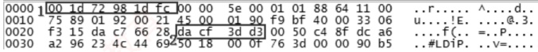

2）要求得 IP 分组所携带的数据量，需要知道首部长度和总长度。218.207.61.211 表示成十六进制是 da.cf.3d.d3，并且作为分组中的目的 IP 地址。在图中确定目的 IP 地址的位置（位置2），再根据 IP 首部的结构，分别从目的 IP 的位置向前数 14 和 16 个字节，即可找到总长度和首部长度字段的位置。但首部长度字段所在的字节值为 0x45，首部长度字段只有 4 位，前 4 位是版本号。因此首部字段的值为 5，单位为 4B，所以首部长度为 20B。总长度字段值为 0x0190，十进制为 400B。因此分组携带的数据长度为 380B。

3）因为整个 IP 分组的长度是 400B，大于输出链路 MTU（380B）。这时需要考虑分片，但是否能够分片还得看 IP 首部中的标志位。IP 首部中的标志字段占 3 位，从前到后依次为保留位、DF、MF。根据 IP 首部结构找到标志字段所在的字节，其值为 0x40，二进制表示为 01000000，于是 DF = 1，不能对该 IP 分组进行分片。此时，路由器应进行的操作是丢弃该分组，并用 ICMP 差错报文向源主机报告。

##### 12

【解答】

1）网络前缀/30，主机号不能为全0或全1，可求出R2接口E1的IP地址为203.10.2.1。H1
配置的默认网关应是 R2 接口 E0 的 IP 地址 172.18.1.126。

2）在 H1→R2→H3 传送 IP 分组的过程中，分别使用了两次 ARP，交换机进行了相关的自学习，还需要考虑 Hub 的广播特性。H1 给 H3 发送一个 IP 分组 A，能收到封装 A 的以太网帧的主机有 H3 和 H4，其中 H4 发现帧的目的 MAC 地址与自身的不同且不是广播地址，于是丢弃该帧，而 H3 发现帧的目的 MAC 地址与自身的相同，于是接收该帧。H3 给 H1 发送一个 IP 分组 B，能收到封装 B 的以太网帧的主机有 H4 和 H1，其中 H4 发现帧的目的 MAC 地址与自身的不同且不是广播地址，于是丢弃该帧，而 H1 接收该帧。

3）当 H1 发出 C 时，首部中的源 IP 地址为 H1 的 IP 地址 172.18.1.33，目的 IP 地址为 Web 服务器 S 的 IP 地址 213.48.226.31。当 C 从 R2 转发出去时，首部中的源 IP 地址为 R2 接口 E1 的 IP 地址 203.10.2.1，目的 IP 地址为 Web 服务器 S 的 IP 地址 213.48.226.31。

##### 13

【解答】

1）子网号可以全0或全1，但主机号不能全0或全1。

因此，若将 IP 地址空间 202.118.1.0/24 划分为 2 个子网，且每个局域网需分配的 IP 地址个数不少于 120 个，则子网号至少要占用 1 位。

由  $2^{6}-2<120<2^{7}-2$ 可知，主机号至少要占用 7 位。

因为源 IP 地址空间的网络前缀为 24 位，所以主机号位数 + 子网号位数 = 8。

综上可得主机号位数为7，子网号位数为1。

因此子网的划分结果为子网1：子网地址为202.118.1.0，子网掩码为255.255.255.128（或子网1：202.118.1.0/25）；子网2：子网地址为202.118.1.128，子网掩码为255.255.255.128（或子网2：202.118.1.128/25）。

地址分配方案：子网1分配给局域网1，子网2分配给局域网2；或者子网1分配给局域网2，子网2分配给局域网1。

2）因为局域网1和局域网2分别与路由器R1的E1、E2接口直接相连，所以在R1的路由表中，目的网络为局域网1的转发路径是直接通过接口E1转发的，目的网络为局域网2的转发路径是直接通过接口E2转发的。因为局域网1、2的网络前缀均为25位，所以它们的子网掩码均为255.255.255.128。

域名服务器是一台特定的主机，它指明了其IP地址，因此设定1条特定主机路由，该表项的子网掩码为255.255.255.255（只有和全1的子网掩码相与时，才能保证和目的IP地址一样，从而选择该特定路由）。对应的下一跳地址是202.118.2.2，转发接口是L0。

R1 到互联网的路由实质上相当于一个默认路由（当某一目的 IP 地址与路由表中其他任何表项都不匹配时，则匹配该默认路由。 **互联网包括了无数的网络集合，不可能在路由表项中一一列出，因此只能采用默认路由的方式**），默认路由一般写为0/0，即目的地址为0.0.0.0，子网掩码为0.0.0.0。对应的下一跳地址是202.118.2.2，转发接口是L0。

综上可得到路由器R1的路由表如下：

（子网1分配给局域网1，子网2分配给局域网2）

| 目的网络 IP 地址 | 子网掩码 | 下一跳 IP 地址 | 接口 |
| --- | --- | --- | --- |
| 202.118.1.0 | 255.255.255.128 | — | E1 |
| 202.118.1.128 | 255.255.255.128 | — | E2 |
| 202.118.3.2 | 255.255.255.255 | 202.118.2.2 | L0 |
| 0.0.0.0 | 0.0.0.0 | 202.118.2.2 | L0 |

（子网1分配给局域网2，子网2分配给局域网1）

| 目的网络 IP 地址 | 子网掩码 | 下一跳 IP 地址 | 接口 |
| --- | --- | --- | --- |
| 202.118.1.128 | 255.255.255.128 | — | E1 |
| 202.118.1.0 | 255.255.255.128 | — | E2 |
| 202.118.3.2 | 255.255.255.255 | 202.118.2.2 | L0 |
| 0.0.0.0 | 0.0.0.0 | 202.118.2.2 | L0 |

3）局域网1和局域网2的地址可以聚合为202.118.1.0/24，而对于路由器R2来说，通往局域网1和局域网2的转发路径都是从L0接口转发的，因此采用路由聚合技术后，路由器R2到局域网1和局域网2的路由如下：

| 目的网络 IP 地址 | 子网掩码 | 下一跳 IP 地址 | 接口 |
| --- | --- | --- | --- |
| 202.118.1.0 | 255.255.255.0 | 202.118.2.1 | L0 |

##### 14

【解答】

1）DHCP 服务器可为主机  $2 \sim N$ 动态分配 IP 地址的最大范围是 111.123.15.5～111.123.15.254；主机 2 发送的封装 DHCP Discover 报文的 IP 分组的源 IP 地址和目的 IP 地址分别是 0.0.0.0 和 255.255.255.255。

2）主机2发出的第一个以太网帧的目的MAC地址是ff-ff-ff-ff-ff-ff；封装主机2发往Internet的IP分组的以太网帧的目的MAC地址是00-al-al-al-al-al。

3）主机1能访问WWW服务器，但不能访问Internet。因为主机1的子网掩码配置正确而默认网关IP地址被错误地配置为111.123.15.2（正确IP地址是111.123.15.1），所以主机1可以访问在同一个子网内的WWW服务器，但当主机1访问Internet时，主机1发出的IP分组会被路由到错误的默认网关（111.123.15.2），从而无法到达目的主机。

##### 15

【解答】

1）广播地址是网络地址中主机号全1的地址（主机号全0的地址代表网络本身）。销售部和技术部均被分配了192.168.1.0/24的IP地址空间，IP地址的前24位为网络号。于是在后8位中划分部门的子网，选择前1位作为部门子网的网络号。根据已分配的IP地址，销售部子网的网络号为0，技术部子网的网络号为1，则技术部的子网地址为192.168.1.128；销售部的子网地址为192.168.1.0，广播地址为192.168.1.127。

每台主机仅分配一个IP地址，计算目前还可以分配的主机数，用技术部可以分配的主机数减去已分配的主机数，技术部总共可以分配的计算机主机数为 $2^7 - 2 = 126$（减去全0和全1的主机号）。已经分配了208 - 129 + 1 = 80台，此外还有1个IP地址（192.168.1.254）分配给了路由器的端口，因此还可以分配126 - 80 - 1 = 45台。

2）判断分片的大小，需要考虑各个网段的 MTU，而且注意分片的数据长度必须是 8B 的整数倍。由题可知，在技术部子网内，MTU=800B，IP 分组首部长 20B，最大 IP 分片封装数据的字节数为 $(800-20)/8 \times 8 = 776$。至少需要的分片数为 $\lceil (1500-20)/776 \rceil = 2$。第 1 个分片的偏移量为 0；第 2 个分片的偏移量为 776/8 = 97。

##### 16

【解答】

1）H2 和 H3 与 Web 服务器处于不同的局域网，路由器 R2、R3 具有 NAT 功能。当 R2 从 WAN 口收到来自 H2 或 H3 发来的 HTTP 请求时，根据 NAT 表发送给 Web 服务器的对应端口。为使外部主机能正常访问 Web 服务器，应在 R2 的 NAT 表中增加一项，外网的 IP
地址配置为路由器的外端 IP 地址，内网的 IP 地址配置为 Web 服务器的 IP 地址，HTTP 的服务器端的默认端口号为 80，因此外网和内网的端口号都需配置为 80。只需在 R2 中配置 Web 服务器的 NAT 表项，而不用在 R3 中配置 H2 和 H3 的 NAT 表项，原因在于 H2 和 H3 是主动访问 Web 服务器，若不提前配置好 Web 服务器的 NAT 映射，则当 IP 分组到达 R2 时，就不知道应当把目的 IP 地址转换成专用网中的哪个本地 IP 地址。而 R3 会自动记录 H2 和 H3 所对应的 IP 地址和端口号，且客户端的端口号是随机分配的，无法做静态配置，只能通过自动动态配置实现。R2 的 NAT 表配置如下：

| 外 网 |   | 内 网 |   |
| --- | --- | --- | --- |
| IP 地址 | 端口号 | IP 地址 | 端口号 |
| 203.10.2.2 | 80 | 192.168.1.2 | 80 |

2）因为启用了 NAT 服务，H2 发送的 P 的源 IP 地址应该是 H2 的内网地址，目的地址应该是 R2 的外网 IP 地址，源 IP 地址是 192.168.1.2，目的 IP 地址是 203.10.2.2。R3 转发后，将 P 的源 IP 地址改为 R3 的外网 IP 地址，目的 IP 地址仍然不变，源 IP 地址是 203.10.2.6，目的 IP 地址是 203.10.2.2。R2 转发后，将 P 的目的 IP 地址改为 Web 服务器的内网地址，源地址仍然不变，源 IP 地址是 203.10.2.6，目的 IP 地址是 192.168.1.2。

##### 17

【解答】

1）设备1选择100Base-T以太网交换机，设备2选择100Base-T集线器。因为物理层设备既不能隔离冲突域，又不能隔离广播域，链路层设备可以隔离冲突域但不能隔离广播域。

2）本题与 2016 年真题第 36 题几乎相同，仅修改了几个数字。有关最短帧长的题要抓住两个公式来分析：① 发送帧的时间≥争用期的时间；② 最短帧长 = 数据传输速率×争用期时间。要使公式①恒成立，就要考虑在最短帧长的情况下公式①仍成立。发送最短帧的时间为  $64\mathrm{B} \div 100\mathrm{Mb}/\mathrm{s} = 5.12\mu\mathrm{s}$，根据公式①可知，该时间即为争用期时间（往返时延）的最大值。本题的特点在于往返时延由两部分组成，即传播时延和 Hub 产生的转发时延。单程总时延为  $2.56\mu\mathrm{s}$，Hub 产生的转发时延为  $1.51\mu\mathrm{s}$，所以传播时延为  $2.56 - 1.51 = 1.05\mu\mathrm{s}$，从而 H2 与 H3 之间理论上可以相距的最大距离为  $200\mathrm{m}/\mu\mathrm{s} \times 1.05\mu\mathrm{s} = 210\mathrm{m}$。

3）M 是 DHCP 发现报文（DISCOVER 报文）。路由器 E0 接口能收到封装 M 的以太网帧，因为 H4 发送的 DHCP 发现报文是广播的形式，所以同一个广播域内的所有设备和接口都可以收到该以太网帧。因为是广播帧，所以目的 MAC 地址是全 1，S 向 DHCP 服务器转发的封装 M 的以太网帧的目的 MAC 地址是 FF-FF-FF-FF-FF-FF。

4）在 H5 收到的帧中，地址 1、地址 2 和地址 3 分别是 00-11-11-11-11-E1、00-11-11-11-11-C1 和 00-11-11-11-11-D1。该帧来自 AP，地址 1 是接收方 H5 的 MAC 地址，地址 2 是 AP 的 MAC 地址，地址 3 是发送方 H4 的 MAC 地址。

##### 18

【解答】

1）R1 到 R2 的卫星链路传播时延由 TR1→卫星→TR2 路径决定。每段距离为 36000km，电磁波速度为 300000km/s，单段时延 = 36000/300000 = 120ms，总单向传播时延 = 2×120ms = 240ms。卫星链路宽带为 200kb/s。忽略各层协议首部和以太网时延，上传 4000B 文件的总时间 = 传输时延 + 传播时延。传输时延为(4000×8b)/(200kb/s) = 160ms，传播时延为 240ms，因此最少需 160ms + 240ms = 400ms。文件上传过程如下图所示。

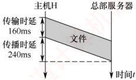

2）令  $W_s$ 为发送窗口， $k$ 为序号字段位数。采用 GBN 协议时，理想情况下，发送窗口内的所有数据帧均可被接收方成功接收并立即返回 ACK。一个数据帧的传输时延为  $(1500\times8b)/(200kb/s) = 60ms$；从发送方发出数据帧的最后一比特到收到 ACK，需经历 2 倍单向传播时延，即  $2\times240ms$。过程示意如下图所示。

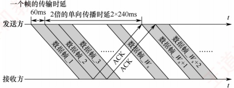

理想情况下，发送方可以连续发出  $W_s$ 个帧，总耗时  $W_s \times 60ms$。从发出第一个帧起，最多经过  $60ms + 2 \times 240ms$ 即可开始下一轮发送。依题意可知，信道利用率为  $(W_s \times 60ms)/(60ms + 2 \times 240ms) \geq 0.8$。解得  $W_s \geq 7.2$，向上取整得  $W_s$ 至少为 8。对于 GBN 协议，接收窗口为 1，需满足  $2^k \geq$ 发送窗口 + 接收窗口，即  $2^k \geq 8 + 1$，故序号字段至少需要 4 位。

3）由题图可知，主机 H 的 IP 地址为 10.10.10.33/26，属于管理区子网，故管理区的子网地址为 10.10.10.0/26，主机号范围 0～63，其中 62 个可分配，满足  $\geq$60 的要求。作业区也需  $\geq$60 个可分配地址，故同样也需一个/26 子网。在 10.10.10.0/24 主网段中，紧接管理区之后的/26 块是 10.10.10.64/26，主机号范围 64～127，符合要求。生活区需  $\geq$120 个可分配地址，故需一个/25 子网（包含 128 个 IP 地址，可分配 126 个）。剩余地址空间为 128～255，对应子网 10.10.10.128/25，满足要求且与其他子网无重叠。
