### 4.4.6 本节习题精选

#### 一、 单项选择题

##### 01

下列关于动态路由选择和静态路由选择的主要区别的描述中，正确是（）。

A. 动态路由选择需要维护整个网络的拓扑结构信息，而静态路由选择只需要维护部分拓扑结构信息

B. 动态路由选择可随网络的通信量或拓扑变化而自适应地调整，而静态路由选择则需要手工去调整相关的路由信息

C. 动态路由选择简单且开销小，静态路由选择复杂且开销大

D. 动态路由选择使用路由表，静态路由选择不使用路由表

##### 02

下列关于路由算法的描述中，错误的是（）。

A. 静态路由有时也被称为非自适应算法

B. 静态路由所使用的路由选择一旦启动就不能修改

C. 动态路由也称自适应算法，会根据网络的拓扑变化和流量变化改变路由决策
D. 动态路由算法需要实时获得网络的状态

##### 03

下列关于链路状态协议的描述中，错误的是（）。

A. 仅相邻路由器需要交换各自的路由表 B. 全网路由器的拓扑数据库是一致的

C. 采用洪泛技术更新链路变化信息 D. 具有快速收敛的优点

##### 04

在链路状态算法中，每个路由器都得到网络的完整拓扑结构后，使用（）算法来找出它到其他路由器的路径长度。

A. Prim 最小生成树算法

B. Dijkstra 最短路径算法

C. Kruskal 最小生成树算法

D. 拓扑排序

##### 05

下列关于分层路由的描述中，错误的是（）。

A. 采用分层路由后，路由器被划分成区域

B. 每个路由器不仅知道如何将分组路由到自己区域的目标地址，还知道如何路由到其他区域

C. 采用分层路由后，可以将不同的网络连接起来

D. 对于大型网络，可能需要多级的分层路由来管理

##### 06

以下关于自治系统的描述中，错误的是（）。

A. 自治系统划分区域的好处是，将利用洪泛法交换链路状态信息的范围局限在每个区域内，而不是整个自治系统

B. 采用分层划分区域的方法使交换信息的种类增多，同时也使 OSPF 协议更加简单

C. OSPF 协议将一个自治系统再划分为若干更小的范围，称为区域

D. 在一个区域内部的路由器只知道本区域的网络拓扑，而不知道其他区域的网络拓扑的情况

##### 07

在计算机网络中，路由选择协议的功能不包括（）。

A. 交换网络状态或通路信息

B. 选择到达目的地的最佳路径

C. 更新路由表

D. 发现下一跳的物理地址

##### 08

用于域间路由的协议是（）。

A. RIP B. BGP C. OSPF D. ARP

##### 09

在 RIP 中，到某个网络的距离值为 16，其意义是（）。

A. 该网络不可达

B. 存在循环路由

C. 该网络为直接连接网络

D. 到达该网络要经过15次转发

##### 10

在 RIP 中，假设路由器 X 和路由器 K 是两个相邻的路由器，X 向 K 说 “我到目的网络 Y 的距离为 N”，则收到此信息的 K 就知道 “若将到网络 Y 的下一个路由器选为 X，则我到网络 Y 的距离为（ ）”。（假设 N 小于 15）

A. N B. N-1 C. 1 D.  $N+1$

##### 11

以下关于 RIP 的描述中，错误的是（）。

A. RIP 是基于距离-向量路由选择算法的

B. RIP 要求内部路由器将它关于整个 AS 的路由信息发布出去

C. RIP 要求内部路由器向整个 AS 的路由器发布路由信息

D. RIP 要求内部路由器按照一定的时间间隔发布路由信息

##### 12

在 RIP 中，当路由器收到相邻路由器发来的路由更新信息时，若发现有更优的路由，则（）。

A. 直接更新自己的路由表

B. 向相邻路由器发送确认信息后再更新自己的路由表

C. 向所有相邻路由器发送确认信息后再更新自己的路由表
D. 不更新自己的路由表

##### 13

对路由选择协议的一个要求是必须能够快速收敛，所谓“路由收敛”是指（）。

A. 路由器能把分组发送到预定的目标

B. 路由器处理分组的速度足够快

C. 网络设备的路由表与网络拓扑结构保持一致

D. 能把多个子网聚合成一个超网

##### 14

下列关于 RIP 和 OSPF 协议的叙述中，错误的是（）。

A. RIP 和 OSPF 协议都是网络层协议

B. 在进行路由信息交换时，RIP 中的路由器仅向自己相邻的路由器发送信息，OSPF 协议中的路由器向本自治系统中的所有路由器发送信息

C. 在进行路由信息交换时，RIP 中的路由器发送的信息是整个路由表，OSPF 协议中的路由器发送的信息只是路由表的一部分

D. RIP 的路由器不知道全网的拓扑结构，OSPF 协议的任何一个路由器都知道自己所在区域的拓扑结构

##### 15

OSPF 协议使用（）分组来保持与其邻居的连接。

A. Hello B. Keepalive C. SPF（最短路径优先） D. LSU（链路状态更新）

##### 16

以下关于 OSPF 协议的描述中，最准确的是（）。

A. OSPF 协议根据链路状态法计算最佳路由

B. OSPF 协议是用于自治系统之间的外部网关协议

C. OSPF 协议不能根据网络通信情况动态地改变路由

D. OSPF 协议只适用于小型网络

##### 17

在 OSPF 协议中，划分区域的最主要目的是（）。

A. 减少路由表的大小

B. 减少洪泛法交换的通信量

C. 增加路由选择的灵活性

D. 增加网络的安全性

##### 18

下列关于 OSPF 协议特征的描述中，错误的是（）。

A. OSPF 协议将一个自治域划分成若干域，有一种特殊的域称为主干区域

B. 域之间通过区域边界路由器互连

C. 在自治系统中有4类路由器：区域内部路由器、主干路由器、区域边界路由器和自治域边界路由器

D. 主干路由器不能兼作区域边界路由器

##### 19

BGP 交换的网络可达性信息是（）。

A. 到达某个网络所经过的路径

B. 到达某个网络的下一跳路由器

C. 到达某个网络的链路状态摘要信息

D. 到达某个网络的最短距离及下一跳路由器

##### 20

RIP、OSPF协议、BGP的路由选择过程分别使用（）。

A. 路径向量协议、链路状态协议、距离向量协议

B. 距离向量协议、路径向量协议、链路状态协议

C. 路径向量协议、距离向量协议、链路状态协议

D. 距离向量协议、链路状态协议、路径向量协议

##### 21

从数据封装的角度看，下列（）协议属于 TCP/IP 模型的应用层。

I. OSPF II. RIP III. BGP IV. ICMP
A. I、II B. II、III C. I、IV D. I、II、III、IV

##### 22

考虑如下图所示的子网，该子网使用了距离-向量算法，下面的向量刚刚到达路由器C：来自B的向量为(5,0,8,12,6,2)；来自D的向量为(16,12,6,0,9,10)；来自E的向量为(7,6,3,9,0,4)。经过测量，C到B、D和E的延迟分别为6、3和5，则C到达所有节点的最短路径是（）。

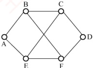

A.  $(5,6,0,9,6,2)$ B.  $(11,6,0,3,5,8)$ C.  $(5,11,0,12,8,9)$ D.  $(11,8,0,7,4,9)$

##### 23

某分组交换网络的拓扑如下图所示，各路由器使用 OSPF 协议且均已收敛，各链路的度量已在图中标注。假设各段链路的带宽均为 100Mb/s，分组长度为 1000B，其中分组的首部长度为 20B。若主机 A 向主机 B 发送一个大小为 980000B 的文件，忽略分组的传播时延和封装/解封时间，从 A 发送开始到 B 接收完毕为止，需要的时间是（）。

A. 80.08ms

B. 80.16ms

C. 80.32ms

D. 80.64ms

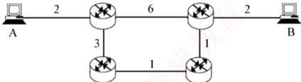

##### 24

【2010 统考真题】某自治系统内采用 RIP，若该自治系统内的路由器 R1 收到其邻居路由器 R2 的距离向量，距离向量中包含信息 <Net1, 16>，则能得出的结论是（）。

A. R2 可以经过 R1 到达 Net1，跳数为 17

B. R2 可以到达 Net1，跳数为 16

C. R1 可以经过 R2 到达 Net1，跳数为 17

D. R1 不能经过 R2 到达 Net1

##### 25

【2016 统考真题】假设下图中的 R1、R2、R3 采用 RIP 交换路由信息，且均已收敛。若 R3 检测到网络 201.1.2.0/25 不可达，并向 R2 通告一次新的距离向量，则 R2 更新后，其到达该网络的距离是（）。

A. 2 B. 3 C. 16 D. 17

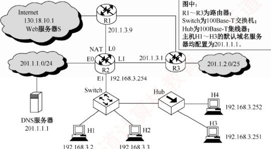

##### 26

【2017 统考真题】直接封装 RIP、OSPF、BGP 报文的协议分别是（）。

A. TCP、UDP、IP

B. TCP、IP、UDP

C. UDP、TCP、IP

D. UDP、IP、TCP

##### 27

【2021 统考真题】某网络中的所有路由器均采用距离-向量算法计算路由。若路由器 E 与邻居路由器 A、B、C 和 D 之间的直接链路距离分别是 8、10、12 和 6，且 E 收到邻居路由器的距离向量如下表所示，则路由器 E 更新后，到达目的网络 Net1 ~ Net4 的距离分别是（）。

| 目的网络 | A 的距离向量 | B 的距离向量 | C 的距离向量 | D 的距离向量 |
| --- | --- | --- | --- | --- |
| Net1 | 1 | 23 | 20 | 22 |
| Net2 | 12 | 35 | 30 | 28 |
| Net3 | 24 | 18 | 16 | 36 |
| Net4 | 36 | 30 | 8 | 24 |

A. 9,10,12,6 B. 9,10,28,20 C. 9,20,12,20 D. 9,20,28,20

#### 二、 综合应用题

##### 01

RIP 使用 UDP，OSPF 使用 IP，而 BGP 使用 TCP。这样做有何优点？为什么 RIP 周期性地和邻站交换路由信息而 BGP 却不这样做？

##### 02

在某个使用 RIP 的网络中，B 和 C 互为相邻路由器，其中表 1 为 B 的原路由表，表 2 为 C 广播的距离向量报文<目的网络，距离>。

表1

| 目的网络 | 距离 | 下一跳 |
| --- | --- | --- |
| N1 | 7 | A |
| N2 | 2 | C |
| N6 | 8 | F |
| N8 | 4 | E |
| N9 | 4 | D |

表2

| 目的网络 | 距离 |
| --- | --- |
| N2 | 15 |
| N3 | 2 |
| N4 | 8 |
| N8 | 2 |
| N7 | 4 |

1）试求路由器B更新后的路由表并说明主要步骤。

2）当路由器B收到发往网络N2的IP分组时，应该做何处理？

##### 03

互联网中的一个自治系统的内部结构如下图所示。路由选择协议采用 OSPF 协议时，计算 R6 的关于网络 N1、N2、N3、N4 的路由表。

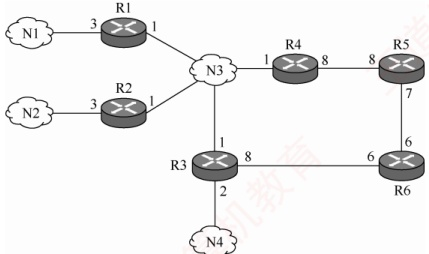

注：端口处的数字是该路由器向该链路转发分组的代价。

##### 04

【2013 统考真题】假设 Internet 的两个自治系统构成的网络如下图所示，自治系统 AS1
由路由器 R1 连接两个子网构成；自治系统 AS2 由路由器 R2、R3 互连并连接 3 个子网构成。各子网地址、R2 的接口名、R1 与 R3 的部分接口 IP 地址如下图所示。

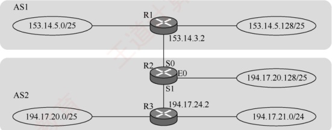

请回答下列问题：

1）假设路由表结构如下表所示。利用路由聚合技术，给出 R2 的路由表，要求包括到达图中所有子网的路由，且路由表中的路由项尽可能少。

| 目的网络 | 下一跳 | 接口 |
| --- | --- | --- |

2）若 R2 收到一个目的 IP 地址为 194.17.20.200 的 IP 分组，R2 会通过哪个接口转发该 IP 分组？

3）R1与R2之间利用哪个路由协议交换路由信息？该路由协议的报文被封装到哪个协议的分组中进行传输？

##### 05

【2014 统考真题】某网络中的路由器运行 OSPF 路由协议，下表是路由器 R1 维护的主要链路状态信息（LSI），下图是根据该表及 R1 的接口名构造的网络拓扑。

|   |   | R1 的 LSI | R2 的 LSI | R3 的 LSI | R4 的 LSI | 备 注 |
| --- | --- | --- | --- | --- | --- | --- |
| Router ID |   | 10.1.1.1 | 10.1.1.2 | 10.1.1.5 | 10.1.1.6 | 标识路由器的 IP 地址 |
| Link1 | ID | 10.1.1.2 | 10.1.1.1 | 10.1.1.6 | 10.1.1.5 | 所连路由器的 Router ID |
| IP | 10.1.1.1 | 10.1.1.2 | 10.1.1.5 | 10.1.1.6 | Link1 的本地 IP 地址 |   |
| Metric | 3 | 3 | 6 | 6 | Link1 的费用 |   |
| Link2 | ID | 10.1.1.5 | 10.1.1.6 | 10.1.1.1 | 10.1.1.2 | 所连路由器的 Router ID |
| IP | 10.1.1.9 | 10.1.1.13 | 10.1.1.10 | 10.1.1.14 | Link2 的本地 IP 地址 |   |
| Metric | 2 | 4 | 2 | 4 | Link2 的费用 |   |
| Net1 | Prefix | 192.1.1.0/24 | 192.1.6.0/24 | 192.1.5.0/24 | 192.1.7.0/24 | 直连网络 Net1 的网络前缀 |
| Metric | 1 | 1 | 1 | 1 | 到达直连网络 Net1 的费用 |   |

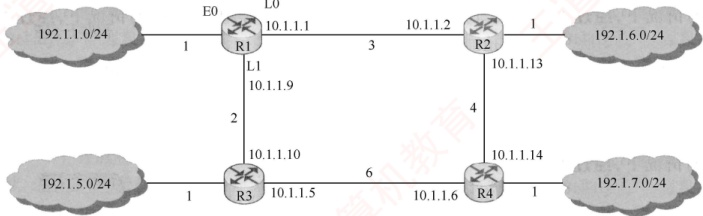

请回答下列问题：

1）假设路由表结构如下表所示，给出图中 R1 的路由表，要求包括到达图中子网 192.1.x.x
的路由，且路由表中的路由项尽可能少（注意，本题是数据结构和计算机网络的组合题，数据结构的问题中已要求计算 R1 到达每个子网的最短路径及费用）。

| 目的网络 | 下一跳 | 接口 |
| --- | --- | --- |

2）当主机192.1.1.130向主机192.1.7.211发送一个TTL=64的IP分组时，R1通过哪个接口转发该IP分组？主机192.1.7.211收到的IP分组的TTL是多少？

3）若 R1 增加一条 Metric 为 10 的链路连接 Internet，则表中 R1 的 LSI 需要增加哪些信息？

##### 06

【2024 统考真题】网络空间是继陆海空天之后的“第五疆域”，网络技术是网络疆域建设与治理的基础。路由算法与协议是网络核心技术之一，对其准确认知、合理选择与应用，对于网络建设十分重要。假设现有互联网中的4个自治系统互连拓扑示意图如下图所示。其中，AS1运行内部网关协议RIP；AS3规模较小，自治系统内任意两个主机间通信，经过路由器的数量不超过15个；AS4规模较大，自治系统内任意两个主机间通信，经过路由器的数量可能超过20个。请回答下列问题。

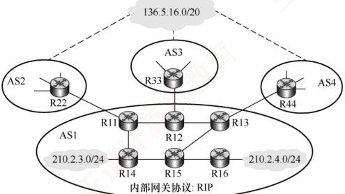

1）若仅有 RIP 和 OSPF 内部网关协议供选择，则 AS4 应该选择哪个协议？

2）若 AS3 中的某主机向本自治系统内的另一主机发送 1 个 IP 分组，为确保该 IP 分组能够被正常接收，则该 IP 分组的初始 TTL 值应该至少设置为多少？

3）假设 AS1 中的路由器同一时刻启动，启动后立即构建并交换初始距离向量，之后每隔 30s 交换一次最新的距离向量，则从交换初始距离向量时刻算起，R11～R16 路由器均获得到达网络 210.2.3.0/24 的正确路由至少需要多长时间？均获得到达网络 210.2.4.0/24 的正确路由至少需要多长时间？

4）R44 向 R13 通告到达网络 136.5.16.0/20 路由时，由 BGP 哪类会话完成？通过哪个 BGP 报文通告？R13 通过 BGP 的哪类会话将该网络可达性信息通告给 R14 和 R15？

5）若 R14 和 R15 均收到分别由 R11、R12、R13 通告的到达网络 136.5.16.0/20 的可达性信息如下。

目的网络：136.5.16.0/20，AS路径：AS2 AS8 AS19，下一跳：R11

目的网络：136.5.16.0/20，AS路径：AS3 AS7 AS11 AS19，下一跳：R12

目的网络：136.5.16.0/20，AS路径：AS4 AS10 AS19，下一跳：R13

则在无策略约束情况下，R14 和 R15 更新路由表后，各自路由表中到达网络136.5.16.0/20路由的下一跳分别是什么（用路由器名称表示）？
### 4.4.7 答案与解析

#### 一、 单项选择题

##### 01

B

静态路由选择使用手动配置的路由信息，实现简单且开销小，需要维护整个网络的拓扑结构信息，但不能及时适应网络状态的变化。动态路由选择通过路由选择协议，自动发现并维护路由信息，能及时适应网络状态的变化，实现复杂且开销大。动态路由选择和静态路由选择都使用路由表。

##### 02

B

静态路由也称非自适应算法，它不会估计流量和结构来调整其路由决策。但是，这并不说明路由选择是不能改变的，事实上用户可以随时配置路由表。而动态路由也称自适应算法，需要实时获取网络的状态，并根据网络的状态适时地改变路由决策。

##### 03

A

在链路状态算法中，每个路由器在自己的链路状态变化时，将链路状态信息用洪泛法发送给网络中的其他路由器。发送的链路状态信息包括该路由器的相邻路由器及所有相邻链路的状态。链路状态算法具有快速收敛的优点，它能在网络拓扑发生变化时，立即进行路由的重新计算，并及时向其他路由器发送最新的链路状态信息，使得各路由器的链路状态表能够尽量保持一致。

##### 04

B

##### 05

B

在链路状态算法中，路由器通过交换每个节点到邻居节点的代价来构建一个完整的网络拓扑结构。然后，路由器使用Dijkstra最短路径算法来计算到所有节点的最短路径。

##### 06

B

采用分层路由后，路由器被划分为区域，每个路由器知道如何将分组路由到自己所在区域内的目标地址，但对于其他区域内的结构毫不知情。当不同的网络相互连接时，可将每个网络当作一个独立的区域，这样做的好处是一个网络中的路由器不必知道其他网络的拓扑结构。

划分区域的好处是，将利用洪泛法交换链路状态信息的范围局限在每个区域内，而不是整个自治系统。因此，在一个区域内部的路由器只知道本区域的网络拓扑情况，而不知道其他区域的网络拓扑情况。采用分层次划分区域的方法虽然使交换信息的种类增多了，同时也使 OSPF 协议更加复杂了，但是，这样做却能使每个区域内部交换路由信息的通信量大大减少，进而使 OSPF 协议能够用于规模很大的自治系统中。

##### 07

D

路由选择协议的功能通常包括：获取网络拓扑信息、构建路由表、在网络中更新路由信息、选择到达每个目的网络的最优路径、识别一个网络的无环通路等。发现下一跳的物理地址一般是通过其他方式（如 ARP）来实现的，不属于路由选择协议的功能。

##### 08

B

BGP（边界网关协议）是域间路由协议。RIP 和 OSPF 是域内路由协议，ARP 不是路由协议。

##### 09

A

RIP 规定的最大跳数为 15，16 表示网络不可达。

##### 10

D

RIP 规定，每经过一个路由器，距离（跳数）加 1。
##### 11

C

RIP 规定一个路由器只向相邻路由器发布路由信息，而不像 OSPF 那样向整个域洪泛。

##### 12

A

在 RIP 中，当路由器收到相邻路由器发来的路由更新信息时，若发现有更优的路由（跳数更小的路由），则直接更新自己的路由表，并向其他相邻路由器广播自己的新路由。

##### 13

C

所谓收敛，是指当路由环境发生变化后，各路由器调整自己的路由表以适应网络拓扑结构的变化，最终达到稳定状态（路由表与网络拓扑状态保持一致）。收敛越快，路由器就能越快适应网络拓扑结构的变化。

##### 14

A

RIP 是应用层协议，它使用 UDP 传送数据，OSPF 才是网络层协议。选项 A 错误。

##### 15

A

此题属于记忆性题目，OSPF 协议使用 Hello 分组来保持与其邻居的连接。

##### 16

A

OSPF 协议是一种用于自治系统内的路由协议，选项 B 错误。它是一种基于链路状态路由选择算法的协议，能适用大型全局 IP 网络的扩展，支持可变长子网掩码，所以 OSPF 协议可用于管理一个受限地址域的中大型网络，选项 D 错误。OSPF 协议维护一张它所连接的所有链路状态信息的邻居表和拓扑数据库，使用多播链路状态更新报文实现路由更新，并且只有当网络发生变化时才传送链路状态更新报文，选项 C 错误。OSPF 协议不传送整个路由表，而传送受影响的路由更新报文。

##### 17

B

链路状态算法让每个路由器都知道整个自治系统的完整拓扑，从而计算最短路径。若不划分区域，则会导致链路状态数据包的个数和占用空间非常大，占用大量的网络带宽资源，影响网络效率和稳定性。划分区域后，每个路由器只需要知道自己所在区域内的完整拓扑，把交换链路状态信息的范围局限在每个区域，这样就大大减少了链路状态数据包的数量和大小。

##### 18

D

主干区域中，用于连接主干区域和其他下层区域的路由器称为区域边界路由器。只要是在主干区域中的路由器，就都称为主干路由器，因此主干路由器可以兼作区域边界路由器。

##### 19

A

因为 BGP 仅力求寻找一条能够到达目的网络且较好的路由（不能兜圈子），而并非寻找一条最佳路由，所以选项 D 错误。BGP 交换的路由信息是到达某个目的网络所要经过的各个自治系统序列，而不仅仅是下一跳，因此选项 A 正确。

##### 20

D

RIP 是一种分布式的基于距离向量的路由选择协议，它使用跳数来度量距离。RIP 选择的路径不一定是时间最短的，但一定是具有最小距离（最少跳数）的路径。

OSPF 协议使用分布式的链路状态协议，通过与相邻路由器频繁交流链路状态信息，来建立全网的拓扑结构图，然后使用 Dijkstra 算法计算从自己到各个目的网络的最优路径。

因为 BGP 仅力求寻找一条能够到达目的网络且较好的路由（不能兜圈子），而并非寻找一条最佳路由，所以它采用的是路径向量路由选择协议。在 BGP 中，每个自治系统选出一个 BGP 发言人，这些发言人通过相互交换自己的路径向量（网络可达性信息）后，就可找出到达各自治系统的较好路由。

##### 21

B
RIP 和 BGP 属于应用层，OSPF 和 ICMP 属于网络层。

##### 22

B

距离-向量算法要求每个路由器维护一张路由表，该表给出了到达每个目的地址的已知最佳距离（最小代价）和下一步的转发地址。算法要求每个路由器定期与所有相邻路由器交换整个路由表，并更新自己的路由表项。注意，从邻接节点接收到路由表不能直接进行比较，而要加上相邻节点传输消耗后再进行计算。C 到 B 的距离是 6，于是从 C 开始通过 B 到达各节点的最短距离向量是 (11, 6, 14, 18, 12, 8)。同理，通过 D 和 E 的最短距离向量分别是 (19, 15, 9, 3, 12, 13) 和 (12, 11, 8, 14, 5, 9)。于是，C 到所有节点的最短路径应该是 (11, 6, 0, 3, 5, 8)。

##### 23

C

根据 OSPF 算法，从 A 到 B 转发经过的链路代价依次为 2、3、1、1、2，一共经过 4 个路由器。分组长度为 1000B，首部长度为 20B，数据长度为 980B，所以共有 980000/980 = 1000 个分组，每次存储转发时延为  $1000B \div 100Mb/s = 0.08ms$，第一个分组从 A 到 B 的时间为  $0.08 \times 5 = 0.4ms$，剩下的 999 个分组每经过 0.08ms 就到达一个，所以总时间为  $0.4 + 0.08 \times 999 = 80.32ms$。

##### 24

D

R1 在收到信息并更新路由表后，若需要经过 R2 到达 Net1，则其跳数为 17，因为距离为 16 表示不可达，所以 R1 不能经过 R2 到达 Net1，R2 也不可能到达 Net1。选项 B、C 错误，选项 D 正确。而题目中并未给出 R1 向 R2 发送的信息，因此选项 A 也不正确。

##### 25

B

初始收敛时，R3 到网络（201.1.2.0/25）的距离为 1，R2 到网络的距离为 2，R1 到网络的距离为 2。当 R3 检测到网络不可达时，因为 R3 存有其他邻居到网络的路由信息，所以它利用所有邻居的距离向量，用 Bellman-Ford 公式更新自己的距离向量（易错点：误以为 R3 检测到网络不可达时，就把其到网络的距离设置为 16），R3 重新计算到网络的距离 = min{16，R1 到网络的距离 + 1，R2 到网络的距离 + 1} = {16，2 + 1，2 + 1} = 3。然后，R3 向其所有邻居发送更新报文，“告诉它到网络的距离为 3”。R2（及 R1）收到 R3 发来的更新报文后，会利用它保存的所有邻居的距离向量，重新计算自己到网络的距离 = min{R1 到网络的距离 + 1，R3 到网络的距离 + 1} = {2 + 1，3 + 1} = 3，因此答案为 3。与此同时，R1 也重新计算自己到网络的距离 = min{R2 到网络的距离 + 1，R3 到网络的距离 + 1} = {2 + 1，3 + 1} = 3。如此反复，直至重新收敛。因为 RIP 的特点“坏消息传得慢”，所以一旦网络出现故障，就要经过较长时间才能将故障消息传送到所有路由器。

##### 26

D

RIP 是一种分布式的基于距离向量的路由选择协议，它通过广播 UDP 报文来交换路由信息。OSPF 是一个内部网关协议，要交换的信息量较大，应使报文的长度尽量短，所以不使用传输层协议（如 UDP 或 TCP），而直接采用 IP。BGP 是一个外部网关协议，在不同的自治系统之间交换路由信息，因为网络环境复杂，需要保证可靠传输，所以采用 TCP。因此，答案为选项 D。

##### 27

D

根据距离-向量算法，E收到相邻路由器的距离向量后，更新它的路由表：

① 当原路由表中没有目的网络时，把该项目添加到路由表中。

② 发来的路由信息中有一条到达某个目的网络的路由，该路由与当前使用的路由相比，有较短的距离，就用经过发送路由信息的节点的新路由替换。

分析题意可知，E 与邻居路由器 A、B、C 和 D 之间的直接链路距离分别是 8、10、12 和 6。到达 Net1～Net4 没有直接链路，需要通过邻居路由器。从上述算法可知，E 到达目的网络一定是经过 A、B、C 和 D 中距离最小的。根据题中所给的距离信息，计算 E 经过邻居路由器到达目的
网络 Net1～Net4 的距离，如下表所示，选择到达每个目的网络距离的最短值。

| 目的网络 | 经过A需要的距离 | 经过B需要的距离 | 经过C需要的距离 | 经过D需要的距离 |
|---|---|---|---|---|
| Net1 | $\underline{9}$ | 33 | 32 | 28 |
| Net2 | $**20**$ | 45 | 42 | 34 |
| Net3 | 32 | $**28**$ | $**28**$ | 42 |
| Net4 | 44 | 40 | $**20**$ | 30 |

所以距离分别是9、20、28、20。

#### 二、 综合应用题

##### 01

【解答】

RIP 处于 UDP 的上层，RIP 所接收的路由信息都封装在 UDP 的数据报中；OSPF 的位置位于网络层，因为要交换的信息量较大，所以应使报文的长度尽量短，因此采用 IP；BGP 要在不同的自治系统之间交换路由信息，因为网络环境复杂，需要保证可靠的传输，所以选择 TCP。

内部网关协议主要设法使数据报在一个自治系统中尽可能有效地从源站传送到目的站，在一个自治系统内部并不需要考虑其他方面的策略，然而BGP使用的环境却不同。主要有以下三个原因：第一，互联网规模太大，使得自治系统之间的路由选择非常困难；第二，对于自治系统之间的路由选择，要寻找最佳路由是不现实的；第三，自治系统之间的路由选择必须考虑有关策略。因为上述情况，BGP只能力求寻找一条能够到达目的网络且较好的路由，而并非寻找一条最佳路由，所以BGP不需要像RIP那样周期性地和邻站交换路由信息。

##### 02

【解答】

1）根据 RIP 算法，首先将从 C 收到的路由信息的下一跳改为 C，并且将每个距离都加 1，得到右表。将题中表 2 与原路由表项进行比较，根据以下规则更新路由表项：① 若目的网络相同，且下一跳路由器相同，则直接更新；② 若是新的目的网络地址，则增加表项；③ 若目的网络相同，且下一跳路由器不同，而距离更短，则更新；④ 否则，无操作。更新后的路由表见下表。

| 目的网络 | 距离 | 下一跳 |
| --- | --- | --- |
| N2 | 16 | C |
| N3 | 3 | C |
| N4 | 9 | C |
| N8 | 3 | C |
| N7 | 5 | C |

| 目的网络 | 距离 | 下一跳路由器 | 目的网络 | 距离 | 下一跳路由器 |
| --- | --- | --- | --- | --- | --- |
| N1 | 7 | A | N6 | 8 | F |
| N2 | 16 | C | N7 | 5 | C |
| N3 | 3 | C | N8 | 3 | C |
| N4 | 9 | C | N9 | 4 | D |

2）在更新后的路由表中，路由器B到N2的距离为16（网络拓扑结构变化导致），这意味着N2网络不可达，这时路由器B应该丢弃该IP分组并向源主机报告目的不可达。

##### 03

【解答】

首先，要明白路由器端口旁的数字的含义——路由器向该链路转发分组的代价，即便是同一段链路的两个不同端点的路由器，转发分组的代价也可能不同。其次，要明白一个网络所连接的几个路由器之间转发分组并不需要经过任何其他中间路由器。例如，R6 到网络 N1 经过的路径和
代价计算如下：R6 到 R3 经过的代价是 6，R3 到 R1 经过的代价是 1，R1 到网络 N1 经过的代价是 3，所以 R6 到网络 N1 经过的代价是 10。根据 Dijkstra 最短路径算法，加入节点的次序之一为（R6，R5，R3，N3，R4，R1，R2，N4，N1，N2），可以得到 R6 的路由表如下表所示。

| 目的网络 | 距离 | 下一跳路由器 | 目的网络 | 距离 | 下一跳路由器 |
| --- | --- | --- | --- | --- | --- |
| N1 | 10 | R3 | N3 | 7 | R3 |
| N2 | 10 | R3 | N4 | 8 | R3 |

##### 04

【解答】

1）要求 R2 的路由表能到达图中的所有子网，且路由项尽可能少，则应对每个路由接口的子网进行聚合。在 AS1 中，子网 153.14.5.0/25 和子网 153.14.5.128/25 可聚合为子网 153.14.5.0/24；在 AS2 中，子网 194.17.20.0/25 和子网 194.17.21.0/24 可聚合为子网 194.17.20.0/23；子网 194.17.20.128/25 单独连接到 R2 的接口 E0。

于是可以得到 R2 的路由表如下：

| 目的网络 | 下一跳 | 接口 |
| --- | --- | --- |
| 153.14.5.0/24 | 153.14.3.2 | S0 |
| 194.17.20.0/23 | 194.17.24.2 | S1 |
| 194.17.20.128/25 | — | E0 |

2）该IP分组的目的IP地址194.17.20.200与路由表中194.17.20.0/23和194.17.20.128/25两个路由表项均匹配，根据最长匹配原则，R2将通过E0接口转发该IP分组。

3）R1 和 R2 属于不同的自治系统，因此应使用边界网关协议（BGP 或 BGP4）交换路由信息；BGP 是应用层协议，它的报文被封装到 TCP 段中进行传输。

##### 05

【解答】

1）因为题目要求路由表中的路由项尽可能少，所以对从同一接口转发的目的网络进行路由聚合，可以求出子网192.1.6.0/24和192.1.7.0/24都是通过接口L0转发，因此可将这两个子网聚合为子网192.1.6.0/23，其他子网照常，可得到路由表如下：

| 目的网络 | 下一跳 | 接口 |
| --- | --- | --- |
| 192.1.1.0/24 | — | E0 |
| 192.1.6.0/23 | 10.1.1.2 | L0 |
| 192.1.5.0/24 | 10.1.1.10 | L1 |

2）通过查路由表可知：R1 通过 L0 接口转发该 IP 分组。因为该分组要经过 3 个路由器（R1、R2、R4），所以主机 192.1.7.211 收到的 IP 分组的 TTL=64-3=61。

3）互联网（Internet）包括无数的网络集合，不可能在路由表项中一一列出，因此 R1 到互联网的路由只能采用默认路由的方式，默认路由的网络前缀为 0.0.0.0/0。因此，R1 的 LSI 需要增加一条特殊的直连网络，网络前缀 Prefix 为 “0.0.0.0/0”，Metric 为 10。

##### 06

【解答】

1）RIP 限制了网络规模，其最大跳数为 15；且 RIP 路由器周期性交换完整的路由表，随着网络规模扩大，开销会显著增大。因此，AS4 应该选择 OSPF 协议。

2）IP分组每经过一个路由器，TTL值减1，当TTL减为0时被丢弃。依题意，AS3中任意两主机间通信最多经过15个路由器，为确保分组能被正常接收，初始TTL值至少应设为16，这样在经过第15个路由器后，TTL值变为1，可成功交付。
3）对于网络 210.2.3.0/24：R14 直连该网络，启动后立即构建初始距离向量。首次交换（t=0）时，R14 将路由信息通告给 R11 和 R15，因此 R11、R14、R15 均立即获得正确的路由，如图 1 所示。经过 30s 后（第二次交换），R11 通告给 R12，R15 通告给 R13 和 R16，至此 R11～R16 均获得正确的路由，如图 2 所示，故至少需要 30s。

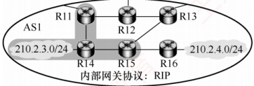

图1

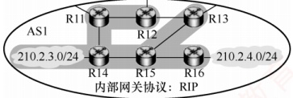

图2

对于网络 210.2.4.0/24：R16 直连该网络。首次交换（t = 0）时，R16 将路由信息通告给 R15，R15 获知路由，如图 3 所示。30s 后，R15 通告给 R13 和 R14，此时 R16、R15、R13、R14 全部获知路由，如图 4 所示；再经过 30s（共 60s），R14 通告给 R11，R13 通告给 R12，此时 R11～R16 全部获知路由，如图 5 所示，故至少需要 60s。

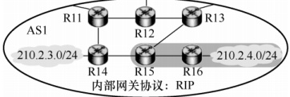

图3

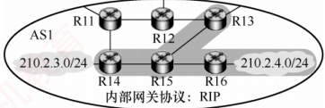

图4

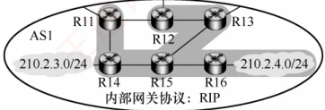

图5

4）R44 属于 AS4，R13 属于 AS1，二者位于不同的自治系统中，因此 R44 向 R13 通告路由通过 eBGP（外部 BGP）会话完成。使用 UPDATE 报文通告路由信息。R13 向同属 AS1 的 R14 和 R15 通告该路由，通过 iBGP（内部 BGP）会话完成。

5）BGP 在无策略约束时，优先选择跳数最少的路由。依题意，从 R11 和 R13 离开都会经过 3 个 AS，从 R12 离开会经过 4 个 AS。从 R11 与 R13 离开的跳数相等。此时，应采用热土豆路由选择算法，让分组经过最少的转发次数离开 AS1。由于 AS1 采用的是 RIP，因此 R14 会选择距离最近的 R11 转发；类似地，R15 会选择距离最近的 R13 转发。
