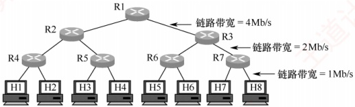
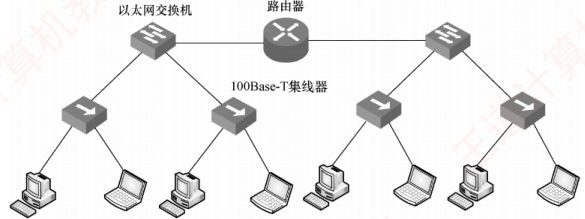
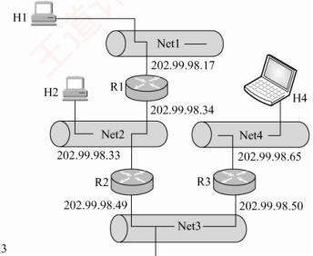
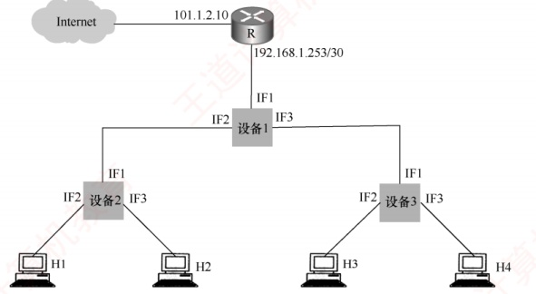
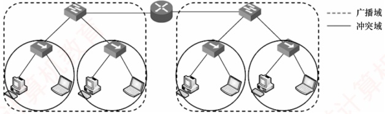

### 4.7.4 本节习题精选

#### 一、 单项选择题

##### 01

要控制网络上的广播风暴，可以采用的方法是（）。

A. 用交换机将网络分段

B. 用路由器将网络分段

C. 将网络转接成 10Base-T

D. 用网络分析仪跟踪正在发送广播信息的计算机

##### 02

下列关于冲突域的叙述中，正确的是()。

A. 能接收到同一广播帧的所有设备的集合

B. 能发送同一广播帧的所有设备的集合

C. 能产生冲突的所有设备的集合

D. 能隔离冲突的所有设备的集合

##### 03

下列设备中，能够分隔广播域的是（）。

A. 集线器 B. 交换机 C. 路由器 D. 中继器

##### 04

一个局域网与在远处的另一个局域网互连，则需要用到（）。

A. 物理通信介质和集线器

B. 网间连接器和集线器

C. 路由器和广域网技术

D. 广域网技术

##### 05

路由器主要实现（）的功能。

A. 数据链路层、网络层与应用层

B. 网络层与传输层

C. 物理层、数据链路层与网络层

D. 物理层与网络层

##### 06

下列关于路由器和路由表的说法中，正确的是（）。

A. 路由器处理的信息量比交换机少，因而转发速度比交换机快

B. 对于同一目标，路由器只提供延迟最小的最佳路由

C. 当路由表中的所有表项都不匹配时，按照默认路由进行转发

D. 路由器不但能够根据 IP 地址进行转发，而且可以根据物理地

##### 07

（未使用 CIDR）当一个 IP 分组进行直接交付时，要求发送方和目的站具有相同的（）。

A. IP 地址 B. 主机号 C. 端口号 D. 子网地址

##### 08

一个路由器的路由表通常包含（）。

A. 需要包含到达所有主机的完整路径信息

B. 需要包含所有到达目的网络的完整路径信息

C. 需要包含到达目的网络的下一跳路径信息

D. 需要包含到达所有主机的下一跳路径信息

##### 09

决定路由器的转发表中的内容的算法是（）。
A. 指数回退算法 B. 分组调度算法 C. 路由算法 D. 拥塞控制算法

##### 10

路由器中计算路由信息的是（）。

A. 输入队列 B. 输出队列 C. 交换结构 D. 路由选择处理机

##### 11

路由表的分组转发部分由（）组成。

A. 交换结构 B. 输入端口 C. 输出端口 D. 以上都是

##### 12

路由器转发分组时，需要进行（）。

A. 网络层处理和数据链路层处理

B. 网络层处理和物理层处理

C. 数据链路层处理和物理层处理

D. 网络层处理、数据链路层处理和物理层处理

##### 13

路由器的路由选择部分包括（）。

A. 路由选择处理机

B. 路由选择协议

C. 路由表

D. 以上都是

##### 14

不同网络设备传输数据的延迟时间是不同的，下列设备中传输时延最大的是（）。

A. 局域网交换机 B. 网桥 C. 路由器 D. 集线器

##### 15

在路由表中设置一条默认路由，则其目的地址和子网掩码应分别置为（）。

A. 192.168.1.1、255.255.255.0

B. 127.0.0.0、255.0.0.0

C. 0.0.0.0、0.0.0.0

D. 0.0.0.0、255.255.255.255

##### 16

路由器转发分组（在路由表中已找到匹配的条目）时，会根据路由表中的（）字段来确定输出端口。

A. 目的网络地址 B. 下一跳地址 C. 距离度量值 D. 接口标识符

##### 17

路由器能够分割广播域的原因是（）。

A. 路由器工作在网络层，不转发广播帧

B. 路由器工作在数据链路层，不转发广播帧

C. 路由器工作在物理层，不转发广播帧

D. 路由器工作在传输层，不转发广播帧

##### 18

如下图所示，用7个相同的路由器与8台主机相连。链路带宽分为三种，最上层的最快，最下层的最慢，都是全双工方式，图中标注了各层链路带宽的数值。所有路由器的处理速度都很快，远超链路带宽。下列关于网络拥塞分析的说法中，正确的是（）。

A. R1-R2 链路和 R2-R4 链路都不可能发生拥塞

B. R1-R2 链路可能发生拥塞，R2-R4 链路不可能发生拥塞

C. R1-R2 链路不可能发生拥塞，R2-R4 链路可能发生拥塞

D. R1-R2 链路和 R2-R4 链路都可能发生拥塞

##### 19

【2010 统考真题】下列网络设备中，能够抑制广播风暴的是（）。

Ⅰ中继器 Ⅱ集线器 Ⅲ网桥 Ⅳ路由器
A. 仅Ⅰ和Ⅱ B. 仅Ⅲ C. 仅Ⅲ和Ⅳ D. 仅Ⅳ

##### 20

【2012 统考真题】下列关于 IP 路由器功能的描述中，正确的是（）。

I. 运行路由协议，设置路由表

II. 监测到拥塞时，合理丢弃 IP 分组

III. 对收到的 IP 分组头进行差错检验，确保传输的 IP 分组不丢失

IV. 根据收到的 IP 分组的目的 IP 地址，将其转发到合适的输出线路上

A. 仅 III、IV

B. 仅 I、II、III

C. 仅 I、II、IV

D. I、II、III、IV

##### 21

【2020 统考真题】下图所示的网络中，冲突域和广播域的个数分别是（）。

A. 2, 2 B. 2, 4 C. 4, 2 D. 4, 4

#### 二、 综合应用题

##### 01

某个单位的网点由4个子网组成，结构如下图所示，其中主机H1、H2、H3和H4的IP地址和子网掩码见下表。

| 主 机 | IP 地址 | 子 网 掩 码 |
| --- | --- | --- |
| H1 | 202.99.98.18 | 255.255.255.240 |
| H2 | 202.99.98.35 | 255.255.255.240 |
| H3 | 202.99.98.51 | 255.255.255.240 |
| H4 | 202.99.98.66 | 255.255.255.240 |

1）请写出路由器R1到4个子网的路由表。

2）描述主机 H1 发送一个 IP 数据报到主机 H2 的过程（包括物理地址解析过程）。

##### 02

试简述路由器的路由功能和转发功能。

##### 03

【2019 统考真题】某网络拓扑如下图所示，其中 R 为路由器，主机 H1～H4 的 IP 地址配置以及 R 的各接口 IP 地址配置如图中所示。现有若干以太网交换机（无 VLAN 功能）
和路由器这两类网络互连设备可供选择。

IP地址：192.168.1.2/26 IP地址：192.168.1.3/26 IP地址：192.168.1.66/26 IP地址：192.168.1.67/26 默认网关：192.168.1.1 默认网关：192.168.1.1 默认网关：192.168.1.65 默认网关：192.168.1.65

请回答下列问题：

1）设备1、设备2和设备3分别应选择什么类型的网络设备？

2）设备1、设备2和设备3中，哪几个设备的接口需要配置IP地址？为对应的接口配置正确的IP地址。

3）为确保主机 H1～H4 能够访问 Internet，R 需要提供什么服务？

4）若主机 H3 发送一个目的地址为 192.168.1.127 的 IP 数据报，网络中哪几个主机会接收该数据报？

### 4.7.5 答案与解析

#### 一、 单项选择题

##### 01

B

网桥和交换机是第二层设备，能够分割冲突域，但不能分割广播域。路由器是第三层设备，不转发全网广播（目的地255.255.255.255），因此可以分割广播域。

##### 02

C

冲突域是指能产生冲突的所有设备的集合，也就是说，若这些设备同时发送数据，则会发生信号干扰和冲突。冲突域的大小取决于网络拓扑和设备类型。

##### 03

C

路由器工作在网络层，不转发广播包（目的地址为255.255.255.255的IP包），因此能够分隔广播域，抑制网络风暴。交换机工作在数据链路层，能够分隔冲突域，但不能分隔广播域。集线器和中继器是物理层设备，既不能分隔广播域，又不能分隔冲突域。

##### 04

C

局域网的互连需要路由器作为连接设备，同时是远程的局域网，因此要用到广域网技术。

##### 05

C

路由器是网络层设备，所以它也必须处理网络层以下的功能，即物理层和数据链路层。而传输层和应用层是网络层之上的，它们使用网络层的接口，路由器不实现它们的功能。

##### 06

C

路由器是第三层设备，要处理的内容比第二层设备交换机更多，因而转发速度比交换机慢，选
项 A 错误。虽然一些路由协议也将延迟等指标作为参数进行路由选择，但路由协议使用得最多的参数是传输距离，此外还有一些其他参数，选项 B 错误。默认路由的匹配优先级最低，只要目的网络不在转发表中，就一律选择默认路由转发，选项 C 正确。路由器只能根据 IP 地址进行转发，选项 D 错误。

##### 07

D

判断一个 IP 分组的交付方式是直接交付还是间接交付，路由器需要根据分组的目的 IP 地址和该路由器接收端口的 IP 地址是否属于同一个子网来判断。具体来说，将该分组的源 IP 地址和目的 IP 地址分别与子网掩码进行 “与” 操作，若得到的子网地址相同，则该分组就采用直接交付方式，否则采用间接交付方式。

##### 08

C

路由表中包含到目的网络的下一跳路径信息。由路由表表项的组成也不难得出正确答案为选项C。路由表也不可能包含到达所有主机的下一跳信息，否则路由转发将是不可想象的。

##### 09

C

##### 10

D

转发表是根据路由表生成的，路由表又是由路由算法得到的，因此路由算法决定了转发表中的内容。

##### 11

D

路由选择处理机的任务是根据所选定的路由选择协议构造路由表，同时经常或定期地与相邻路由器交换路由信息而不断地更新和维护路由表。

分组转发部分包括3部分：①交换结构，根据转发表对分组进行处理，将某个输入端口进入的分组从一个合适的输出端口转发出去。②输入端口，包括物理层、数据链路层和网络层的处理模块。③输出端口，负责从交换结构接收分组，再将其发送到路由器外面的线路上。

##### 12

D

路由器的端口中有物理层、数据链路层和网络层的处理模块。输入端口在物理层接收比特流，在数据链路层提取出帧，剥去帧的首部和尾部后，分组就被送入网络层的处理模块；输出端口执行相反的操作。网络层处理模块根据分组的目的地址，查找转发表，决定输出端口。

##### 13

D

路由器的路由选择部分包括 3 部分：① 路由选择处理机，它根据所选定的路由选择协议构造路由表，同时和相邻路由器交换路由信息。② 路由选择协议，用来更新路由表的算法。③ 路由表，它是根据路由算法得出的，一般包括从目的网络到下一跳的映射。

##### 14

C

路由器具有较大的传输时延，因为它需要根据所接收的每个分组首部中的IP地址决定是否转发分组，处理分组首部的任务一般由软件完成，将带来较长的处理时间。因为局域网交换机由硬件进行帧的转发，而且不关心数据链路层以上的数据，所以具有比路由器要小得多的传输时延。从数量级上看，若局域网交换机的传输时延为几十微秒，则路由器的传输时延为几千微秒。集线器的每个接口都具有收发功能，当某个接口收到信号时，立即向所有其他接口转发，因此其传输时延最小。

##### 15

C

路由表中默认路由的目的地址和子网掩码都是0.0.0.0。

##### 16

D

输出端口就是路由器的接口，每个接口都有一个标识符，如 G0/0 等。路由表中的每个条目都会指定一个接口标识符，路由器转发分组时，根据路由表中的接口标识符来确定输出端口。
##### 17

A

交换机会转发广播帧，所以同一台交换机下的所有设备都在一个广播域中。路由器不会转发广播帧，因为路由器工作在网络层，它只关心IP地址，而不关心MAC地址。

##### 18

C

R1-R2 链路上的数据率在任何时候都不可能超过 4Mb/s，因此不可能发生拥塞。对于 R2-R4 链路，考虑这种情况：H5 和 H6 同时以 1Mb/s 的速率向 H1 发送数据，H7 和 H8 同时以 1Mb/s 的速率向 H2 发送数据。此时，R1 右边的所有链路都正常工作，R1-R2 链路也正常工作，都没有超过这些链路的带宽。但是，若这些数据全部都通过 R2 转发，再通过带宽为 2Mb/s 的 R2-R4 链路分别发送给主机 H1 和 H2，则显然是不可能的，于是在 R2 的输入缓存中，进来的数据比出去的要多，数据堆积得越来越多，发送不出去，产生拥塞。选项 C 正确。

##### 19

D

中继器和集线器工作在物理层，既不隔离冲突域也不隔离广播域。为了解决冲突域的问题，人们利用网桥和交换机来分隔各个网段中的通信量，建立多个分离的冲突域，但当网桥和交换机接收到一个未知转发信息的数据帧时，为了保证该帧能被目的节点正确接收，将该帧从所有的端口广播出去，可以看出网桥和交换机的冲突域等于端口个数，广播域为1。路由器可以隔离广播域和冲突域，要屏蔽数据链路层的广播帧，当然应该是网络层设备路由器。在此题的选项中，路由器是其中最高层的网络设备，其他设备能隔离的，路由器一定能隔离。

##### 20

C

说法 I 和 IV 显然是路由器的功能。对于说法 II，当路由器监测到拥塞时，可合理丢弃 IP 分组，并向发出该 IP 分组的源主机发送一个源点抑制的 ICMP 报文（最新标准已不再使用）。对于说法 III，路由器对收到的 IP 分组首部进行差错检验，丢弃有差错首部的报文，但不保证 IP 分组不丢失。

##### 21

C

网络层设备路由器可以隔离广播域和冲突域；数据链路层设备交换机只能隔离冲突域；物理层设备集线器、中继器既不隔离冲突域也不隔离广播域。因此共有2个广播域，4个冲突域。

#### 二、 综合应用题

##### 01

【解答】

1）将 H1、H2、H3、H4 的 IP 地址分别与它们的子网掩码进行“与”操作，可得到 4 个子网的网络地址，分别为 202.99.98.16、202.99.98.32、202.99.98.48、202.99.98.64，因此路由器 R1 到 4 个子网的路由表见下表。

| 目的网络 | 子网掩码 | 下一跳 |
| --- | --- | --- |
| 202.99.98.16 | 255.255.255.240 | 直接 |
| 202.99.98.32 | 255.255.255.240 | 直接 |
| 202.99.98.48 | 255.255.255.240 | 202.99.98.33 |
| 202.99.98.64 | 255.255.255.240 | 202.99.98.33 |

2）主机 H1 向主机 H2 发送一个 IP 数据报的过程如下：

① 主机 H1 首先构造一个源 IP 地址为 202.99.98.18、目的 IP 地址为 202.99.98.35 的 IP 数据报，主机 H1 先把本子网的子网掩码与 H2 的 IP 地址逐位 “与”，所得结果不等于 H1 的网络地址，因此 H1 与 H2 不在同一子网，无法直接交付，然后将该数据报传送给数据链路层。

② 主机 H1 通过 ARP 获得路由器 R1（202.99.98.17）对应的 MAC 地址，并将其作为目的 MAC 地址，将 H1 的 MAC 地址作为源 MAC 地址填入封装有 IP 数据报的帧，然后将该帧发送出去。

③ 路由器 R1 收到该帧后，去掉帧头与帧尾，得到 IP 数据报，然后根据 IP 数据报中的目的 IP 地址（202.99.98.35）去查找路由表，得到下一跳地址为直接相连。

④ 路由器 R1 通过 ARP 得到主机 H2 的 MAC 地址，并将其作为目的 MAC 地址，将 R1 的 MAC 地址作为源 MAC 地址填入封装有 IP 数据报的帧，然后将该帧发送到子网 Net2 上。

⑤ 主机 H2 将收到的帧，去除帧头与帧尾，并最终得到从主机 H1 发来的 IP 数据报。

**注意**

在②（发出的帧）中，帧的目的 MAC 地址为默认网关的 MAC 地址；在④（接收的帧）中，帧的源 MAC 地址为默认网关的 MAC 地址。

##### 02

【解答】

转发即当一个分组到达时所采取的动作。在路由器中，每个分组到达时对它进行处理，它在路由表中查找分组所对应的输出线路。通过查得的结果，将分组发送到正确的线路上。

路由算法是网络层软件的一部分，它负责确定一个进来的分组应该被传送到哪条输出线路上。路由算法负责填充和更新路由表，转发功能则根据路由表的内容来确定当每个分组到来时应该采取什么动作（如从哪个端口转发出去）。

##### 03

【解答】

1）以太网交换机（无 VLAN 功能）连接的若干 LAN 仍然是一个网络（同一个广播域），路由器可以连接不同的 LAN、不同的 WAN 或把 WAN 和 LAN 互连起来，隔离了广播域。IP 地址 192.168.1.2/26 与 192.168.1.3/26 的网络前缀均为 192.168.1.0，视为 LAN1。IP 地址 192.168.1.66/26 与 192.168.1.67/26 的网络前缀均为 192.168.1.64，视为 LAN2。所以设备 1 为路由器，设备 2、3 为以太网交换机。

2）设备1为路由器，其接口应配置IP地址。IF1接口与路由器R相连，其相连接口的IP地址为192.168.1.253/30，253的二进制表示形式为11111101，因此IF1接口的网络前缀也应为192.168.1.111111，已分配192.168.1.253，去除全0和全1，IF1接口的IP地址应为192.168.1.254。LAN1的默认网关为192.168.1.1，LAN2的默认网关为192.168.1.65，网关的IP地址是具有路由功能的设备的IP地址，通常默认网关地址就是路由器中的LAN端口地址，设备1的IF2、IF3接口的IP地址分别设置为192.168.1.1和192.168.1.65。

3）私有地址段：C 类 192.168.0.0～192.168.255.255，即 H1～H4 均为私有 IP 地址，若要能够访问 Internet，R 需要提供 NAT 服务，即网络地址转换服务。

4）主机 H3 发送一个目的地址为 192.168.1.127 的 IP 数据报，主机号全为 1，为本网络的广播地址，因为路由器可以隔离广播域，所以只有主机 H4 会接收到数据报。
