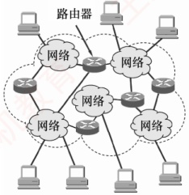
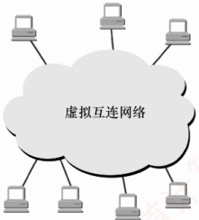
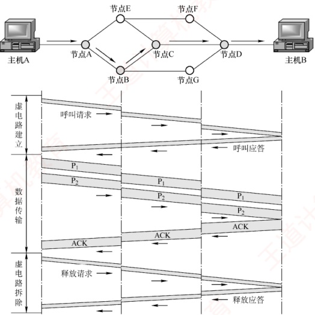
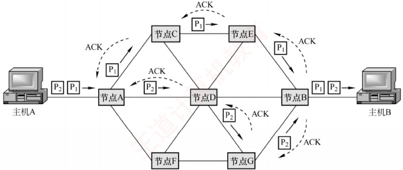
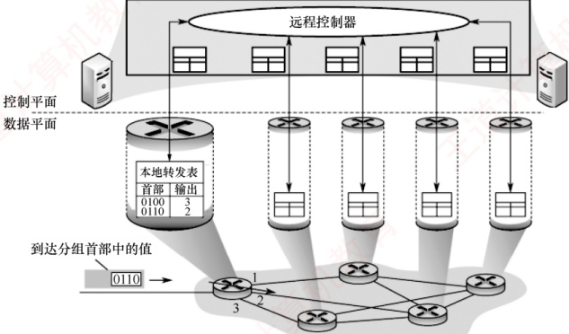

## 4.1 网络层的功能

网络层提供主机到主机的通信服务，主要任务是将分组从源主机经过多个网络和多段链路传输到目的主机。该任务可划分为分组转发和路由选择两种重要功能。

OSI 参考模型曾主张在网络层使用面向连接的虚电路服务，认为应由网络自身来保证通信的可靠性。而 TCP/IP 体系结构的网络层提供的是无连接的数据报服务，其核心思想是应由用户主机来保证通信的可靠性。虚电路和数据报服务将在 4.1.3 节中介绍。

在互联网采用的 TCP/IP 体系结构中，网络层向上只提供简单灵活的、无连接的、尽最大努
力交付的数据报服务。也就是说，所传送的分组可能出错、丢失、重复或失序，这就使得网络中的路由器可以做得比较简单，且价格低廉。通信的可靠性可由更高层的传输层来负责。

### 4.1.1 异构网络互连

互联网是由全球范围内数以百万计的异构网络互连起来的。这些网络的拓扑结构、寻址方案、差错处理方法、路由选择机制等都不尽相同。网络层所要完成的任务之一就是实现这些异构网络的互连。网络互连是指将两个以上的计算机网络，通过一定的方法，用一些中继系统相互连接起来，以构成更大的网络系统。根据所在的层次，中继系统分为以下4种：

1）物理层中继系统：转发器，集线器。

2）数据链路层中继系统：网桥或交换机。

3）网络层中继系统：路由器。

4）网络层以上的中继系统：网关。

当使用物理层或数据链路层的中继系统时，只是把一个网络扩大了，而从网络层的角度看，它仍然是同一个网络，一般并不称为网络互连。因此，网络互连通常是指用路由器进行网络连接和路由选择。路由器是一台专用计算机，用于在互联网中进行路由选择。

**注意**

由于历史原因，许多有关 TCP/IP 的文献也将网络层的路由器称为网关。

TCP/IP 在网络互连方面的做法是在网络层采用标准化协议，但相互连接的网络可以是异构的。图4.1(a)表示许多计算机网络通过一些路由器进行互连。因为参与互连的计算机网络都使用相同的网际协议IP，通过IP协议就可使这些性能各异的网络在网络层上看起来像是一个统一的网络，所以可以把互连后的网络视为如图4.1(b)所示的一个虚拟互连网络，简称IP网络。

(a) 实际互连网络

(b) 虚拟互连网络

图 4.1 IP 网络的概念

使用 IP 网络的好处是：当 IP 网络上的主机进行通信时，就好像在单个网络上通信一样，而看不见互连的各个网络的具体异构细节（如具体的编址方案、路由选择协议等）。

### 4.1.2 路由与转发

路由器的核心功能包括路由选择与分组转发：

1）路由选择。路由器运行路由协议，通过定期与相邻路由器交换信息，获取网络拓扑变化，动态生成并维护路由表，从而计算到达目的网络的最优路径。
2）分组转发。路由器根据转发表将到达的分组从合适的输出端口转发出去。

路由表由路由选择算法生成，侧重于拓扑计算。转发表则由路由表导出，其结构应使查找最优化。在讨论路由选择的原理时，往往不区分转发表和路由表，而笼统地使用路由表一词。

### 4.1.3 网络层提供的两种服务

分组交换网根据其通信子网向端点系统提供的服务，还可进一步分为面向连接的虚电路服务和无连接的数据报服务。这两种服务方式都是由 **网络层提供**的。

#### 1. 虚电路

### 考点追踪 虚电路的特点（2020）

在虚电路方式中，两台主机进行通信前，必须首先在网络层建立一条逻辑连接，即虚电路（Virtual Circuit，VC）。该连接一旦建立，其对应的端到端传输路径即被固定。与电路交换类似，整个通信过程可分为三个阶段：虚电路建立、数据传输与虚电路释放。

每次建立虚电路时，系统为其分配一个未使用过的虚电路号（VCID），以区别于同一节点上的其他虚电路。此后，双方就沿着已建立的虚电路传送分组。值得注意的是，仅在连接建立阶段使用完整的源和目的地址，后续分组的首部仅需携带虚电路号。每个中间节点都维护一个虚电路表，其中记录了每条虚电路的 VCID 及下一跳信息，这些内容在连接建立过程中确定。

下面以图4.2为例说明虚电路服务的工作原理，假设主机A向主机B发送分组。

图4.2 虚电路方式的工作原理

1）数据传输前，主机 A 与主机 B 需先建立虚电路连接：A 发送 “呼叫请求” 分组，经由中间节点转发至 B；若 B 同意建立连接，则返回 “呼叫应答” 分组予以确认。

2）虚电路建立后，双方即可相互传输数据分组。

3）传输结束后，主机A发送“释放请求”分组，逐段拆除虚电路。
注意，图4.2所示的数据传输是有确认的，接收方收到分组后需返回确认。

通过上述例子，可总结出虚电路服务具有 **以下特点**：

1）建立与释放连接开销大。不适合交互应用或少量数据交换，适合长时间或大量数据交换。

2）路由选择在连接建立阶段完成。建立完成后，就固定了传输路径。

3）提供可靠、有序的分组交付，并支持端到端的流量控制。

4）对节点或链路的故障敏感。任一故障都会导致所有经过该节点或链路的虚电路中断。

5）分组首部开销小。因为其无须携带完整的目的地址，而只需携带虚电路号。

虚电路之所以是虚的，是因为这条链路并非专用的，而是可被多条虚电路共享。

#### 2. 数据报

在数据报方式中，发送分组前无须建立连接。源主机将应用层报文分割为若干数据段，并封装成携带完整源地址和目的地址的独立分组。中间节点对分组短暂缓存，独立选路后随即转发。网络层不提供服务质量保证，也不确保可靠传输，因此分组可能丢失、重复、失序或出错。这就使得网络中的路由器比较简单，且造价低廉（与电话网络相比）。

下面以图4.3为例说明数据报服务的工作原理，假设主机A向主机B发送分组。

图4.3 数据报方式转发分组

1）主机 A 将分组逐个发送至与其直连的节点 A，该节点对分组进行短暂缓存。

2）随后，节点 A 查询其转发表。网络状态动态变化，导致转发表随之更新，各分组独立进行路由选择，可能经由不同路径转发（例如部分发往节点 C，部分发往节点 D）。

3）后续节点以相同的方式转发分组，直至其最终抵达主机B。

在传输过程中，分组仅占用当前链路的资源。得益于存储转发机制和资源共享，多个主机可以同时通信——例如主机 A 在发送分组的同时，主机 B 也可向其他主机发送数据。

通过上述例子，可总结出数据报服务具有 **以下特点**：

1）无须建立连接。发送方可随时发送分组，交换节点也可随时接收并处理。

2）尽最大努力交付。网络不保证可靠性，分组可能丢失、出错或失序；由于每个分组独立选路，转发路径可能不同，可能导致失序到达。

3）分组携带完整地址。每个分组均包含完整的源地址和目的地址，以支持独立路由。

4）存在排队时延与丢包风险。分组在交换节点中需排队处理；网络拥塞时，时延显著增加，还可能被主动丢弃。

5）故障适应能力强。当某节点或链路失效时，可通过更新转发表动态选择绕行路径。
6）资源利用率高。通信双方不独占链路，带宽等资源由多个会话共享。

采用这种设计思想的好处是：网络的造价大大降低、运行方式灵活、能够适应多种应用。互联网能够发展到今天的规模，充分证明了当初采用这种设计思想的正确性。

数据报服务和虚电路服务的比较见表4.1。

表4.1 数据报服务和虚电路服务的比较

|   | 数据报服务 | 虚电路服务 |
| --- | --- | --- |
| 连接的建立 | 不需要 | 必须有 |
| 目的地址 | 每个分组都有完整的目的地址 | 仅在建立连接阶段使用，之后每个分组使用长度较短的虚电路号 |
| 路由选择 | 每个分组独立地进行路由选择和转发 | 属于同一条虚电路的分组按照同一路由转发 |
| 分组顺序 | 不保证分组的有序到达 | 保证分组的有序到达 |
| 可靠性 | 不保证可靠通信，可靠性由用户来保证 | 可靠性由网络自身来保证 |
| 对网络故障的适应性 | 可寻找新的路径转发分组，对故障的适应能力强 | 所有经过故障节点的虚电路均不能正常工作 |
| 差错处理和流量控制 | 由用户主机进行流量控制，不保证数据报的可靠性 | 可由分组交换网负责，也可由用户主机负责 |

### 4.1.4 SDN 的基本概念

网络层的核心任务是分组转发与路由选择。从功能架构上看，网络层可抽象地划分为两个逻辑平面：数据平面（也称转发平面）和控制平面，其中，数据平面负责执行分组转发，而控制平面负责实现路由选择，生成并维护路由信息。

软件定义网络（Software Defined Network，SDN）是一种近年来广泛采用的创新网络架构，其核心在于控制平面与数据平面的解耦：控制平面集中化，数据平面分布式部署。在传统网络中，每台路由器同时承担控制与转发功能，既运行路由协议，又维护转发表。而在 SDN 架构中（见图 4.4），路由器仅保留数据平面功能，不再运行路由选择软件，因此彼此之间无须交换路由信息。网络的控制功能由一个逻辑集中式的远程控制器（通常由多个服务器协同实现）统一承担。该控制器掌握全网拓扑及主机状态，能为每个分组计算最优转发路径，并通过 OpenFlow 等协议将相应的流表（SDN 中的转发表）下发至各路由器。路由器的工作因此变得极为简洁：接收分组、匹配流表、执行转发。

图 4.4 SDN 结构

如此一来，网络构架又变为集中控制模式，而互联网本质上是分布式的。SDN并非要把整个互联网改造为如图4.4所示的集中控制模式，这显然不具有可行性。然而，在某些特定条件下，例如像一些大型数据中心互联的广域网，采用SDN架构能够显著提升网络的运行效率。

### 考点追踪 SDN 的南向接口（2022）

SDN 通过提供标准化的编程接口，赋予网络高度的可编程性，使开发者能够以软件方式灵活定义、动态调整并高效控制网络行为。SDN 架构主要包含 **三类接口。**

1）北向接口。面向上层应用提供标准化 API，支持开发者高效构建定制化网络应用，而无须关注底层转发设备的具体实现细节。

2）南向接口。实现控制器与转发设备之间的双向通信，通过 OpenFlow 等协议，控制器可统一管理异构硬件，并将上层应用逻辑动态下发至数据平面。

3）东西向接口。用于控制器集群内部通信，提升控制平面的可靠性和可拓展性。

SDN 的 **优势**：① 集中控制与分布转发，控制平面具备全局视图，便于统一优化；数据平面分布式高速转发，保障性能。② 灵活可编程性，通过标准化接口，开发者能以软件方式动态定义网络行为。③ 降低成本，控制与转发分离使硬件设备简化（仅需基础转发能力），能有效降低成本。

SDN 的 **挑战**：① 安全风险，集中化的控制器易受攻击，一旦崩溃，就会影响整个网络。② 性能瓶颈，控制功能集中化后，随着网络规模的扩大，控制器可能成为网络性能的瓶颈。

### 4.1.5 拥塞控制

网络中出现过量分组，超过其处理能力时所引发的性能下降现象，称为拥塞。判断网络是否进入拥塞状态，通常依据的是吞吐量与网络负载之间的关系：

若负载增大但吞吐量增长甚微，则表明网络可能已处于轻度拥塞状态。

若负载增大但吞吐量反而下降，则表明网络很可能已进入拥塞状态。

拥塞控制的核心在于及时感知拥塞并采取措施，避免因缓冲区溢出导致分组丢失。拥塞控制的目标是确保网络能有效承载当前流量，这是一个全局性过程，涉及所有主机、路由器及影响网络传输能力的各类因素。仅靠增加资源无法根本解决拥塞。

需要特别区分拥塞控制与流量控制：流量控制用于管理发送方与接收方之间的点对点通信，其核心是抑制发送方的发送速率，以确保接收方能够及时接收和处理数据。

拥塞控制主要有 **两种方法**：

1）开环控制。在系统设计时，预先考虑可能导致拥塞的因素，通过静态策略防止拥塞发生。一旦系统投入运行，控制机制就不再依赖实时反馈。典型手段包括：确定何时接收新流量、确定何时及丢弃哪些分组、确定何种调度策略等。其特点是不依赖当前网络状态。

2）闭环控制。通过监测网络运行状态，动态检测拥塞的发生位置与程度，然后反馈至控制节点，进而调整网络的运行以缓解拥塞。该方法基于反馈机制，是一种动态的方法。
