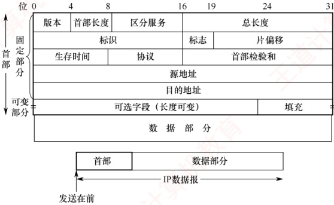
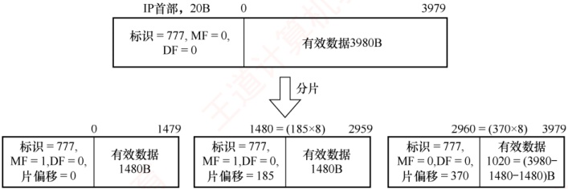
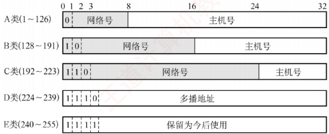
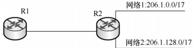
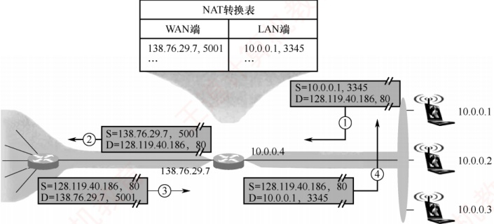
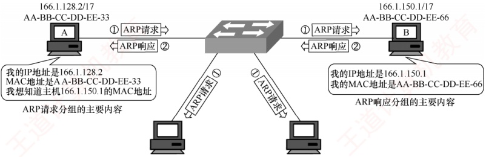
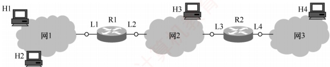

## 4.2 IPv4

### 4.2.1 IPv4 分组

IPv4（版本4）即现在普遍使用的网际协议（Internet Protocol，IP）。IP定义数据传送的基本单元——IP分组及其确切的数据格式。IP也包括一套规则，指明分组如何处理、错误怎样控制。特别是IP还包含非可靠投递的思想，以及与此关联的路由选择的思想。

#### 1. IPv4 分组的格式

### 考点追踪 IP 首部格式及字段含义（2011、2012）

一个 IP 分组（或称 IP 数据报）由首部和数据部分组成。首部前一部分的长度固定，共 20B，是所有 IP 分组必须具有的。在首部固定部分的后面是一些可选字段，用来提供错误检测及安全等机制，其长度可变，从 1B 到 40B 不等。IP 数据报的格式如图 4.5 所示。

图4.5 IP 数据报的格式

IPv4 首部的部分重要字段含义如下：

1）版本。占4位。表示IP协议的版本，IPv4中该字段的值为4。

2）首部长度。占4位。以4B为单位，可表示的最大首部长度为60B（15×4B）。最常用的首部长度是20B（5×4B），该字段的值是5，表示不使用可选字段。IP首部长度必须是4B的整数倍，若可选字段导致长度不足，则通过填充字段加以填充。

**注意**

IP 首部前两个字节往往以 0x45 开头，解题时可用于定位 IP 数据报的开始位置。

3）总长度。占16位，表示首部和数据之和的长度，以1B为单位，因此IP数据报的最大长度为 $2^{16}-1=65535B$。由于以太网MTU为1500B，因此当一个数据报封装成帧时，数据报的总长度（首部加数据）一定不能超过当前链路的MTU。

4）标识。占16位。源主机用一个递增计数器，为每个数据报设置标识字段。它并不是“序号”（因为 IP 是无连接服务）。分片时，所有分片复制原始数据报的标识字段值，以便目的主机据此正确重组为原数据报。

5）标志（Flag）。占3位，目前只有低2位有意义。MF（More Fragment，更多分片），MF=1表示后面还有分片，MF=0表示这是最后一个分片。DF（Don’t Fragment，不能分片），仅当DF=0时允许分片，若DF=1，则禁止分片。

6）片偏移。占13位，以8B为单位，指出该分片数据部分起始位置相对于原始数据报数据部分开头的偏移量。除最后一个分片外，其他分片的数据长度必须是8B的整数倍。

### 考点追踪 TTL 机制的分析（2014、2024）

7）生存时间（TTL）。占8位，表示数据报在网络中允许经过的路由器数的最大值，防止其在网络中无限循环。每经过一个路由器，TTL减1。若TTL被减为0，则丢弃该数据报。若TTL的初值设为1，则该数据报仅限在本局域网内传输。

8）协议。占8位，指出此数据报携带的数据使用何种协议，即指示数据应交付给哪个上层协议（如TCP、UDP）。其中值为6表示TCP，值为17表示UDP。

9）首部检验和。占16位，只检验首部（不含数据部分），不检验数据部分可减少计算的工作量。数据报每经过一个路由器，首部中的某些字段（如生存时间、总长度、标志、片偏移、源/目的地址）都可能发生变化，因此路由器都要重新计算检验和。首部检验和的计算方法与UDP和TCP检验和的计算方法类似，具体见5.2.2节。

10）源地址字段。占4B，标识发送方的IP地址。

11）目的地址字段。占4B，标识接收方的IP地址。

**注意**

① IP 数据报首部包含 3 个与长度相关的字段： **首部长度**、 **总长度**、 **片偏移**，它们的基本单位分别为 4B、1B、8B，计算时要注意换算。读者应理解 IP 首部各字段的意义和功能，但无须死记首部格式，若题目需要，通常会直接给出。这一原则同样适用于第 5 章对 TCP 和 UDP 首部的学习。

② 在分析 IP 首部的十六进制原始数据时，IP 地址以连续 4B 的十六进制形式呈现。将其转换为点分十进制形式时要格外小心，极易因字节顺序或进制转换错误而导致结果偏差。

#### 2. IP 数据报分片

一个链路层数据帧能承载的最大数据量称为最大传送单元（MTU）。由于IP数据报被封装在
链路层帧中，其长度受到 MTU 的严格限制。此外，从源主机到目的主机的路径上可能会经过多段链路，各段链路的 MTU 可能不同——例如，以太网的 MTU 通常为 1500B，而很多广域网的 MTU 不超过 576B。当 IP 数据报的总长度超过某段链路的 MTU 时，就必须将 IP 数据报中的数据分装在多个较小的 IP 数据报中，这些较小的数据报称为分片（或片）。

### 考点追踪 IP 分片相关首部字段（2011）

分片只能发生在源主机或中间路由器上，而重组仅在目的主机上进行。目的主机利用 IP 首部中的标识、标志和片偏移三个字段完成分片的重组。源主机在创建 IP 数据报时，会为其分配唯一的标识号。当该数据报被分片时，所有分片均继承原始数据报的标识号。目的主机收到来自同一源主机的多个数据报后，通过比对标识号，即可判断哪些分片属于同一个原始数据报。分片行为受标志字段控制：仅当 DF=0 时，数据报才被允许分片；若 DF=1，则禁止分片。此外，MF=1 表示还有后续分片；MF=0 表示这是最后一个分片。在重组过程中，依据片偏移字段确定每个分片在原始数据报中的起始位置，从而正确还原原始数据。

### 考点追踪 IP 分片的原理及分析（2021）

IP 分片涉及一定的计算。例如，一个总长 4000B 的 IP 数据报（首部 20B，数据部分 3980B）到达路由器，需转发到 MTU 为 1500B 的链路上。每个分片都是一个独立的 IP 数据报，均包含 20B 的 IP 首部，每片最多携带 1480B 数据，因此需划分为 3 个分片，数据部分依次为 1480B、1480B 和 1020B。假定原始数据报标识号为 777，则各分片如图 4.6 所示。由于片偏移以 8B 为单位，为保证偏移值为整数，除最后一个分片外，其余分片的数据长度必须是 8B 的整数倍。

图4.6 IP 分片的例子

### 4.2.2 IPv4 地址

#### 1. IPv4 地址

IP 地址是为连接到互联网上的每台主机（或路由器）的每个接口，分配的一个全球唯一的32位标识符。IP 地址的分配由互联网名字与数字分配机构（ICANN）统一管理。为方便书写和记忆，通常将32位IP地址分为4段，每段8位，转换为等效的十进制数，并用小数点分隔，即一个IP地址用4段十进制数表示，这种表示方法称为点分十进制记法。

#### 2. 分类的 IP 地址

互联网早期采用的是分类的 IP 地址，如图 4.7 所示。

无论哪类 IP 地址，都由网络号和主机号两部分组成。即 IP 地址::={<网络号>, <主机号>}。其中网络号标志主机（或路由器）的接口所连接到的网络，一个网络号在整个互联网范围内必须唯一。主机号标志该主机（或路由器）的接口，一个主机号在其网络号所指的网络范围内必须唯一。由此可见，每个 IP 地址在整个互联网中是唯一的。

图4.7 分类的 IP 地址

### 考点追踪 0.0.0.0 地址的作用（2017）

A 类、B 类和 C 类地址均为单播地址（用于一对一通信），可分配给主机或路由器的接口。但以下特殊 IP 地址不能用作普通主机的地址：

- 主机号全为0：表示本网络本身（网络地址），例如202.98.174.0。

- 主机号全为1：表示本网络的广播地址，也称直接广播地址，例如202.98.174.255。

127.×.×：保留用于本地环回测试（Loopback Test），仅用于本机进程间的通信，目的地址为环回地址的IP数据报不会被发送到任何物理网络。

32位全为0，即0.0.0.0：表示本网络上的本主机（常用于DHCP，见4.2.6节）。

32位全为1，即255.255.255.255：表示受限广播地址，仅在本网络内广播。

常用的三种类别 IP 地址的使用范围见表 4.2。

表4.2 常用的三种类别 IP 地址的使用范围 $^{①}$

| 网络类别 | 最大可用网络数 | 第一个可用的网络号 | 最后一个可用的网络号 | 每个网络中的最大主机数 |
|---|---|---|---|---|
| A | $2^{7}-2$ | 1 | 126 | $2^{24}-2$ |
| B | $2^{14}$ | 128.0 | 191.255 | $2^{16}-2$ |
| C | $2^{21}$ | 192.0.0 | 223.255.255 | $2^{8}-2$ |

在表4.2中，A类地址可用的网络数为 $2^7 - 2$，减2的原因如下：①网络号为0（0.×.×），保留用于特殊用途；②网络号为127（127.×.×.×），保留作为环回测试地址。每个网络中的最大主机数减2的原因是：①主机号全为0的地址用作网络地址（标识本网络）；②主机号全为1的地址用作直接广播地址（向本网络所有主机广播），这两个地址不能分配给主机使用。

IP 地址具有以下 **重要特点**:

1）IP 地址由网络号和主机号两部分组成，是一种分等级的地址结构。这种设计带来了两大优势：① IP 地址管理机构只分配网络号，主机号由获得该网络的单位自行分配，便于地址管理；② 路由器转发分组时仅依据目的地址的网络号，从而显著减小路由表规模。

2）IP 地址标识的是网络接口，而非主机本身。当一台主机同时连接到多个网络时，必须为每个接口配置一个 IP 地址，且各地址的网络号必须不同。因此，路由器至少拥有两个或更多的 IP 地址，每个接口对应一个不同网络号的 IP 地址。

3）通过集线器或交换机连接的多个网段在逻辑上仍然属于同一个网络（同一个广播域），因此，其中所有主机的IP地址必须具有相同的网络号，但主机号必须唯一。

4）IP 地址是逻辑地址，与底层物理硬件（如 MAC 地址）无关。这使得网络层能够屏蔽链
路层的异构性，支持跨不同物理网络的统一通信。

近年来，随着无分类编址的广泛应用，这种传统分类的IP地址已逐渐退出历史舞台。

#### 3. 划分子网

##### （1） 划分子网

传统的两级 IP 地址结构（仅含网络号和主机号）存在以下主要缺点。

地址空间利用率低：为每个物理网络分配一个完整网络号，导致大量主机号未被使用。

路由表规模过大：网络数量增长使路由表膨胀，从而影响转发性能。

地址分配缺乏灵活性：无法根据实际需求，对网络进行更细粒度的划分。

为克服上述问题，从1985年起，在IP地址中增加“子网号”字段，形成 **三级结构**：

 $$IP 地址 \because=\{< 网络号 >,\text{< 子网号 >},\text{< 主机号 >}\}$$

这一机制称为划分子网，现已成为互联网的正式标准。

划分子网的基本思想如下。

1）对外透明：单位对外仍表现为单一网络，外部路由器无须感知其内部子网结构。

2）内部灵活划分：从原主机号中借用若干位作为子网号，主机号位数相应减少。

3）分层转发：外部路由器根据网络号转发数据报至该单位边界路由器；边界路由器再结合子网号，将数据报交付至具体子网，最终送到目的主机。

例如，将一个 C 类网络 208.115.21.0 划分为 4 个子网，需借用 2 位作为子网号（因为  $2^{2}=4$），主机号剩余 6 位，每个子网中的最大主机数为  $2^{6}-2=62$（扣除网络地址和广播地址），各子网的网络地址为：208.115.21.0、208.115.21.64、208.115.21.128、208.115.21.192。

**注意**

① 划分子网仅对 IP 地址的主机号部分再划分，不改变原网络号，因此无法从 IP 地址本身判断是否划分子网。② 划分子网提升了地址分配的灵活性，但也使特定网络的可分配主机总数略有减少。

##### （2） 子网掩码

### 考点追踪 ➤ 网络地址的确定方法（2022）

子网掩码是一个与 IP 地址对应的 32 位二进制串，由一串 1 后跟一串 0 组成。其中，1 对应 IP 地址中的网络号和子网号，而 0 对应主机号。主机或路由器通过将 IP 地址与其子网掩码进行逐位 “与”（AND）运算，即可得出该地址所在子网的子网地址。

现在的互联网标准规定：每个网络都需配置子网掩码。对于未划分子网的传统分类网络，应使用其默认子网掩码。A、B、C 类地址的默认子网掩码分别为 255.0.0.0、255.255.0.0、255.255.255.0。例如，某主机的 IP 地址为 192.168.5.56，子网掩码为 255.255.255.0，通过逐位“与”运算，可得出其所在子网的子网地址为 192.168.5.0。

子网掩码是网络的关键属性。路由器交换路由信息时，必须同时通告目的网络地址和子网掩码。转发分组时，路由器将分组的目的IP地址与某条路由的子网掩码进行逐位“与”运算，若结果等于该路由的目的网络地址，则匹配成功，并将分组转发至对应的下一跳。

在使用子网掩码时，需遵循以下原则：

1）主机在配置 IP 地址时，必须同时设置子网掩码。

2）同一子网内的所有主机及路由器接口，必须配置相同的子网掩码。

3）路由器的路由表中通常包含三项核心信息：目的网络地址、子网掩码、下一跳地址。
#### （3） 默认网关

### 考点追踪 默认网关与子网掩码的配置（2015、2016、2019、2022）

默认网关是指本子网所连路由器接口的 IP 地址，用于将数据转发至外部网络。主机发送数据时，会将目的 IP 地址与自身 IP 地址及子网掩码比较，以判断目的主机是否在同一子网。

若在同一子网内，则执行直接交付：通过 ARP（见 4.2.5 节）获取目的主机的 MAC 地址，并将数据报封装成数据链路层帧（如以太网帧），直接发送至该 MAC 地址。

若不在同一子网内，则执行间接交付：将数据报发往默认网关，并通过 ARP 获取其 MAC 地址，再将数据报封装成帧并发送至该 MAC 地址，由路由器在网络层进行转发。

#### 4. 无分类编址 CIDR

无分类域间路由选择（Classless Inter-Domain Routing，CIDR）是一种基于可变长子网掩码的地址分配与路由聚合机制，旨在消除传统A、B、C类地址的限制，并提升IP地址空间的利用效率。其 **核心思想**是：不再区分网络类别，而使用“网络前缀”来标识网络部分。网络前缀的长度（掩码中连续1的数量）可根据实际需求灵活指定，不再局限于8位、16位或24位。

例如，若某单位需要约2000个IP地址，则为其分配一个包含2048个地址的连续块（如/21），而非浪费一个完整的B类网络（65534个地址），进而大幅提高地址分配的灵活性和利用率。

CIDR 采用如下结构表示 IP 地址：

 $$IP 地址 \because=\{< 网络前缀 >,\ < 主机号 >\}。$$

### 考点追踪 CIDR 地址块的分析（2011、2015、2016、2019、2023）

CIDR 还使用斜线记法（也称 CIDR 表示法），格式为 “IP 地址/前缀长度”，其中前缀长度表示网络前缀所占的位数，它等效于子网掩码中连续 1 的数量。例如，128.14.32.5/20 表示其子网掩码由 20 个连续的 1 和 12 个连续的 0 组成（255.255.240.0）。将该 IP 地址与掩码进行逐位 “与” 运算，即可得到其网络前缀（子网地址），它等价于直接截取 IP 地址的前 20 位。

 $$\begin{aligned}& 逐位“与”\left\{\begin{array}{ll}IP 地址 &=\underline{10000000.00001110.0010}0000.00000101\\ 掩码 &=11111111.11111111.11110000.00000000\end{array}\right.\end{aligned}$$

 $$网络前缀 =\underline{10000000.00001110.0010}0000.00000000\quad(128.14.32.0)$$

斜线记法不仅标识了具体的 IP 地址，还明确了其所属地址块的网络前缀长度。在 CIDR 环境下，“/前缀长度”不可省略——若仅给出 IP 地址（如 128.14.32.5），则无法确定其网络地址。

### 考点追踪 地址块的范围分析（2023）

CIDR 将网络前缀相同的连续 IP 地址组成一个 CIDR 地址块。只要知道该地址块中的任意一个地址及其前缀长度，即可确定其最小地址、最大地址和地址总数。

以地址 128.14.32.5/20 为例，其所在地址块的地址范围为

最小地址： $**10000000.00001110.0010**$0000.00000000（128.14.32.0）

最大地址： $**10000000.00001110.0010**$1111.11111111（128.14.47.255）

主机号全0或全1的地址一般不分配给主机使用，实际可用地址为两者之间的地址。

需要强调的是，“CIDR 不使用子网”是指其不在全局地址结构中预设固定的子网字段。但这并不妨碍获得 CIDR 地址块的单位在其内部继续划分子网。例如，某单位获得一个/20 的地址块后，可从主机号部分借用 3 位划分为 8 个子网，此时每个子网的网络前缀长度变为/23。

### 考点追踪 子网地址与子网广播地址的分析（2011、2012、2018、2019）

CIDR 地址块的地址总数一定是 2 的整数次幂。若主机号部分占 N 位，则该地址块包含  $2^{N}$ 个地址，实际可分配给主机的地址数通常为  $2^{N}-2$（扣除网络地址和广播地址）。网络前缀越短，
主机号位数越大，地址块包含的总地址就越多；反之，前缀越长，地址块越小。

#### 5. 路由聚合

一个大的 CIDR 地址块中包含多个较小的地址块，因此在路由表中可以用这个较大的 CIDR 地址块来代替多个较小的地址块。这种方法称为路由聚合，它使得路由表中的一个项目能够代表原来基于传统分类地址的多条路由，从而压缩路由表规模，提升网络性能。

### 考点追踪 路由聚合的原理（2009、2011、2013、2014、2018）

例如，在如图4.8所示的网络中，若不使用路由聚合，则R1的路由表中需要分别为网络1和网络2配置两条独立的路由项。观察可知，这两个网络的地址前缀在二进制表示下的前16位完全相同，第17位分别为0和1，且R1到这两个网络的下一跳均为R2。在此情况下，R1可将这两个网络聚合成一个更大的地址块206.1.0.0/16，从而用一条聚合路由替代原有的两条路由。

图4.8 路由聚合的例子

### 考点追踪 最长前缀匹配机制（2013、2015）

最长前缀匹配（也称最佳匹配）：使用 CIDR 时，路由表项由 “网络前缀” 和 “下一跳地址” 组成。当查找路由表时，目的地址可能匹配多个路由项。此时，应选择网络前缀最长（前缀位数最多）的那条路由，因为前缀越长，对应的地址块越小，路由信息就越具体、越精确。

CIDR 查找路由表的 **方法**：为高效实现最长前缀匹配，路由器通常将 CIDR 路由表组织成层次式数据结构（如 Trie 树），通过自上而下的方式快速定位最优匹配项。

CIDR 的 **主要优势**在于网络前缀长度的灵活性：在网络外部，可通过较短前缀进行路由聚合，显著减少全局路由表项；在网络内部，可延长前缀以灵活划分子网，满足不同规模的需求。这种“外部聚合、内部细分”的机制，兼顾了路由可扩展性与地址分配的精细化控制。

#### 6. 子网划分的应用举例

通常有两类划分子网的方法：采用定长子网掩码和变长子网掩码。

##### （1） 采用定长子网掩码划分子网

当采用定长子网掩码时，所划分的每个子网使用相同的子网掩码，并且每个子网所分配的IP地址数量也相同，因此容易造成地址资源的浪费。

 $$考点追踪 \quad\rightarrow 定长掩码子网划分的应用 (2009、2010、2017、2018)$$

假设某单位拥有一个 CIDR 地址块 208.115.21.0/24，该单位有三个部门，各部门的主机数量分别为 50、20、5 台，采用定长子网掩码给各部门分配 IP 地址。

各部门（含一个路由器接口）实际所需 IP 地址数分别为 51 个、21 个、6 个。接下来，从/24 地址块的主机号部分借用 2 位作为子网号，可划分为  $2^{2}=4$ 个子网，每个子网可用地址数为  $2^{8-2}-2=62$，满足各部门需求。各子网划分如下（为书写方便，仅将 IP 地址的后 8 位用二进制展开）：

 $**208.115.21.00**$000000～ $**208.115.21.00**$111111，地址块208.115.21.0/26，分配给部门1。

 $**208.115.21.01**$000000～ $**208.115.21.01**$111111，地址块208.115.21.64/26，分配给部门2。

 $**208.115.21.10**$000000～ $**208.115.21.10**$111111，地址块208.115.21.128/26，分配给部门3。

 $**208.115.21.11**$000000～ $**208.115.21.11**$111111，地址块208.115.21.192/26，留作备用。
子网掩码： $**255.255.255.11**$000000，即255.255.255.192。

##### （2） 采用变长子网掩码划分子网

### 考点追踪 ▶ 变长掩码子网划分的应用（2019、2021、2025）

采用变长子网掩码时，所划分的每个子网可使用不同的子网掩码，并且每个子网所分配的IP地址数量也可不同，从而更高效地利用地址资源，减少浪费。

假设条件与上一节相同，下面采用变长子网掩码给各部门分配 IP 地址。

部门1的主机号需6位，剩余26位（32-6=26）作为网络前缀；部门2的主机号需5位，剩余27位（32-5=27）作为网络前缀；部门3的主机号需3位，剩余29位（32-3=29）作为网络前缀。接下来，从地址块208.115.21.0/24中按需划分出3个子网（1个“/26”，1个“/27”，1个“/29”），分配给三个部门。每个子网的网络地址（最小地址）为主机号全0的地址。划分方案不唯一，建议从最大的子网开始划分（以避免地址碎片），例如：

 $$\begin{array}{l}\left.\begin{array}{l}\frac{208.115.21.00}{}\quad000000\\\cdots\cdots\\\underline{208.115.21.00}111111\\\end{array}\right\}\\\left.\begin{array}{l}\underline{208.115.21.010}00000\\\cdots\cdots\\\underline{208.115.21.010}11111\\\cdot\end{array}\right\}\end{array}$$

地址块208.115.21.0/26，子网掩码255.255.255.192

可分配地址 62 个，分配给部门 1。

地址块208.115.21.64/27，子网掩码255.255.255.224可分配地址30个，分配给部门2。

 $$\begin{array}{l}\left.\begin{array}{l}\frac{208.115.21.01100}{000}\\\cdots\cdots\\\end{array}\right\}\\\underline{208.115.21.01100}111\\\underline{208.115.21.01101000}\\\cdots\cdots\end{array}$$

地址块 208.115.21.96/29，子网掩码 255.255.255.248 可分配地址 6 个，分配给部门 3。

剩余256-64-32-8=152个地址，留作备用。

划分方案不唯一，还可借助二叉树模型（参考本节习题2021年统考真题解析图）辅助分配，但要确保各子网地址范围互不重叠，且起始地址对齐到其网络前缀对应的地址边界。

对于连接两个路由器接口的点对点链路，传统做法是分配一个“/30”地址块：主机号部分占2位，包含4个地址，可分配地址有2个，恰好可分配给链路两端的接口。

**注意**

根据最新标准 $^{①}$，为节省IP地址资源，这类链路的两端接口 **可不分配IP地址**。若需分配，则该链路被视为仅含两个节点的特殊“网络”，此时应使用“/31”地址块：主机号部分仅1位，包含2个地址， **无须保留网络地址和广播地址**，2个地址均可直接分配给链路两端接口，实现IP地址的零浪费。

### 4.2.3 网络地址转换 NAT

网络地址转换（Network Address Translation，NAT）是指将专用网络中的私有IP地址转换为公网IP地址，从而实现与互联网的通信，并对外隐藏内部网络的结构。它使得整个专用网通常只需一个全球IP地址即可与互联网连通；由于私有IP地址可在不同专用网络中重复使用，NAT有效地缓解了IP地址短缺的问题。此外，NAT还在一定程度上降低了内部网络受攻击的风险。
### 考点追踪 私有 IP 地址连网处理机制（2011）

IANA 保留了三个私有 IP 地址块。这些地址仅用于 LAN 内部，不得直接用于 WAN，若需访问互联网，则必须通过网关采用 NAT 技术，将私有地址映射为合法的公网 IP 地址。

这三个私有 IP 地址块如下：

1）10.0.0.0/8，即10.0.0.0～10.255.255.255，相当于1个A类网络。

2）172.16.0.0/12，即172.16.0.0～172.31.255.255，相当于16个连续的B类网络。

3）192.168.0.0/16，即192.168.0.0～192.168.255.255，相当于256个连续的C类网络。

互联网中的所有路由器对目的地址为私有地址的数据报一律不予转发。采用私有 IP 地址组建的网络称为专用网络（或私有网络）。私有 IP 地址也称可重用地址。

使用 NAT 时，需在专用网连接到互联网的路由器上安装 NAT 软件，该 NAT 路由器至少应拥有一个有效的全球 IP 地址。当使用私有 IP 地址的主机与外部通信时，NAT 路由器通过 NAT 转换表实现私有 IP 地址与全球 IP 地址之间的映射。该表中保存 {私有 IP 地址: 端口} 到 {全球 IP 地址: 端口} 的对应关系。借助该映射机制，多个私有 IP 地址可共享同一个全球 IP 地址访问互联网。

### 考点追踪 NAT 的工作原理（2016、2019、2020、2023）

如图4.9所示，假设某家庭办理了一条10Mb/s的电信宽带，则会获得一个全球IP地址（如138.76.29.7）。家庭内部的3台主机使用私有地址（如10.0.0.0网段），此时家庭网关路由器需启用NAT功能。下面以主机访问外部Web服务器为例，介绍NAT路由器的 **工作原理**。

图 4.9 NAT 路由器的工作原理

1）假设主机10.0.0.1（源端口3345）向Web服务器128.119.40.186（端口80）发送请求。

2）NAT 路由器收到 IP 分组后，将分组的源地址替换为自身的全球 IP 地址 138.76.29.7，将源端口替换为新分配的端口 5001，同时在 NAT 转换表中新增一条映射记录。

3）Web 服务器并不知晓该分组的源地址已被路由器转换，也无法获知用户的私有地址，因此其响应分组的目的地址是路由器的全球 IP 地址 138.76.29.7，目的端口是 5001。

4）响应分组到达路由器后，路由器根据 NAT 转换表，将目的地址还原为 10.0.0.1，目的端口还原为 3345，再将分组转发给对应主机。

上述过程属于动态 NAT，路由器在内网主机发起连接时自动创建映射关系，并在一段时间后自动清除。然而，在某些场景中，内网中的服务器需要向公网用户提供服务，例如部署在内网内的 Web 服务器、FTP 服务器等。此时，可由管理员在 NAT 转换表中手工配置{公网 IP 地址 + 端口}到{内网 IP 地址 + 端口}的静态映射，使公网用户能够通过该映射访问内网服务器。
**注意**

普通路由器在转发 IP 分组时，不会改变其源 IP 地址和目的 IP 地址。而 NAT 路由器在转发 IP 分组时，会修改其源 IP 地址（出站）或目的 IP 地址（入站）。普通路由器仅工作在网络层，而 NAT 路由器在转发 IP 分组时，通常还需查看并转换传输层的端口号，因此其功能还涉及传输层。

### 4.2.4 网络层转发分组的过程

4.2.2 节介绍过，主机发送数据时，会先将待发送分组的目的 IP 地址与本网络的子网掩码进行逐位与运算。若结果等于本网络的网络前缀，则执行直接交付，无须路由器参与。否则，必须将分组发送至默认网关，由路由器在网络层进行转发（间接交付）。由此可见，同一网络内的通信无须路由器参与，而跨网络通信必须依赖路由器转发。

分组的转发始终基于目的主机所在网络，这是因为互联网中的网络数量远小于主机数量，从而可以显著压缩转发表的规模。当分组到达路由器后，路由器根据目的IP地址的网络前缀查找转发表，确定下一跳应发往哪个路由器。因此，转发表中的每条路由至少包含以下两项信息：

（目的网络地址，下一跳地址）

借助这一机制，分组最终总能抵达目的主机所在网络的边缘路由器（可能需经过多次间接交付），并在最后一跳由该路由器向目的主机执行直接交付。

采用 CIDR 编址时，若转发表中存在多个匹配的前缀，则应使用最长前缀匹配。为提高查找效率，可将转发表按前缀长度降序排列（前缀最长的条目排在最前）。这样，从第一行开始顺序查找，一旦找到匹配项，就可立即停止，无须继续查找。

此外，路由表中还可以包含 **两种特殊路由**：

### 考点追踪 特定主机路由的应用（2009）

1）特定主机路由：为某个特定目的主机的IP地址单独设置一条路由，便于网络管理员进行控制和测试。若该主机的IP地址为a.b.c.d，则转发表中对应项的目的网络表示为a.b.c.d/32。尽管“/32”的子网掩码在子网划分中无实际意义，但在转发表中可作为标识单个主机的特殊前缀。

### 考点追踪 默认路由的应用（2009、2014）

2）默认路由：用特殊前缀 0.0.0.0/0 表示，由于全 0 掩码与任何目的地址进行按位与运算的结果均为 0.0.0.0，因此该前缀必然匹配所有未被其他路由项覆盖的目的地址。只要目的网络不在转发表中明确列出，就一律使用默认路由。默认路由常用于连接到互联网的路由，互联网包含海量网络，无法在转发表中一一列出，只能通过默认路由的方式。

匹配时，特定主机路由的优先级最高（因其前缀最长，为/32），默认路由的优先级最低（因其前缀最短，为/0）。

综上所述，路由器执行的分组转发算法如下：

1）从收到的 IP 分组的首部提取目的 IP 地址 D（目的地址），从转发表第一项开始检查（按前缀长度降序排列）。

2）若存在特定主机路由（目的网络为 D/32），则按其下一跳转发；否则从转发表中下一项开始检查，执行步骤3）。

3）将当前路由项的子网掩码与目的地址 D 进行逐位 “与” 运算。

若结果等于该路由项的网络前缀，则匹配成功，按“下一跳”处理（直接交付给本网络上的目的主机，或通过指定接口转发至下一跳路由器）。
否则，若转发表还有后续项，则继续检查下一项，重复步骤3）。

4）若遍历完所有路由项仍未匹配，但存在默认路由（0.0.0.0/0），则将分组发送至默认路由；否则，报告“目的不可达”错误。

需要说明的是，上述特定主机路由和默认路由的匹配过程，本质上已包含在步骤3）的匹配过程中；此处单独列出，是为了强调其优先级和典型应用场景。

此外，转发表（或路由表）不提供到目的网络的完整路径，仅指明“下一跳路由器”。分组每经过一个路由器，都会根据其转发表决定下一步去向，逐跳转发，直至抵达目的网络。

**注意**

从转发表得到下一跳路由器的IP地址后，并不会将该地址填入待转发分组的首部，而是通过ARP（见4.2.5节）解析出对应的MAC地址，填入链路层帧首部作为目的地址。随后，该帧通过数据链路层发送至下一跳路由器。路由器收到后，剥离帧首部，取出IP分组，再交给网络层处理。

### 4.2.5 地址解析协议（ARP）

#### 1. IP 地址与硬件地址

IP 地址是网络层及以上使用的分层式地址，而硬件地址（MAC 地址）是数据链路层使用的平面式地址。IP 地址置于 IP 数据报的首部，而 MAC 地址则置于 MAC 帧的首部。当 IP 数据报被封装为 MAC 帧后，数据链路层无法感知其中的 IP 地址。

由于路由器隔离了广播域，无法通过广播 MAC 地址实现跨网络通信，因此网络层仅依赖 IP 地址进行寻址。每个路由器根据其路由表，选择通往目的网络的下一跳（通常为下一跳路由器的接口 IP 地址）。IP 数据报经过多次路由转发抵达目的网络后，在局域网内通过 ARP 获取目的主机的 MAC 地址，将 IP 数据报封装为 MAC 帧并直接交付给目的主机。

以下几点体现了分层抽象的精髓，值得特别强调：

1）在 IP 层抽象的互联网上，只能看到 IP 数据报。

2）尽管 IP 数据报首部包含源 IP 地址，但路由器仅依据目的 IP 地址进行转发。

3）在局域网的链路层，只能看到 MAC 帧，IP 数据报被封装其中；每当经过路由器转发时，都会被解封装并重新封装，MAC 帧的源地址和目的地址都随之改变，这决定了 MAC 地址无法用于跨网络通信。

4）尽管底层网络的硬件地址体系各异，IP层的抽象屏蔽了这些差异。只要在网络层讨论问题，就能使用统一的IP地址研究主机与主机、主机与路由器之间的通信。

**注意**

路由器因互连多个网络，每个接口都配置有一个IP地址和一个对应的MAC地址。

#### 2. 地址解析协议

### 考点追踪 ARP 的工作原理（2011、2012、2021）

无论网络层使用何种协议，在实际链路上传送数据帧时，最终都必须使用 MAC 地址。因此，需要一种将 IP 地址映射到 MAC 地址的机制，这就是地址解析协议（Address Resolution Protocol, ARP）。每台主机和路由器都维护一个 ARP 高速缓存（ARP Cache），用于存放本局域网内各主机和路由器接口的 IP 地址与 MAC 地址的映射表，称为 ARP 表。ARP 通过动态更新维护该表，并为每个表项设置生存时间（例如 20 分钟），超时的条目将被自动删除。
### 考点追踪 ARP 的解析过程（2011、2015）

ARP 工作在网络层，其核心功能是解析同一个局域网内 IP 地址对应的 MAC 地址。以主机 A 向本局域网中的主机 B 发送 IP 数据报为例：主机 A 首先在其 ARP 高速缓存中查找主机 B 的 IP 地址。若存在对应表项，则直接获取其 MAC 地址，填入 MAC 帧的目的地址字段，并发送该帧。若未找到，则自动发起 ARP 请求，按以下步骤获取主机 B 的 MAC 地址，如图 4.10 所示。

图 4.10 ARP 的工作原理

1）主机 A 构造 ARP 请求分组，封装在目的 MAC 地址为 FF-FF-FF-FF-FF-FF 的帧中并广播发送，本局域网内所有主机均会收到。请求内容为“我的 IP 地址是 166.1.128.2，MAC 地址是 AA-BB-CC-DD-EE-33，我想知道 IP 地址为 166.1.150.1 的主机的 MAC 地址”。

2）主机 B 收到广播帧后，发现请求解析的 IP 地址正是自己的地址，便向主机 A 单播发送 ARP 响应分组，其中包含自身的 MAC 地址。响应内容为“我的 IP 地址是 166.1.150.1，MAC 地址是 AA-BB-CC-DD-EE-66”。同时，主机 B 将主机 A 的 IP 地址和 MAC 地址的映射写入自己的 ARP 缓存，以便后续通信。

3）主机 A 收到 ARP 响应分组后，将主机 B 的 IP 地址和 MAC 地址的映射写入其 ARP 缓存，随后即可使用该 MAC 地址封装并发送数据帧。

之所以将 ARP 归为网络层协议，是因为它处理的是 IP 地址。一般而言，可根据某协议是否使用或依赖某一层的地址或端口信息来判断其所属的协议层次。

**注意**

ARP  **仅作用于同一局域网（广播域）**，无法跨网络工作。

跨网通信时，ARP 解析的是 **下一跳路由器接口的 MAC 地址**，而非最终目的主机，

使用 ARP 的 4 种典型情况总结如下（见图 4.11）。

图4.11 使用 ARP 的 4 种典型情况

1）发送方是主机（如 H1），要把 IP 分组发送到本网络上的另一台主机（如 H2）。这时 H1 在网 1 上通过 ARP 解析出目的主机 H2 的 MAC 地址。

2）发送方是主机（如 H1），要把 IP 分组发送到其他网络上的主机（如 H4）。这时 H1 通过 ARP 找到本网络中默认网关（路由器 R1 的接口 L1）的 MAC 地址，并将分组发给 R1，后续工作由 R1 完成。

### 考点追踪 跨局域网的 ARP 解析过程（2015）

**注意**

起初，H1 向 R1 发送数据时，MAC 帧首部的源/目的地址分别为 H1 和 L1 的 MAC 地址。R1 收到该帧后，在数据链路层将其解封装并重新封装，源/目的地址分别更新为 L2 和 L3 的 MAC 地址。随后，R2 收到该帧，同样进行解封装与重新封装，源/目的地址再次更新为 L4 和 H4 的 MAC 地址。可见， **IP分组每经过一个路由器，其外层MAC帧的源/目的地址都会更新为当前链路两端设备的接口MAC地址**。

3）发送方是路由器（如R1），要把IP分组转发到与其直连的网络（网2）上的主机（如H3）。这时R1在网2上通过ARP解析出H3的MAC地址。

4）发送方是路由器（如 R1），要把 IP 分组转发到非直连网络（网 3）上的主机（如 H4）。这时 R1 在其出接口所在网络（网 2）上，通过 ARP 找到下一跳路由器 R2 的接口 L3 的 MAC 地址，并将分组发给 R2，后续工作由 R2 完成。

整个 ARP 过程对用户完全透明。只要需要与本局域网内的设备通信，系统便会自动完成 IP 地址到 MAC 地址的解析，并封装成帧发送，用户无须也无法干预这一过程。

### 4.2.6 动态主机配置协议 DHCP

动态主机配置协议（Dynamic Host Configuration Protocol，DHCP）常用于给主机动态地分配IP地址，它提供了即插即用的联网机制，这种机制允许一台计算机加入新的网络和自动获取IP地址，而不用手工参与。DHCP是应用层协议，它是基于UDP的。

**注意**

连接到互联网的计算机需要配置的项目包括：① IP 地址，② 子网掩码，③ 默认路由器的 IP 地址（默认网关），④ 域名服务器的 IP 地址。

### 考点追踪 DHCP 发现报文的作用（2022）

DHCP 使用客户/服务器模型。其工作原理是：需要 IP 地址的主机在启动时就向 DHCP 服务器广播发送发现报文，这时该主机就成为 DHCP 客户。本地网络上的所有主机都能收到这个广播报文，但只有 DHCP 服务器才能回答该广播报文。DHCP 服务器先在其数据库中查找该计算机的配置信息。若找到，则返回找到的信息；若找不到，则从服务器的 IP 地址池中取一个地址分配给该主机。DHCP 服务器的回答报文称为提供报文，包含提供的 IP 地址等配置信息。

### 考点追踪 DHCP 报文的地址分析（2015、2022、2025）

DHCP 客户与 DHCP 服务器的交换过程如下：

1）DHCP 客户广播 “DHCP Discover” 发现报文，试图找到网络中的 DHCP 服务器，以便从 DHCP 服务器获得一个 IP 地址。此时，DHCP 客户未分配 IP 地址，也不知道 DHCP 服务器的 IP 地址，因此源地址为 0.0.0.0，目的地址为 255.255.255.255。网络中的所有主机都能收到该广播报文，但只有 DHCP 服务器才对 DHCP 发现报文进行响应。
2）DHCP 服务器收到 “DHCP 发现” 报文后，广播 “DHCP Offer” 提供报文，其中包含提供给 DHCP 客户的 IP 地址等配置信息（还包括子网掩码、默认网关、DNS 服务器、租用期等）。源地址为 DHCP 服务器地址，目的地址为 255.255.255.255。网络中的 DHCP 服务器可能有多台，凡收到 DHCP 发现报文的 DHCP 服务器都要发出 DHCP 提供报文。

3）DHCP 客户收到 “DHCP 提供” 报文，若接受该 IP 地址，则广播 “DHCP Request” 请求报文向 DHCP 服务器请求提供 IP 地址。源地址为 0.0.0.0，目的地址为 255.255.255.255。DHCP 客户可能收到多个 DHCP 提供报文，只能从其中选择一个，因此仍用广播方式发送，以让未选中的 DHCP 服务器释放自己为该 DHCP 客户预留的 IP 地址等资源。

4）被选中的 DHCP 服务器广播 “DHCP ACK” 确认报文，将 IP 地址分配给 DHCP 客户。源地址为 DHCP 服务器地址，目的地址为 255.255.255.255。DHCP 客户收到后配置生效。

DHCP 服务器分配给 DHCP 客户的 IP 地址是临时的，DHCP 客户只能在一段有限的时间内使用这个 IP 地址，这段时间被称为租用期，其数值应由 DHCP 服务器决定。

租用期过 50% 时，DHCP 客户发送 DHCP 请求报文（源地址为客户当前的 IP 地址，目的地址是为其分配地址的 DHCP 服务器地址），请求更新租用期。若 DHCP 服务器同意，则发回 DHCP 确认报文（单播发送）；若 DHCP 服务器不同意，则发回 DHCP 否认报文（单播发送）。此时，DHCP 客户必须停止使用当前的 IP 地址，然后重新申请。

租用期过 87.5% 时，若 DHCP 服务器未响应上次的续租请求，则 DHCP 客户广播 DHCP 请求报文（源地址为客户当前的 IP 地址，目的地址为 255.255.255.255），以提高续租的成功率，若仍无响应，则在租用期到后，DHCP 客户必须停止使用当前的 IP 地址，然后重新申请。

DHCP 客户也可以随时提前终止租用期，只需向 DHCP 服务器发送 DHCP 释放报文（源地址为客户当前的 IP 地址，目的地址是为其分配地址的 DHCP 服务器地址）。

DHCP 之所以采用 UDP 而非 TCP，是因为 DHCP 客户在初始阶段既无 IP 地址，又不知道 DHCP 服务器地址，无法建立 TCP 连接；而 UDP 无须连接，且支持广播，满足 DHCP 的通信需求。

### 4.2.7 网际控制报文协议 ICMP

### 考点追踪 ICMP 使用的下层协议（2012）

为了更有效地转发 IP 数据报并提高交付成功率，网络层使用了网际控制报文协议（Internet Control Message Protocol，ICMP），使主机或路由器能够向源点报告网络中的差错或异常情况。ICMP 报文被封装在 IP 数据报中传送，但它不是高层协议，而 **是网络层协议**。

ICMP 报文分为两类：ICMP 差错报告报文和 ICMP 询问报文。

### 考点追踪 ICMP 差错报告报文的类型与语义（2022）

ICMP 差错报告报文用于目标主机或路径上的路由器向源主机报告差错。有 5 种常用类型：1）终点不可达。当路由器或主机无法交付数据报时，向源点发送终点不可达报文。

2）时间超过。路由器每转发一个数据报，就会将其首部的生存时间（TTL）减1；若TTL减为0，则丢弃该数据报，并向源点发送时间超过报文。此外，若目的主机在规定时间内未能收齐某个数据报的所有分片，则也会丢弃已收到的分片，并向源点发送时间超过报文。

3）参数问题。当路由器或目的主机发现数据报首部中某些字段的值不正确（注意并非任意字段）时，丢弃该数据报，并向源点发送参数问题报文。

4）改变路由（重定向）。路由器通过改变路由报文通知源点，下次应将数据报发送给另外的路由器（可通过更好的路由），使得路径更短。
5）源点抑制 $^{①}$。当路由器或主机因拥塞而丢弃数据报时，通过此报文请求源点降低发送速率。为了避免无限循环或无意义反馈，以下几种情形不应发送ICMP差错报告报文：

1）对 ICMP 差错报告报文本身，不再发送 ICMP 差错报告报文。

2）对第一个数据报片之后的所有后续分片，不发送 ICMP 差错报告报文。

3）对目的地址为多播或广播地址的数据报，不发送 ICMP 差错报告报文。

4）对具有特殊地址（如 127.0.0.0 或 0.0.0.0）的数据报，不发送 ICMP 差错报告报文。常用的 ICMP 询问报文有两种类型：

1）回送请求和回答报文。用来测试目的主机是否可达，并获取其状态信息。

2）时间戳请求和回答报文。通过报文中记录的时间戳，发送方可估算当前的往返时延。

ICMP 的两个典型应用是：分组网间探测 PING，利用 ICMP 回送请求与回答报文，测试两台主机之间的连通性；路由跟踪 Traceroute（UNIX）/Tracert（Windows），通过逐步增大 TTL 值，触发沿途路由器返回 ICMP 时间超过报文，从而追踪分组经过的路由路径。
