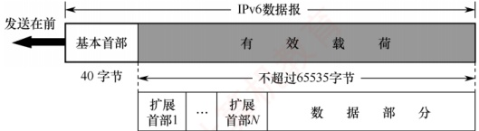
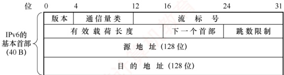
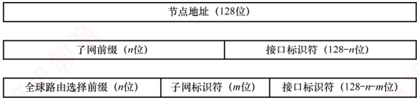

## 4.3 IPv6

### 4.3.1 IPv6 的特点

目前广泛使用的 IPv4 是在 20 世纪 70 年代设计的，互联网经过几十年的飞速发展，到 2011 年 2 月，IPv4 地址已经耗尽，为解决 “IP 地址耗尽” 问题，采取了以下三种措施。

1）无类别编址 CIDR：使 IP 地址分配更加合理。

2）网络地址转换（NAT）：节省全球唯一的公网 IP 地址。

3）IPv6：采用更大地址空间的新版本IP协议。

前两种方法只是延缓了 IPv4 使用寿命，只有第三种方法能从根本上解决 IP 地址耗尽问题。

### 考点追踪 IPv6 的特点（2023）

IPv6 的主要特点如下：

1）更大的地址空间。这是最重要的。IPv6 将地址长度从 IPv4 的 32 位增大到 128 位，地址空间是 IPv4 的  $2^{128}/2^{32}=2^{96}$ 倍。从长远来看，这些地址是绝对够用的。

2）扩展的地址层次结构。由于 IPv6 地址空间很大，因此可以划分出更多的层次。
3）灵活的首部格式。IPv6定义了许多可选的扩展首部，不仅可提供比IPv4更多的功能，还能提高路由器的处理效率，这是因为路由器通常不对扩展首部进行处理。

4）改进的选项。IPv6 首部长度是固定的，其选项放在有效载荷中，可根据需要灵活配置。而 IPv4 预先定义好了一套标准的选项，其选项放在首部的可变部分。

5）允许协议继续扩充。IPv6 允许不断扩充功能，而 IPv4 的功能是固定不变的。

6）支持即插即用（自动配置IPv6地址）。因此通常不需要使用DHCP，简化了网络管理。

7）支持资源的预分配。IPv6 支持实时音频/视频等要求保证一定带宽和时延的应用。

8）IPv6只有源主机才能分片，只支持端到端的分片，不允许中间路由器进行分片。

9）IPv6 首部长度是固定的 40B，而 IPv4 的首部长度是可变的（必须是 4B 的整数倍）。

10）增大了安全性。身份鉴别和保密功能由IPv6的扩展首部提供。

虽然 IPv6 与 IPv4 不兼容，但它与所有其他互联网协议（如 TCP、UDP、ICMP、IGMP 和 DNS 等）总体上是兼容的，仅在少数地方做了必要的修改，主要是为了处理更长的地址。

### 4.3.2 IPv6 数据报的基本首部

IPv6 数据报由两部分组成：基本首部和有效载荷（也称净负荷）。有效载荷由零个或多个扩展首部（扩展首部不属于基本首部）及其后面的数据部分构成，如图4.12所示。

图 4.12 具有多个可选扩展首部的 IPv6 数据报的一般形式

与 IPv4 相比，IPv6 对首部中的某些字段进行了如下调整：

取消了首部长度字段，因为基本首部长度固定为40B。

取消了服务类型字段，其功能由优先级和流标号字段实现。

取消了总长度字段，改用有效载荷长度字段。

取消了标识、标志和片偏移字段，相关功能已移至分片扩展首部。

把 TTL 字段更名为跳数限制字段，作用不变，但名称更贴合实际含义。

取消了协议字段，改用下一个首部字段。

取消了首部检验和字段，因传输层已提供差错检测，此举可加快路由器处理速度。

取消了选项字段，其功能由灵活的扩展首部实现。

尽管取消了 IPv4 首部中多项冗余功能，使 IPv6 基本首部的字段数减少至仅 8 个，但由于地址长度从 32 位扩展到 128 位，其基本首部长度反而增至 40B。

IPv6 数据报的基本首部格式如图 4.13 所示。

图 4.13 IPv6 数据报的基本首部的格式

### 考点追踪 IPv6 全部格式及字段含义（2023）

下面简要介绍 IPv6 基本首部中各字段的含义：

1）版本。占4位，指明IP协议的版本。对于IPv6，该字段的值为6。

2）通信量类。占8位，用于区分不同IPv6数据报的类别或优先级。

3）流标号。占20位，IPv6提出了流的抽象概念。流是指互联网上从特定源点到特定终点（单播或多播）的一系列数据报（如实时音频/视频传输），路径上的路由器可据此提供特定的服务质量保证。所有属于同一个流的数据报都具有相同的流标号。

4）有效载荷长度。占16位，表示IPv6数据报中基本首部之后的字节数，包括所有扩展首部和上层数据。最大值为65535（单位为字节）。

5）下一个首部。占8位，功能类似于IPv4的协议字段。若无扩展首部，则标识上层协议类型；若存在扩展首部，则标识紧随其后的第一个扩展首部的类型。

6）跳数限制。占8位，作用等同于IPv4的TTL字段。源主机在发送数据报时设定初始值（最大为255），每经过一个路由器，其值减1，减至0时丢弃该数据报。

7）源地址和目的地址。占128位，分别表示数据报的发送方/接收方的IPv6地址。

### 4.3.3 IPv6 地址

IPv6 数据报的目的地址有以下三种基本类型：

1）单播。即传统的点对点通信，数据报发送给唯一指定的接收方。

2）多播。一点对多点的通信，数据报发送给所有加入该多播组的接口。

3）任播。是IPv6新增的一种地址类型，其特点可概括为“一址多用、就近交付”。任播地址标识一组接口，但网络会将数据报仅交付给其中路由距离最近的一个。

IPv4 地址通常采用点分十进制表示法。若 IPv6 也沿用此方式，其 128 位地址将显得冗长。因此，IPv6 标准采用冒号十六进制记法：将地址划分为 8 组，每组 16 位（4 个十六进制数），各组之间用冒号分隔。例如，4BF5:AA12:0216:FEBC:BA5F:039A:BE9A:2170。

为了书写简便，还规定了如下两种缩写规则。

省略前导零。每组中前面连续的十六进制零可以省略，但至少要保留一个数字。例如，可以把地址4BF5:0000:0000:0000:BA5F:039A:000A:2176缩写为4BF5:0:0:0:BA5F:39A:A:2176。

双冒号替换连续全零组。当地址中出现一个或多个连续的全零组时，可用双冒号（::）替代。但“::”在一个地址中只能使用一次，否则无法确定省略了多少个全零组（因总组数需恢复为8）。因此，上述地址可被更紧凑地缩写为4BF5::BA5F:39A:A:2176。

IPv6 地址的分类如表 4.3 所示。

表4.3 IPv6 地址的分类

| 地址类型 | 二进制前缀 | CIDR 记法 |
| --- | --- | --- |
| 未指明地址 | 00...0(128 位) | ::/128 |
| 环回地址 | 00...01 (128 位) | ::1/128 |
| 多播地址 | 11111111(8 位) | FF00::/8 |
| 本地链路单播地址 | 1111111010 (10 位) | FE80::/10 |
| 全球单播地址 | 见图 4.14 |   |

对表4.3给出的五类地址简单解释如下：

1）未指明地址：不能用作目的地址，仅用于尚未配置IPv6地址的主机作为源地址。

2）环回地址：作用与 IPv4 的环回地址相同，但 IPv6 中仅定义这一个环回地址。
3）多播地址：作用与IPv4多播类似。这类地址占IPv6地址空间的1/256。

4）本地链路单播地址：仅用于本地链路内的通信，不能被路由器转发。

5）全球单播地址：使用得最多的地址。IPv6 单播地址的划分方法非常灵活，如图 4.14 所示。可以把整个 128 位都作为一个节点的地址。也可用 n 位作为子网前缀，剩下的(128-n)位作为接口标识符（相当于 IPv4 的主机号）。还可以划分为三级：用 n 位作为全球路由选择前缀，用 m 位作为子网前缀，而剩下的 128-n-m 位则作为接口标识符。

图 4.14 IPv6 全球单播地址的几种划分方法

### 4.3.4 从 IPv4 向 IPv6 过渡

IPv4 问 IPv6 的过渡只能采用逐步演进的办法，并确保新部署的 IPv6 系统具备向后兼容的能力：能够接收、转发 IPv4 数据报，并为其选择路由。

### 考点追踪 IPv4 向 IPv6 过渡的策略（2023）

目前主要采用以下两种过渡策略：

1）双协议栈，是指在一台主机上同时安装 IPv4 和 IPv6 两个协议栈，分别配置一个 IPv4 地址和一个 IPv6 地址，因此既能与 IPv4 网络通信，也能与 IPv6 网络通信。双协议栈主机通过应用层的域名系统（DNS）获知目的主机使用的地址类型：若 DNS 返回的是 IPv4 地址，则使用 IPv4；若返回的是 IPv6 地址，则使用 IPv6。

2）隧道技术，是指当IPv6数据报需要进入IPv4网络时，将其整个封装为IPv4数据报的数据部分，使原IPv6数据报如同在IPv4网络的隧道中传输；当该IPv4数据报离开IPv4网络后，再将其数据部分交由主机的IPv6协议处理。
