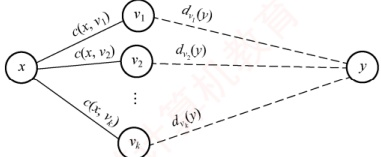
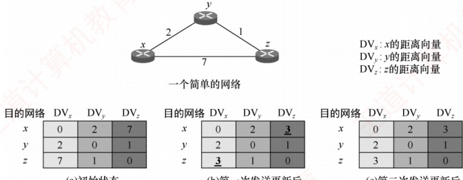
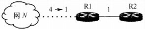
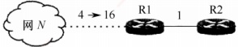
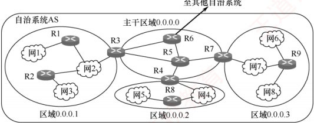
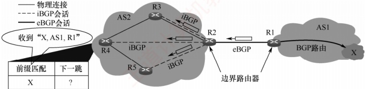
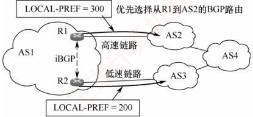
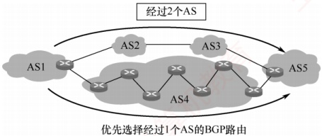
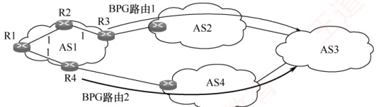

## 4.4 路由算法与路由协议

### 4.4.1 路由算法

路由选择协议的核心是路由算法，即用于生成路由表中各项条目的计算方法。其目的很明确：给定一组路由器及其互连链路，路由算法要找到一条从源路由器到目的路由器的最佳路径。通常，“最佳”路径是指费用最低的路径，该费用可根据跳数、带宽、延迟等因素定义。

#### 1. 静态路由与动态路由

路由器转发分组是通过路由表进行的，而路由表是通过各种算法生成的。从能否随网络状态自适应调整的角度，路由算法可分为 **如下两大类**。

1）静态路由算法。由网络管理员手工配置每一条路由。

2）动态路由算法。根据网络状态的变化（如链路故障或新增）来动态调整自身的路由表。

静态路由算法的特点是实现简单、开销小，但不能及时适应网络状态的变化，适用于简单的小型网络。动态路由算法能较好地适应网络状态的变化，但实现复杂、开销也大，适用于较复杂的大型网络。常用的动态路由算法可分为两类：距离-向量算法和链路状态算法。

#### 2. 距离-向量算法

距离-向量（Distance-Vector，DV）算法基于 Bellman-Ford 算法，它不要求每个节点掌握完整的网络拓扑，而只需知道：与相邻节点之间的距离；各邻居节点到目的节点的最短距离。每个节点以自身为源点，独立运行 Bellman-Ford 算法，通过迭代交换信息，最终可收敛到全网一致的最短路径解。下面讨论 Bellman-Ford 算法的基本思想。

假设  $d_{x}(y)$ 表示从节点 x 到节点 y 的最短路径费用，则有

 $$d_{x}(y)=\min\{c(x,v)+d_{v}(y)\},\quad v 是 x 的所有邻居$$

式中， $c(x, v)$ 是从 x 到其邻居 v 的链路费用。已知 x 的所有邻居到 y 的最短路径费用后，x 到 y 的最短路径费用即为所有  $c(x, v) + d_v(y)$ 中的最小值，如图 4.15 所示。所有最短路径算法都依赖于一个基本性质：“两点之间的最短路径，必然包含路径上任意子路径的最短路径”。

图 4.15 Bellman-Ford 算法的基本思想

在距离-向量算法中，每个节点x维护以下路由信息：

1）从 x 到每个直接相连邻居 v 的链路费用  $c(x, v)$。

2）节点 x 的距离向量，即 x 到网络中其他节点的费用。这是一组距离，因此称为距离向量。

3）从每个邻居接收到的距离向量副本，即 x 的各邻居到所有其他节点的费用。

算法运行时，每个节点定期向所有邻居发送自己的距离向量。当节点 x 从邻居 v 接收到新的距离向量后，会更新本地保存的 v 的距离向量副本，并利用上述公式重新计算自身的距离向量。若计算结果导致自身的距离向量发生变化，则立即向所有邻居发送更新后的距离向量。

下面以图4.16顶部所示的三节点简单网络为例，说明距离-向量算法的实现过程。

(a) 初始状态

(b) 第一次发送更新后

(c)第二次发送更新后

图 4.16 距离-向量算法实现的举例

### 考点追踪 距离-向量算法的实现原理（2021）

图4.16(a)中的各列依次是三个节点的初始化距离向量，此时各节点之间尚未交换过任何路由信息，因此每个节点的距离向量仅包含到每个直连邻居的链路费用。

初始化完成后，各节点首次向邻居发送自己的距离向量。收到更新后，每个节点重新计算自己的距离向量。例如，节点  $x$ 计算的过程为： $d_x(x) = 0$； $d_y(y) = \min\{c(x, y) + d_y(y), c(x, z) + d_z(y)\} = \min\{2 + 0, 7 + 1\} = 2$； $d_x(z) = \min\{c(x, y) + d_y(z), c(x, z) + d_z(z)\} = \min\{2 + 1, 7 + 0\} = \underline{3}$。可见， $x$ 到  $z$ 的最低费用由 7 变成了 3， $z$ 到  $x$ 的最低费用也由 7 变成了 3，如图 4.16(b)所示。由于距离向量发生变化， $x$ 和  $z$ 要再次向邻居发送更新报文，而未变化的  $y$ 则无须发送。这一轮交换后，各节点又重新计算，发现距离向量不再变化，算法收敛并进入静止状态，如图 4.16(c)所示。

显然，更新报文的大小与网络节点数成正比，大型网络中可能产生较大的通信开销。

最常见的距离-向量路由协议是 RIP，它采用跳数作为路径费用的度量标准。

#### 3. 链路状态算法

链路状态（Link State，LS）指的是：本路由器与哪些邻居相连，以及对应链路的代价。链路状态算法要求每个节点都掌握完整的全网拓扑结构图。为此，每个节点执行以下两项任务：

主动探测所有相邻节点的状态：

定期将自身的链路状态信息，通过洪泛法传播给全网所有节点。

因此，每个节点都知道全网拓扑、连接关系及各链路代价，并可基于此使用 Dijkstra 最短路径算法，独立计算到其他所有节点的最短路径；每当收到链路状态报文时，节点会更新本地的拓扑视图，并在链路状态发生变化时，立即重新运行 Dijkstra 算法以更新最短路径。

链路状态算法的主要优点是：①所有节点基于相同的链路状态数据库独立计算最优路径，不依赖邻居的路由决策，避免了距离-向量算法中的无穷计数等问题；②每个节点获得完整拓扑
后，可本地计算全局最优路径，收敛过程通常较快且无环；③ 链路状态报文仅包含本节点的直连链路信息，单个报文大小与网络总规模无关，因此在大型网络中具有更好的可扩展性。

两种路由算法的比较：① 在距离-向量算法中，每个节点仅与直接邻居交换信息，发送的是完整的距离向量（大小与节点数成正比），通信开销较大；② 在链路状态算法中，每个节点通过洪泛方式向全网广播自身直连链路的状态，但每条报文仅包含局部信息，总体扩展性更好。

典型的链路状态算法是 OSPF 算法。

### 4.4.2 分层次的路由选择协议

互联网采用的是自适应的分布式路由选择协议。由于互联网规模非常庞大，且许多联网单位不愿对外暴露其内部网络细节，因此采用了分层次的路由选择协议。

为此，整个互联网被划分为多个较小的自治系统（Autonomous System，AS）。每个自治系统在对外通信时，表现为一个单一且一致的路由选择策略。自治系统的管理者有权自主决定在其内部使用何种路由选择协议（如RIP或OSPF）。

基于此，互联网的路由选择协议被划分为两大类。

#### 1. 内部网关协议（Interior Gateway Protocol，IGP）

内部网关协议用于自治系统内部的路由选择，与其他自治系统所采用的协议无关。目前这类路由选择协议使用得最多，如 RIP 和 OSPF。

#### 2. 外部网关协议（External Gateway Protocol，EGP）

当源主机和目的主机位于不同的自治系统中（这两个自治系统可能使用不同的 IGP），数据报在到达某一自治系统边界时，就需要借助一种协议将路由信息传递到另一个自治系统。这类协议称为外部网关协议。当前广泛使用的外部网关协议是 BGP-4。

自治系统之间的路由选择也称域间路由选择，自治系统内部的路由选择也称域内路由选择。

图 4.17 是两个自治系统互连的示意图。每个自治系统可以自行选择内部使用的网关协议（如 RIP 或 OSPF）。但每个自治系统都至少有一个或多个边界路由器（图中的 R1 和 R2），这些路由器除运行本系统的内部网关协议外，还需运行外部网关协议（如 BGP-4）。

图4.17 两个自治系统互连的示意图

### 4.4.3 路由信息协议

路由信息协议（Routing Information Protocol，RIP）是内部网关协议（IGP）中最早得到广泛应用的协议之一。RIP 是一种分布式的、基于距离向量的路由选择协议。

#### 1. RIP 的规定

1）RIP 使用跳数（Hop Count，也称距离）来衡量到达目的网络的远近。规定从一个路由器到其直连网络的距离为 1；每经过一个路由器，跳数加 1。

2）RIP 认为“好”的路由就是所经路由器数量最少的路径，即跳数最少。
### 考点追踪 RIP 中跳数为 16 的含义（2010）

3）RIP 规定一条路径最多包含 15 个路由器，因此跳数为 16 表示目的网络不可达。由此可见，RIP 仅适用于小型自治系统。

4）每个路由表项包含三个关键字段：<目的网络N，距离d，下一跳路由器地址X>，其含义是“我通过下一跳路由器X到达目的网络N的距离为d”。

5）网络中的每个路由器都需维护一个距离向量，即其到所有目的网络的距离记录。

#### 2. RIP 的特点

RIP 要求每个路由器持续与其他路由器交换信息，其工作特点主要体现在以下三个方面。

1）和谁交换信息：仅和直接相邻的路由器交换信息。

2）交换什么信息：交换的是本路由器当前的完整路由表，即全部路由信息。

3）何时交换信息：按固定的时间间隔（默认为30秒）交换路由信息，路由器据此更新自己的路由表。当网络拓扑发生变化时，路由器也及时向相邻路由器通告最新路由信息。

路由器刚开始工作时，它的路由器表是空的。然后，路由器得知到几个直连网络的距离为1。接着，它周期性地与邻居交换并更新路由信息。经过若干轮的交换和更新后，所有路由器最终都会获知到达本自治系统内任意网络的最少跳数和对应的下一跳地址，这一过程称为 **收敛**。

### 考点追踪 RIP 使用的下层协议（2017）

RIP 是应用层协议，它使用 UDP 传送数据（端口 520）。需要注意的是，RIP 选择的路径不一定是时延最短，但一定是跳数最少的路径，因为它仅依据跳数进行路径选择。

#### 3. RIP 的基本工作原理

对于每个相邻路由器发来的 RIP 报文，执行以下步骤：

1）对来自地址为 X 的相邻路由器的 RIP 报文，首先修改其中所有项目：将所有 “下一跳” 字段都置为 X，并将所有 “距离” 字段的值加 1。

2）对修改后的每个项目，按如下规则处理：

IF (若原路由表中没有目的网络 N)

则将该项目加入路由表（表示发现新网络）。

ELSE IF (若原路由表中已有目的网络 N，且原下一跳地址是 X)

用新收到的项目替换原表项（要以最新的消息为准）。

ELSE IF (若原路由表中已有目的网络 N，但原下一跳地址不是 X)

若新收到的项目中的距离 d 小于当前记录的距离，则替换原表项（表示找到更优路径）。ELSE 什么也不做。

3）若连续180秒（RIP默认超时时间）未收到某相邻路由器的更新报文，则将其标记为不可达，即将对应路由项的距离置为16（表示不可达）。

4）处理完毕，返回。

### 考点追踪 RIP 路由收敛机制（2024）

下面举例说明 RIP 路由表项的更新过程。已知路由器 R6 和 R4 互为相邻路由器，表 4.4(a) 所示为 R6 的路由表。现在收到相邻路由器 R4 发来的路由表，如表 4.4(b) 所示。

表4.4(a) R6 的路由表

| 目的网络 | 距离 | 下一跳路由器 |
| --- | --- | --- |
| Net2 | 3 | R4 |
| Net3 | 4 | R5 |
| ... | ... | ... |

表4.4(b) R4 发来的路由表

| 目的网络 | 距离 | 下一跳路由器 |
| --- | --- | --- |
| Net1 | 3 | R1 |
| Net2 | 4 | R2 |
| Net3 | 1 | 直接交付 |

现对 R6 的路由表进行更新。先把 R4 发来的路由表 [表 4.4(b)] 中各项的距离都加 1，并把下一跳路由器都改为 R4，得到表 4.5(a)。这么做的意义是：R4 是 R6 的相邻路由器，R6 可通过 R4 到达这些网络，但距离比 R4 到达这些网络的距离大 1。将该表与 R6 的原路由表逐项比较。

表4.5(a) 修改 R4 发来的路由表

| 目的网络 | 距离 | 下一跳路由器 |
| --- | --- | --- |
| Net1 | 4 | R4 |
| Net2 | 5 | R4 |
| Net3 | 2 | R4 |

表4.5(b) 更新后 R6 的路由表

| 目的网络 | 距离 | 下一跳路由器 |
| --- | --- | --- |
| Net1 | 4 | R4 |
| Net2 | 5 | R4 |
| Net3 | 2 | R4 |
| ... | ... | ... |

第一行的 Net1 在表 4.4(a) 中没有。这表明：R6 此前没有到达 Net1 的路由，现在知道可通过 R4 到达 Net1。因此，要把这条 Net1 的路由表项添加到 R6 的路由表中。

第二行的 Net2 在表 4.4(a) 中已有，且下一跳路由器也是 R4。这表明：R6 到达 Net2 的最佳路由仍然是通过 R4，但距离发生了变化（通常由网络拓扑变化引起）。因此，要更新目的网络 Net2 的路由表项（无论距离是变大还是变小，都需要更新）。

第三行的 Net3 在表 4.4(a) 中已有，但下一跳路由器不同。此时比较距离，新路由信息的距离为 2，小于原表中的 4。这表明：R6 通过 R4 到达 Net3 的路径比原来经由 R5 的更短，因此应更新 Net3 的路由表项（新路由的距离更大时，不更新）。

更新后的 R6 的路由表如表 4.5(b) 所示。

#### 4. RIP 的优缺点

### 考点追踪 RIP 的优缺点（2024）

RIP 的优点：

1）实现简单、开销小、收敛过程较快。

2）若一个路由器发现更短的路由，该更新信息会迅速传播，在较短时间内即可传至所有路由器，俗称“好消息传播得快”。

RIP 的缺点：

1）RIP 限制了网络的规模，其最大有效距离为 15（距离 16 表示不可达）。

2）路由器之间交换的是完整的路由表，因此网络规模越大，通信开销也越大。

3）当网络出现故障时，路由器需反复多次交换信息才能完成收敛，故障信息传递缓慢，导致慢收敛现象，俗称“坏消息传播得慢”。

下面举例说明 RIP “好消息传播得快，坏消息传播得慢” 的特点。假设图 4.18 中的路由器均采用 RIP 交换路由信息，初始时 R1 到网络 N 的距离为 4，且 R1 和 R2 均已收敛。为简化讨论，此处仅考虑到达网络 N 的路由条目：R1 中为<N,4，直接>，R2 中为<N,5，R1>。

(a) 发现更短的路由

(b) 链路出现故障

图 4.18 RIP 举例：链路开销改变

在图 4.18(a)中，某时刻，R1 检测到一条 “到 N 更短的链路”（距离由 4 变为 1），于是将到 N 的距离更新为 1，并通知 R2（即便 R1 先收到 R2 发来的更新报文，也不会修改自身到 N 的路由）。R2 收到后，将到 N 的距离更新为 2，并通知 R1；R1 收到后，不再修改自己的路由，算法进入静止状态。可见，R2 到 N 的距离减少的好消息通过 RIP 得到了迅速传播。
### 考点追踪 RIP “坏消息传播得慢”的分析（2016）

在图 4.18(b)中，某时刻，R1 检测到 “N 不可达”（距离由 4 变为 16），于是将到 N 的距离置为 16，但可能需等到下一次周期性更新（默认 30s）才会通知 R2。而在此期间，R2 可能已先将自己的更新报文发给了 R1，其中包含<N, 5, R1>。R1 收到后，误认为可通过 R2 到达 N，于是将路由信息更新为<N, 6, R2>。随后 R1 通知 R2，R2 又据此将路由信息更新为<N, 7, R1>，误认为可通过 R1 到达 N……如此往复，直到两者最终都将距离增至 16，才知道原来 N 是不可达的。可见，RIP 对链路故障或距离增加这类 “坏消息” 的传播非常缓慢。若无跳数上限（15）的限制，路由器将无限循环转发无效路由信息，因此 “坏消息传播得慢” 也称无穷计数问题。

### 4.4.4 开放最短路径优先协议

虽然名称中含有“最短路径优先”，但这并不意味着其他路由协议不采用最短路径原则。实际上，自治系统内使用的所有路由协议都旨在寻找一条最短路径，只是最短的度量标准不同。

#### 1. 开放最短路径优先（OSPF）的基本特点

### 考点追踪 OSPF 与 RIP 特性对比（2024）

OSPF 协议是分布式链路状态算法的典型代表，它采用了 Dijkstra 提出的最短路径算法。与 RIP 相比，OSPF 具有以下四个主要特点：

1）OSPF 使用洪泛法向本自治系统中所有路由器发送信息：路由器通过所有输出端口向相邻路由器发送信息，每个相邻路由器再将该信息转发给其所有邻居（但不再回传给刚刚发送信息的路由器）。最终，整个区域内的所有路由器都会收到该信息的一个副本。而 RIP 仅向直接相邻的几个路由器发送信息。

2）OSPF 发送的信息是本路由器与其相邻路由器之间的链路状态（局部拓扑信息），而非全局路由表。而 RIP 发送的是本路由器所知的全部路由信息（完整的路由表）。

3）OSPF 仅在链路状态发生变化时才触发洪泛更新，收敛速度快，不会出现 RIP 中 “坏消息传得慢” 的问题。而 RIP 不论网络拓扑是否变化，都需定期交换路由信息。

### 考点追踪 OSPF 使用的下层协议（2017）

4）OSPF 是网络层协议，不使用 UDP 或 TCP，而是直接封装在 IP 数据报中（IP 首部的协议字段为 89）。而 RIP 是应用层协议，使用 UDP 传输（端口 520）。

**注意**

“用 UDP 传送”是指将协议数据作为 UDP 报文的数据部分；“直接使用 IP 数据报传送”则是指将协议数据直接作为 IP 数据报的数据部分。RIP 报文属于前者。

除上述区别外，OSPF还具有以下优势：

1）OSPF 支持对每条路由设置不同的代价，可针对不同业务类型计算差异化路径。

2）存在多条到同一目的网络且代价相同的路径时，可实现负载分担（或称负载均衡）。

3）OSPF 分组具备鉴别功能，确保仅在可信路由器之间交换链路状态信息。

4）OSPF 支持可变长子网掩码和无分类编址。

5）每条链路状态通告均携带一个32位序号，序号越大，表示状态越新。

由于各路由器频繁交换链路状态信息，最终所有路由器都能构建出一致的链路状态数据库（LSDB）。随后，每个路由器基于 LSDB，利用 Dijkstra 算法计算到达各目的网络的最优路径，并生成自己的路由表。当链路状态发生变化时，路由器会重新计算并更新路由表。
**注意**

尽管 Dijkstra 算法能计算完整的最优路径，但路由表中不会存储完整路径，而仅存储“下一跳”，只有到了下一跳后，才能确定再下一跳应当怎样走。

为支持大规模网络，OSPF 将一个自治系统划分为若干更小的区域（Area）。划分区域的好处是：将洪泛法交换链路状态信息的范围限制在各区域内，而非整个 AS，从而显著减少网络通信开销。每个区域由一个或多个区域边界路由器负责为进出该区域的分组提供路由。AS 内必须有一个区域配置成主干区域，它包含 AS 内的所有区域边界路由器（可能还包含部分非边界路由器），用于连通其他区域。当分组需在不同区域之间传送时，其转发路径为：源区域→本地区域边界路由器→主干区域→目的区域边界路由器→目的地。在图 4.19 中，R3、R4 和 R7 均为区域边界路由器，每个区域至少包含一个区域边界路由器。此外，主干区域中还需指定一个自治系统边界路由器（如 R6），专门负责与本 AS 外的其他 AS 交换路由信息。

图 4.19 OSPF 划分区域举例

#### 2. OSPF 的五种分组类型

OSPF 定义了以下五种分组类型：

1）问候（Hello）分组，用来发现邻居并维持邻接关系，确认链路双向连通性。

2）数据库描述（Database Description，DD）分组，向邻居发送自己的链路状态数据库（LSDB）中的所有链路状态项目的摘要信息。

3）链路状态请求（Link-State Request，LSR）分组，向邻居请求发送某些链路状态项目的详细信息。

4）链路状态更新（Link-State Update，LSU）分组，通过洪泛法向全网发送链路状态通告（LSA），它是OSPF最核心的部分。路由器使用这种分组将其链路状态通知给邻居。

5）链路状态确认（Link-State Acknowledgment，LSAck）分组，对链路更新分组的确认。这五种分组共同支撑了OSPF的邻居发现、数据库同步、拓扑更新、可靠确认的全过程。

#### 3. OSPF 的基本工作原理

##### （1） 邻居发现与可达性维护

OSPF 规定，相邻路由器之间需每隔 10s 周期性地交换问候分组，以确认邻接关系并维持彼此的可达性。若某路由器在 40s 内未收到邻居的问候分组，则判定该邻居已不可达，并立即触发链路状态数据库（LSDB）的更新，随后重新运行 Dijkstra 算法以生成新的路由表。

通常，网络中传送的大多数 OSPF 分组都是问候分组。

##### （2） 链路状态数据库的初始同步

路由器刚启动时，仅能通过问候分组发现其直连邻居，并获知本地链路的基本信息（如接口
状态和链路开销）。然而，要构建完整的 LSDB，若采用全网广播所有路由器的完整链路状态信息，则会带来巨大的通信开销。为此，OSPF 采用了一种高效且可靠的同步机制。

首先，相邻路由器通过数据库描述分组交换各自 LSDB 中链路状态通告（LSA）的摘要信息；随后，路由器根据摘要对比，使用链路状态请求分组向邻居请求自身缺失或过期的 LSA 详细内容；对方则通过链路状态更新分组发送所请求的 LSA，接收方成功接收后需返回链路状态确认分组以确保可靠传输。通过这一系列交互，相邻路由器最终实现 LSDB 的完全同步。

##### （3） 链路状态变更的实时传播

在网络运行过程中，一旦路由器检测到自己的链路状态发生变化（如接口故障或邻居失效等），就会立即生成新的LSA，并通过链路状态更新分组以可靠的泛洪方式向整个区域传播。其他路由器收到后，同样必须返回确认，随后更新自己的LSDB，重新运行Dijkstra算法计算路由。

##### （4） 链路状态通告的定期更新

每条 LSA 的最大生存时间为 60 分钟，为防止 LSA 丢失或异常，最初生成该 LSA 的路由器需定期（通常是每隔 30 分钟）刷新该 LSA，从而确保 LSDB 与实际网络拓扑始终保持一致。

由于每个路由器的链路状态信息仅描述其与直连邻居的连接关系及链路代价，与全网规模无直接关联。因此，当网络规模很大时，OSPF要显著优于基于跳数且收敛缓慢的RIP。

### 4.4.5 边界网关协议

#### 1. BGP 的基本特点

### 考点追踪 BGP 的功能（2013）

边界网关协议（Border Gateway Protocol，BGP）是不同自治系统的路由器之间交换路由信息的协议，是一种外部网关协议。BGP常用于互联网的AS之间。而RIP和OSPF都只能在一个AS内工作；若没有BGP，则全世界数以万计的AS都将是一个个彼此孤立的“孤岛”。

内部网关协议主要是设法使分组在一个 AS 内尽可能有效地从源站传送到目的站。在一个 AS 内部通常不需要考虑其他方面的策略。然而 BGP 使用的环境却不同，主要原因如下：

1）互联网的规模太大，使得 AS 之间的路由选择非常困难，每个主干网路由器表中的项目数都非常庞大。对于 AS 之间的路由选择，要寻找最佳路由是很不现实的。

2）AS 之间的路由选择必须考虑政治、安全或经济等有关因素。

### 考点追踪 BGP 使用的下层协议（2013、2017）

因此，BGP 只能力求寻找一条能够到达目的网络且比较好的路由（不能兜圈子），而并非要寻找一条最佳路由。BGP 采用了路径向量路由选择协议，它与距离向量协议（如 RIP）和链路状态协议（如 OSPF）都有很大的区别。BGP 是应用层协议，基于 TCP 实现。

#### 2. BGP 路由

BGP 路由的一般格式如下：

BGP 路由 =<前缀, BGP 属性>=<前缀, AS-PATH, NEXT-HOP>

BGP 属性有多种类型。当一个路由器通过 BGP 会话向对等方通告一条 BGP 路由时，最重要的两个属性是 AS-PATH（自治系统路径）和 NEXT-HOP（下一跳）。

AS-PATH 记录了该 BGP 路由所经过的自治系统序列。在 BGP 中，每个自治系统由一个全局唯一的自治系统号（ASN）标识。BGP 路由每经过一个 AS，就向其 ASN 加入 AS-PATH。可见，BGP 路由明确指出了所经过的 AS 路径，但不指明具体经过哪些路由器。

NEXT-HOP 表示接收该 BGP 路由的路由器去往目的网络时应使用的下一跳地址。具体而言，
从本 AS 出发时，需将分组发给 NEXT-HOP，其通常是通告此路由的邻居 AS 的边界路由器上与本 AS 直连的接口 IP 地址，即 AS-PATH 中第一个 AS（邻居 AS）对应的入口点。

### 考点追踪 BGP 会话类型（2024）

在一个 AS 中有两类功能不同的路由器：边界路由器和内部路由器。在这些边界路由器之间，以及在 AS 内部的 BGP 路由器之间，均通过端口号为 179 的半永久 TCP 连接（交换信息后仍保持连接）来交换 BGP 路由信息。每对通过 TCP 连接交换 BGP 报文的路由器称为 BGP 对等方，该 TCP 连接称为 BGP 会话。其中，跨越两个 AS 的 BGP 会话称为外部 BGP（eBGP，external）会话，而位于同一 AS 内的 BGP 会话称为内部 BGP（iBGP，internal）会话。可见，BGP 不仅用于 AS 之间的路由交换，还运行于 AS 内部，以确保外部路由信息在整个 AS 中正确传播。

为避免路由信息丢失，BGP 要求在 AS 内的任意两台路由器之间都要建立 iBGP 会话，但不要求物理直连（如图 4.20 中 R2 与 R4、R2 与 R5 之间的 iBGP 会话）。

下面通过一个简单的例子来说明。

在图 4.20 中，位于 AS2 的 R4 收到一条 BGP 路由 “X, AS-PATH = AS1, NEXT-HOP = R1”，表示 “从 R1 出发，经过 AS1，可到达网络 X”，即 “R1→X”。R4 为了构造自己的路由表，需要解析该路由的 NEXT-HOP。由于 R1 位于 AS1，AS2 的内部路由器无法直接将分组发往 R1，因此 R4 必须通过 AS2 中的某个边界路由器来抵达 NEXT-HOP。具体地，R4 知道 R1 是其 eBGP 对等方 R2 的邻居，因此通往 R1 的流量必须先发给 R2，形成的路径为 “R2→R1→X”。由于 R2 在 AS2 中，AS2 内的所有路由器都能将分组转发到 R2，再经过 R1，最终到达 X。

图 4.20 BGP 路由的举例

接着，R4 利用内部网关协议（IGP），找到从自身到 R2 的最优路径，假设查得下一跳为 R3。于是，R4 在路由表中添加表项<X, R3>。此后，R4 收到目的网络为 X 的分组时，将按路径 R4→R3→R2→R1→X 转发。类似地，R3 也会在其路由表中添加表项<X, R2>。每个路由器在收到新的 BGP 路由通告后，都需要执行 NEXT-HOP 解析和 IGP 查找，才能将路由正确写入本地路由表。

#### 3. BGP 路由选择

### 考点追踪 BGP 路由选择的策略（2024）

若从一个 AS 到另一个 AS 中的网络 X 只有一条 BGP 路由，则无须进行 BGP 路由选择，该路由即为唯一路径。然而，如果存在两条或更多的 BGP 路由可供选择，则应根据以下原则，并按下面给定的优先顺序，选择一条较好的 BGP 路由。

#### （1） 首先选择本地偏好值最高的路由

在 BGP 路由的属性中，有一个称为本地偏好（LOCAL-PREF）的选项，其值可由管理员根据政治或经济上的策略来设置。以图 4.21 为例，从 AS1 到 AS4 共有两条 BGP 路由，管理员设置 LOCAL-PREF 值后，根据该原则，所有发往 AS4 的流量都选择从 R1 离开。然而，即使高速链路过载，BGP 也无法自动将部分流量切换到较空闲的低速链路。

图 4.21 本地偏好值较高的路由优先

若在几条 BGP 路由中找不出本地偏好值最高的路由，则采用下面的方法。

#### （2） 选择 AS 跳数最少（AS-PATH 最短）的路由

假设到达目的 AS 的多条 BGP 路由的本地偏好值都相同，则 BGP 选择 AS 跳数最少的路由。以图 4.22 为例，从 AS1 到 AS5 共有两条 BGP 路由，根据该原则，应选择仅通过 1 个 AS 的 BGP 路由，即 AS1→AS4→AS5。然而，由于 AS4 是个很大的 AS，分组在 AS4 中反而要经过更多次的转发，可能要花费更长的时间。可见，AS 跳数最少的路由未必是最好的。

图 4.22 根据经过 AS 跳数的多少选择 BGP 路由

#### （3） 使用热土豆路由选择算法

假设按前两种方法都无法确定最好的路由。以图 4.23 为例，从 AS1 到 AS3 共有两条 BGP 路由，假设这两条路由的本地偏好都相同，所经过的 AS 个数也相同。此时，AS1 中的每个路由器执行热土豆路由选择算法（比喻成烫手的热土豆），使分组经过最少的转发次数离开本 AS。这时要使用内部网关协议（如 RIP 或 OSPF），对于不同的路由器，得出的选择结果是不同的。对于 R1，要使分组尽快离开 AS1，应选择 R4 作为下一跳，因此应选择 BGP 路由 2，最终的转发路径为 R1→R4→BGP 路由 2。同理，对于 R2，要使分组尽快离开 AS1，应选择 R3 作为其下一跳，因此应选择 BGP 路由 1，最终的转发路径为 R2→R3→BGP 路由 1。

图 4.23 热土豆路由选择算法的举例

#### （4） 选择BGP标识符数值最小的路由

在 BGP 报文的首部有一个称为 BGP 标识符的字段，该字段是运行 BGP 路由器的唯一标识符。当以上三种方法都无法找出最好的 BGP 路由时，可使用 BGP 标识符来选择路由。
#### 4. BGP 的四种报文

当 BGP 刚启动时，BGP 会话的两端需要交换完整的 BGP 路由表；此后，仅在路由发生变化时发送更新部分。这种方式有助于节省网络带宽并降低路由器的处理开销。

### 考点追踪 BGP 报文类型及作用（2024）

BGP-4 定义了以下四种报文类型。

1）Open（打开）报文。用来与BGP会话的对等方建立关系，使通信初始化。

2）Update（更新）报文。用来通告某一路由的信息，以及列出要撤销的多条路由。

3）Keepalive（保活）报文。用来周期性地证实与对等方的连通性。

4）Notification（通知）报文。用来发送检测到的差错。

两个路由器在建立 TCP 连接后，必须首先交换 Open 报文，以相互识别对方，并协商一些协议参数。收到 Open 报文的路由器若接受 BGP 连接请求，则返回 Keepalive 报文。BGP 会话建立后，对等方需要周期性地交换 Keepalive 报文（默认间隔为 60 秒），以维持连接活跃状态。

Update 报文是 BGP 的核心，用于撤销它之前通告过的路由，或者宣布增加一条新的路由。撤销路由可以一次撤销多条，但新增路由时，每个更新报文只能增加一条。

为检测对等方是否失效，每个BGP路由器都维护一个保持时间计时器。每当收到任意BGP报文，计时器就重置为0并开始计时，若在约定的保持时间内未收到任何BGP报文，则认为对等方已失效，BGP连接将被关闭。保持时间默认为180s，而Keepalive报文的发送间隔为其1/3。

RIP、OSPF 与 BGP 的比较如表 4.6 所示。

表4.6 三种路由协议的比较

| 协议 | RIP | OSPF | BGP |   |
| --- | --- | --- | --- | --- |
| 类型 | 内部 | 内部 | 外部 |   |
| 路由算法 | 距离向量 | 链路状态 | 路径向量 |   |
| 传递协议 | UDP | IP | TCP |   |
| 路径选择 | 跳数最少 | 代价最低 | 较好，非最佳 |   |
| 交换节点 | 和本节点相邻的路由器 | 网络中的所有路由器 | 和本节点相邻的路由器 |   |
| 交换内容 | 当前本路由器知道的全部信息，即自己的路由表 | 与本路由器相邻的所有路由器的链路状态 | 首次 | 整个路由表 |
| 非首次 | 有变化的部分 |   |   |   |

