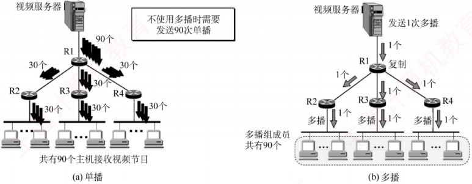
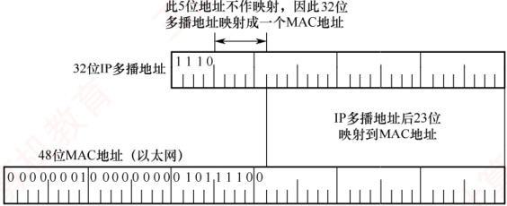

## 4.5 IP 多播

### 4.5.1 多播的概念

多播（也称组播）是让源主机一次发送的单个分组可以抵达用一个组地址标识的若干目的主
机，即一对多的通信。在互联网上进行的多播，称为IP多播。与单播相比，多播在一对多通信中能显著节省网络资源。例如，当视频服务器向90台主机发送相同的视频分组时（见图4.24），单播需要为每台主机单独发送一份分组，共90份；而多播仅发送一份分组。该分组在传输路径上仅当遇到分岔节点时才被复制并转发。到达目的局域网后，已加入该多播组的主机均可收到该分组。因此，多播大幅减轻了服务器的负担和网络负载。

多播的实现依赖于路由器的支持，支持多播路由协议的路由器称为多播路由器。

图 4.24 单播与多播的比较

### 4.5.2 IP 多播地址

多播数据报的源地址是源主机的 IP 地址，目的地址是 IP 多播地址。IP 多播地址就是 IPv4 中的 D 类地址。D 类地址的前四位是 1110，因此地址范围是 224.0.0.0～239.255.255.255，每个地址标志一个多播组，可支持  $2^{28}$ 个多播组，主机可随时加入或离开一个多播组。

多播数据报是指目的地址为 D 类 IP 地址的数据报，其协议字段值由其携带的上层协议决定（若携带的是 UDP 数据，则为 17；若携带的是 IGMP 报文，则为 2）。注意事项如下：

1）多播数据报也是“尽最大努力交付”，不提供可靠交付。

2）多播地址只能用于目的地址，而不能用于源地址。

3）对多播数据报不产生 ICMP 差错报文。

IP 多播可分为两种：① 只在本局域网上进行硬件多播；② 在互联网的范围内进行多播。目前大部分主机都是通过局域网接入互联网的。因此，在互联网上进行多播的最后阶段，仍需要把多播数据报在局域网上用硬件多播交付给多播组的所有成员［见图4.24(b)］。

多播机制仅适用于 UDP，因为它能将同一报文同时发送给多个接收者；而 TCP 是面向连接的协议，建立的是一对一的端到端连接，无法支持一对多的多播通信。

### 4.5.3 在局域网上进行硬件多播

由于局域网支持硬件多播，只需将 IP 多播地址映射为对应的多播 MAC 地址，并将 IP 多播数据报封装在以太网帧中，其 MAC 帧首部的目的地址字段设为该映射所得的多播 MAC 地址。这样，即可借助局域网的硬件多播能力，高效实现 IP 多播在本地网络中的传输。

IANA（互联网地址指派机构）保留的以太网多播地址的范围是01-00-5E-00-00-00到01-00-5E-7F-FF-FF，在这48位中，前25位保持不变，只有后23位可用作多播。而D类IP地址共有28位可用于标志多播组，这28位中的高5位无法映射，导致32（即 $2^{5}$）个不同的IP多播地址会映射
到同一个多播 MAC 地址。因此两者是多对一的映射关系，如图 4.25 所示。

例如，IP 多播地址 224.128.64.32（E0-80-40-20）与 224.0.64.32（E0-00-40-20）映射到以太网多播 MAC 地址时，均得到 01-00-5E-00-40-20。因此，主机在收到多播数据帧后，还需在 IP 层利用数据报首部中的目的 IP 地址进行过滤，仅保留本机所属多播组的数据报，其余则予以丢弃。

图4.25 D类IP地址与以太网多播地址的映射关系

### 4.5.4 IGMP 与多播路由协议

路由器要获得多播组的成员信息，需要利用网际组管理协议（Internet Group Management Protocol，IGMP）。连接到局域网上的多播路由器还必须和互联网上的其他多播路由器协同工作，以便用最小代价将多播数据报分发至所有组成员，这就需要使用多播路由选择协议。

IGMP 用于使连接到本地局域网上的多播路由器，能够获知本局域网上是否有主机加入或退出了某个多播组。IGMP 仅作用于本地子网，并非用于在互联网范围内管理所有多播组成员，它既不知道某个多播组的总成员数量，也不了解这些成员分布在哪些网络。

IGMP 报文封装在 IP 数据报（协议字段值为 2）中传送。IGMP 作为 IP 的配套协议，用于协助 IP 实现多播功能，因此不将其视为一个单独的协议，而是整个 IP 协议的一个组成部分。

IGMP 的工作可分为两个阶段：

第一阶段：当主机加入一个新的多播组时，会向该多播组的多播 IP 地址发送一个 IGMP 报文，声明自己要成为该组的成员。本地多播路由器收到 IGMP 报文后，将利用多播路由选择协议，把这种组成员关系通告给互联网上的其他多播路由器。

第二阶段：组成员关系是动态的。本地多播路由器会周期性地查询本地局域网上的主机，以探测各多播组是否仍有活跃成员。只要某个组至少有一台主机响应，路由器即认为该组在本网络仍处于活跃状态。若某个组在经过连续多次查询后仍无任何主机响应，则路由器判定该组在本网络已无成员，并停止向其他多播路由器通告该组的成员关系。

多播路由选择实际上就是要构造一棵以源主机为根节点的多播转发树。在这棵树上，每个分组在每条链路上仅被传送一次，且参与转发的路由器不会收到重复的多播数据报。值得注意的是，不同的多播组对应不同的转发树；同一个多播组，若源主机不同，则对应的转发树也不同。
