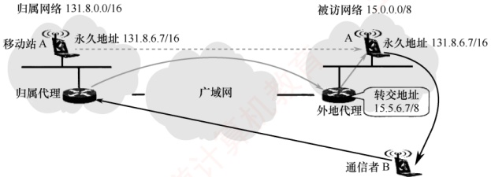

## 4.6 移动 IP

### 4.6.1 移动 IP 的概念

移动 IP 是一种允许移动主机在切换网络接入点时，仍能保持其永久 IP 地址不变的网络协议机制。其目标是：无论移动主机当前位于哪个网络，都能确保发往该站的数据分组被自动、透明地正确投递。该机制对上层应用（如 TCP 连接）完全透明，从而保障了会话的连续性。

移动 IP 定义了三种功能实体：移动节点、归属代理和外地代理。

1）移动节点。拥有永久IP地址、可在不同网络间移动的主机。

2）归属代理（也称本地代理）。连接在归属网络（初始接入的网络）上的路由器，负责截获并转发发往移动节点的数据。

3）外地代理。连接在被访网络（当前接入的网络）上的路由器，协助移动节点接收数据。

值得注意的是，若用户将笔记本电脑关机后从家中移至办公室，并通过 DHCP 自动获取新的 IP 地址重新接入网络。尽管设备的物理位置和接入网络发生了变化，但由于其 IP 地址已改变，因此不属于移动 IP 的范畴。然而，若需在移动过程中维持 TCP 传输，则要确保该 TCP 连接在漫游期间持续有效；否则，TCP 连接将因地址变化而中断。由此可见，实现移动中 TCP 连接中断的关键，在于保持移动节点的 IP 地址不变——这正是移动 IP 所要研究的问题。

### 4.6.2 移动 IP 通信过程

要类比移动 IP 通信的原理，可借助一个生活化的例子：过去大学毕业离校时，尚不确定未来的工作地点及通信地址，但仍希望与同学保持联系。解决方法很简单——彼此交换家庭地址（永久地址）。日后，若想联系某位同学，只需将信件寄往其家庭地址，再由其家人代为转交即可。

在移动 IP 中，每个移动站都有一个初始 IP 地址称为永久地址（或归属地址），移动站初始所在的网络称为归属网络。永久地址和归属网络的关联是固定不变的。在图 4.26 中，移动站 A 的永久地址是 131.8.6.7/16，其归属网络是 131.8.0.0/16。归属网络中的归属代理通常是连接到该网络上的路由器，负责截获发往移动站的分组，并将其转发至移动站当前所在的位置。

移动站离开归属网络后，所接入的外地网络也称被访网络。在图4.26中，当移动站A漫游到被访网络15.0.0.0/8，被访网络中的代理称为外地代理，它通常是连接在被访网络上的路由器。外地代理有两个重要功能：①为移动站分配一个临时的转交地址（站A的转交地址为15.5.6.7/8），该地址属于被访网络，用于标识移动站的当前位置。②将此转交地址及时通知给其归属代理，以便后者建立从归属网络到当前位置的转发路径。

图 4.26 移动 IP 的基本通信过程

注意两点：转交地址仅用于移动站、归属代理和外地代理之间的通信，应用程序不会使用该地址。外地代理向被访网络中的移动站发送IP分组时，直接通过其MAC地址进行链路层交付。

在图 4.26 中，当通信者 B 希望与移动站 A 通信时，B 无须知晓 A 的当前位置，只需将 A 的永久地址作为发送的 IP 分组的目的地址即可。移动 IP 的基本通信流程如下：

1）本地通信。移动站 A 位于其归属网络时，按传统的 TCP/IP 方式直接通信。

2）漫游与注册。当移动站 A 漫游到被访网络时，先向该网络中的外地代理登记，并获得一个临时的转交地址。随后外地代理将该转交地址注册至 A 的归属代理，完成位置更新。

3）移动站接收数据（B→A）。归属代理截获所有发往移动站 A 的 IP_分组后，构建一条通往转交地址的 IP 隧道，将原始分组封装在新的 IP 包中，并通过该隧道转发至外地代理。外地代理收到后，解封装并还原出原始分组，并直接交付给 A。

4）移动站发送数据（A→B）。移动站 A 在被访网络向外发送 IP 分组时，仍使用其永久地址作为源地址。此时，可直接通过被访网络的外地代理转发，而无须通过归属代理。

5）移动与返回。移动站 A 再次漫游至另一被访网络时，新外地代理会将其新的转交地址注册给 A 的归属代理。无论 A 如何移动，所有发往 A 的 IP 分组均由归属代理统一截获并转发。A 返回归属网络后，向归属代理注销转交地址，恢复本地直连通信。

为支持移动 IP 机制，网络层需增加一些新功能：①移动站到外地代理的登记协议；②外地代理到归属代理的注册协议；③归属代理的隧道封装协议；④外地代理的隧道拆封协议。
