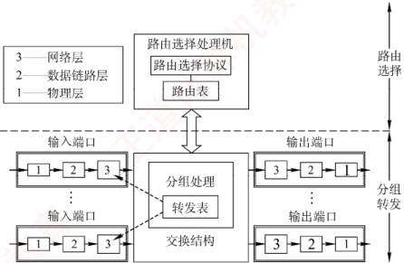
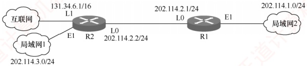

## 4.7 网络层设备

### 4.7.1 冲突域和广播域

### 考点追踪 网络设备对冲突域和广播域的影响（2010、2020）

这里的“域”表示冲突或广播在其中发生并传播的区域。

#### 1. 冲突域

冲突域是指连接到同一物理介质上的所有节点的集合，这些节点之间存在介质争用的现象。在OSI参考模型中，冲突域属于第1层（物理层）的概念。第1层设备（如集线器、中继器）仅复制和转发信号，不能划分冲突域，其所有端口属于同一个冲突域。第2层设备（如网桥、交换机）和第3层设备（如路由器）均可划分冲突域。

#### 2. 广播域

广播域是指能够接收同一广播帧的所有节点的集合。也就是说，该集合中任一节点发送广播帧，其他能收到该帧的节点均属于此广播域。在OSI参考模型中，广播域属于第2层（数据链路层）的概念。第1层设备（如集线器）和第2层设备（如交换机）所连接的节点通常处于同一个广播域。路由器作为第3层设备，可以划分广播域，即连接不同的广播域。

通常所说的局域网（LAN）在逻辑上等同于一个广播域。路由器用于连接不同的 LAN，即分隔不同的广播域。

### 4.7.2 路由器的组成和功能

### 考点追踪 路由器的功能（2010）

路由器是一种具有多个输入/输出端口的专用计算机，其任务是互连不同的网络（异构网络）并转发分组。在多个逻辑网络（多个广播域）互连时必须使用路由器，可用于连接不同的LAN，不同的VLAN，不同的WAN，或实现LAN与WAN的互连。

从结构上看，路由器由路由选择（控制平面）和分组转发（数据平面）两部分构成，如图4.27所示。而从模型角度看，路由器是工作在网络层的设备，其转发决策基于IP地址；为完成此功能，其端口还要具备物理层和数据链路层的处理能力。

路由选择部分的核心是路由选择处理机，其任务是根据所选路由选择协议（如 RIP、OSPF）构建路由表，并周期性地与相邻路由器交换路由信息，以更新和维护路由表。

图 4.27 路由器体系结构

分组转发部分由三部分组成：交换结构、一组输入端口和一组输出端口。

交换结构是路由器内部连接输入与输出端口的高速通路，负责根据转发表将输入端口的分组快速转发至合适的输出端口。交换结构本身就是一个“在路由器中的网络”。

路由器的每个端口都包含物理层、数据链路层和网络层的处理模块。输入端口在物理层接收比特流，在数据链路层提取帧并剥离帧头和帧尾后，将分组送入网络层的处理模块。若收到的分组为普通数据分组，则根据目的IP地址查找转发表，经交换结构送至相应的输出端口。若为路由协议分组（如RIP、OSPF报文），则交由路由选择处理机处理。

路由器在端口处设有缓冲区，用于暂存待处理或待发送的分组，并可进行差错检测。若分组到达速率超过处理能力，则缓冲区可能溢出，导致后续分组被丢弃。需要说明的是，路由器的物理端口通常兼具输入和输出功能，图4.27中将输入/输出端口分开绘制，仅为方便理解。

### 4.7.3 路由表与分组转发

### 考点追踪 路由聚合与路由表构造（2009、2013）

路由表是根据路由选择算法得出的，主要用于路由选择。根据历年统考真题可知，标准的路由表通常包含四个字段：目的网络IP地址、子网掩码、下一跳IP地址、接口。在图4.28所示的网络拓扑中，R1的路由表如表4.7所示，其中包含一条指向互联网的默认路由。

图 4.28 一个简单的网络拓扑

### 考点追踪 路由表分组转发匹配过程（2014）

表4.7 R1 的路由表

| 目的网络 IP 地址 | 子网掩码 | 下一跳 IP 地址 | 接 口 |
| --- | --- | --- | --- |
| 202.114.1.0 | 255.255.255.0 | 直连 | E1 |
| 202.114.2.0 | 255.255.255.0 | 直连 | L0 |
| 202.114.3.0 | 255.255.255.0 | 202.114.2.2 | L0 |
| 0.0.0.0 | 0.0.0.0 | 202.114.2.2 | L0 |

转发表由路由表得出，其表项与路由表项有直接的对应关系。但两者的设计目标不同：路由表应使路由计算优化，便于动态更新和拓扑变化处理；转发表应使高速查找优化，用于实际的数据转发过程。转发表通常包含目的网络前缀和对应的下一跳信息。转发表中可配置一条默认路由，当目的地址无法匹配任何明确表项时，分组将按默认路由转发。在实现方式上，路由表通常由软件维护；而转发表既可用软件实现，又可通过专用硬件。

注意转发和路由选择的区别：“转发”是单个路由器根据转发表，将收到的IP数据报从合适端口送出的过程，属于数据平面操作；而“路由选择”是多个路由器协同工作，通过路由协议交换拓扑信息，运行路由算法动态生成路由表的过程，属于控制平面操作。
