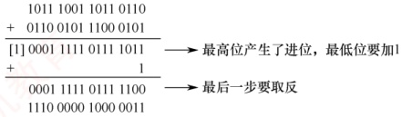

### 5.2.3 本节习题精选

#### 一、 单项选择题

##### 01

使用 UDP 的网络应用，其数据传输的可靠性由（）协议负责。

A. 传输层 B. 应用层 C. 数据链路层 D. 网络层

##### 02

下列关于 UDP 的描述中，错误的是（）。

A. UDP 报头主要包括端口号、长度、检验和等字段

B. UDP 长度字段是 UDP 数据报的长度，包括伪首部的长度

C. UDP 检验和对伪首部、UDP 报文头及应用层数据进行检验

D. 伪首部包括 IP 分组报头的一部分

##### 03

UDP 数据报首部不包含（）。

A. UDP 源端口号

B. UDP 检验和

C. UDP 目的端口号

D. UDP 数据报首部长度

##### 04

UDP 数据报中的长度字段（）。

A. 不记录数据的长度

B. 只记录首部的长度

C. 只记录数据部分的长度

D. 包括首部和数据部分的长度

##### 05

UDP 数据报比 IP 数据报多提供了（）服务。

A. 流量控制 B. 拥塞控制 C. 端口功能 D. 路由转发

##### 06

下列关于 UDP 的描述，正确的是（）。
A. 给出数据的按序投递

B. 不允许多路复用

C. 拥有流量控制机制

D. 是无连接的

##### 07

接收方收到有差错的 UDP 数据报时的处理方式是（）。

A. 丢弃 B. 请求重传 C. 差错校正 D. 忽略差错

##### 08

下列关于 UDP 检验和的说法中，错误的是（）。

A. 计算检验和时需按 2B 对齐，若数据部分不足，则需用一个全 0B 填充

B. 若 UDP 检验和计算结果为 0，则在检验和字段填充 0

C. UDP 检验和字段的计算包括一个伪首部、UDP 首部和携带的用户数据

D. UDP 检验和的计算方法是二进制反码运算求和再取反

##### 09

下列关于 UDP 检验的描述中，错误的是（）。

A. UDP 检验和字段是可选的，若源主机不想计算检验和，则应置其为全 0

B. 在计算检验和的过程中，需要生成一个伪首部，源主机需要把该伪首部发送给目的主机

C. 检验出 UDP 数据报出错时，可以丢弃或交付给上层

D. UDP 检验和还能检验 IP 数据报的源 IP 地址和目的 IP 地址

##### 10

下列网络应用中，不适合使用 UDP 的是（）。

A. 客户/服务器领域

B. 远程调用

C. 实时多媒体应用

D. 远程登录

##### 11

一个 UDP 数据报的数据字段长度为 9192B，如在数据链路层要采用以太网来传送，则应当将其划分为 IP 数据报片的片数是（）。

A. 6 B. 7 C. 8 D. 9

##### 12

某应用层数据大小为 200B，传输层使用 UDP，网际层使用 IP（采用最大首部长度），使用以太网进行传输（不考虑前导码和 VLAN），则该应用层数据的传输效率是（）。

A. 82.6%

B. 77.5%

C. 69.9%

D. 67.1%

##### 13

在进行跨网络的 IP 通信时，不考虑 NAT，传输层使用 UDP 进行封装，数据链路层采用以太网 MAC 帧进行封装，则下列字段中一定保持不变的是（）。

I. UDP 总长度          II. UDP 检验和          III. FCS 帧检验序列

IV. 目的 MAC 地址       V. 目的 IP 地址       VI. IP 检验和

A. V           B. I、II、V       C. IV、VI       D. III、IV、V

##### 14

【2014 统考真题】下列关于 UDP 的叙述中，正确的是（）。

I. 提供无连接服务 II. 提供复用/分用服务 III. 通过差错检验，保障可靠数据传输

A. 仅 I

B. 仅 I、II

C. 仅 II、III

D. I、II、III

##### 15

【2018 统考真题】UDP 实现分用时所依据的首部字段是（）。

A. 源端口号 B. 目的端口号 C. 长度 D. 检验和

##### 16

【2024 统考真题】UDP 在计算检验和的过程中，计算得到中间结果为 1011 1001 1011 0110 时，还需要加上最后一个 16 位数 0110 0101 1100 0101，最终计算得到的检验和是（）。

A. 0001 1111 0111 1011

B. 0001 1111 0111 1100

C. 1110 0000 1000 0011

D. 1110 0000 1000 0100

##### 17

【2025 统考真题】假设路由器实现 NAT 功能，内网中主机 H 的 IP 地址为 192.168.1.5/24。若 H 运行某应用向 Internet 发送了一个 UDP 报文段，则路由器在转发封装该 UDP 报文段的 IP 数据报的过程中，UDP 报文段的首部字段会被修改的是（）。

I. 源端口号

II. 目的端口号

III. 总长度

IV. 检验和
A. 仅Ⅰ、Ⅲ B. 仅Ⅰ、Ⅳ C. 仅Ⅱ、Ⅲ D. 仅Ⅱ、Ⅳ

#### 二、 综合应用题

##### 01

为什么要使用 UDP? 让用户进程直接发送原始的 IP 分组不就足够了吗?

##### 02

使用 TCP 对实时语音数据的传输是否有问题？使用 UDP 传送数据文件时有什么问题？

##### 03

一个应用程序用 UDP，到了 IP 层将数据报再划分为 4 个数据报片发送出去。结果前两个数据报片丢失，后两个到达目的站。过了一段时间应用程序重传 UDP，而 IP 层仍然划分为 4 个数据报片来传送。结果这次前两个到达目的站而后两个丢失。试问：在目的站能否将这两次传输的 4 个数据报片组装成为完整的数据报？假定目的站第一次收到的后两个数据片仍然保存在目的站的缓存中。

##### 04

一个UDP首部的信息（十六进制表示）为0xF7210045002CE827。UDP数据报的格式如下图所示。试问：

| 16位源端口号 | 16位目的端口号 | 8B |
| --- | --- | --- |
| 16位UDP长度 | 16位UDP检验和 |   |
| 数据（如果有） |   |   |

1）源端口、目的端口、数据报总长度、数据部分长度分别是什么？

2）该 UDP 数据报是从客户发送给服务器还是从服务器发送给客户？使用该 UDP 服务的程序使用的是哪个应用层协议？

##### 05

一个UDP用户数据报的数据字段为8192B，要使用以太网来传送。假定IP数据报无选项。试问应当划分为几个IP数据报片？说明每个IP数据报片的数据字段长度和片段偏移字段的值。

### 5.2.4 答案与解析

#### 一、 单项选择题

##### 01

B

UDP 在网络层的 IP 基础之上增加了复用分用和有限的差错控制，IP 的特点是尽最大努力交付。UDP 在传送数据时没有流量控制机制，也没有确认机制，是一个不可靠的传输层协议。若网络应用使用 UDP 传输数据，则必须在传输层的上层即应用层提供可靠性的工作。

##### 02

B

伪首部只是在计算检验和时临时添加的，不计入 UDP 的长度。对于选项 D，伪首部包括源 IP 和目的 IP，这是 IP 分组报头的一部分。

##### 03

D

UDP 数据报的格式包括 UDP 源端口号、UDP 目的端口号、UDP 报文长度和检验和，但不包括 UDP 数据报首部长度。因为 UDP 数据报首部长度是固定的 8B，所以没有必要再设置首部长度字段。

##### 04

D

长度字段记录 UDP 数据报的长度（包括首部和数据部分），以字节为单位。

##### 05

C

虽然 UDP 和 IP 都是数据报协议，但是它们之间还是存在差别。其中，最大的差别是 IP 数据
报只能找到目的主机而无法找到目的进程，UDP提供端口功能及复用和分用功能，可以将数据报投递给对应的进程。

##### 06

D

UDP 是不可靠的，所以没有数据的按序投递，排除选项 A；UDP 只在 IP 层的数据报服务上增加了很少的一点功能，即复用和分用功能及差错检测功能，排除选项 B；显然 UDP 没有流量控制，排除选项 C；UDP 是传输层的无连接协议，答案为选项 D。

##### 07

A

接收端通过检验发现数据有差错，就直接丢弃该数据报，仅此而已。

##### 08

B

UDP 检验和不是必需的，若不使用检验和，则将检验和字段设置为 0。而若检验和的计算结果恰好为 0，则将检验和字段置为全 1（这个结论了解即可）。

##### 09

B

UDP 数据报的伪首部包含了 IP 地址信息，目的是通过数据检验保证 UDP 数据报正确到达目的主机。伪首部是临时添加的，只是为了计算检验和，既不向下传送，又不向上递交。若检验出 UDP 数据报出错，则可以丢弃，也可以交付给上层，但是需要告诉上层这是错误的数据报。

##### 10

D

UDP 的特点是开销小，时间性能好且易于实现。在客户/服务器模型中，它们之间的请求报文都很短，使用 UDP 不但编码简单，而且只需要很少的消息。远程调用使用 UDP 的理由和客户/服务器模型的类似。对于实时多媒体应用，需要保证数据及时传送，而比例不大的错误是可以容忍的，所以使用 UDP 也是合适的，而且使用 UDP 可以实现多播，为多个客户端服务。而远程登录需要依靠一个客户端到服务器的可靠连接，必须保证数据传输的安全性，使用 UDP 是不合适的。

##### 11

B

UDP 数据字段长度为 9192B，UDP 首部长度为 8B，共 9200B。每个 IP 数据报片的最大长度为 1500B，减去 IP 首部 20B，剩下 1480B 用来存放 UDP 数据报。因此需要将 UDP 数据报划分为「9200/1480」=7 个 IP 数据报片。每个 IP 数据报片的数据字段长度为 1480B，除了最后一个为 320B。每个 IP 数据报片的偏移字段的值依次为 0, 185, 370, 555, 740, 925, 1110。

##### 12

C

以太网 MAC 帧首部和尾部为 18B，网际层 IP 首部为 60B（采用最大首部长度），传输层 UDP 首部为 8B，所以该应用层数据的传输效率为  $200 \div (200 + 18 + 60 + 8) = 69.9\%$。

##### 13

B

UDP 总长度等于应用层数据加 UDP 首部长度，传输过程中保持不变。UDP 检验和覆盖伪首部（含源/目的 IP）、UDP 首部及数据内容；由于中间节点不修改这些字段，检验和无须更新。FCS 是以太网帧的校验码，每经过一跳都需要重新封装帧，因此必须重新计算。MAC 地址是链路层地址，路由器转发时会将其更新为下一跳的 MAC 地址。路由器依据目的 IP 地址转发分组，不改变 IP 地址，但每转发一次会将 TTL 减 1，并重新计算 IP 首部检验和。

##### 14

B

UDP 提供无连接服务（说法 I 正确），并在发送/接收时通过端口号实现复用与分用功能（说法 II 正确）。虽然 UDP 首部包含检验和字段用于差错检测，但其仅能发现传输错误并丢弃出错报文，不具备重传、确认等机制，无法保障可靠数据传输，可靠性需由应用层实现。因此，说法 III 错误。

##### 15

B

传输层的分用是指接收方根据报文首部信息将数据交付给正确的应用进程。UDP使用目的端
口号标识目标进程，是分用的关键依据。源端口号主要用于回信，非分用所必需；长度和检验和字段不参与进程寻址。

##### 16

C

UDP 检验和的计算方法是二进制反码求和再取反，二进制反码求和的运算规则：①从低位到高位逐列进行加法运算，0 和 0 相加得 0，0 和 1 相加得 1，1 和 1 相加得 0 并产生进位 1；②若最高位相加后产生进位，则将该进位加到结果的最低位，该过程也称回卷。计算过程如下：

##### 17

B

NAT 在转发内网主机 H 的 UDP 报文时，会修改 IP 数据报的源 IP 地址和 UDP 首部的源端口号（I 被修改），而目的端口号（II）保持不变。UDP 首部中的总长度（III）仅由 UDP 数据自身决定，未发生变化。但由于 UDP 检验和（IV）的计算包含伪首部（含源 IP 地址），当源 IP 被 NAT 替换后，必须重新计算检验和，因此 IV 被修改。综上，仅 I 和 IV 被修改。

#### 二、 综合应用题

##### 01

【解答】

仅仅使用 IP 分组还不够。IP 分组包含 IP 地址，该地址指定一个目的机器。一旦这样的分组到达目的机器，网络控制程序如何知道把它交给哪个进程呢？UDP 分组包含一个目的端口，这一信息是必需的，因为有了它，分组才能被投递给正确的进程。此外，UDP 可以对数据报做包括数据段在内的差错检测，而 IP 只对其首部做差错检测。

##### 02

【解答】

TCP 需要建立连接和维护状态，提供了确认、重传、拥塞控制等机制，虽然保证了传输的可靠性，但也增加了网络延迟和开销，还会导致报文的失序、重复等现象，影响实时语音数据的实时性、连贯性和清晰度。实时音频/视频传输，不宜重传，可容忍少量数据的丢失或出错，但不允许有太大的时延，因此适合使用 UDP。UDP 不需要建立连接，没有重传机制，不保证可靠交付，因此不适合可靠性要求高的应用，在传送数据文件时可能会丢失数据。对于可靠性要求高但实时性要求低的应用，如文件传输、电子邮件等，适合使用 TCP。

##### 03

【解答】

不行。重传时，IP 数据报的标识字段会有另一个标识符。仅当标识符相同的 IP 数据报片才能组装成一个 IP 数据报。前两个 IP 数据报片的标识符与后两个 IP 数据报片的标识符不同，因此不能组装成一个 IP 数据报。

##### 04

【解答】

1）第1、2个字节为源端口，即F721，转换成十进制数为63265。第3、4个字节为目的端口，即0045，转换成十进制数为69。第5、6个字节为UDP长度（包含首部和数据部分），即002C，转换成十进制数为44，数据报总长度为44B，数据部分长度为44-8=36B。

2）由1）可知，该UDP数据报的源端口号为63265，目的端口号为69，前一个为客户端使用的端口号，后一个为熟知的TFTP的端口，可知该数据报是客户发给服务器的。

##### 05

【解答】
以太网帧的数据段的最大长度是 1500B，UDP 用户数据报的首部是 8B。假定 IP 数据报无选项，首部长度都是 20B。IP 数据报的片段偏移指一个片段在原 IP 分组中的相对位置，偏移的单位是 8B。UDP 用户数据报的数据字段为 8192B，加上 8B 的首部，总长度是 8200B。应当划分为 6 个 IP 报片。各 IP 报片总长度、数据长度和片偏移如下表所示。

| IP 报片 | 1 | 2 | 3 | 4 | 5 | 6 |
| --- | --- | --- | --- | --- | --- | --- |
| 总长度 | 1500B | 1500B | 1500B | 1500B | 1500B | 820B |
| 数据长度 | 1480B | 1480B | 1480B | 1480B | 1480B | 800B |
| 片偏移 | 0 | 185 | 370 | 555 | 740 | 925 |

