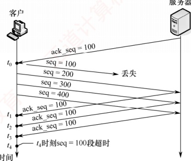
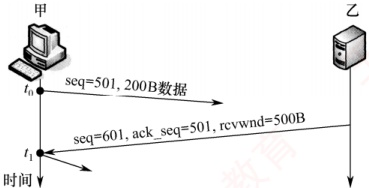
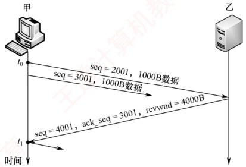
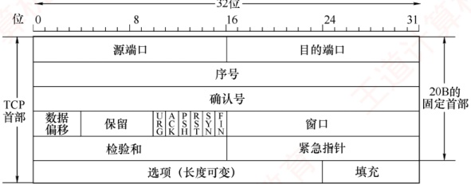
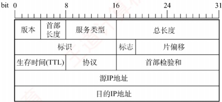
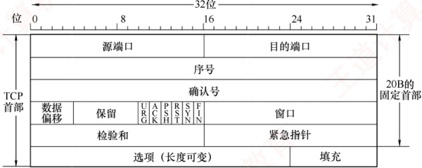
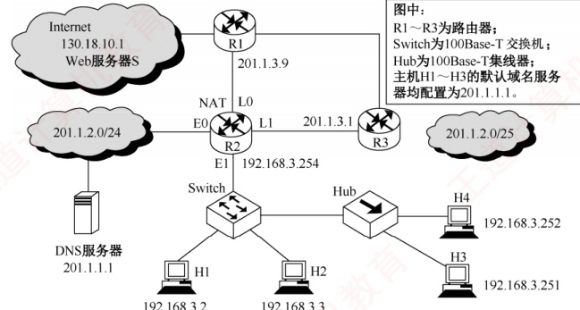

### 5.3.7 本节习题精选

#### 一、 单项选择题

##### 01

下列关于传输层协议的面向连接服务的描述中，错误的是（）。

A. 面向连接的服务需要经历 3 个阶段：连接建立、数据传输及连接释放

B. 当链路不发生错误时，面向连接的服务可以保证数据到达的顺序是正确的

C. 面向连接的服务有很高的效率和时间性能

D. 面向连接的服务提供了一个可靠的数据流

##### 02

TCP 规定 HTTP() 进程的端口号为 80。

A. 客户 B. 解析 C. 服务器 D. 主机

##### 03

下列关于 TCP 的端口的叙述中，错误的是（）。

A. 客户端使用的端口号是动态规定的 B. 端口号长度为 16 位

C. 端口号用于在通信中识别进程 D. 局域网内的计算机不能使用

##### 04

下列几种描述中，（）不是 TCP 服务的特点。

A. 字节流 B. 全双工 C. 可靠 D. 支持广播

##### 05

下列几种描述中，（）不是 TCP 的特性。

A. 比 UDP 开销大

B. 强制重传错误分组

C. 在 TCP 首部中有目标主机 IP 地址

D. 把消息分成段并在目标主机中进行重

##### 06

下列几种字段中，包含在 TCP 首部中而不包含在 UDP 首部中的是（）。

A. 目的端口号

B. 序号

C. 检验和

D. 目的 IP 地址

##### 07

下列关于 TCP 报头格式的描述中，错误的是（）。

A. 报头长度为 20~60B，其中固定部分为 20B

B. 端口号字段依次表示源端口号与目的端口号

C. 报头长度总是4的倍数个字节
D. TCP 检验和伪首部中 IP 分组头的协议字段为 17

##### 08

当 TCP 报文段标志字段中的（）为 1 时，表示必须释放连接，然后重新建立连接。

A. URG B. RST C. ACK D. FIN

##### 09

TCP 报文段首部中窗口字段的值的含义是（）。

A. 指明自己的拥塞窗口的尺寸

B. 指明对方的发送窗口的尺寸

C. 指明自己的接收窗口的尺寸

D. 指明对方的拥塞窗口的尺寸

##### 10

在采用 TCP 连接的数据传输阶段，若发送端的发送窗口值由 1000 变为 2000，则发送端在收到一个确认之前可以发送（）。

A. 2000 个 TCP 报文段

B. 2000 B

C. 1000 B

D. 1000 个 TCP 报文段

##### 11

A 和 B 建立了 TCP 连接，当 A 收到确认序号为 100 的确认报文段时，表示（）。

A. 报文段 99 已收到

B. 报文段 100 已收到

C. 末字节序号为 99 的报文段已收到

D. 末字节序号为 100 的报文段已收到

##### 12

当 TCP 在传送大量数据时，是以（）的大小将数据进行分割发送的，进行重发时同样也是以此为单位的。

A. MSS B. 字节 C. 比特 D. MTU

##### 13

在 TCP 中，发送方的窗口大小取决于（）。

A. 仅接收方允许的窗口

B. 接收方允许的窗口和发送方允许的窗口

C. 接收方允许的窗口和拥塞窗口

D. 发送方允许的窗口和拥塞窗口

##### 14

TCP 利用滑动窗口来实现流量控制，只要发送方收到对方的零窗口通知，就启动（）计时器。若计时器超时，则发送一个零窗口探测报文段，以试图获得对方的窗口值。

A. 重传 B. 保活 C. 时间等待 D. 持续

##### 15

TCP 在 40Gb/s 的线路上传送数据，若 TCP 充分利用了线路的带宽，则经过（）后，TCP 会发生序号绕回（使用了之前用过的字节序号，已知  $2^{32}/5\times10^{9}=0.859$）。

A. 859ms B. 85.9ms C. 8.59ms D. 0.859ms

##### 16

下列关于 TCP 窗口与拥塞控制概念的描述中，错误的是（）。

A. 接收窗口（rwnd）通过 TCP 首部中的窗口字段通知数据的发送方

B. 发送窗口确定的依据是：发送窗口 = min[接收端窗口，拥塞窗口]

C. 拥塞窗口是接收端根据网络拥塞情况确定的窗口值

D. 拥塞窗口大小在开始时可以按指数规律增长

##### 17

下列关于 TCP 工作原理与过程的描述中，错误的是（）。

A. TCP 连接建立过程需要经过 “三次握手” 的过程

B. TCP 传输连接建立后，客户端与服务器端的应用进程进行全双工的字节流传输

C. TCP 传输连接的释放过程很复杂，只有客户端可以主动提出释放连接的请求

D. TCP 连接的释放需要经过 “四次挥手” 的过程

##### 18

TCP 使用三次握手协议来建立连接，设 A、B 双方发送报文的初始序号分别为 X 和 Y，A 发送（①）的报文给 B，B 接收到报文后发送（②）的报文给 A，然后 A 发送一个确
认报文给 B 便建立了连接（注意，ACK 的下标为消带的序号）。

①A. SYN=1，序号=X B. SYN=1，序号=X+1， $ACK_{X}=1$

C. SYN=1，序号=Y D. SYN=1，序号=Y， $ACK_{Y+1}=1$

②A. SYN=1，序号=X+1 B. SYN=1，序号=X+1， $ACK_{X}=1$

C. SYN=1，序号=Y， $ACK_{X+1}=1$ D. SYN=1，序号=Y， $ACK_{Y+1}=1$

##### 19

TCP “三次握手” 过程中，第二次 “握手” 时，发送的报文段中（）标志位被置为 1。

A. SYN B. ACK C. ACK 和 RST D. SYN 和 ACK

##### 20

TCP 采用三报文握手建立连接，其中第三个报文是（）。

A. TCP 连接请求

B. 对 TCP 连接请求的确认

C. 对 TCP 连接请求确认的确认

D. TCP 普通数据

##### 21

主机 A 和 B 之间建立了一个 TCP 连接，A 向 B 发送的第一个 SYN 报文段中的序号值（seq）等于 211，数据传输结束在释放连接时，A 向 B 发送的第 4 次挥手报文段的 seq 等于 985，则在本次通信过程中，A 向 B 总共发送了（ ）字节的数据。

A. 771 B. 772 C. 773 D. 774

##### 22

A 和 B 之间建立了 TCP 连接，A 向 B 发送了一个报文段，其中序号字段 seq=200，确认序号字段 ack=201，数据部分有 2B，那么在 B 对该报文的确认报文段中（）。

A. seq=202, ack=200

B. seq=201, ack=201

C. seq=201, ack=202

D. seq=202, ack=201

##### 23

TCP 的通信双方，有一方发送了带有 FIN 标志的数据段后，表示（）。

A. 将断开通信双方的 TCP 连接

B. 单方面释放连接，表示本方已经无数据发送，但可以接收对方的数据

C. 中止数据发送，双方都不能发送数据

D. 连接被重新建立

##### 24

某客户与服务器建立 TCP 连接，当连接断开时，客户先向服务器发送一个标志 FIN = 1 的报文段 A，此报文段中 seq 值为 x，ack 值为 y。一段时间后，客户收到了服务器发来的一个标志 FIN = 1 的报文段 B，则下列关于报文段 B 的说法中，正确的是（）。

A. B 中的 seq 值一定为 y

B. B 中的 seq 值一定为  $y+1$

C. B 中的 ack 值一定为 x

D. B 中的 ack 值一定为  $x+1$

##### 25

某应用程序每秒产生一个60B的数据块，每个数据块被封装在一个TCP报文中，然后封装在一个IP数据报中，则最后每个数据报所包含的应用数据所占的百分比是（）。（注意：TCP报文和IP数据报文的首部没有附加字段。）

A. 20% B. 40% C. 60% D. 80%

##### 26

假设 TCP 客户与 TCP 服务器的通信已结束，端到端的往返时间为 RTT。t 时刻 TCP 客户请求断开连接，则从 t 时刻起 TCP 服务器释放该连接的最短时间是（）。

A. 0.5RTT B. 1RTT C. 1.5RTT D. 2RTT

##### 27

甲发起与乙的 TCP 连接，甲选择的初始序号为 200，若甲和乙建立连接过程中最后一个报文段不携带数据，则 TCP 连接建立后，甲给乙发送的数据报文段的序号为（）。

A. 203 B. 202 C. 201 D. 200

##### 28

A发起与B的TCP连接，A选择的初始序号为1666，连接建立过程中未发送任何数据，TCP连接建立后，A给B发送了1000B数据，B正确接收后发送给A的确认序号是()。
A. 1667 B. 2666 C. 2667 D. 2668

##### 29

一个 TCP 连接的数据传输阶段，若发送端的发送窗口值由 2000 变为 3000，则意味着发送端可以（）。

A. 在收到一个确认之前可以发送 3000 个 TCP 报文段

B. 在收到一个确认之前可以发送 1000B

C. 在收到一个确认之前可以发送 3000B

D. 在收到一个确认之前可以发送 2000 个 TCP 报文段

##### 30

甲和乙建立了 TCP 连接，甲向乙发送了 3 个连续的 TCP 段，分别包含 200B、300B、400B 的有效载荷，第 3 个段的序号为 1000。若乙仅正确接收到第 1 个和第 3 个段，则乙发送给甲的确认序号是（）。

A. 500 B. 600 C. 700 D. 800

##### 31

在一个 TCP 连接中，MSS 为 1KB，当拥塞窗口为 34KB 时发生了超时事件。若在接下来的 4RTT 内报文段传输都是成功的，则当这些报文段均得到确认后，拥塞窗口的大小是（）。

A. 8KB B. 9KB C. 16KB D. 17KB

##### 32

若甲向乙发起了一条 TCP 连接，最大段长为 1KB，乙每收到一个数据段都会发出一个接收窗口为 10KB 的确认段，若甲在 t 时刻发生超时，此时拥塞窗口为 16KB。则从 t 时刻起，在不再发生超时的情况下，经过 10RTT 后，甲的发送窗口的大小为（）。

A. 10KB B. 12KB C. 14KB D. 15KB

##### 33

设 TCP 的拥塞窗口的慢开始门限值初始为 8（单位为报文段），当拥塞窗口上升到 12 时发生超时，TCP 开始慢开始和拥塞避免，则第 13 次传输时拥塞窗口的大小为（）。

A. 4 B. 6 C. 7 D. 8

##### 34

甲和乙刚建立 TCP 连接，并约定最大段长为 2KB，假设乙总是及时清空缓存，保证接收窗口始终为 20KB，ssthresh 为 16KB，若双向传输时间为 10ms，发送时延忽略不计，且没有发生拥塞的情况，则经过（），甲的发送窗口第一次达到 20KB。

A. 40ms B. 50ms C. 60ms D. 70ms

##### 35

假设一个 TCP 连接的传输过程在慢开始阶段，在 rtTT 时刻到  $(t+1)$RTT 时刻之间发送了 k 个数据段，假设仍然保持在慢开始阶段，预期在  $(t+1)$RTT 时刻到  $(t+2)$RTT 时刻之间将发送（ ）个数据段（假设接收方有足够的缓存）。

A. k B.  $k+1$ C.  $2^{k}$ D. 2k

##### 36

下列关于 TCP 的拥塞控制机制的描述中，错误的是（）。

A. TCP 刚建立连接进入慢开始阶段

B. 慢开始阶段拥塞窗口指数级增加

C. 超时发生时，新门限值（慢开始和拥塞避免阶段的分界点）等于旧门限值的一半

D. 拥塞避免阶段拥塞窗口线性增加

##### 37

在一个 TCP 连接中，MSS 为 1KB，当拥塞窗口为 34KB 时收到了 3 个冗余 ACK 报文。若在接下来的 4RTT 内报文段传输都是成功的，则当这些报文段均得到确认后，拥塞窗口的大小是（）。

A. 8KB B. 16KB C. 20KB D. 21KB

##### 38

A 和 B 建立 TCP 连接，MSS 为 1KB。某时，慢开始门限值为 2KB，A 的拥塞窗口为 4KB，在接下来的 1RTT 内，A 向 B 发送了 4KB 的数据（TCP 的数据部分），并
且得到了 B 的确认，确认报文中的窗口字段的值为 2KB。在下一个 RTT 中，A 最多能向 B 发送（）数据。

A. 2KB B. 8KB C. 5KB D. 4KB

##### 39

假设在没有发生拥塞的情况下，在一条往返时延 RTT 为 10ms 的线路上采用慢开始控制策略。若接收窗口的大小为 24KB，最大报文段 MSS 为 2KB，则发送方能发送出第一个完全窗口（也就是发送窗口达到 24KB）需要的时间是（）。

A. 30ms B. 40ms C. 50ms D. 60ms

##### 40

甲向乙发起一个 TCP 连接，最大段长 MSS = 1KB，RTT = 3ms，乙的接收缓存为 16KB，且乙的接收缓存仅有数据存入而无数据取出，则甲从连接建立成功至发送窗口达到 8KB，需经过的最小时间以及此时乙的接收缓存的可用空间分别为（）。

A. 3ms, 15KB B. 9ms, 9KB C. 6ms, 13KB D. 12ms, 8KB

##### 41

【2009 统考真题】主机甲与主机乙之间已建立一个 TCP 连接，主机甲向主机乙发送了两个连续的 TCP 段，分别包含 300B 和 500B 的有效载荷，第一个段的序号为 200，主机乙正确接收到这两个数据段后，发送给主机甲的确认序号是（）。

A. 500 B. 700 C. 800 D. 1000

##### 42

【2009 统考真题】一个 TCP 连接总以 1KB 的最大段长发送 TCP 段，发送方有足够多的数据要发送，当拥塞窗口为 16KB 时发生了超时，若接下来的 4RTT 时间内的 TCP 段的传输都是成功的，则当第 4 个 RTT 时间内发送的所有 TCP 段都得到肯定应答时，拥塞窗口大小是（）。

A. 7KB B. 8KB C. 9KB D. 16KB

##### 43

【2010 统考真题】主机甲和主机乙之间已建立一个 TCP 连接，TCP 最大段长为 1000B。若主机甲的当前拥塞窗口为 4000B，在主机甲向主机乙连续发送两个最大段后，成功收到主机乙发送的第一个段的确认段，确认段中通告的接收窗口大小为 2000B，则此时主机甲还可以向主机乙发送的最大字节数是（）。

A. 1000 B. 2000 C. 3000 D. 4000

##### 44

【2011 统考真题】主机甲向主机乙发送一个（SYN=1，seq=11220）的 TCP 段，期望与主机乙建立 TCP 连接，若主机乙接受该连接请求，则主机乙向主机甲发送的正确的 TCP 段可能是（）。

A. （SYN=0，ACK=0，seq=11221，ack=11221）

B. （SYN=1，ACK=1，seq=11220，ack=11220）

C. （SYN=1，ACK=1，seq=11221，ack=11221）

D. （SYN=0，ACK=0，seq=11220，ack=11220）

##### 45

【2011 统考真题】主机甲与主机乙之间已建立一个 TCP 连接，主机甲向主机乙发送了 3 个连续的 TCP 段，分别包含 300B、400B 和 500B 的有效载荷，第 3 个段的序号为 900。若主机乙仅正确接收到第 1 个段和第 3 个段，则主机乙发送给主机甲的确认序号是（）。

A. 300 B. 500 C. 1200 D. 1400

##### 46

【2013 统考真题】主机甲与主机乙之间已建立一个 TCP 连接，双方持续有数据传输，且数据无差错与丢失。若甲收到一个来自乙的 TCP 段，该段的序号为 1913、确认序号为 2046、有效载荷为 100B，则甲立即发送给乙的 TCP 段的序号和确认序号分别是（）。

A. 2046、2012 B. 2046、2013 C. 2047、2012 D. 2047、2013
##### 47

【2014 统考真题】主机甲和乙建立了 TCP 连接，甲始终以 MSS=1KB 大小的段发送数据，并一直有数据发送；乙每收到一个数据段都会发出一个接收窗口为 10KB 的确认段。若甲在 t 时刻发生超时的时候拥塞窗口为 8KB，则从 t 时刻起，不再发生超时的情况下，经过 10RTT 后，甲的发送窗口的大小为（）。

A. 10KB B. 12KB C. 14KB D. 15KB

##### 48

【2015 统考真题】主机甲和主机乙新建一个 TCP 连接，甲的拥塞控制初始阈值为 32KB，甲始终向乙以 MSS=1KB 大小的段发送数据，并一直有数据发送；乙为该连接分配 16KB 接收缓存，并对每个数据段进行确认，忽略段传输延迟。若乙收到的数据全部存入缓存，不被取走，则甲从连接建立成功时刻起，未出现发送超时的情况下，经过 4RTT 后，甲的发送窗口是（）。

A. 1KB

B. 8KB

C. 16KB

D. 32KB

##### 49

【2017 统考真题】若甲向乙发起一个 TCP 连接，最大段长 MSS = 1KB，RTT = 5ms，乙开辟的接收缓存为 64KB，则甲从连接建立成功至发送窗口达到 32KB，需经过的时间至少是（）。

A. 25ms B. 30ms C. 160ms D. 165ms

##### 50

【2019 统考真题】某客户通过一个 TCP 连接向服务器发送数据的部分过程如下图所示。客户在  $t_{0}$ 时刻第一次收到确认序号 ack_seq=100 的段，并发送序号 seq=100 的段，但发生丢失。若 TCP 支持快速重传，则客户重新发送 seq=100 段的时刻是（）。

A.  $t_{1}$ B.  $t_{2}$ C.  $t_{3}$ D.  $t_{4}$



##### 51

【2019 统考真题】若主机甲主动发起一个与主机乙的 TCP 连接，甲、乙选择的初始序号分别为 2018 和 2046，则第三次握手 TCP 段的确认序号是（）。

A. 2018 B. 2019 C. 2046 D. 2047

##### 52

【2020 统考真题】若主机甲与主机乙已建立一条 TCP 连接，最大段长（MSS）为 1KB，往返时间（RTT）为 2ms，则在不出现拥塞的前提下，拥塞窗口从 8KB 增长到 32KB 所需的最长时间是（）。

A. 4ms B. 8ms C. 24ms D. 48ms

##### 53

【2020 统考真题】若主机甲与主机乙建立 TCP 连接时，发送的 SYN 段中的序号为 1000，在断开连接时，主机甲发送给主机乙的 FIN 段中的序号为 5001，则在无任何重传的情
况下，甲向乙已经发送的应用层数据的字节数为（）。

A. 4002 B. 4001 C. 4000 D. 3999

##### 54

【2021 统考真题】若客户首先向服务器发送 FIN 段请求断开 TCP 连接，则当客户收到服务器发送的 FIN 段并向服务器发送 ACK 段后，客户的 TCP 状态转换为（）。
```c

A. CLOSE_WAIT B. TIME_WAIT C. FIN_WAIT_1 D. FIN_WAIT_2
```

##### 55

【2021 统考真题】若大小为 12B 的应用层数据分别通过 1 个 UDP 数据报和 1 个 TCP 段传输，则该 UDP 数据报和 TCP 段实现的有效载荷（应用层数据）最大传输效率分别是（）。

A. 37.5%, 16.7%

B. 37.5%, 37.5%

C. 60.0%, 16.7%

D. 60.0%, 37.5%

##### 56

【2021 统考真题】设主机甲通过 TCP 向主机乙发送数据，部分过程如下图所示。甲在  $t_0$ 时刻发送一个序号 seq = 501、封装 200B 数据的段，在  $t_1$ 时刻收到乙发送的序号 seq = 601、确认序号 ack_seq = 501、接收窗口 rcvwnd = 500B 的段，则甲在未收到新的确认段之前，可以继续向乙发送的数据序号范围是（）。



A. 501~1000

B. 601~1100

C. 701~1000

D. 801~1100

##### 57

【2022 统考真题】假设主机甲和主机乙已建立一个 TCP 连接，最大段长 MSS=1KB，甲一直向乙发送数据，当甲的拥塞窗口为 16KB 时，计时器发生了超时，则甲的拥塞窗口再次增长到 16KB 所需要的时间至少是（）。

A. 4 RTT B. 5 RTT C. 11 RTT D. 16 RTT

##### 58

【2022 统考真题】假设客户 C 和服务器 S 已建立一个 TCP 连接，通信往返时间 RTT = 50ms，最长报文段寿命 MSL = 800ms，数据传输结束后，C 主动请求断开连接。若从 C 主动向 S 发出 FIN 段时刻算起，则 C 和 S 进入 CLOSED 状态所需的时间至少分别是（）。

A. 850 ms, 50 ms

B. 1650 ms, 50 ms

C. 850 ms, 75 ms

D. 1650 ms, 75 ms

##### 59

【2024 统考真题】假设主机 H 通过 TCP 向服务器发送长度为 3000B 的报文，往返时间 RTT = 10ms，最长报文段寿命 MSL = 30s，最大报文段长度 MSS = 1000B，忽略 TCP 段的传输时延，报文传输结束后 H 首先请求断开连接，则从 H 请求建立 TCP 连接时刻起，到 H 进入 CLOSED 状态为止，所需的时间至少是（）。

A. 30.03s B. 30.04s C. 60.03s D. 60.04s

##### 60

【2025 统考真题】主机甲通过 TCP 向主机乙发送数据的部分过程如下图所示，seq 为序号，ack_seq 为确认序号，rcv_wnd 为接收窗口。甲在  $t_0$ 时刻的拥塞窗口和发送窗口均为 2000B，拥塞控制阈值为 8000B，MSS = 1000B，甲始终以 MSS 发送 TCP 段。若甲在  $t_1$ 时刻收到如图所示的确认段，则甲在未收到新的确认段之前，还可继续向乙发送的 TCP 段数是（ ）。



A. 2 B. 3 C. 4 D. 5

##### 61

【2025 统考真题】Time 是一个提供时间查询服务的 C/S 架构网络应用，支持客户通过 UDP 或 TCP 向 Time 服务器请求时间服务。若某客户与某 Time 服务器通信的往返时间 RTT = 8ms，则该客户分别通过 UDP 和 TCP 向该服务器请求服务，所需的最少时间分别是（）。

A. 8ms, 8ms

B. 8ms, 16ms

C. 16ms, 8ms

D. 16ms, 16ms

#### 二、 综合应用题

##### 01

在使用 TCP 传输数据时，若有一个确认报文段丢失，则也不一定会引起与该确认报文段对应的数据的重传。试说明理由。

##### 02

若收到的报文段无差错，只是报文段失序，则 TCP 对此未做明确规定，而是让 TCP 的实现者自行确定。试讨论两种可能的方法的优劣：

1）将失序报文段丢弃。

2）先将失序报文段暂存于接收缓存内，待所缺序号的报文段收齐后再一起上交应用层。

##### 03

一个 TCP 连接要发送 3200B 的数据。第一个字节的编号为 10010。若前两个报文段各携带 1000B 的数据，最后一个报文段携带剩下的数据，写出每个报文段的序号。

##### 04

设 TCP 发送窗口的最大尺寸为 64KB，网络的平均往返时间为 20ms，问 TCP 所能得到的最大数据传输速率是多少？（只考虑单向传输，且假设信道带宽不受限）

##### 05

在一个 TCP 连接中，信道带宽为 100Mb/s，单个报文大小为 1000B，发送窗口固定为 60，端到端时延为 20ms。TCP 最多能达到的平均数据传输速率是多少？信道利用率是多少？（只考虑单向传输，确认报文的发送时延、各层协议的首部开销均忽略不计。）

##### 06

主机 A 基于 TCP 向主机 B 连续发送 3 个 TCP 报文段。第一个报文段的序号为 90，第二个报文段的序号为 120，第三个报文段的序号为 150。

1）第一、二个报文段中有多少数据？

2）假设第二个报文段丢失而其他两个报文段到达主机B，在主机B发往主机A的确认报文中，确认序号应是多少？

##### 07

考虑在一条 TCP 连接上采用慢开始拥塞控制而不发生网络拥塞的情况下，接收窗口为 24KB，RTT 为 10ms，最大段长为 2KB，则需要多长时间才能发送第一个完全窗口？

##### 08

设 TCP 拥塞窗口的慢开始门限值初始为 12MSS，当拥塞窗口达到 16 时出现超时，再次进入慢开始阶段，则从此时起恢复到超时的拥塞窗口大小，需要多少个往返时延？

##### 09

假定 TCP 报文段载荷是 1500B，最大分组存活时间是 120s，要使得 TCP 报文段的序号不会循环回来而重叠，线路允许的最快速度是多大？（不考虑帧长限制）

##### 10

一个 TCP 连接使用 256kb/s 的链路，其端到端时延为 128ms。经测试发现吞吐率只有
128kb/s。问窗口是多少？忽略PDU封装的协议开销及接收方应答分组的发送时间（假定应答分组长度很小）。

##### 11

假定 TCP 最大报文段的长度是 1KB，拥塞窗口被置为 18KB，并且发生了超时事件。若接着的 4 次迸发量传输都是成功的，则该窗口将是多大？

##### 12

一个TCP首部的数据信息（十六进制表示）为0x0D280015505FA906000000070024000C0290000。TCP首部的格式如下图所示。请回答：

1）源端口号和目的端口号各是多少？

2）发送的序号是多少？确认序号是多少？

3）TCP 首部的长度是多少？

4）这是一个使用什么协议的 TCP 连接？该 TCP 连接的状态是什么？



##### 13

【2012 统考真题】主机 H 通过快速以太网连接 Internet，IP 地址为 192.168.0.8，服务器的 IP 地址为 211.68.71.80。H 与 S 使用 TCP 通信时，在 H 上捕获的其中 5 个 IP 分组如表 1 所示。

表1

| 编 号 | IP 分组的前 40B 内容（十六进制） |   |   |   |   |
| --- | --- | --- | --- | --- | --- |
| 1 | 45 00 00 30 | 01 9b 40 00 | 80 06 1d e8 | c0 a8 00 08 | d3 44 47 50 |
| 0b d9 13 88 | 84 6b 41 c5 | 00 00 00 00 | 70 02 43 80 | 5d b0 00 00 |   |
| 2 | 45 00 00 30 | 00 00 40 00 | 31 06 6e 83 | d3 44 47 50 | c0 a8 00 08 |
| 13 88 0b d9 | e0 59 9f ef | 84 6b 41 c6 | 70 12 16 d0 | 37 e1 00 00 |   |
| 3 | 45 00 00 28 | 01 9c 40 00 | 80 06 1d ef | c0 a8 00 08 | d3 44 47 50 |
| 0b d9 13 88 | 84 6b 41 c6 | e0 59 9f f0 | 50 10 43 80 | 2b 32 00 00 |   |
| 4 | 45 00 00 38 | 01 9d 40 00 | 80 06 1d de | c0 a8 00 08 | d3 44 47 50 |
| 0b d9 13 88 | 84 6b 41 c6 | e0 59 9f f0 | 50 18 43 80 | e6 55 00 00 |   |
| 5 | 45 00 00 28 | 68 11 40 00 | 31 06 06 7a | d3 44 47 50 | c0 a8 00 08 |
| 13 88 0b d9 | e0 59 9f f0 | 84 6b 41 d6 | 50 10 16 d0 | 57 d2 00 00 |   |

回答下列问题：

1）表1中的IP分组中，哪几个是由H发送的？哪几个完成了TCP连接建立过程？哪几个在通过快速以太网传输时进行了填充？

2）根据表1中的IP分组，分析S已经收到的应用层数据字节数是多少。

3）若表1中的某个IP分组在S发出时的前40B如表2所示，则该IP分组到达H时经过了多少个路由器？

表2

| 来自S的分组 | 45 00 00 28 | 68 11 40 00 | 40 06 ec ad | d3 44 47 50 | ca 76 01 06 |
| --- | --- | --- | --- | --- | --- |
| 13 88 a1 08 | e0 59 9f f0 | 84 6b 41 d6 | 50 10 16 d0 | b7 d6 00 00 |   |

IP 分组头结构和 TCP 段头结构分别如图 1 和图 2 所示。



图 1 IP 分组头结构



图2 TCP 段头结构

##### 14

【2016 统考真题】假设下图中的 H3 访问 Web 服务器 S 时，S 为新建的 TCP 连接分配了 20KB（K = 1024）的接收缓存，最大段长 MSS = 1KB，平均往返时间 RTT = 200ms。H3 建立连接时的初始序号为 100，且持续以 MSS 大小的段向 S 发送数据，拥塞窗口初始阈值为 32KB；S 对收到的每个段进行确认，并通告新的接收窗口。假定 TCP 连接建立完成后，S 端的 TCP 接收缓存仅有数据存入而无数据取出。请回答下列问题：



1）在 TCP 连接建立过程中，H3 收到的 S 发送过来的第二次握手 TCP 段的 SYN 和 ACK 标志位的值分别是多少？确认序号是多少？
```c

2）H_{3}收到的第8个确认段所通告的接收窗口是多少？此时H_{3}的拥塞窗口变为多少？
```
H_{3} 的发送窗口变为多少?
```c

3）H_{3} 的发送窗口等于 0 时，下一个待发送的数据段序号是多少？H_{3} 从发送第 1 个数据段到发送窗口等于 0 时刻为止，平均数据传输速率是多少？（忽略段的传输时延。）
```

4）若 H3 与 S 之间的通信已经结束，在 t 时刻 H3 请求断开该连接，则从 t 时刻起，S 释放该连接的最短时间是多少？

### 5.3.8 答案与解析

#### 一、 单项选择题

##### 01

C

因为面向连接的服务需要建立连接，且需要保证数据的有序性和正确性，所以它比无连接的服务开销大，而速度和效率方面也要比无连接的服务差一些。

##### 02

C

TCP 中端口号 80 标识 Web 服务器端的 HTTP 进程，客户端访问 Web 服务器的 HTTP 进程的端口号由客户端的操作系统动态分配。因此答案为选项 C。

##### 03

D

客户端使用的端口号仅在客户进程运行时才动态地选择。应用进程通过端口号进行标识，端口号长度为16位。不同计算机的相同端口号是没有联系的，因此选项D错误。

##### 04

D

TCP 提供的是一对一全双工可靠的字节流服务，所以 TCP 并不支持广播。

##### 05

C

在 TCP 首部中没有目标主机 IP 地址，这是 IP 首部的字段。TCP 采用确认机制，并对错误或超时的分组进行重传，以保证数据的可靠性。TCP 会根据网络的最大传输单元 MTU 和最大报文段长度 MSS 将消息分成适当大小的段（参考本章疑难点），并在目标主机中进行重组。

##### 06

B

TCP 报文段和 UDP 数据报都包含源端口、目的端口、检验号。因为 UDP 提供不可靠的传输服务，不需要对报文编号，所以不会有序号字段，而 TCP 提供可靠的传输服务，因此需要设置序号字段。目的 IP 地址属于 IP 数据报中的内容。

##### 07

D

TCP 伪首部与 UDP 伪首部一样，包括 IP 分组首部的一部分。IP 首部中有一个协议字段，用于指明上层协议是 TCP 还是 UDP。17 代表 UDP，6 代表 TCP，所以选项 D 错误。对于选项 A，因为数据偏移字段的单位是 4B，所以当偏移取最大值时 TCP 首部长度为  $15 \times 4 = 60$B。由于使用填充，所以长度总是 4B 的倍数，选项 C 正确。

##### 08

B

URG 是紧急位，其为 1 时表示报文段中有紧急数据，需要尽快发送。RST 是复位位，其为 1 时表示出现严重错误，必须释放连接，然后重新建立连接。ACK 是确认位，其为 1 时表示确认序号（ack）字段有效。FIN 为终止位，其为 1 时代表发送方请求释放单向连接，此时并没有完全释放连接，只有当接收方发送完数据并同样将 FIN 位置为 1 时才会释放连接。

##### 09

C

TCP 报文段首部中窗口字段的值指的是自己接收窗口的尺寸。
##### 10

B

TCP 使用滑动窗口机制来进行流量控制。在 ACK 应答信息中，TCP 在接收端用 ACK 加上接收方允许接收数据范围的最大值回送给发送方，发送方把这个最大值当作发送窗口值，表明发送端在未收到确认之前可以发送的最大字节数，即 2000B。

##### 11

C

TCP 的确认序号是指明接收方下一次希望收到的报文段的数据部分第一个字节的编号，可以看出，前一个已收到的报文段的最后一个字节的编号为 99，所以选项 C 正确。报文段的序号是其数据部分第一个字节的编号。选项 A、B 不正确，因为有可能已收到的这个报文段的数据部分不止一个字节，则报文段的编号就不为 99，但可以说编号为 99 的字节已收到。

##### 12

A

两端主机在发出建立 TCP 连接的请求时，会在 TCP 首部写入 MSS（最大报文段长度）选项，告诉对方自己的接口能够适应的 MSS 的大小，然后在二者之间选择一个较小的值投入使用，此后 TCP 将以 MSS 的大小对数据进行分割发送。MSS 是在三次握手时计算得出的。

##### 13

C

TCP 让每个发送方仅发送正确数量的数据，保持网络资源被利用但又不会过载。为了避免网络拥塞和接收方缓冲区溢出，TCP 发送方在任意时刻可以发送的最大数据流是接收方允许的窗口和拥塞窗口中的最小值。

##### 14

D

TCP 为每个连接设有一个持续计时器，只要发送方收到对方的零窗口通知，就启动持续计时器。若计时器超时，则发送一个零窗口探测报文段，而对方就在确认这个探测报文段时给出现在的窗口值。若窗口值仍然为零，则发送方收到确认报文段后就重新设置持续计时器。

##### 15

A

在 40Gb/s 的线路上传送数据，每秒可传送  $5 \times 10^9$ B 的数据，TCP 的序号字段有 32 位，共有  $2^{32}$ 个不同的序号，则可发送的时间是  $2^{32} / (5 \times 10^9) = 0.859$ s = 859 ms。

##### 16

C

拥塞窗口是发送端根据网络拥塞情况确定的窗口值。

##### 17

C

参与 TCP 连接的两个进程中的任何一个都能提出释放连接的请求。

##### 18

A, C

TCP 使用三次握手来建立连接，第一次握手时，A 发给 B 的 TCP 报文中应置其首部 SYN 位为 1，并选择序号 seq = X，表明传送数据时的第一个数据字节的序号是 X；在第二次握手中，即 B 接收到报文后，发给 A 的确认报文段中应使 SYN = 1、ACK = 1，且序号 ACK_{X+1} = 1（ACK 的下标为捎带的序号），同时告诉自己选择的序号 seq = Y。

##### 19

D

在 TCP 的 “三次握手” 中，第二次握手时，SYN 和 ACK 均被置为 1。

##### 20

C

TCP 采用三报文握手建立连接，其中第一个报文是 TCP 连接请求，第二个报文是对 TCP 连接请求的确认，第三个报文是对 TCP 连接请求确认的确认。

##### 21

B

A 向 B 发送的第一个 SYN 段虽然不携带数据，但仍会消耗一个序号 211，A 向 B 发送的第 4 次挥手报文段的 seq 等于 985，说明之前发送的数据的序号为 212～984，因为在断开连接时发送
的第一个 FIN 段会消耗一个序号，因此发送的总数据量为 984-212=772B。

##### 22

C

在 A 发向 B 的报文中，seq 表示发送的报文段中数据部分的第一个字节在 A 的发送缓存区中的编号，ack 表示 A 期望收到的下一个报文段的数据部分的第一个字节在 B 的发送缓存区中的编号。因此，同一个报文段中的 seq 和 ack 的值是没有联系的。在 B 发给 A 的报文（捎带确认）中，seq 值应和 A 发向 B 的报文中的 ack 值相同，即 201；ack 值表示 B 期望下次收到 A 发出的报文段的第一个字节的编号，应是  $200+2=202$。

##### 23

B

FIN 位用来释放一个连接，它表示本方已没有数据要传输。然而，在关闭一个连接后，对方还可以继续发送数据，所以还有可能接收到数据。

##### 24

D

客户向服务器发送 FIN 报文段 A，表示客户不再通过本连接向服务器发送数据，但服务器仍有可能继续向客户发送数据，假设服务器在发送 FIN 报文段 B 之前已向客户发送了 k 字节的数据，则报文段 B 中的 seq 值为  $y + k$，选项 A、B 错误。报文段 A 是客户通过本连接发给服务器的最后一个报文段，会消耗一个序号（注意，尽管协议未禁止 FIN 段携带数据，但主流的操作系统一般不允许其携带数据），因此报文段 B 中的 ack 值一定为  $x + 1$，选项 C 错误，选项 D 正确。

##### 25

C

本题中，一个 TCP 报文的首部长度是 20B，一个 IP 数据报的首部长度也是 20B，再加上 60B 的数据，一个 IP 数据报的总长度为 100B，可知数据占 60%。

##### 26

C

t时刻 TCP 客户请求断开连接，发出连接释放 FIN 报文段；题目问的是最短时间，所以当 TCP 服务器收到 TCP 客户发来的 FIN 报文段后不再发送数据，因此同时发出确认 ACK 报文段和连接释放 FIN 报文段，即直接跳过 CLOSE-WAIT 状态；TCP 客户收到 FIN 报文段后必须发出确认；TCP 服务器收到确认后就进入 CLOSED 状态，共经历 1.5RTT。

##### 27

C

甲选择的初始序号为200，建立TCP连接的第一个报文段不能携带数据，但要消耗一个序号。甲给乙发送的第二个报文段（第三次握手）的序号是201，该报文段可以携带数据，若不携带数据，则不消耗序号，题中该报文段不携带数据，因此下一个数据报文段的序号仍是201。

##### 28

C

A 的初始序号为 1666，建立连接的第一个报文段不携带数据，但要消耗一个序号。A 给 B 发送的第二个报文段的序号是 1667，该报文段不携带数据，因此不消耗序号。下一个数据报文段的序号仍是 1667，1000B 的序号范围是 1667～2666，所以 B 接收后发送给 A 的确认序号是 2667。

##### 29

C

TCP 提供的是可靠的字节流传输服务，使用窗口机制进行流量控制与拥塞控制。TCP 的滑动窗口机制是面向字节的，因此窗口大小的单位为字节。假设发送窗口的大小为 N，这意味着发送端可以在没有收到确认的情况下连续发送 N 字节。

##### 30

C

乙仪止确接收到第1个和第3个段，所以乙下次期望收到第2个段，乙发送给甲的确认序号即第2个段的序号。第3个段的序号为1000，则第2个段的序号为1000-300=700，所以确认序号为700。
##### 31

C

若在拥塞窗口为 34KB 时发生了超时事件，则慢开始门限值就被设定为 17KB，且 cwnd 重新设为 1KB。按照慢开始算法，第 1 个 RTT 后，cwnd=2KB，第 2 个 RTT 后，cwnd=4KB，第 3 个 RTT 后，cwnd=8KB。当第 4 个 RTT 发出去的 8 个报文段的确认都收到后，cwnd=16KB（此时还未超过慢开始门限值）。注意，题中“这些报文段均得到确认后”这句话很重要。

##### 32

A

接收窗口等于10KB。发生超时后，拥塞窗口重设为1，经过10RTT后，拥塞窗口一定大于10KB。但甲的发送窗口取拥塞窗口和接收窗口中的较小值，即10KB。

##### 33

C

在慢开始和拥塞避免算法中，拥塞窗口初始为1，窗口大小开始按指数增长。当拥塞窗口大于慢开始门限后停止慢开始算法，改用拥塞避免算法。此处慢开始的门限值初始为8，当拥塞窗口增大到8时改用拥塞避免算法，窗口大小按线性增长，每次增加1个报文段，当增加到12时，出现超时，重新设门限值为6（12的一半），拥塞窗口再重新设为1，执行慢开始算法，到门限值6时执行拥塞避免算法。因此，拥塞窗口大小的变化为1,2,4,8,9,10,11,12,1,2,4,6,7,8,9, $\cdots$，其中第13次传输时（第12个传输轮次后）拥塞窗口的大小为7。

##### 34

B

当拥塞窗口小于 ssthresh 时，拥塞窗口以指数方式增长，拥塞窗口从 2KB 到 16KB 需经过 3RTT，超过 16KB 后，每经过 1RTT，拥塞窗口加 1MSS，所以从 16KB 到 20KB 经过了 2RTT，共经过 5RTT，RTT = 10ms，故经过 50ms 后甲的发送窗口第一次为 20KB。

##### 35

D

在慢开始阶段，每收到一个对新报文段的确认，拥塞窗口就加1，因此每经过1RTT，拥塞窗口就加倍。在tRTT时刻到 $(t+1)$RTT时刻之间发送了k个数据段，因此在这个RTT后，拥塞窗口由k变为2k，所以在下一个RTT内预期将发送2k个数据段。

##### 36

C

超时发生时，新门限值通常设置为此时拥塞窗口值的一半，而不是旧门限值的一半。

##### 37

D

条件“收到了3个冗余ACK报文”说明此时应执行快恢复算法，因此慢开始门限值设为17KB，并且此时cwnd也被设为17KB，第1个RTT后，cwnd=18KB，第2个RTT后，cwnd=19KB，第3个RTT后，cwnd=20KB，第4个RTT后，发出的报文全部得到确认，cwnd再增加1KB，变为21KB。注意cwnd的增加都发生在收到确认报文后。

##### 38

A

本题中出现了拥塞窗口和接收端窗口，为了保证 B 的接收缓存不发生溢出，发送窗口应该取两者的最小值。先看拥塞窗口，由于慢开始门限值为 2KB，第 1 个 RTT 中 A 拥塞窗口为 4KB，按照拥塞避免算法，收到 B 的确认报文后，拥塞窗口增长为 5KB。再看接收端窗口，B 通过确认报文中窗口字段向 A 通知接收端窗口，则接收端窗口为 2KB。因此在下一次发送数据时，A 的发送窗口应该为 2KB，即 1RTT 内最多发送 2KB。所以选项 A 正确。

##### 39

B

按照慢开始算法，发送窗口的初始值为拥塞窗口的初始值，即 MSS 的大小 2KB，然后依次增大为 4KB、8KB、16KB，然后是接收窗口的大小 24KB，即达到第一个完全窗口。因此达到第一个完全窗口所需要的时间为 4RTT=40ms。

##### 40

B
本题要求的是最小时间，且题目未给出拥塞窗口的门限值，所以拥塞窗口一直按指数增长是最快的。拥塞窗口从 1KB 增长到 8KB 需要 3 个 RTT，即 9ms，并在第 1 个 RTT 内发送 1KB，在第 2 个 RTT 内发送 2KB，在第 3 个 RTT 内发送 4KB，累积发送  $1 + 2 + 4 = 7$KB，这时乙的接收缓存还剩  $16 - 7 = 9$KB，此时的发送窗口 = min{拥塞窗口, 接收窗口} = 8KB，所以选 B。

##### 41

D

确认序号表示接收方期望收到的下一个字节的序号。第一个段起始序号为200，包含300B数据，序号范围200～499；第二个段起始序号为500，包含500B数据，序号范围500～999。因此，乙正确接收后，期望的下一个字节序号为1000，故返回的确认序号为1000。

##### 42

C

超时发生时，将慢开始门限 ssthresh 设为当前拥塞窗口 cwnd 的一半，即 8KB，并将 cwnd 重置为 1KB。此后进入慢开始阶段：第 1 个 RTT 后 cwnd = 2KB，第 2 个 RTT 后 cwnd = 4KB，第 3 个 RTT 后 cwnd = 8KB（达到 ssthresh）。从第 4 个 RTT 开始转为拥塞避免算法，窗口线性增长，即每个 RTT 增加 1 个 MSS（1KB），因此第 4 个 RTT 结束时 cwnd = 8 + 1 = 9KB。

##### 43

A

发送窗口的大小由接收窗口和拥塞窗口中的较小值决定。主机甲的拥塞窗口为 4000B，乙确认段通告的接收窗口为 2000B，因此发送窗口 = min{4000, 2000} = 2000B。甲已连续发送两个最大段（共 2000B），但仅第一个段被确认，说明第二个段（1000B）仍处于已发送未确认状态。因此，甲已使用的窗口为 1000B，还可发送的最大字节数 = 2000 - 1000 = 1000B。

##### 44

C

在 TCP 三次握手中，当主机乙接受连接请求时，必须发送 SYN = 1 且 ACK = 1 的报文段。确认序号 ack 应为甲初始序号 seq = 11220 加 1，即 11221。乙的序号 seq 由其自行选择，与甲的序号无关，可为任意值。因此选项 C（SYN = 1, ACK = 1, seq = 11221, ack = 11221）符合要求。

##### 45

B

TCP段的序号字段表示该段数据部分第一个字节的序号。已知第3个段序号为900，则第2个段的结束序号为899，起始序号=900-400=500。主机乙仅收到第1段和第3段，未收到第2段（500～899），因此期望收到的下一个字节序号为500，即确认序号为500。

##### 46

B

乙发送给甲的 TCP 段中，序号 seq = 1913 表示其数据从字节编号 1913 开始，有效载荷为 100B，故覆盖 1913～2012；确认序号 ack = 2046 表示乙已成功接收甲发送的序号至 2045 的所有数据，期望下个字节为 2046。甲成功收到后，在立即回复的 TCP 段中，seq 设置为 2046（发送的第一个字节序号），ack 设置为 2013（期待乙发送的下一个字节序号，即  $2012 + 1 = 2013$）。

##### 47

A

t 时刻发生超时，将慢开始门限 ssthresh 设为 8KB/2 = 4KB，并将拥塞窗口 cwnd 重置为 1KB。接收窗口恒为 10KB，因此发送窗口 = min{cwnd, 10KB}。经历 10RTT 后，拥塞窗口的大小（单位为 KB）依次为 2, 4, 5, 6, 7, 8, 9, 10, 11, 12。由于接收窗口限制为 10KB，最终发送窗口为 10KB。实际上，由于发送窗口必然总小于或等于 10KB，四个选项中只有选项 A 符合条件。

##### 48

A

发送窗口 = min{接收窗口，拥塞窗口}。乙的接收缓存为 16KB 且不取走数据，因此接收窗口随接收数据递减。甲按慢开始发送：第 1RTT 发 1KB，累计 1KB；第 2RTT 发 2KB，累计 3KB；第 3RTT 发 4KB，累计 7KB；第 4RTT 发 8KB，累计 15KB。此时乙的缓存剩余 1KB，接收窗口 = 1KB。拥塞窗口此时为 16KB，故发送窗口 = min{16KB, 1KB} = 1KB。
##### 49

A

接收缓存为 64KB，远大于目标窗口 32KB，因此发送窗口由拥塞窗口决定。TCP 慢开始阶段，初始拥塞窗口 cwnd = 1KB（1MSS），每经过 1RTT，cwnd 翻倍：1KB→2KB→4KB→8KB→16KB→32KB，共需 5RTT。每个 RTT = 5ms，总时间 = 5×5ms = 25ms。

##### 50

C

TCP 快速重传机制规定：当发送方收到对同一报文段的 3 个重复确认（冗余 ACK）时，立即重传丢失段。 $t_0$ 时刻首次收到  $ack\_seq = 100$ 的确认段，不计入冗余； $t_1$、 $t_2$、 $t_3$ 连续收到三个相同的  $ack\_seq = 100$，构成 3 个重复 ACK，因此在  $t_3$ 时刻触发快速重传，重新发送 seq = 100 的段。

##### 51

D

三次握手过程: 甲发 SYN(seq = 2018); 乙回 SYN + ACK(seq = 2046, ack = 2019); 甲再发 ACK。第三次握手的确认序号应为乙的初始序号加 1，即  $2046 + 1 = 2047$。

##### 52

D

由于慢开始门限 ssthresh 可按需设置，为求拥塞窗口 cwnd 从 8KB 增长到 32KB 所需的最长时间，可将 ssthresh 设置小于或等于 8KB。即始终处于拥塞避免阶段，cwnd 从 8KB 增至 32KB，需增加 24KB，每经过一个 RTT，cwnd 加 1，故需 24 个 RTT，总时间为  $24 \times 2ms = 48ms$。

##### 53

C

TCP 规定：SYN 段虽不携带数据，但要消耗一个序号，因此数据传输阶段所用的起始序号为  $1000 + 1 = 1001$。FIN 段也要消耗一个序号，因此已发送数据的最后一个字节序号为 5001 - 1 = 5000。因此已发送应用层数据字节数为  $5000 - 1001 + 1 = 4000$ B。

##### 54

B
```c

TCP 客户主动关闭连接：发 FIN 后进入 FIN_WAIT_1 状态；收到服务器 ACK 后进入 FIN_WAIT_2 状态；收到服务器 FIN 后，客户发 ACK 后进入 TIME_WAIT 状态；经过 2MSL 时间后才进入 CLOSED 状态。因此，当客户收到服务器 FIN 并发送 ACK 后，其状态为 TIME_WAIT。
```

##### 55

D

UDP 首部固定为 8B，传输 12B 应用数据时总长度 = 12 + 8 = 20B，有效载荷传输效率 = 12/20 = 60%。TCP 首部最短为 20B，总长度 = 12 + 20 = 32B，有效载荷传输效率为 12/32 = 37.5%。

##### 56

C

甲在  $t_0$ 发送 seq = 501、200B 数据的段，覆盖 501～700。 $t_1$ 收到乙的确认段：ack_seq = 501（表示序号 501 之前已接收），rcvwpnd = 500B（表示从 501 起可接收 500B 数据）。甲已发送 200B（501～700），故在未收到新的确认前，甲还可继续发送 500–200 = 300B，对应序号 701～1000。

##### 57

C

时刻 0 发生超时，将慢开始门限值 ssthresh 设为 16KB/2 = 8KB，拥塞窗口 cwnd 重置为 1KB。执行慢开始算法：cwnd 指数增长，经过 3RTT，达到 ssthresh；随后执行拥塞避免算法：cwnd 线性增长，再经过 8RTT，达到 16KB。共需 11RTT。拥塞窗口的变化如下表所示。

| 时刻 | 0 | 1 | 2 | 3 | 4 | 5 | 6 | 7 | 8 | 9 | 10 | 11 |
| --- | --- | --- | --- | --- | --- | --- | --- | --- | --- | --- | --- | --- |
| 拥塞窗口 | 1 | 2 | 4 | 8 | 9 | 10 | 11 | 12 | 13 | 14 | 15 | 16 |

##### 58

D

题目问的是最少时间，因此当服务器 S 收到客户 C 发的 FIN 后不再传输数据，而立即返回 ACK 和 FIN。客户 C 主动关闭：C 发 FIN（0ms）→S 在 0.5RTT（25ms）收到后立即返回 ACK + FIN（因无数据待发）→C 在 1RTT（50ms）收到 S 的 ACK + FIN 后，发送 ACK 并启动 2MSL 计
时器。C 进入 CLOSED 状态至少需 50ms + 2×800ms = 1650ms。S 在收到 C 对 FIN 的 ACK 后即进入 CLOSED 状态，该 ACK 在 C 发 FIN 后 1.5RTT = 75ms 到达 S，故 S 至少需 75ms。

##### 59

D

TCP 连接建立的前两次握手耗时 1RTT。第三次握手段可携带 1000B 数据（或与数据段合并发送）。H 收到确认后，拥塞窗口增长至 2000B。因此第 3 个 RTT 内，可发送剩余 2000B 数据，至此数据传输完毕。第 4 个 RTT 开始时，H 向服务器发送 FIN 请求断开连接。题目问的是最少时间，因此服务器收到 FIN 后不再发送数据，并立即回复 ACK + FIN。第 4 个 RTT 结束时，H 收到服务器的 FIN，等待 2MSL 时间（60s）后进入 CLOSED 状态，总时间为 40ms + 60s = 60.04s。

|   | H | H |
| --- | --- | --- |
| 建立TCP连接 | 1000 | 1000 |
| ACK + 发送1000B | 1000 | 1000 |
| 发送2000B | 2000 | 2000 |
| FIN | 200 | 200 |
| ACK | 20 | 100 |
| 2MSL | 10 | 100 |
| CLOSE | 10 | 100 |

##### 60

A

甲收到确认段（ack_seq = 3001），表明序号 2001～3000 的 1000 B 数据已接收。由于当前拥塞窗口小于阈值，处于慢启动阶段，每收到一个 ACK，拥塞窗口加 1 MSS，故由 2000 B 增至 3000B。接收窗口为 4000B。因此发送窗口 = min{3000, 4000} = 3000B。此时甲已发送但尚未确认的数据为序号 3001～4000（1000 B），故可用窗口为 3000-1000 = 2000B，还可发送 2 个 TCP 段。

##### 61

B

UDP 是无连接的，客户发送请求后服务器直接返回应答，整个过程需约 1RTT，因此 UDP 的最少时间为 8ms。TCP 需先通过三次握手建立连接：客户发送 SYN，服务器回复 SYN-ACK，客户再发送 ACK（可携带应用请求）。从客户发送 SYN 起，到服务器收到请求共经历 1.5RTT，服务器响应后，再经 0.5RTT 返回客户，总计 2RTT。因此 TCP 的最少时间为 16ms。

#### 二、 综合应用题

##### 01

【解答】

这是因为发送方可能还未重传时，就收到了对更高序号的确认。例如主机 A 连续发送两个报文段（SEQ=92，DATA 共 8B）和（SEQ=100，DATA 共 20B），均正确到达主机 B。B 连续发送两个确认（ACK=100 和 ACK=120），但前一个确认在传送时丢失。例如 A 在第一个报文段（SEQ=92，DATA 共 8B）超时之前收到了对第二个报文段的确认（ACK=120），此时 A 知道，119 号和在 119 号之前的所有字节均已被 B 正确接收，因此 A 不会再重传第一个报文段。

##### 02

【解答】

第一种方法将失序报文段丢弃，会引起被丢弃报文段的重复传送，增加对网络带宽的消耗，但由于用不着将该报文段暂存，可避免对接收方缓冲区的占用。

第二种方法先将失序报文段暂存于接收缓存，待所缺序号的报文段收齐后再一起上交应用层；这样可以减少发送方的重传次数，减少对网络带宽的消耗，但增加了接收方缓冲区的开销。

##### 03

【解答】

TCP 报文段的序号是指其数据部分的第一个字节的序号。因此第一个报文段的序号是 10010，序号范围 10010～11009；第二个报文段的序号是 10010 + 1000 = 11010，序号范围 11010～12009；
第三个报文段的序号为11010+1000=12010，序号范围12010～13209。

##### 04

【解答】

最大数据传输速率表明在 1RTT 内将窗口中的字节全部发送完毕。在平均往返时间 20ms 内，发送的最大数据量为最大窗口值，即  $64 \times 1024$B，

 $$64\times1024\times8\div(20\times10^{-3})\approx26.2\mathrm{M b/s}$$

因此，所能得到的最大数据传输速率是26.2Mb/s。

##### 05

【解答】

发送方发出一个报文所需的时间 = 报文长度/信道带宽 = 1000×8÷(100×10⁶) = 0.08ms（注意单位转换）。发送方发出一个窗口的第一个报文收到该报文的确认报文所需的时间 = 0.08 + RTT = 0.08 + 2×端到端时延 = 40.08ms。发出一个窗口的所有报文所需的时间 = 60×0.08ms = 4.8ms。在40.08ms 时间内，发送方可以连续发出一个窗口的所有报文，若所有报文都正确到达接收方，则所能达到的平均数据传输速率为 1000×60×8÷(40.08×10⁻³) ≈ 11.98Mb/s。

信道利用率 = 平均数据传输速率/信道带宽（最大数据传输速率）=11.98/100=11.98%。

##### 06

【解答】

1）TCP 报文段的序号是指其数据部分的第一个字节的编号。因此第一个报文段中的数据有120-90=30B，第二个报文段中的数据有150-120=30B。

2）因为 TCP 使用累积确认策略，所以当第二个报文段丢失后，第三个报文段就成了失序报文，B 期望收到的下一个报文段是序号为 120 的报文段，所以确认序号为 120。

##### 07

【解答】

最大段长是 2KB，初始的拥塞窗口是 2KB，经过前 3 个 RTT 后拥塞窗口依次变为 4KB，8KB 和 16KB，经过第 4 个 RTT 后拥塞窗口变为 32KB（大于接收窗口 24KB），所以此时发送窗口取 24KB，即第一个完全窗口。10ms×4 = 40ms，因此需要 40ms 才能发送第一个完全窗口。

##### 08

【解答】

在慢开始和拥塞避免算法中，拥塞窗口初始为1，窗口大小开始按指数增长。当拥塞窗口大于慢开始门限后停止慢开始算法，改用拥塞避免算法。此处慢开始的门限值初始为12，当拥塞窗口增大到12时改用拥塞避免算法，窗口大小按线性增长，每次增加1个报文段，当增加到16时，出现超时，重新设门限值为8（16的一半），拥塞窗口再重新设为1，执行慢开始算法，到门限值8时执行拥塞避免算法。

这样，拥塞窗口的变化就为1，2，4，8，12，13，14，15， $\underline{16}$，1，2，4，8，9，10，11，12，13，14，15， $\underline{16}$……。可见从出现超时时拥塞窗口为16到恢复拥塞窗口大小为16，需要的往返时间次数是11。注意，发现超时时，拥塞窗口从16变为1是立即进行的，不会间隔1RTT。

##### 09

【解答】

目标在 120s 内最多发送  $2^{32}$B（序号为 32 位），即 35791394B/s 的载荷。TCP 报文段载荷是 1500B，因此可以发送 23861 个报文段。TCP 开销是 20B，IP 开销是 20B，以太网开销是 26B（18B 的首部和尾部，7B 的前同步码，1B 的帧开始定界符）。这就意味着对于 1500B 的载荷，必须发送 1566B。 $1566 \times 8 \times 23861 \approx 299$Mb/s，因此允许的最快线路速率是 299Mb/s。当比这一速度更快时，就存在同一时段内不同 TCP 报文段具有相同序号的风险。

##### 10

【解答】

来回路程的时延  $128ms \times 2 = 256ms$。设窗口值为 X（注意：单位为字节）。

假定一次最大发送量等于窗口值，且发送时间等于256ms，则每发送一次都得停下来期待再次得到下一个窗口的确认，以得到新的发送许可。这样，发送时间等于停止等待应答的时间，结
果测到的平均吞吐率就等于发送速率的一半，即128kb/s，

 $$8X{\div}(128{\times}2{\times}1000)=256{\times}0.001\quad\implies\quad X=256{\times}1000{\times}256{\times}0.001/8=256{\times}32=8192$$

所以，窗口值为8192。

##### 11

【解答】

在 TCP 的拥塞控制算法中，除使用慢开始的接收窗口和拥塞窗口外，还使用第 3 个参数，即门槛值。发生超时的时候，该门槛值被设置成当前拥塞窗口值的一半即 9KB，而拥塞窗口则重置成一个最大报文段长。然后使用慢开始的算法决定网络可以接受的进发量，一直增长到门槛为止。从这一点开始，成功的传输线性地增加拥塞窗口，即每次进发传输后只增加一个最大报文段，而不是每个报文段传输后都增加一个最大报文段的窗口值。现在由于发生了超时，下一次传输将是 1 个最大报文段，然后是 2 个、4 个和 8 个最大报文段，第四次发送成功，且门限为 9KB，所以在 4 次进发量传输后，拥塞窗口将增加为 9KB。

##### 12

【解答】

1）源端口号为第1、2个字节，即0D 28，转换为十进制数为3368。目的端口号为第3、4个字节，即00 15，转换为十进制数为21。

2）第5～8个字节为序号，即50 5F A9 06。第9～12个字节为确认序号，即00 00 00 00，也即十进制数0。

3）第13个字节的前4位为TCP首部的长度，这里的值是7（以4B为单位），因此乘以4后得到TCP首部的长度为28B，说明该TCP首部还有8B的选项数据。

4）根据目的端口是21可知这是一条FTP连接，而TCP的状态则需要分析第14个字节。第14个字节的值为02，即SYN置为1，而且ACK=0表示该数据段没有捎带的确认，这说明是第一次握手时发出的TCP连接。

##### 13

【解答】

1）由图1看出，源IP地址为IP分组头的第13～16个字节。在表1中，1、3、4号分组的源IP地址均为192.168.0.8（c0a80008H），所以1、3、4号分组是由H发送的。再观察1，3，4号分组的标识字段，分别是9b，9c，9d，标识字段是一个计数器，每产生一个数据报就加1，这也说明主机H先后发送了1，3，4号分组。

在表 1 中，1 号分组封装的 TCP 段的 SYN=1，ACK=0，seq=846b 41c5H；2 号分组封装的 TCP 段的 SYN=1，ACK=1，seq=e059 9fefH，ack=846b 41c6H；3 号分组封装的 TCP 段的 ACK=1，seq=846b 41c6H，ack=e059 9ff0H，所以 1、2、3 号分组完成了 TCP 连接的建立过程。

由于快速以太网数据帧有效载荷的最小长度为 46B，表 1 中 3、5 号分组的总长度为 40（28H）字节，小于 46B，其余分组总长度均大于 46B。所以 3、5 号分组通过快速以太网传输时需要填充。

2）由3号分组封装的TCP段可知，发送应用层数据初始序号为seq=846b41c6H，由5号分组封装的TCP段可知，ack为seq=846b41d6H，所以S已经收到的应用层数据的字节数为846b41d6H-846b41c6H=10H=16B。

3）因为 S 发出的 IP 分组的标识 = 6811H，所以该分组所对应的是表 1 中的 5 号分组。S 发出的 IP 分组的 TTL = 40H = 64，5 号分组的 TTL = 31H = 49，64 - 49 = 15，所以可以推断该 IP 分组到达 H 时经过了 15 个路由器。

##### 14

【解答】

1）第二次握手报文段的 SYN=1，ACK=1。确认序号是第一次握手报文段的序号 +1=101。
2）因为 S 的 TCP 接收缓存仅有数据存入而无数据取出，当 S 收到第 8 个段时接收缓存还剩 12KB，所以 H3 收到的第 8 个确认段所通告的接收窗口是 12KB。在慢开始阶段，每收到一个对新报文段的确认，拥塞窗口就加 1，当收到对第 8 个报文段的确认后，H3 的拥塞窗口变为 9KB。H3 的发送窗口取接收窗口和拥塞窗口的最小值，即 9KB。

3）H3 的发送窗口等于 0 时，下一个待发送段的序号是 20K + 101 = 20×1024 + 101 = 20581。

H3 从发送第 1 个段到发送窗口等于 0 时刻为止，共耗费了 5RTT（每个 RTT 传输的数据量依次为 1KB、2KB、4KB、8KB、5KB），平均数据传输速率是 20KB÷(5×200ms) = 20×1024×8b/s = 163.84kb/s。

**注意**

K 表示文件大小或描述存储空间时等于 1024，这里通常用大写的 K；k 表示传输速率或描述网络通信时等于 1000，这里通常用小写的 k。注意区分和转换。

4）t时刻H3请求断开连接，发出连接释放FIN报文段；S收到后，最短时间的情况是S已没有要发送的数据，所以同时发出确认ACK报文段和连接释放FIN报文段，即S直接跳过CLOSE-WAIT状态；H3收到FIN报文段后必须发出确认，S收到确认后进入CLOSED状态，共经历1.5RTT，因此S释放该连接的最短时间是 $1.5\times200ms=300ms$。
