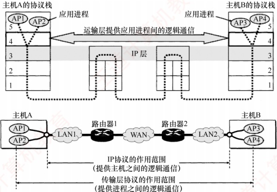

## 5.1 传输层提供的服务

### 5.1.1 传输层的功能

数据链路层提供链路上相邻节点之间的逻辑通信，网络层提供主机之间的逻辑通信。传输层位于网络层之上、应用层之下，为运行在不同主机上的进程之间提供逻辑通信 $^{①}$。传输层是面向通信部分的最高层，同时也是用户功能中的最低层。即使网络层协议不可靠（例如，导致分组丢失、失序或重复），传输层仍能为应用程序提供可靠的服务。

以图 5.1 为例说明传输层的作用。假设局域网 LAN1 上的主机 A 和局域网 LAN2 上的主机 B 通过互连的广域网 WAN 进行通信。一台主机中常有多个应用进程同时与另一台主机中的多个应用进程通信，其中 APx 表示主机中参与通信的应用进程。传输层的主要功能如下。

#### 1. 应用进程之间的逻辑通信

从网络层角度看，通信的两端是两台主机，IP 数据报首部指明了这两台主机的 IP 地址。但“主机之间的通信”的实质是主机中应用进程之间的通信，也称为端到端的逻辑通信。IP 虽能将分组送达目的主机，但该分组仅停留在主机的网络层，并未交付给具体的应用进程。而从传输层视角看，通信的真正端点并非主机，而是主机中的进程。

图 5.1 传输层为相互通信的进程提供逻辑通信

#### 2. 复用和分用

复用是指发送方的多个应用进程可使用同一个传输层协议传送数据。分用是指接收方的传输层在剥去报文首部后，能将数据正确交付给对应的目的应用进程。

**注意**

网络层也具备复用和分用的功能，但其复用是指将不同传输层协议的数据封装成IP数据报发送；分用则是指接收方网络层根据首部的协议字段，将数据交付给相应的传输层协议。

#### 3. 差错检测

传输层对收到的整个报文（包括首部和数据部分）进行差错检测。对于 TCP，若接收方发现报文段出错，则要求发送方重传。对于 UDP，若发现数据报出错，则直接丢弃。相比之下，网络层的 IP 数据报仅对其首部进行校验，不检查数据部分。

#### 4. 提供面向连接和无连接的传输服务

传输层向上层屏蔽了底层网络的复杂性（如拓扑结构、路由协议等），使应用进程感知到的是一条端到端的逻辑通信信道。该信道的特性取决于所采用的传输层协议：使用 TCP（面向连接）时，尽管底层网络仅提供“尽最大努力”的服务，逻辑信道仍表现为一条全双工的可靠信道；使用 UDP（无连接）时，逻辑信道则仍为不可靠信道。

### 5.1.2 传输层的寻址与端口

#### 1. 端口的作用

端口是传输层与应用层交互的接口：应用进程通过端口将数据向下交付给传输层；传输层则通过端口将收到的数据向上交付给正确的应用进程。发送时，应用进程将数据送至指定端口，传输层读取后封装并发送；接收时，传输层将数据送至对应端口，应用进程从中读取。TCP 和 UDP 通过首部中的源端口和目的端口两个字段，实现传输层与应用层之间的服务访问。
**注意**

数据链路层的服务访问点是帧的“类型”字段，网络层的服务访问点是IP数据报的“协议”字段，传输层的服务访问点是“端口号”字段，应用层的服务访问点是“用户界面”。

#### 2. 端口号

应用进程通过端口号标识，端口号长度为16比特，可表示65536（即 $2^{16}$）个不同的端口号。端口号仅具有本地意义，即只用于标识本机应用层中的进程；不同主机的相同端口号是没有关联的，且UDP和TCP的端口号彼此也是独立的。

根据用途，可将端口分为两类。

1）服务器端使用的端口号。又分为两类：① 熟知端口号（0～1023），由 IANA 分配给最重要的 TCP/IP 应用程序，供所有用户熟知；② 登记端口号（1024～49151），供未获熟知端口号的应用程序使用，需在 IANA 登记以避免冲突。常见熟知端口号如下：

| 应用程序 | FTP | TELNET | SMTP | DNS | TFTP | HTTP | SNMP |
| --- | --- | --- | --- | --- | --- | --- | --- |
| 熟知端口号 | 21 | 23 | 25 | 53 | 69 | 80 | 161 |

2）客户端使用的端口号（49152～65535）。此类端口号在客户进程运行时动态分配，故又称短暂端口号。服务器从客户报文中提取源端口号，并将其作为回送数据的目的端口。通信结束后，该临时端口号被系统回收，可供其他客户进程复用。

#### 3. 套接字

在网络中，通过 IP 地址区分不同的主机，通过端口号区分同一主机中的不同应用进程，将端口号与 IP 地址拼接，即构成套接字（Socket）：

 $$套接字 (Socket)=(IP 地址：端口号 )$$

套接字唯一标识网络中某台主机上的一个应用进程，是通信的端点。

在通信过程中，主机 A 发往主机 B 的报文包含目的端口和源端口。其中，源端口构成“返回地址”的一部分；当 B 回复 A 时，其报文的目的端口即为 A 原报文中的源端口。注意：同一 IP 地址可参与多个 TCP 连接，同一端口号也可出现在多个不同的 TCP 连接中。

### 5.1.3 无连接服务与面向连接服务

TCP/IP 协议族在 IP 层之上定义了两个主要的传输协议：

• TCP（传输控制协议）：面向连接，提供可靠的全双工逻辑信道。

• UDP（用户数据报协议）：无连接，提供不可靠的逻辑信道。

TCP 要求通信双方在数据传输前先建立连接，传输结束后释放连接。TCP 不提供广播或多播服务。TCP 通过确认、流量控制、计时器和连接管理等机制保障可靠传输，但代价是首部开销大、处理资源消耗高。因此，TCP 适用于对可靠性要求高的场景，如 FTP、HTTP、SMTP 等。

UDP 无须建立连接，接收方收到数据报后，也不发送确认。它在 IP 层之上仅提供两项服务：多路复用与分用、数据差错检测。由于结构简单、开销小，UDP 执行效率高、实时性好，适用于对时延敏感、可容忍少量丢包的应用，如 TFTP、DNS、DHCP 和 RIP 等。

表5.1列出了一些典型互联网应用及其对应的传输层协议。
表5.1 一些典型互联网应用及其对应的传输层协议

| 互联网应用 | TCP/IP 应用层协议 | TCP/IP 传输层协议 |
| --- | --- | --- |
| 域名解析 | 域名系统（DNS） | UDP |
| 文件传送 | 简单文件传送协议（TFTP） | UDP |
| 路由选择 | 路由信息协议（RIP） | UDP |
| IP 地址分配 | 动态主机配置协议（DHCP） | UDP |
| 网络管理 | 简单网络管理协议（SNMP） | UDP |
| 电子邮件 | 简单邮件传送协议（SMTP） | TCP |
| 远程终端接入 | 远程终端协议（TELNET） | TCP |
| 万维网 | 超文本传送协议（HTTP） | TCP |
| 文件传送 | 文件传送协议（FTP） | TCP |

**注意**

IP 数据报和 UDP 数据报的区别：IP 数据报在网络层需经路由器存储转发；而 UDP 数据报作为 IP 数据报的载荷，在网络层传输时，其内容对路由器不可见。
