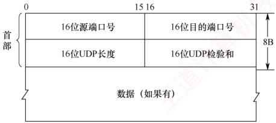
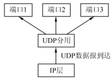
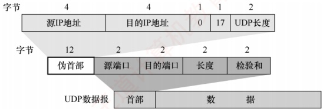

## 5.2 UDP

### 5.2.1 UDP 数据报

#### 1. UDP 概述

UDP 仅在 IP 层的数据报服务之上增加了复用、分用和差错检测的功能。若应用开发者选择 UDP 而非 TCP，则应用程序几乎直接与 IP 打交道。尽管 TCP 提供可靠服务，而 UDP 不提供，但 TCP 并非总是首选。许多应用更适合采用 UDP，主要原因如下。

### 考点追踪 UDP 协议的优点（2014、2024）

1）UDP 是无连接的，没有建立连接的时延。TCP 需要在主机中维护连接状态（包括发送和接收缓存、拥塞控制参数、序号和确认序号等），而 UDP 无须维护这些状态。

2）UDP 是面向报文的。发送方 UDP 对应用层交下的报文，在添加首部后即向下交付给 IP 层，一次发送一个完整的报文（不可分割），既不合并也不拆分，而是保留报文的边界。因此，应用程序必须选择合适大小的报文，若报文太长，则交付给 IP 层后，可能导致分片；若报文太短，则会使 IP 首部的开销占比过大。两者均会降低传输效率。相比之下，TCP 是面向字节流的，每个字节都有编号，支持自动拆分与重组，对报文长度无限制。

3）UDP的首部开销小，仅有8B；而TCP首部至少20B。

4）UDP支持一对一、一对多和多对多的通信。TCP仅支持一对一的通信。

5）UDP 没有拥塞控制，因此网络拥塞不会影响源主机的发送速率。某些实时应用要求以稳定的速率发送数据，可以容忍少量丢包，但无法接受较大的传输时延。

UDP 常用于一次性传输少量数据的应用（如 DNS、DHCP 等），因为 TCP 的连接建立、维护和释放会带来显著开销。UDP 也广泛用于多媒体应用（如视频会议、流媒体等），因为这些应用更关注低时延而非可靠性，而 TCP 的拥塞控制会引入不可接受的延迟。

UDP 不保证可靠交付，但这并不意味着应用不要求可靠性——所有可靠性机制可由应用层自行实现，开发者可根据需求灵活设计。

#### 2. UDP 的首部格式

UDP 数据报包含两部分：首部字段和数据字段。UDP 首部有 8B，由 4 个字段组成，每个字段的长度都是 2B，如图 5.2 所示。各个字段的意义如下：

### 考点追踪 → UDP 的首部格式及字段含义（2018）

1）源端口号。发送进程的端口号。需要对方回复时选用，不需要回复时可置为全0。

2）目的端口号。接收进程的端口号。该字段在所有UDP报文中都必须有效。

### 考点追踪 UDP 首部的长度（2021）

3）长度。UDP 数据报的长度（包括首部和数据），其最小值是 8（仅有首部）。

4）检验和。由发送方的传输层计算并写入，接收方的传输层检测是否有差错，有错就丢弃。在IPv4中，该字段可置为全0表示未使用（但不建议），在IPv6中则强制启用。

当传输层从 IP 层收到 UDP 数据报时，就根据首部中的目的端口，把 UDP 数据报通过相应的端口，上交给最后的终点——应用进程，如图 5.3 所示。

图 5.2 UDP 数据报格式

图 5.3 UDP 基于端口的分用

若接收方 UDP 发现收到的报文中的目的端口号不正确（不存在对应于端口号的应用进程），则丢弃该报文，并由 ICMP 发送 “端口不可达” 差错报文给发送方。

### 5.2.2 UDP 检验

### 考点追踪 UDP 检验的原理（2025）

在计算检验和时，要在UDP数据报之前增加12B的伪首部，伪首部并不是UDP的真正首部。只是在计算检验和时，临时添加在UDP数据报的前面，得到一个临时的UDP数据报。检验和就是按照这个临时的UDP数据报来计算的。伪首部既不向下传递给网络层，也不向上递交给应用层，而只是为了计算检验和。图5.4给出了UDP数据报的首部和伪首部。

图 5.4 UDP 数据报的首部和伪首部

UDP 检验和的计算方法与 IP 首部检验和基本类似。不同之处在于：IP 检验和只检验 IP 数据报的首部，而 UDP 检验和把首部和数据部分一起检验。

UDP 计算检验和的过程：在发送方，首先将检验和字段置为全 0，然后将伪首部与 UDP 数据报视为一连串 16 位字。若 UDP 数据部分的长度为奇数个字节，则在计算时末尾补一个全 0B （该填充字节仅在计算检验和时临时添加，不影响实际发送的数据内容）。随后，按二进制反码规则对所有 16 位字求和，并将结果的反码填入检验和字段后发送。在接收方，将收到的 UDP 数据报与伪首部重新组合（同样在必要时补全字节），再按二进制反码求和。若无差错，则结果应为全 1（16 位全为 1）；否则说明有差错，接收方应丢弃该 UDP 数据报。

### 考点追踪 UDP 检验和的计算（2024）

二进制反码求和的运算规则：① 从低位到高位逐列进行计算， $0+0=0$， $0+1=1$， $1+1=0$ 并产生进位1；② 若最高位相加后产生进位，则需将该进位加到结果的最低位，该过程称为回卷。以下通过一个简单示例说明，假设有以下3个16位字：

01100110 01100000

01010101 01010101

10001111 00001100
先将前两个字相加，得

01100110 01100000

01010101 01010101

10111011 10110101

再将结果与第三个字相加（最高位产生进位，需加至最低位），得

10111011 10110101

10001111 00001100

01001010 11000001

+  $\frac{1}{01001010 11000010}$ ← 进位加至最低位

最后对上述相加结果取反码，就得到检验和：

10110101 00111101

在接收方，将包括检验和在内的4个16位字相加，若结果为1111111111111111，则判定无差错；若结果中的某些位是0，则说明有差错。

**注意**

① 若 UDP 检验和检验出数据报错误， **通常应丢弃该报文**；尽管 RFC 允许将其交付上层并附带错误指示，但实际实现中极少采用。

②通过伪首部，UDP **不仅能校验源端口、目的端口**和数据内容， **还能检测IP首部中的源地址和目的地址**是否在传输过程中因错误而改变。

这种差错检验机制虽然检错能力有限，但其优势在于计算简单、处理速度快。
