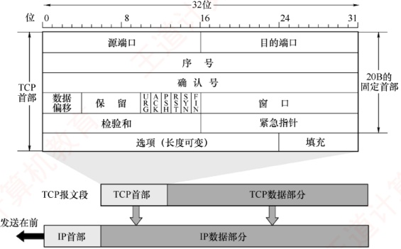
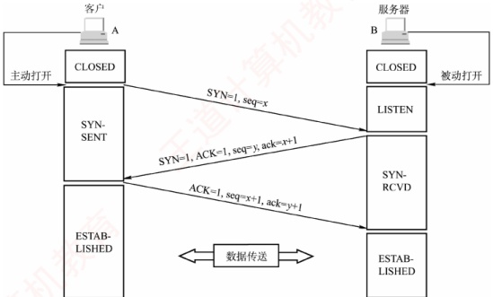
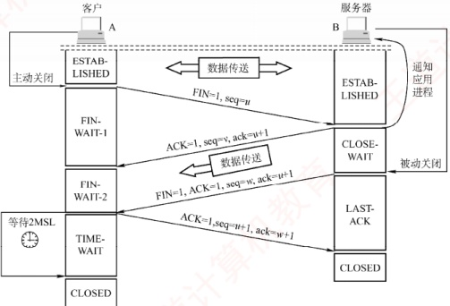
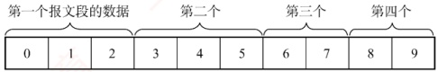
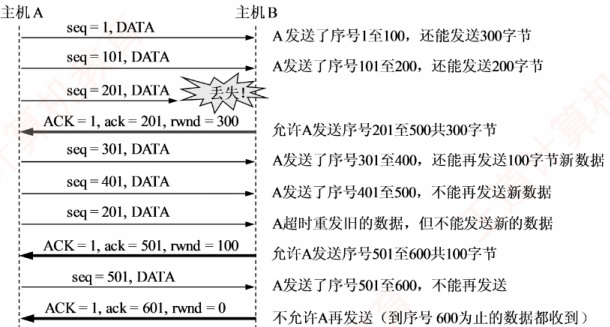
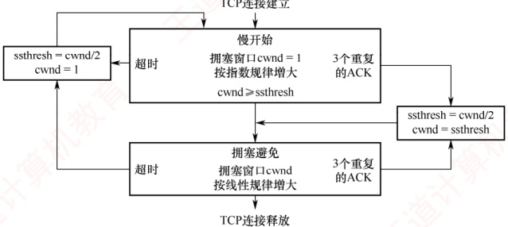

## 5.3 TCP

### 5.3.1 TCP 的特点

TCP 是在不可靠的 IP 层之上实现的可靠数据传输协议，主要解决传输过程中可能出现的分组丢失、失序、重复和差错等问题。其主要特点如下：

1）TCP 是面向连接的传输层协议，因此引入了建立连接和释放连接的开销。

2）每一条 TCP 连接只能有两个端点，且仅支持一对一通信。

3）TCP 提供可靠交付服务，保证所传数据无差错、不丢失、不重复且按序到达。

4）TCP 支持全双工通信，允许通信双方的应用进程在任何时候发送数据。为此，TCP 连接的两端均设有发送缓存和接收缓存，用来临时存放双向通信的数据。

5）TCP 是面向字节流的。尽管应用程序与 TCP 的交互是以一个个数据块（大小不等）进行的，但 TCP 将这些数据视为一连串无结构的字节流，并不保留应用层数据块的边界。

TCP 与 UDP 在发送报文的方式上存在本质区别。TCP 并不关心应用进程一次向其缓存发送多长的数据，而是根据对方通告的窗口大小和当前网络的拥塞程度，动态决定一个报文段应包含多少字节（而 UDP 报文的长度由应用进程直接指定）。若应用进程传送到 TCP 缓存的数据块过长，TCP 会将其划分为较短的数据块再传送；若数据块过短，TCP 也可暂存数据，待积累到合适长度后再封装成报文段发送。关于 TCP 报文段长度的控制机制，将在后续章节详细讨论。

### 5.3.2 TCP 报文段

TCP 传送的数据单元称为报文段。一个 TCP 报文段分为首部和数据两部分，整个 TCP 报文段作为 IP 数据报的数据部分进行封装，如图 5.5 所示。TCP 的全部功能都体现在其首部的各个字段中，因此只有弄清各个字段的作用，才能掌握 TCP 的工作原理。TCP 首部的前 20 个字节是固定的，后面有 4N 字节是根据需要而增加的选项。因此，TCP 首部的最小长度为 20B。

各个字段的意义如下：

### 考点追踪 ▶️ TCP 首部格式及字段含义（2012）

1）源端口和目的端口。各占2B。分别表示发送方和接收方所使用的端口号。

### 考点追踪 ▶️ TCP 序号与确认序号机制（2009、2016）

2）序号。占4B，范围为 $0\sim2^{32}-1$，共 $2^{32}$个序号。当序号达到 $2^{32}-1$后，下一个序号将回绕到0，即采用模 $2^{32}$运算。TCP连接中传送的字节流中的每个字节都按顺序编号，序号字段的值指明了本报文段所发送数据的第一个字节的序号。
例如，若某报文段的序号为 301，携带的数据长度为 100B，则该报文段的最后一个数据字节的序号为 400，因此下一个报文段的数据应从序号 401 开始。

图 5.5 TCP 报文段

3）确认序号。占4B，表示期望收到对方下一个报文段中第一个数据字节的序号。若确认序号为N，则表明到序号N-1为止的所有数据均已正确接收。

例如，B 正确收到了 A 发送的一个报文段，其序号为 501，数据长度为 200B（对应序号 501～700），说明 B 已完整接收到了到序号 700 为止的数据。因此，B 期望接收的下一个数据字节的序号为 701，于是在发给 A 的确认报文段中将确认序号置为 701。

### 考点追踪 TCP 首部的最小长度（2021）

4）数据偏移（首部长度）。占4位，用于指出TCP首部的长度。由于首部可能包含长度可变的选项字段，该字段用于指示TCP报文段中数据部分的起始位置距离报文段起始处的偏移量。偏移单位为4B，因此该字段的值乘以4就等于首部长度。

TCP 全部最小长度为 20B，对应数据偏移字段的最小值为 5；4 位二进制数最大可表示 15，因此 TCP 首部的最大长度为 60B（选项长度最多 40B）。

5）保留。占6位，保留为今后使用，但目前须置为0。

下面有 6 个控制位，各占 1 位，用来说明本报文段的性质。

6）紧急位 URG。当 URG=1 时，表明紧急指针字段有效，通知系统本报文段中包含紧急数据，应优先处理。紧急数据被放置在报文段数据的最前面，后续的仍为普通数据，因此需配合紧急指针字段使用。

7）确认位 ACK。仅当 ACK=1 时，确认序号字段才有效；当 ACK=0 时，确认序号无效。TCP 规定，在连接建立后，所有传送的报文段都必须将 ACK 置为 1。

8）推送位 PSH（Push）。在交互式通信中，应用进程希望输入命令后能立即收到响应。此时发送方将 PSH 置为 1，接收方收到 PSH=1 的报文段后，会立即将数据交付给应用进程，而不必等到整个缓存填满后才向上交付。

9）复位位 RST（Reset）。当 RST=1 时，表示 TCP 连接出现严重差错（如主机崩溃），必须释放连接并重新建立连接。此外，RST 也可用于拒绝非法的报文段或连接请求。

10）同步位 SYN。当 SYN=1 时， **表示这是一个连接请求或连接接受报文**。

当 SYN=1，ACK=0 时，表明这是一个连接请求报文，若对方同意建立连接，则在响应报
文中设置 SYN=1 且 ACK=1。关于连接的建立和释放，将在下一节详细讨论。

11）终止位 FIN（Finish）。用于释放连接。当 FIN=1 时，表示此报文段的发送方已无更多数据要发送，并请求释放连接。

12）窗口。占2B，范围为 $0\sim2^{16}-1$，以字节为单位，该字段由本报文段的发送方填写，表示其作为接收方时当前还能接收的最大数据量。它告诉对方（作为发送方）“从本报文段的确认序号所指示的字节序号开始，你最多可以连续发送这么多字节的数据”。例如，若确认序号为701，窗口字段值为1000，这表示发送方可以从序号701开始，连续发送最多1000B的数据（字节序号为701～1700）。

13）检验和。占2B。检验范围包括首部和数据部分。计算时需在TCP报文段前添加一个12B的伪首部（与UDP类似，只需将协议字段由17改成6，长度字段改成TCP长度）。

14）紧急指针。占2B。仅在URG=1时有效，指出本报文段中紧急数据的字节数（紧急数据位于数据部分的开头）。即使接收窗口为零，仍可发送紧急数据。

15）选项。长度可变，最长可达40B。若不使用选项，TCP首部长度即为20B。TCP最初只定义了一种选项，即最大报文段长度（Maximum Segment Size，MSS），它表示TCP报文段中数据字段的最大长度。后续又增加了窗口扩大、时间戳等选项，具体内容请参见教材。注意，与MSS类似，数据链路层的MTU指的是帧中数据部分的最大长度。

16）填充。用于确保整个首部长度为4B的整数倍，这是由于选项字段的长度是可变的。

### 5.3.3 TCP 连接管理

TCP 是面向连接的协议，因此每条 TCP 连接都包含三个阶段：连接建立、数据传送和连接释放。TCP 连接管理的目标是确保连接的建立与释放能够正常、可靠地进行。

在 TCP 连接建立过程中，需解决以下三个问题：

1）使通信双方确知对方的存在。

2）允许双方协商相关参数（如最大窗口值、是否使用窗口扩大选项、时间戳选项等）。

3）为传输实体分配必要的资源（如缓存空间、连接表项等）。

TCP 将连接作为最基本的抽象。每条 TCP 连接有两个端点，这些端点既不是主机、IP 地址，也不是应用进程或传输层端口，而是套接字（Socket）。一条 TCP 连接由通信双方的两个套接字唯一确定。需要注意的是：同一个 IP 地址可以参与多个不同的 TCP 连接，同一个端口号也可以出现在多个不同的 TCP 连接中。

TCP 连接的建立采用客户/服务器模式。主动发起连接建立的应用进程称为客户（Client），被动等待连接请求的应用进程称为服务器（Server）。

#### 1. TCP 连接的建立

连接建立需经历三个步骤，通常称为三次握手，如图5.6所示。假设主机A和B分别运行TCP 客户和服务器程序，最初两端的TCP进程均处于CLOSED（关闭）状态。在连接建立前，服务器完成一些准备工作后进入LISTEN（收听）状态，等待客户的连接请求。

第一步：客户向服务器发送连接请求报文段。该报文段的 SYN = 1，同时选择一个初始序号 seq = x。TCP 规定，SYN 报文段（SYN = 1 的报文段）不能携带数据，但仍消耗一个序号，因此客户下一次发送的报文段序号 seq = x + 1。此时，客户进入 SYN-SENT（同步已发送）状态。

第二步：服务器收到连接请求后，若同意建立连接，则向客户返回确认报文段。该报文段的 SYN = 1、ACK = 1，确认序号  $ack = x + 1$，同时选择自己的初始序号  $seq = y$。确认报文段同样不能携带数据，但也消耗一个序号。此时，服务器进入 SYN-RCVD（同步已收到）状态。

图 5.6 用 “三次握手” 建立 TCP 连接

### 考点追踪 ▶️ TCP 三次握手的字段解析（2011、2012、2016、2019、2023）

第三步：客户收到确认后，再向服务器发送最终确认。该确认报文段的 ACK = 1，确认序号 ack = y + 1，序号 seq = x + 1。此报文段可以携带数据。若不携带数据，则不消耗序号，下一个数据报文段的序号仍为 x + 1。此时，客户进入 ESTABLISHED（已建立连接）状态。

当服务器收到该最终确认后，也进入 ESTABLISHED 状态，连接正式建立。

**注意**

①仅在前两次握手的报文段中，SYN=1。TCP规定：SYN报文段不能携带数据，但仍消耗一个序号，因此下次发送的报文段序号为其SYN报文段序号加1。

②仅在第一次握手的报文段中，ACK=0，因为此时尚未收到任何报文段。

③ 第三次握手的报文段可携带数据；若不携带，则不消耗序号。

从客户发出 SYN 报文段（第一次握手的连接请求报文段）时刻起算，客户最早可在 1RTT 后开始发送数据，而服务器最早在 1.5RTT 后才能发送数据。

#### 2. TCP 连接的释放

“天下没有不散的筵席”，TCP 连接亦如此。通信双方中的任意一方均可主动终止连接。TCP 连接的释放过程通常称为四次挥手，如图 5.7 所示。

图5.7 用“四次挥手”释放TCP连接

### 考点追踪 ▶️ TCP 四次挥手的字段解析（2020、2023）

第一步：客户决定关闭连接时，向服务器发送连接释放报文段，并停止发送数据（主动关闭）。该报文段的 FIN=1，序号 seq=u，其值等于此前已发送数据的最后一个字节序号加 1。TCP 规定，FIN 报文段（FIN=1 的报文段）即使不携带数据，也消耗一个序号。此时，客户进入 FIN-WAIT-1（终止等待 1）状态。由于 TCP 是全双工的，可视为连接包含两条独立的数据通路；发送 FIN 的一端关闭了其发送方向，但对方仍可继续发送数据。

第二步：服务器收到连接释放报文段后，立即发送确认报文段。该报文段的 ACK=1，确认序号 ack=u+1，序号 seq=v（v 为服务器此前已发送数据的最后一个字节序号加 1）。随后，服务器进入 CLOSE-WAIT（关闭等待）状态。此时，从客户到服务器方向的连接已释放，但从服务器到客户方向的连接并未释放，TCP 连接处于半关闭状态。客户收到确认后，进入 FIN-WAIT-2（终止等待 2）状态，等待服务器发出的连接释放报文段。

### 考点追踪 ▶️ TCP 四次挥手状态变化（2021）

第三步：若服务器已经没有要向客户发送的数据，就向其发送连接释放报文段。该报文段的 FIN = 1、ACK = 1，序号 seq = w（w 可能大于 v，因服务器在半关闭期间可能又发送了数据），还需重复此前已发送的确认序号 ack = u + 1。此时，服务器进入 LAST-ACK（最后确认）状态。

### 考点追踪 ▶️ TCP 连接释放的时间分析（2016、2022、2024）

第四步：客户收到连接释放报文段后，必须发送最终确认，并进入 TIME-WAIT（时间等待）状态。该确认报文段的 ACK = 1，确认序号  $ack = w + 1$，序号  $seq = u + 1$。服务器收到此确认后，即进入 CLOSED（连接关闭）状态。客户在 TIME-WAIT 状态下，还需等待时间等待计时器设置的时间 2MSL（Maximum Segment Lifetime，最长报文段寿命）后，才进入 CLOSED 状态。

设置 2MSL 的主要目的是：① 确保客户发送的最后一个 ACK 报文段能够到达服务器；② 使本连接中所有可能滞留的旧报文段从网络中自然消失，避免影响新连接。

若服务器在收到客户的连接释放请求后不再发送数据，则从客户发出 FIN 报文段时刻起算，客户释放连接的最短时间为  $1RTT + 2MSL$，服务器释放连接的最短时间为 1.5RTT。

**注意**

① 仅在第一次和第三次挥手的报文段中（请求主动关闭），FIN=1。

② 后三次挥手的报文段中，ACK=1，因为每次都需要对之前收到的报文段进行确认。

③ 尽管协议并未禁止 FIN 段携带数据，但主流的操作系统一般不允许其携带数据

除时间等待计时器外，TCP 还使用一个保活计时器，以防止客户突发故障导致服务器长期无效等待。服务器每收到一次数据，就会重置该计时器；若计时器超时仍未收到数据，则每隔 75 秒发送一个探测报文段。若连续 10 次探测均无响应，则判定客户已故障，并关闭该连接。

### 5.3.4 TCP 可靠传输

TCP 在不可靠的 IP 层之上提供可靠传输服务，确保接收方从缓存中读取的字节流与发送方发出的字节流完全一致。TCP 通过检验、序号、确认和重传等机制实现这一目的。其中，TCP 的检验机制与 UDP 类似，这里不再赘述。

### 考点追踪 ▶️ TCP 序号与确认机制（2011、2012、2013、2025）

#### 1. 序号

TCP 首部的序号字段用于保证数据按序提交给应用层。TCP 将数据视为一个无结构但有序的
字节流，其序号是对字节流中的每个字节依次编号，而非对报文段整体编号。

TCP 将每个字节都编上一个序号，序号字段值指明本报文段所发送的第一个数据字节的序号。如图 5.8 所示，假设 A 和 B 之间建立了一条 TCP 连接，A 的发送缓存区中有 10B 的数据，序号从 0 开始编号。第一个报文段包含 0～2 号数据字节，则该 TCP 报文段的序号是 0；第二个报文段的序号是 3；第三个报文段的序号是 6；第四个报文段的序号是 8。

图 5.8 A 的发送缓存区中的数据划分成 TCP 段

#### 2. 确认

TCP 首部的确认序号字段表示期望收到对方下一个报文段的第一个数据字节的序号。在图5.8中，若接收方B已收到第一个和第二个报文段，此时B希望收到的下一个报文段的数据是从6号字节开始的，因此B向A发送的下一个报文段中的确认序号字段应置为6。

发送方缓存区会继续存储那些已发送但未收到确认的报文段，以便在需要时重传。TCP 默认使用累积确认，即确认按序到达的连续字节，确认序号为第一个未收到字节的序号。接收方可以在合适时机发送确认，也可以在有数据要发送时将确认信息顺便捎带上（捎带确认）。例如，在图 5.8 中，接收方 B 收到了 A 发送的第一个和第三个报文段，尚未收到第二个报文段，此时 B 仍在等待从 3 号字节开始的连续数据，因此 B 向 A 发送的下一个报文段将确认序号字段置为 3。

#### 3. 重传

有两种事件会导致 TCP 对报文段进行重传：超时和冗余 ACK。

##### （1） 超时

TCP 每发送一个报文段，就会对该报文段设置一个超时计时器。当计时器到期仍未收到确认时，TCP 将重传该报文段。

由于 TCP 下层是互联网环境，IP 数据报所选的路由变化很大，因此传输层的往返时延波动也较大。为了计算超时计时器的重传时间，TCP 采用一种自适应算法。它记录报文段发出的时间及收到相应确认的时间，两者之差称为报文段的往返时间（Round-Trip Time，RTT）。TCP 维护了一个加权平均往返时间 RTTS，并根据新测量的 RTT 样本值动态调整 RTTS。显然，超时计时器设置的超时重传时间（Retransmission Time-Out，RTO）应略大于 RTTS，但也不能大太多，否则当报文段丢失时，TCP 无法迅速重传，导致数据传输延迟增大。

##### （2） 冗余 ACK（冗余确认）

超时触发重传的一个问题是超时周期往往太长。幸运的是，发送方通常可以在超时发生之前，通过注意所谓的冗余 ACK 来较好地检测丢包情况。冗余 ACK 是再次确认某个报文段的 ACK，而发送方先前已收到过该报文段的确认。例如，发送方 A 发送了编号为 1、2、3、4、5 的 TCP 报文段，其中 2 号报文段在链路中丢失，未能到达接收方 B。因此，3、4、5 号报文段对于 B 来说成为失序报文段。TCP 规定，每当比期望序号大的失序报文段到达时，立即发送一个冗余 ACK，指明下一个期待字节的序号。在本例中，3、4、5 号报文段到达 B，但它们不是 B 期望收到的下一个报文段，于是 B 立即发送 3 个对 1 号报文段的冗余 ACK，表示自己期望接收 2 号报文段。

TCP 规定，当发送方收到对同一个报文段的 3 个冗余 ACK 时，可以认为紧跟在这个被确认报文段之后的报文段已丢失。就前面的例子而言，当 A 收到对 1 号报文段的 3 个冗余 ACK 时，它可
以判断2号报文段已经丢失，并立即对2号报文段执行重传，这种技术称为快速重传。当然，冗余ACK也被用于拥塞控制，相关内容将在后续章节讨论。

**注意**

在上述示例中，对1号报文段的正常确认不能称为冗余ACK，只有在收到失序的3、4、5号报文段后，发回的确认才被称为冗余ACK。也就是说，触发快重传时，发送方共收到4个对1号报文段的确认。

### 5.3.5 TCP 流量控制

流量控制的功能是确保发送方的发送速率不会过快，以便让接收方能够及时处理。因此，可以说流量控制是一种速度匹配服务，它匹配发送方的发送速率与接收方的读取速率。

TCP 利用滑动窗口机制来实现流量控制。滑动窗口的基本原理已在第 3 章介绍过，这里重点讨论 TCP 如何使用窗口机制进行流量控制。TCP 要求接收方维持一个接收窗口（rwnd），该窗口大小根据当前接收缓存的大小动态调整，反映了接收方的容量。接收方将此窗口值写入 TCP 首部的“窗口”字段，以通知发送方。发送方的发送窗口不能超过接收方给出的接收窗口值，从而限制发送方向网络注入报文的速率。

### 考点追踪 ▶ 基于滑动窗口的流量控制机制（2016、2021）

图 5.9 说明了如何利用滑动窗口进行流量控制。假设数据仅从 A 发往 B，而 B 仅向 A 发送确认报文段，则 B 可通过设置确认报文段首部中的窗口字段来通知 A 当前的 rwnd 值。rwnd 表示接收方允许连续接收的最大字节数。发送方 A 总是根据最新收到的 rwnd 值来限制自己发送窗口的大小，从而将未确认的数据量控制在 rwnd 大小之内，确保 A 不会使 B 的接收缓存溢出。

假设在连接建立时，B 告诉 A：“我的接收窗口 rwnd=400”。我们注意到，接收方 B 进行了三次流量控制，这三个报文段都设置了 ACK=1，只有当 ACK=1 时，确认序号字段才有意义。第一次将窗口减至 rwnd=300，第二次减至 rwnd=100，最后减至 rwnd=0，即不允许发送方再发送数据。这使得发送方暂停发送的状态将持续到 B 重新发出一个新的窗口值为止。

图5.9 利用滑动窗口进行流量控制

假设 B 向 A 发送了零窗口通知后不久，B 的接收缓存又有了一些存储空间，于是 B 向 A 发送非零窗口通知，然而这个报文段在传输过程中丢失了。若不采取其他措施，则 B 和 A 会陷入相互等待的死锁状态。为此，TCP 为每个连接设有一个持续计时器。只要发送方收到对方的零窗口
通知，就启动持续计时器。若计时器超时，则发送方发送一个零窗口探测报文段，而对方会在确认该探测报文段时给出当前的窗口值。若窗口仍然是零，则发送方收到确认报文段后重新设置持续计时器；若窗口不是零，则死锁状态就可以打破了。

传输层和数据链路层的流量控制的区别是：传输层实现的是端到端，即两个进程之间的流量控制；数据链路层实现的是相邻节点之间的流量控制。此外，数据链路层的滑动窗口协议的窗口大小一般为固定值，而传输层的窗口大小可以根据接收方的缓存情况动态变化。

### 5.3.6 TCP 拥塞控制

拥塞控制是指防止过多的数据注入网络，以保证网络中的路由器或链路不致过载。出现拥塞时，通信端点通常无法直接获知拥塞的具体细节，只能通过表现（如时延增加）间接感知。

拥塞控制与流量控制的区别：拥塞控制的目标是使网络能够承受当前的负载，是一个全局性过程，涉及所有主机、路由器及影响网络性能的各种因素。而流量控制则关注点对点通信中接收方的处理能力，是一个端到端的问题，由接收方通过窗口机制抑制发送方的发送速率，以确保自身能及时接收数据。尽管二者目标不同，但都是通过调节发送方的发送速率来实现控制效果的。

例如，某链路的传输速率为10Gb/s，当一台大型机以1Gb/s的速率向一台PC传送文件时，显然网络带宽充足，不存在拥塞问题；但由于PC的处理能力有限，可能来不及接收如此高速的数据流，因此必须进行流量控制。反之，若有100万台PC同时以1Mb/s的速率通过该链路传输文件，则问题就转变为网络总负载是否超出了其承载能力，这时需要依赖拥塞控制。

TCP 采用四种算法进行拥塞控制：慢开始、拥塞避免、快重传和快恢复。

发送方在确定数据的发送速率时，既要考虑接收方的接收能力，也要从全局角度避免引发网络拥塞。因此，除了上节介绍的接收窗口，TCP还要求发送方维护一个拥塞窗口（cwnd），其大小取决于当前网络的拥塞状况，并动态调整。其控制原则是：

若网络未出现拥塞，则适当增大 cwnd，以便把更多分组发送出去，提高网络利用率。

若检测到网络拥塞，则适当减少 cwnd，以减少注入网络的分组数量，缓解网络拥塞。通常，只要发送方未按时收到确认（发生了超时），即可认为网络出现了拥塞。

### 考点追踪 ▶️ TCP 的滑动窗口机制（2010、2014-2016、2025）

发送窗口的上限值应取接收窗口（rwnd）和拥塞窗口（cwnd）中较小的一个，即

 $$发送窗口的上限值 =min[rwnd,cwnd]$$

接收窗口的大小可通过 TCP 首部中的 “窗口” 字段由接收方通知发送方。那么，发送方如何维护拥塞窗口呢？这正是下面要介绍的慢开始和拥塞避免算法所解决的问题。为便于分析，这里假设：数据仅单向传输，接收方只发送确认报文；接收方拥有足够大的缓存空间，因此发送窗口的大小仅受拥塞窗口的限制；并且以最大报文段长度 MSS 作为拥塞窗口大小的单位。

#### 1. 慢开始和拥塞避免

##### （1） 慢开始算法

慢开始的基本思想：在连接刚建立时，发送方并不了解网络的负载情况，若立即向网络注入大量数据，可能会引发拥塞。因此，应先发送少量数据进行试探；若未发生拥塞，则逐步增大发送量，即从小到大逐渐增大拥塞窗口。

### 考点追踪 ▶ 慢开始算法的原理（2014、2015、2025）

初始拥塞窗口 cwnd 通常设为 1MSS（最新的 RFC 允许设置更多 MSS），慢开始算法规定：每收到一个对新报文段的确认，就将 cwnd 加 1。这样，每经过一个传输轮次（一个往返时延 RTT），
cwnd 就会加倍，从而随传输轮次呈指数增长。请注意：慢开始的“慢”并非指增长速度慢，而是指从较小的 cwnd（如 1）开始，谨慎试探网络状态，从而有效预防拥塞。例如，A 向 B 发送数据，初始 cwnd=1，A 发送第 1 个报文段；收到确认后，cwnd 增至 2，接着发送 2 个报文段；收到这 2 个确认后，cwnd 增至 4，下一轮便可发送 4 个报文段，依此类推。

为防止 cwnd 无限制增长，还需设置一个慢开始门限 ssthresh（阈值）。当 cwnd 增长至 ssthresh 时，停止慢开始算法，转而采用拥塞避免算法。

#### （2） 拥塞避免算法

### 考点追踪 拥塞避免算法的原理（2009、2017、2020、2022、2023）

拥塞避免的目标是让 cwnd 缓慢增长，以降低拥塞风险。其策略是：每经过一个传输轮次（收到本轮所有报文段的确认），就将 cwnd 加 1，而不是加倍，从而使 cwnd 按线性规律缓慢增长（加法增大），防止网络过早出现拥塞。这种增长速率比慢开始阶段要慢得多。

两种算法的切换规则如下：

当 cwnd < ssthresh 时，使用慢开始算法。

当 cwnd > ssthresh 时，使用拥塞避免算法。

当 cwnd = ssthresh 时，既可使用慢开始算法，又可使用拥塞避免算法（常规做法）。

#### （3） 网络拥塞的处理

无论处于慢开始阶段还是拥塞避免阶段，只要发送方判断网络出现拥塞（如发生超时），就执行以下操作：① 将慢开始门限 ssthresh 调整为当前 cwnd 的一半（但不得小于 2）；② 将 cwnd 重置为 1；③ 重新执行慢开始算法。这样做的目的是迅速减少注入网络的分组数量，使得发生拥塞的路由器有足够时间把队列中积压的分组处理完。

### 考点追踪 ▶️ TCP 拥塞控制与传输效率分析（2016、2023）

慢开始和拥塞避免算法的实现过程如图5.10所示。

| 慢开始 | 拥塞窗口cwnd | 指数规律增长 | “乘法减小”后限 | “乘法减小”后端限 | 传输轮次 |
| --- | --- | --- | --- | --- | --- |
| 0 | 2 | 2 |   |   | 2 |
| 1 | 3 | 3 |   |   | 3 |
| 2 | 4 | 4 |   |   | 4 |
| 3 | 8 | 8 |   |   | 8 |
| 4 | 16 | 16 |   |   | 16 |
| 5 | 17 | 17 |   |   | 17 |
| 6 | 18 | 18 |   |   | 18 |
| 7 | 19 | 19 |   |   | 19 |
| 8 | 20 | 20 |   |   | 20 |
| 9 | 21 | 21 |   |   | 21 |
| 10 | 22 | 22 |   |   | 22 |
| 11 | 23 | 23 |   |   | 23 |
| 12 | 24 | 24 |   |   | 24 |
| 13 | 0 | 0 |   |   | 0 |
| 14 | 2 | 2 |   |   | 2 |
| 15 | 4 | 4 |   |   | 4 |
| 16 | 8 | 8 |   |   | 8 |
| 17 | 12 | 12 |   |   | 12 |
| 18 | 14 | 14 |   |   | 14 |
| 19 | 15 | 15 |   |   | 15 |
| 20 | 16 | 16 |   |   | 16 |
| 21 | 17 | 17 |   |   | 17 |
| 22 | 18 | 18 |   |   | 18 |

图 5.10 慢开始和拥塞避免算法的实现过程

初始时，拥塞窗口设为1，即  $cw_{nd}=1$；慢开始门限设为16，即  $ssth_{resh}=16$。

### 考点追踪 ▶️ TCP 拥塞窗口演化分析（2016、2023）

在慢开始阶段，发送方每收到一个对新报文段的确认，就将 cwnd 加 1。当 cwnd 增长到 ssthresh（cwnd = 16）时，停止慢开始算法，转而采用拥塞避免算法。

当 cwnd = 24 时，若网络出现拥塞，则将 ssthresh 调整为当前 cwnd 的一半（12），同时将 cwnd 重置为 1，并重新执行慢开始算法；此后，当 cwnd 再次增长到 12 时，改为执行拥塞避免算法。
**注意**

在慢开始阶段，若  $2cwnd > ssthresh$，则下一个传输轮次后的 cwnd 应等于 ssthresh，而不是 2cwnd。例如，第 16 个轮次时 cwnd = 8、ssthresh = 12，则第 17 个轮次后 cwnd = 12，而不是 16。

在慢开始和拥塞避免算法中采用了“乘法减小”策略：当网络发生超时（通常意味着很可能出现了拥塞），将慢开始门限 ssthresh 调整为当前 cwnd 的一半，并重新进入慢开始阶段。如果网络频繁发生拥塞，ssthresh 会下降得很快，从而大幅减少注入网络的分组数量。

拥塞避免并不能完全避免拥塞。事实上，依靠上述机制彻底避免拥塞是不可能的。所谓拥塞避免，是指在该阶段将拥塞窗口按线性规律增长，从而使网络较不容易发生拥塞。

#### 2. 快重传和快恢复

有时，个别报文段因偶然原因丢失，但网络并未真正拥塞。若发送方等待超时才重传，则会误判为拥塞并启动慢开始算法，导致传输效率下降。为此，TCP引入了快重传和快恢复机制。

##### （1） 快重传

### 考点追踪 快重传算法的原理（2019）

快重传算法的核心是让发送方在超时前尽早重传丢失的报文段。为此，接收方不应等到有数据要发送时才捎带确认，而应在收到报文段后立即确认；特别是收到失序报文段时，要立即对最后一个按序到达的报文段发送重复确认（冗余ACK）。发送方连续收到3个相同的冗余ACK时，即可判定对应报文段已丢失，并立即重传，而无须等待超时计时器到期。

#### （2） 快恢复

快恢复算法的思路：当发送方连续收到3个冗余ACK时，表明后续多个报文段已成功抵达接收方，说明网络很可能并未发生严重拥塞。此时，发送方执行“乘法减小”策略，将ssthresh调整为当前cwnd的一半，以预防潜在的拥塞。与慢开始算法的不同之处是：它不将cwnd重置为1，而是将cwnd也调整为当前cwnd的一半（等于ssthresh），然后直接进入拥塞避免阶段，使cwnd缓慢线性增长。由于跳过了从cwnd=1开始的慢开始过程，因此称为快恢复。

TCP 拥塞控制算法的实现过程如图 5.11 所示，其中前 20 个轮次与图 5.10 中的相同。在第 21 轮次（cwnd = 16），发送方连续收到 3 个冗余 ACK，此时不启动慢开始算法，而执行快恢复算法：设置 ssthresh = cwnd/2 = 8，cwnd = ssthresh = 8，并开始执行拥塞避免算法。

| 传输轮次 | 拥塞窗口cwnd | 拥塞避免 | 慢开始 | 慢开始 |
| --- | --- | --- | --- | --- |
| 0 | 1 | 1 |   |   |
| 2 | 4 | 4 |   |   |
| 4 | 16 | 16 |   |   |
| 6 | 19 | 19 |   |   |
| 8 | 22 | 22 |   |   |
| 10 | 24 | 24 |   |   |
| 12 | 25 | 25 | 1 | 1 |
| 14 | 26 | 26 | 2 | 2 |
| 16 | 27 | 27 | 4 | 4 |
| 18 | 28 | 28 | 8 | 8 |
| 20 | 29 | 29 | 12 | 12 |
| 22 | 30 | 30 | 16 | 16 |
| 24 | 31 | 31 | 19 | 19 |
| 26 | 32 | 32 | 22 | 22 |
| 28 | 33 | 33 | 24 | 24 |

图 5.11 TCP 拥塞控制算法的实现过程

TCP 拥塞控制可归纳为图 5.12 所示的流程图。四种算法的使用总结：当 TCP 连接建立或网络出现超时现象时，采用慢开始和拥塞避免算法（ssthresh=cwnd/2，cwnd=1）；当发送方收到 3 个冗余 ACK 时，采用快重传和快恢复算法（ssthresh=cwnd/2，cwnd=ssthresh）。
在流量控制中，发送方发送数据的量由接收方通过接收窗口（rwnd）决定；而在拥塞控制中，发送方则根据网络反馈自主调整拥塞窗口（cwnd）。接收方的缓存空间总是有限的。因此，发送方实际的发送窗口大小由流量控制和拥塞控制共同决定。当题目中同时出现接收窗口（rwnd）和拥塞窗口（cwnd）时，发送窗口的上限值应取两者中的较小者，即 min[rwnd, cwnd]。

图 5.12 TCP 拥塞控制的流程图
