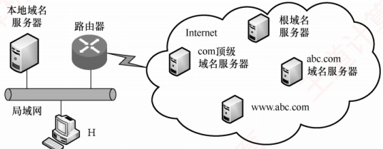

### 6.2.4 本节习题精选

#### 一、 单项选择题

##### 01

域名与（）具有一一对应的关系。

A. IP 地址 B. MAC 地址 C. 主机 D. 以上都不是
##### 02

下列说法错误的是（）。

A. Internet 上提供客户访问的主机一定要有域名

B. 同一域名在不同时间可能解析出不同的 IP 地址

C. 多个域名可以指向同一台主机的 IP 地址

D. IP 子网中的主机可以由不同的域名服务器来维护其映射

##### 03

DNS 是基于（）模型的分布式系统。

A. C/S B. B/S C. P2P D. 以上均不正确

##### 04

域名系统（DNS）的组成不包括（）。

A. 域名空间 B. 分布式数据库

C. 域名服务器 D. 从内部 IP 地址到外部 IP 地址的翻译程序

##### 05

互联网中域名解析依赖于由域名服务器组成的逻辑树。在域名解析过程中，主机上请求域名解析的软件不需要知道（ ）信息。

I. 本地域名服务器的 IP

II. 本地域名服务器父节点的 IP

III. 域名服务器树根节点的 IP

A. I 和 II

B. I 和 III

C. II 和 III

D. I、II 和 III

##### 06

在 DNS 的递归查询中，由（）给客户端返回地址。

A. 最开始连接的服务器

B. 最后连接的服务器

C. 目的地址所在服务器

D. 不确定

##### 07

当本地域名服务器向根域名服务器查询一个域名时，根域名服务器返回一个负责该域名的顶级域名服务器的 IP 地址，让本地域名服务器再向该域名服务器查询，这种查询方式称为（）。

A. 递归查询 B. 迭代查询 C. 重定向查询 D. 广播查询

##### 08

一台主机要解析 www.cskaoyan.com 的 IP 地址，若这台主机配置的域名服务器为 202.120.66.68，互联网顶级域名服务器为 11.2.8.6，而存储 www.cskaoyan.com 的 IP 地址对应关系的域名服务器为 202.113.16.10，则这台主机解析该域名通常首先查询（）。

A. 202.120.66.68 域名服务器

B. 11.2.8.6 域名服务器

C. 202.113.16.10 域名服务器

D. 可以从这 3 个域名服务器中任选一个

##### 09

（）可以将其管辖的主机名转换为主机的 IP 地址。

A. 本地域名服务器

B. 根域名服务器

C. 权限域名服务器

D. 代理域名服务器

##### 10

若本地域名服务器无缓存，用户主机采用递归查询向本地域名服务器查询另一网络某主机域名对应的 IP 地址，而本地域名服务器采用迭代查询向其他域名服务器进行查询，则用户主机和本地域名服务器发送的域名请求条数分别为（）。

A. 1 条，1 条

B. 1 条，多条

C. 多条，1 条

D. 多条，多条

##### 11

【2010 统考真题】若本地域名服务器无缓存，则在采用递归方法解析另一网络某主机域名时，用户主机和本地域名服务器发送的域名请求条数分别为（）。

A. 1 条，1 条

B. 1 条，多条

C. 多条，1 条

D. 多条，多条

##### 12

【2016 统考真题】假设所有域名服务器均采用迭代查询方式进行域名解析。当主机访问
规范域名为 www.abc.xyz。com 的网站时，本地域名服务器在完成该域名解析的过程中，可能发出 DNS 查询的最少和最多次数分别是（）。

A. 0, 3 B. 1, 3 C. 0, 4 D. 1, 4

##### 13

【2018 统考真题】下列 TCP/IP 应用层协议中，可以使用传输层无连接服务的是（）。

A. FTP B. DNS C. SMTP D. HTTP

##### 14

【2020 统考真题】假设卜图所示网络中的本地域名服务器只提供递归查询服务，其他域名服务器都只提供迭代查询服务；局域网内主机访问 Internet 上各服务器的往返时间（RTT）均为 10ms，忽略其他各种时延。若主机 H 通过超链接 http://www.abc.com/index.html 请求浏览纯文本 Web 页 index.html，则从单击超链接开始到浏览器接收到 index.html 页面为止，所需的最短时间与最长时间分别是（）。

A. 10ms, 40ms B. 10ms, 50ms C. 20ms, 40ms D. 20ms, 50ms

#### 二、 综合应用题

##### 01

DNS 使用 UDP 而非 TCP，若一个 DNS 分组丢失，没有自动恢复，则这会引起问题吗？若会，则应如何解决？

##### 02

为何要引入域名的概念？举例说明域名转换过程。域名服务器中的高速缓存有何作用？

### 6.2.5 答案与解析

#### 一、 单项选择题

##### 01

D

若一台主机通过两块网卡连接到两个网络（如服务器双线接入），则就具有两个 IP 地址，每个网卡对应一个 MAC 地址，显然这两个 IP 地址可以映射到同一个域名上。此外，多台主机也可以映射到同一个域名上（如负载均衡），一台主机也可以映射到多个域名上（如虚拟主机）。因此，选项 A、B 和 C 和域名均不具有一一对应的关系。

##### 02

A

Internet 上提供访问的主机一定要有 IP 地址，而不一定要有域名，选项 A 错误。域名在不同的时间可以解析出不同的 IP 地址，因此可以用多台服务器来分担负载，选项 B 正确。可以把多个域名指向同一台主机的 IP 地址，选项 C 正确。IP 子网中主机也可以由不同的域名服务器来维护其映射，选项 D 正确。

##### 03

A

DNS 是一个基于 C/S 模型的分布式数据库系统，主要用于域名和 IP 地址的映射。

##### 04

D

DNS 提供从域名到 IP 地址或从 IP 地址到域名的映射服务。它被设计成为一个联机分布式数据库系统，并采用客户/服务器模式。域名的解析是由若干域名服务器程序完成的。从内部 IP 地
址到外部 IP 地址的映射是由 NAT 实现的，用于缓解 IPv4 地址紧缺的问题，与域名系统无关。

##### 05

C

正常情况下，客户只需把域名解析请求发往本地域名服务器，其他事情都由本地域名服务器完成，并把最后结果返回给客户。所以主机只需要知道本地域名服务器的 IP。

##### 06

A

在递归查询中，每台不包含被请求信息的服务器都转到其他地方去查找，然后它再往回发送结果，所以客户端最开始连接的服务器最终将返回正确的信息。

##### 07

B

迭代查询是指当一个域名服务器收到本地域名服务器发出的查询请求报文时，要么给出所要查询的IP地址，要么告诉本地服务器：“你下一步应当向哪个DNS服务器进行查询。”然后让本地域名服务器进行后续的查询（而不替本地域名服务器进行后续的查询）。

##### 08

A

当这台主机发出对 www.cskaoyan.com 的 DNS 查询报文时，这个查询报文首先被送往该主机的本地域名服务器 202.120.66.68。本地域名服务器不能立即回答该查询时，就以 DNS 客户的身份向某一根域名服务器查询。但不管采用何种查询方式，首先都要查询本地域名服务器。

##### 09

C

##### 10

B

每台主机都必须在权限域名服务器处注册登记，权限域名服务器一定能够将其管辖的主机名转换为该主机的 IP 地址。

##### 11

A

用户主机向本地域名服务器采用递归查询，只需发送1条查询请求。本地域名服务器无缓存，因此还要进行后续的查询。本地域名服务器向其他域名服务器采用迭代查询，本地域名服务器分别向根域名服务器、顶级域名服务器、权限域名服务器发送多条查询请求。

用户主机向本地域名服务器采用递归查询，只需发送1条请求。本地域名服务器无缓存，但因其向其他域名服务器也采用递归查询方式，故只需向根域名服务器发送1条请求，后续查询由被询问的服务器代为完成。因此，用户主机和本地域名服务器各自发送的域名请求条数均为1。

##### 12

C

最少情况：若本地域名服务器已缓存该域名的解析结果，则无须发出任何 DNS 查询，最少为 0 次。最多情况：因所有服务器均采用迭代查询，在最坏情况下，本地域名服务器需要依次向根域名服务器、顶级域名服务器（.com）、权限域名服务器（xyz.com）和次级权限域名服务器（abc.xyz.com）发起查询，共 4 次，因此最多为 4 次。

##### 13

B

FTP 用于文件传输，SMTP 用于电子邮件发送，HTTP 用于网页传输，三者均要求可靠传输，故在传输层使用有连接的 TCP 服务。DNS 对可靠性的要求相对较低，且追求效率与低开销，因此在传输层通常使用无连接的 UDP 服务。

##### 14

D

题中 RTT 指局域网内主机或本地域名服务器访问 Internet 上各服务器的往返时间，H 与本地域名服务器间的通信时延忽略不计。最短时间：若 H 本地有域名缓存，则无须 DNS 查询，直接与 www.abc.com 建立 TCP 连接并请求资源。TCP 三次握手需 1.5RTT，第三次握手可携带 HTTP 请求，服务器返回页面需 0.5RTT，共 2RTT = 20ms。最长时间：H 向本地域名服务器发起递归查询（时延忽略），本地域名服务器依次迭代查询根域名服务器、顶级域名服务器（.com）、域名
服务器（abc.com），共 3RTT；随后 H 建立 TCP 连接并获取页面，需 2RTT；总计 5RTT = 50ms。

#### 二、 综合应用题

##### 01

【解答】

DNS 使用传输层的 UDP 而非 TCP，因为它不需要使用 TCP 在发生传输错误时执行的自动重传功能。实际上，对于 DNS 服务器的访问，多次 DNS 请求都返回相同的结果，即做多次和做一次的效果一样。因此 DNS 操作可以重复执行。当一个进程做一次 DNS 请求时，它启动一个定时器。若定时器计满而未收到回复，则它就再请求一次，这样做不会有害处。

##### 02

【解答】

IP 地址很难记忆，引入域名是为了便于人们记忆和识别。

域名解析可以把域名转换成 IP 地址。域名转换过程是向本地域名服务器申请解析，若本地域名服务器查不到，则向根域名服务器进行查询。若根域名服务器中也查不到，则向根域名服务器中保存的顶级域名服务器和相应权限域名服务器进行查询，一定可以查找到。

域名服务器中高速缓存的作用：将近期访问过的域名信息保存在高速缓存，再次访问时会从缓存中读取，不需要重新解析，这样就可以加快域名解析的响应速度。
