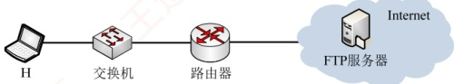

### 6.3.3 本节习题精选

#### 一、 单项选择题

##### 01

文件传输协议（FTP）的一个主要特征是（）。
A. 允许客户指明文件的类型但不允许指明文件的格式

B. 不允许客户指明文件的类型但允许指明文件的格式

C. 允许客户指明文件的类型与格式

D. 不允许客户指明文件的类型与格式

##### 02

以下关于 FTP 工作模型的描述中，错误的是（）。

A. FTP 使用控制连接、数据连接来完成文件的传输

B. 用于控制连接的 TCP 连接在服务器端使用的熟知端口号为 21

C. 用于控制连接的 TCP 连接在客户端使用的端口号为 20

D. 服务器端由控制进程、数据进程两部分组成

##### 03

控制信息是带外传送的协议是（）。

A. HTTP B. SMTP C. FTP D. POP

##### 04

下列关于 FTP 连接的叙述中，正确的是（）。

A. 控制连接先于数据连接被建立，并先于数据连接被释放

B. 数据连接先于控制连接被建立，并先于控制连接被释放

C. 控制连接先于数据连接被建立，并晚于数据连接被释放

D. 数据连接先于控制连接被建立，并晚于控制连接被释放

##### 05

FTP 客户发起对 FTP 服务器连接的第一阶段是建立（）。

A. 传输连接 B. 数据连接 C. 会话连接 D. 控制连接

##### 06

FTP 中作为服务器一方的进程，通过监听（）端口得知有无服务请求。

A. 53 B. 80 C. 20 D. 21

##### 07

下列关于 FTP 的叙述中，错误的是（）。

A. FTP可以实现异构网络中计算机之间的文件传送

B. 在进行文件传输时，FTP客户端和服务器之间需建立两个连接

C. FTP 服务器主进程在 20 端口上监听客户端的连接请求

D. FTP 使用 TCP 进行可靠传输

##### 08

一个FTP用户发送了一个LIST命令来获取服务器的文件列表，这时服务器应通过（）端口来传输该列表。

A. 21 B. 20 C. 22 D. 19

##### 09

下列关于 FTP 的叙述中，错误的是（）。

A. FTP可以在不同类型的操作系统之间传送文件

B. FTP并不适合用在两个计算机之间共享读写文件

C. 控制连接在整个 FTP 会话期间一直保持

D. 客户端默认使用端口 20 与服务器建立数据传输连接

##### 10

当一台计算机从 FTP 服务器下载文件时，在该 FTP 服务器上对数据进行封装的 5 个转换步骤是（）。

A. 比特，数据帧，数据报，数据段，数据

B. 数据，数据段，数据报，数据帧，比特

C. 数据报，数据段，数据，比特，数据帧

D. 数据段，数据报，数据帧，比特，数据

##### 11

FTP 支持两种方式的传输：ASCII 方式和 Binary（二进制）方式。通常文本文件的传输采用（）方式，而图像、声音等非文本文件采用（）方式传输。
A. ASCII, Binary B. Binary, ASCII C. ASCII, ASCII D. Binary, Binary

##### 12

直接封装 FTP、DNS、DHCP 报文的协议分别是（）。

A. TCP、UDP、UDP B. UDP、TCP、TCP

C. TCP、UDP、IP D. UDP、UDP、UDP

##### 13

【2009 统考真题】FTP 客户和服务器间传递 FTP 命令时，使用的连接是（）。

A. 建立在 TCP 之上的控制连接

B. 建立在 TCP 之上的数据连接

C. 建立在 UDP 之上的控制连接

D. 建立在 UDP 之上的数据连接

##### 14

【2017 统考真题】下列关于 FTP 的叙述中，错误的是（）。

A. 数据连接在每次数据传输完毕后就关闭

B. 控制连接在整个会话期间保持打开状态

C. 服务器与客户端的 TCP20 端口建立数据连接

D. 客户端与服务器的 TCP21 端口建立控制连接

#### 二、 综合应用题

##### 01

文件传输协议的主要工作过程是怎样的？主进程和从属进程各起什么作用？

##### 02

为什么FTP要使用两个独立的连接，即控制连接和数据连接？

##### 03

主机 A 想下载文件 ftp://ftp.abc.edu.cn/file，大致描述下载过程中主机和服务器的交互过程。

##### 04

【2023 统考真题】某网络拓扑如下图所示，主机 H 登录 FTP 服务器后，向服务器上传一个大小为 18000B 的文件 F。假设 H 为传输 F 建立数据连接时，选择的初始序号为 100，MSS = 1000B，拥塞控制初始阈值为 4MSS，RTT = 10ms，忽略 TCP 段的传输时延；在 F 的传输过程中，H 均以 MSS 段向服务器发送数据，且未发生差错、丢包和失序现象。

请回答下列问题。

1）FTP 的控制连接是持久的还是非持久的？FTP 的数据连接是持久的还是非持久的？当 H 登录 FTP 服务器时，建立的 TCP 连接是控制连接还是数据连接？

2）当 H 通过数据连接发送 F 时，F 的第一个字节的序号是多少？在断开数据连接过程中，FTP 服务器发送的第二次挥手 ACK 段的确认序号是多少？

3）在H通过数据连接发送F的过程中，当H收到确认序号为2101的确认段时，H的拥塞窗口调整为多少？收到确认序号为7101的确认段时，H的拥塞窗口调整为多少？

4）H从请求建立数据连接开始，到确认F已被服务器全部接收为止，至少需要多长时间？期间应用层数据平均发送速率是多少？

### 6.3.4 答案与解析

#### 一、 单项选择题

##### 01

C

FTP 提供交互式访问，允许客户指明文件的类型与格式，并允许文件具有存取权限。

##### 02

C
在服务器端，控制连接使用 TCP 的 21 号端口，数据连接使用 TCP 的 20 号端口；而在客户端，控制连接和数据连接的 TCP 端口都是由客户端系统自动分配的。需要注意的是，当我们说 FTP 使用 20、21 号端口，HTTP 使用 80 号端口，SMTP 使用 25 号端口时，都是指相应协议的服务器端所使用的端口号，而客户端使用系统自动分配的端口号向这些服务的熟知端口发起连接。

##### 03

C

带外传送是指控制信息与数据信息通过不同的逻辑信道传送。例如，FTP 使用一个单独的控制连接来传输控制信息，而数据连接用于传送文件。带内传送是指控制信息与数据信息通过同一个逻辑信道传送。例如，HTTP 的请求和响应报文都是在同一个 TCP 连接上进行的。

##### 04

C

FTP 客户首先连接服务器的 21 号端口，建立控制连接（控制连接在整个会话期间一直保持打开），然后建立数据连接，在数据传送完毕后，数据连接最先释放，控制连接最后释放。

##### 05

D

FTP 工作时使用两个连接：控制连接和数据连接。FTP 客户对 FTP 服务器发起连接时，首先建立控制连接，即向服务器的 21 号 TCP 端口发起连接；然后建立数据连接（20 号 TCP 端口）。FTP 并没有传输连接和会话连接的说法。

##### 06

D

##### 07

C

FTP 服务器通过监听熟知端口 21（控制端口）得知有无服务请求。

因为 FTP 屏蔽了各计算机系统的细节，所以 FTP 适用于异构网络中计算机之间的文件传送。当进行文件传输时，FTP 客户端和服务器之间需建立两个并行的控制连接和数据连接。FTP 服务器主进程在熟知端口 21 上监听客户端的服务请求。FTP 在传输层使用 TCP 进行可靠传输。

##### 08

B

FTP 中数据连接的端口是 20，而文件的列表是通过数据连接来传输的。

##### 09

D

控制连接建立后，服务器进程用自己传送数据的熟知端口20与客户进程所提供的端口号建立数据传输连接（默认为PORT模式），即客户进程的端口号是客户进程自己提供的。

##### 10

B

FTP 服务器的数据要经过应用层、传输层、网络层、数据链路层及物理层。因此，对应的封装是数据、数据段、数据报、数据帧，最后是比特。

##### 11

A

FTP 支持 ASCII 和 Binary 两种方式的传输，非加密文本文件通常采用 ASCII 方式传输，而图像、声音等非文本文件采用 Binary 方式传输。本题可能有所超纲，了解即可。

##### 12

A

FTP 需要保证数据传输的可靠性，因此采用 TCP 作为传输层协议。在 DHCP 的应用中，客户在分配到 IP 地址前无法使用 TCP 建立连接，因此只能利用 UDP 进行无连接的交互。UDP 具有简化通信、更高效、低延迟的特性，能满足 DNS 查询对快速响应和高并发的需求。

##### 13

A

对于 FTP 文件传输，为了保证可靠性，选择 TCP，排除 C 和 D。FTP 的控制信息是带外传送的，即 FTP 使用了一个分离的控制连接来传送命令，因此答案为选项 A。

##### 14

C

FTP 使用控制连接和数据连接，控制连接存在于整个 FTP 会话过程中，数据连接在每次文件
传输时才建立，传输结束就关闭，选项 A 和 B 正确。默认情况（PORT 模式）下 FTP 服务器使用 TCP 20 端口进行数据连接，使用 TCP 21 端口进行控制连接，这里的端口号是指 FTP 服务器的端口号，因此选项 C 错误、选项 D 正确。此外还需要注意的是，FTP 服务器是否使用 TCP 20 端口建立数据连接与传输模式有关，PORT 模式使用 TCP 20 端口，PASV 模式由服务器随机选定。

#### 二、 综合应用题

##### 01

【解答】

FTP 的主要工作过程如下：在进行文件传输时，FTP 客户所发出的传送请求通过控制连接发送给服务器端的控制进程，并在整个会话期间一直保持打开，但控制连接不用来传送文件。服务器端的控制进程在接收到 FTP 客户发送来的文件传输请求后，就创建数据传送进程和数据连接，数据连接用来连接客户端和服务器端的数据传送进程，数据传送进程实际完成对文件的传送，在传送完毕后关闭“数据传送连接”，并结束运行。

FTP 的服务器进程由两大部分组成：一个主进程，负责接收新的请求；若干从属进程，负责处理单个请求。

##### 02

【解答】

在 FTP 的实现中，客户与服务器之间采用了两条传输连接，其中控制连接用于传输各种 FTP 命令，而数据连接用于文件的传送。之所以这样设计，是因为使用两条独立的连接可使 FTP 变得更加简单、更容易实现、更有效率。同时在文件传输过程中，还可以利用控制连接控制传输过程，如客户可以请求终止、暂停传输等。

##### 03

【解答】

大致过程如下：

① 建立一个 TCP 连接到服务器 ftp.abc.edu.cn 的 21 号端口，然后发送登录账号和密码。

② 服务器返回登录成功信息后，主机 A 打开一个随机端口，并将该端口号发送给服务器。

③ 主机 A 发送读取文件命令，内容为 get file，服务器使用 20 号端口建立一个 TCP 连接到主机 A 的随机打开的端口。

④ 服务器把文件内容通过第二个连接发送给主机 A，传输完毕后连接关闭。

##### 04

【解答】

1）在 FTP 会话期间，控制连接一直处于保持状态，是持久的。当每次需要传输文件时，FTP 客户和服务器之间会建立一个临时的数据连接，用于传输文件数据，是非持久的。控制连接用于传输命令和控制信息，登录操作涉及身份验证、发送命令等控制信息，因此 H 登录 FTP 服务器时建立的 TCP 连接是控制连接。

2）建立连接时，FTP 客户发送的第一次握手 SYN 段要消耗一个序号，选择的初始序号为 100，因此发送文件 F 时，第一个字节的序号为 101。文件 F 共有 18000 个字节，需占用 18000 个序号，释放连接时，FTP 客户发送的第一次握手 FIN 段也要消耗一个序号，所以该 FIN 段的序号为 18101，因此 TCP 服务器发送的第二次握手 ACK 段的确认序号是 18102。

3）拥塞窗口在每个传输轮次后的变化如下表所示。前两个传输轮次，拥塞窗口小于阈值，拥塞窗口按指数增长；第2个传输轮次结束后，拥塞窗口增长到4MSS，此后每经过一个传输轮次，拥塞窗口增加1MSS。当H收到确认序号为2101的确认段时，表示服务器已收到2000B数据，即2个报文段，此时还处在第2个传输轮次（慢开始阶段），拥塞窗口还未达到阈值，发送端每收到一个确认，拥塞窗口就加1，所以此时拥塞窗口为 $2+1=3$MSS。当H收到确认序号为7101的确认段时，表示服务器已收到7个报文段，第3轮
传输结束后，发送端共发送了 $1+2+4=7$MSS数据，所以拥塞窗口大小为5MSS。

| N个传输轮次后 | 初始时 | N=1 | N=2 | N=3 |
| --- | --- | --- | --- | --- |
| 拥塞窗口大小 | 1MSS | 2MSS | 4MSS | 5MSS |

4）每个传输轮次传输的数据量如下表所示，文件 F 的大小 18000B = 18MSS，则发送完 F 要经过 5RTT，此外还要 1 个额外的 RTT 用来建立 TCP 连接。因此，H 从请求建立数据连接开始，到确认 F 已被服务器全部接收为止，至少需要 6RTT = 6×10ms = 60ms；期间应用层的数据平均发送速率是 18000B÷60ms = 300×10³B/s = 0.3MB/s = 2.4Mb/s。

| k | k=1 | k=2 | k=3 | k=4 | k=5 |
| --- | --- | --- | --- | --- | --- |
| 第k轮最大数据传输量 | 1MSS | 2MSS | 4MSS | 5MSS | 6MSS |

