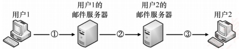

### 6.4.4 本节习题精选

#### 一、 单项选择题

##### 01

互联网用户的电子邮件地址格式必须是（）。

A. 用户名@单位网络名

B. 单位网络名@用户名

C. 邮箱所在主机的域名@用户名

D. 用户名@邮箱所在主机的域名

##### 02

SMTP 基于传输层的 ___ 协议，POP3 基于传输层的 ___ 协议。

A. TCP, TCP B. TCP, UDP C. UDP, UDP D. UDP, UDP

##### 03

SMTP 服务器使用的端口号是（）。

A. 21 B. 25 C. 80 D. 110

##### 04

用 Firefox（浏览器）在 Gmail 中向邮件服务器发送邮件时，使用的是（）协议。

A. HTTP B. POP3 C. P2P D. SMTP

##### 05

用户代理只能发送而不能接收电子邮件时，可能是（）地址错误。
A. POP3 B. SMTP C. HTTP D. Mail

##### 06

不能用于用户从邮件服务器接收电子邮件的协议是（）。

A. HTTP B. POP3 C. SMTP D. IMAP

##### 07

下列关于电子邮件格式的说法中，错误的是（）。

A. 电子邮件内容包括邮件头与邮件体两部分

B. 邮件头中发信人地址（From：）、发送时间、收信人地址（To：）及邮件主题（Subject：）是由系统自动生成的

C. 邮件体是实际要传送的信函内容

D. MIME 允许电子邮件系统传输文字、图像、语音与视频等多种信息

##### 08

【2012 统考真题】若用户1与用户2之间发送和接收电子邮件的过程如下图所示，则图中①、②、③阶段分别使用的应用层协议可以是（）。

A. SMTP、SMTP、SMTP B. POP3、SMTP、POP3

C. POP3、SMTP、SMTP D. SMTP、SMTP、POP3

##### 09

【2013 统考真题】下列关于 SMTP 的叙述中，正确的是（）。

I. 只支持传输 7 比特 ASCII 码内容

II. 支持在邮件服务器之间发送邮件

III. 支持从用户代理向邮件服务器发送邮件

IV. 支持从邮件服务器向用户代理发送邮件

A. 仅 I、II 和 III    B. 仅 I、II 和 IV    C. 仅 I、III 和 IV    D. 仅 II、III 和 IV

##### 10

【2015 统考真题】通过 POP3 协议接收邮件时，使用的传输层服务类型是（）。

A. 无连接不可靠的数据传输服务

B. 无连接可靠的数据传输服务

C. 有连接不可靠的数据传输服务

D. 有连接可靠的数据传输服务

##### 11

【2018 统考真题】无须转换即可由 SMTP 直接传输的内容是（）。

A. JPEG 图像        B. MPEG 视频        C. EXE 文件        D. ASCII 文本

##### 12

【2025 统考真题】下列关于 POP3 协议的叙述中，正确的是（）。

Ⅰ. 支持用户代理从邮件服务器读取邮件

Ⅱ. 支持用户代理向邮件服务器发送邮件

Ⅲ. 支持邮件服务器之间发送与接收邮件

Ⅳ. 支持通过一条 TCP 连接收取多封邮件

Ⅶ. 仅 I、IV

Ⅷ. 仅 II、III

Ⅸ. 仅 I、II、III

Ⅹ. 仅 I、III、IV

#### 二、 综合应用题

##### 01

电子邮件系统使用 TCP 传送邮件，为什么有时会遇到邮件发送失败的情况？为什么有时对方会收不到发送的邮件？

##### 02

MIME 与 SMTP 的关系是怎样的？

##### 03

用户主机上的电子邮件用户代理与邮件服务器建立了连接，现截获一个 TCP 报文段，如下图所示。图中显示了该报文段的前 126 个字节的十六进制数及 ASCII 码内容。TCP
首部长度为20B。请回答：

| 0020 | c0 | e6 | 00 | 19 | b0 | ca | d5 | 6f | eb | c9 | 10 | e9 | 50 | 18 | ...... | .o....P. |
| --- | --- | --- | --- | --- | --- | --- | --- | --- | --- | --- | --- | --- | --- | --- | --- | --- |
| 0030 | f9 | 98 | 51 | bd | 00 | 00 | 4d | 65 | 73 | 73 | 61 | 67 | 65 | 2d | 49 | ...Q...Me ssage-ID |
| 0040 | 3a | 20 | 3c | 34 | 44 | 43 | 45 | 39 | 32 | 42 | 41 | 2e | 32 | 31 | 30 | :4DCE9 2BA.2010 |
| 0050 | 39 | 30 | 32 | 40 | 31 | 36 | 33 | 2e | 63 | 6f | 6d | 3e | 0d | 0a | 44 | 902@163. com>..Da |
| 0060 | 74 | 65 | 3a | 20 | 53 | 61 | 74 | 2c | 20 | 31 | 34 | 20 | 4d | 61 | 79 | te: Sat, 14 May |
| 0070 | 32 | 30 | 31 | 31 | 20 | 32 | 32 | 3a | 33 | 33 | 34 | 33 | 30 | 20 | 2b | 2011 22: 33:30 +0 |
| 0080 | 38 | 30 | 30 | 0d | 0a | 46 | 72 | 6f | 6d | 3a | 20 | 63 | 73 | 6b | 61 | 800..Fro m: cskao |
| 0090 | 79 | 61 | 6e | 32 | 30 | 31 | 32 | 40 | 31 | 36 | 33 | 2e | 63 | 6f | 6d | yan2012@ 163.com. |

1）用户代理和服务器之间使用的应用层协议是什么？

2）用户代理使用的端口号是多少？

3）该邮件的发件人邮箱是什么？

### 6.4.5 答案与解析

#### 一、 单项选择题

##### 01

D

电子邮件是互联网最基本、最常用的服务功能。要使用电子邮件服务，首先要拥有自己的电子邮件地址，其格式为：用户名@邮箱所在主机的域名。

##### 02

A

SMTP 和 POP3 都是基于 TCP 的协议，提供可靠的邮件通信。

##### 03

B

##### 04

A

SMTP 服务器使用的熟知端口号是 25。

在基于力维网的电子邮件中，用户浏览器与 Hotmail 或 Gmail 的邮件服务器之间的邮件发送或接收使用的是 HTTP，而仅在不同邮件服务器之间传送邮件时才使用 SMTP。

##### 05

A

用户代理使用 POP3 协议接收邮件。通常用户在配置电子邮件用户代理时需要设置邮件服务器的 POP3 地址（如 pop3.gmail.com），若这个地址设置错误，则会导致用户无法接收邮件。用户代理中的 SMTP 地址错误时会导致无法发送邮件。收件人 E-mail 地址错误时，可能会发错人，也可能会导致投递失败（不存在的地址）。

##### 06

C

SMTP 是一种 “推” 协议，用于发送端用户代理与发送端服务器之间及发送端服务器与接收端服务器之间，不能用于接收端用户从服务器上读取邮件。常用的邮件读取协议有 POP3、HTTP 和 IMAP。大家平时通过浏览器登录 163 邮箱、Gmail 邮箱时，使用的邮件读取协议就是 HTTP。IMAP 是另一个专用于读取邮件的协议，它要比 POP3 复杂得多，功能也更为强大。

##### 07

B

邮件头是由多项内容构成的，其中一部分是由系统自动生成的，如发信人地址（From:）、发送时间；另一部分是由发件人输入的，如收信人地址（To:）、邮件主题（Subject:）等。

##### 08

D

SMTP 采用推的通信方式，即用户代理向邮件服务器及邮件服务器之间发送邮件时，SMTP 客户主动将邮件推送到 SMTP 服务器。而 POP3 采用拉的通信方式，即用户读取邮件时，用户代理向邮件服务器发出请求，拉取用户邮箱中的邮件。

##### 09

A

根据 6.4.1 节可知，SMTP 用于用户代理向邮件服务器发送邮件，或在邮件服务器之间发送
邮件。SMTP 只支持传输 7 比特的 ASCII 码内容。

##### 10

D

POP3 建立在 TCP 连接上，使用的是有连接可靠的数据传输服务。

##### 11

D

电子邮件出现得较早，当时的数据传输能力较弱，使用者往往也不需要传输较大的图片、视频等，因此SMTP具有一些目前来看较为老旧的性质，如限制所有邮件报文的体部分只能采用7位ASCII码来表示。在如今的传输过程中，传输了非文本文件时，往往需要将这些多媒体文件重新编码为ASCII码再传输。因此无须转换即可传输的是ASCII文本，答案为选项D。

##### 12

A

POP3 用于用户代理从邮件服务器读取邮件，说法 I 正确。用户代理向邮件服务器发送邮件使用的是 SMTP，而非 POP3。邮件服务器之间的邮件传输也由 SMTP 实现，与 POP3 无关。POP3 支持在一条 TCP 连接中收取多封邮件，无须为每封邮件单独建立连接，说法 IV 正确。

#### 二、 综合应用题

##### 01

【解答】

有时对方的邮件服务器不工作，邮件就发送不出去。对方的邮件服务器出故障也会使邮件丢失。有时网络非常拥塞，路由器丢弃大量的IP数据报，导致通信中断。

##### 02

【解答】

因为 SMTP 存在一些缺点和不足，所以通过 MIME 并非改变或取代 SMTP。MIME 继续使用 RFC 822 格式，但增加了邮件主体的结构，并定义了传送非 ASCII 码的编码规则。也就是说，MIME 邮件可在已有的电子邮件和协议下传送。

##### 03

【解答】

1）本题中并未明确告诉这个报文段是从用户代理发往服务器还是从服务器发往用户代理。分析 TCP 首部格式可知，源端口为 49382（0xc0e6），目的端口为 25（0x0019），因此该应用层协议为 SMTP。

2）因为使用的是 SMTP，且服务器端口 25 作为目的端口，所以源端口 49382 为用户代理所使用的端口。

3）因为 SMTP 的协议字段都是用 ASCII 码表示的，所以发件人的关键字是 FROM，从截图右侧的 ASCII 码形式中直接找到答案 FROM: cskaoyan2012@163.com。
