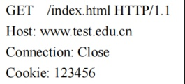
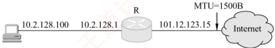
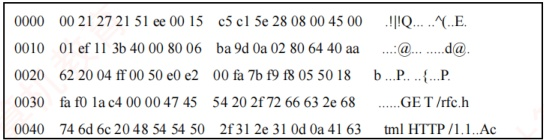
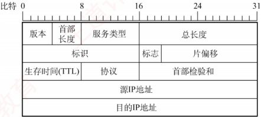
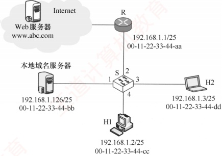
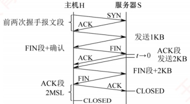
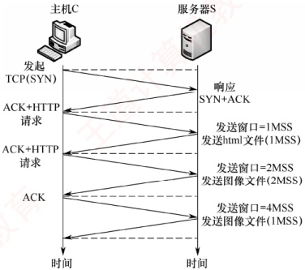

### 6.5.3 本节习题精选

#### 一、 单项选择题

##### 01

下面的（）协议中，客户与服务器之间采用面向无连接的协议进行通信。

A. FTP B. SMTP C. DNS D. HTTP

##### 02

从协议分析的角度，WWW服务的第一步操作是浏览器对服务器的（）。

A. 请求地址解析

B. 传输连接建立

C. 请求域名解析

D. 会话连接建立

##### 03

TCP 和 UDP 的一些端口保留给一些特定的应用使用。为 HTTP 保留的端口号为（）。

A. TCP 的 80 端口

B. UDP 的 80 端口

C. TCP 的 25 端口

D. UDP 的 25 端口

##### 04

从某个已知的 URL 获得一个万维网文档时，若该万维网服务器的 IP 地址开始时并不知道，则需要用到的应用层协议有（），需要用到的传输层协议有（）。

① A. FTP、HTTP B. DNS、FTP C. DNS、HTTP D. TELNET、HTTP

② A. UDP B. TCP C. UDP、TCP D. TCP、IP

##### 05

万维网上的每个页面都有唯一的地址，这些地址统称（）。

A. IP 地址

B. 域名地址

C. 统一资源定位符

D. WWW 地址

##### 06

使用鼠标单击一个万维网文档时，若该文档除有文本外，还有三幅 gif 图像，则在 HTTP/1.0 中需要建立（）次 TCP 连接。

A. 4 B. 3 C. 2 D. 1

##### 07

仅需 Web 服务器对 HTTP 报文进行响应，但不需要返回请求对象时，HTTP 请求报文应该使用的方法是（）。

A. GET B. PUT C. POST D. HEAD

##### 08

HTTP 是一个无状态协议，然而 Web 站点经常希望能够识别用户，这时需要用到（）。

A. Web 缓存 B. Cookie C. 条件 GET D. 持续连接

##### 09

下列关于 Cookie 的说法中，错误的是（）。

A. Cookie 仅存储在服务器端 B. Cookie 是服务器产生的

C. Cookie 会威胁客户的隐私 D. Cookie 的作用是跟踪用户的访问和状态

##### 10

以下关于非持续连接 HTTP 特点的描述中，错误的是（）。

A. HTTP 支持非持续连接与持续连接

B. HTTP/1.0 使用非持续连接，而 HTTP/1.1 默认使用持续连接

C. 非持续连接中对每次请求/响应都要建立一次 TCP 连接

D. 非持续连接中读取一个包含 100 个图片对象的 Web 页面，需要 TCP 连接

##### 11

若浏览器支持并行 TCP 连接，使用非持久的 HTTP/1.0 协议请求浏览 1 个 Web 页，该页中引用同一网站上的 7 个小图像文件，则从浏览器为传输 Web 页请求建立 TCP 连接开始，到接收完所有内容为止，所需的往返时间 RTT 数至少是（）。

A. 3 B. 4 C. 8 D. 9

##### 12

假设主机通过 HTTP/1.1（流水线方式）请求浏览某个 Web 服务器 S 上的 Web 页 rfc.html，rfc.html 引用了同目录下的 3 个 JPEG 小图像（假设只有在收到 rfc.html 后才能发送对其引用
图像的请求），一次请求响应的时间为 RTT，忽略其他各种时延，不考虑拥塞控制和流量控制，则从发出 HTTP 请求报文开始到收到全部内容为止，所耗费的时间是（）。

A. 2RTT B. 2.5RTT C. 4RTT D. 4.5RTT

##### 13

主机通过超链接 http://www.cskaoyan.com/index.html 请求浏览 Web 页 index.html，浏览器使用流水线方式的 HTTP/1.1 协议，该 Web 页引用了同一网站上的 7 个小图像文件，假设主机到本地域名服务器和互联网上各服务器的往返时延均为 1RTT。本地域名服务器只提供递归查询服务，其他域名服务器只提供迭代查询服务，忽略其他所有时延，则从点击超链接开始到浏览器接收到所有内容为止，所需的往返时间 RTT 数最多是（）。

A. 5 B. 6 C. 7 D. 8

##### 14

主机 H 通过持久的 HTTP/1.1 协议请求服务器 S 上的 5KB 数据，最大段长 MSS = 1KB，往返时间 RTT = 50ms，最长报文段寿命 MSL = 800ms，假设双方的接收窗口都足够大，当 H 收到来自 S 的第一个携带数据的报文段后，立即向 S 发送连接释放报文段（注：连接释放报文段可以携带数据信息或确认信息）。从 H 请求与 S 建立 TCP 连接时刻起，到 H 进入 CLOSED 状态为止，所需的时间至少是（）。

A. 1000ms B. 1200ms C. 1600ms D. 1800ms

##### 15

假定一个 NAT 路由器的公网地址为 205.56.79.35，并且有如下表项：

| 转换端口 | 源 IP 地址 | 源 端 口 |
| --- | --- | --- |
| 2056 | 192.168.32.56 | 21 |
| 2057 | 192.168.32.56 | 20 |
| 1892 | 192.168.48.26 | 80 |
| 2256 | 192.168.55.106 | 80 |

它收到一个源 IP 地址为 192.168.32.56、源端口为 80 的分组，其动作是（）

A. 转换地址，将源 IP 变为 205.56.79.35，端口变为 2056，然后发送到公网

B. 添加一个新的条目，转换 IP 地址及端口然后发送到公网

C. 不转发，丢弃该分组

D. 直接将分组转发到公网

##### 16

【2014 统考真题】使用浏览器访问某大学的 Web 网站主页时，不可能使用到的协议是（）。

A. PPP          B. ARP         C. UDP         D. SMTP

##### 17

【2015 统考真题】某浏览器发出的 HTTP 请求报文如下:



下列叙述中，错误的是（）。

A. 该浏览器请求浏览 index.html

B. index.html 存放在 www.test.edu.cn 上

C. 该浏览器请求使用持续连接

D. 该浏览器曾经浏览过 www.test.edu.cn

##### 18

【2022 统考真题】假设主机 H 通过 HTTP/1.1 请求浏览某 Web 服务器 S 上的 Web 页 news408.html，news408.html 引用了同目录下的 1 幅图像，news408.html 文件大小为 1MSS
（最大段长），图像文件大小为 3MSS，H 访问 S 的往返时间 RTT=10 ms，忽略 HTTP 响应报文的首部开销和 TCP 段传输时延。若 H 已完成域名解析，则从 H 请求与 S 建立 TCP 连接时刻起，到接收到全部内容止，所需的时间至少是（）。

A. 30ms B. 40ms C. 50ms D. 60ms

##### 19

【2024 统考真题】若浏览器不支持并行 TCP 连接，使用非持久的 HTTP/1.0 协议请求浏览 1 个 Web 页，该页中引用同一网站上的 7 个小图像文件，则从浏览器为传输 Web 页请求建立 TCP 连接开始，到接收完所有内容为止，所需要的往返时间 RTT 数至少是（）。

A. 4 B. 9 C. 14 D. 16

#### 二、 综合应用题

##### 01

在浏览器中输入 http://cskaoyan.com 并按回车，直到王道论坛的首页显示在浏览器中，请问在此过程中，按照 TCP/IP 模型，从应用层到网络层都用到了哪些协议？

##### 02

在如下条件下，计算使用非持续方式和持续方式请求一个 Web 页面所需的时间：

1）测试的 RTT 的平均值为 150ms，一个 gif 对象的平均发送时延为 35ms。

2）一个 Web 页面中有 10 幅 gif 图片，Web 页面的基本 HTML 文件、HTTP 请求报文、TCP 握手报文大小忽略不计。

3）TCP 三次握手的第三步中捎带一个 HTTP 请求。

4）使用非流水线方式

##### 03

【2011统考真题】某主机的MAC地址为00-15-C5-C1-5E-28，IP地址为10.2.128.100（私有地址）。图1是网络拓扑，图2是该主机进行Web请求的一个以太网数据帧前80B的十六进制数及ASCII码内容。



图 1 网络拓扑



图2 以太网数据帧（前80B）

请参考图中的数据回答以下问题。

1）Web服务器的IP地址是什么？该主机的默认网关的MAC地址是什么？

2）该主机在构造图2的数据帧时，使用什么协议确定目的 MAC 地址？封装该协议请求报文的以太网帧的目的 MAC 地址是什么？

3）假设 HTTP/1.1 协议以持续的非流水线方式工作，一次请求-响应时间为 RTT，rfc.html 页面引用了 5 幅 JPEG 小图像。问从发出图 2 中的 Web 请求开始到浏览器收到全部内容为止，需要多少 RTT?

4）该帧封装的 IP 分组经过路由器 R 转发时，需修改 IP 分组头中的哪些字段？

注：以太网数据帧结构和 IP 分组头结构分别如图 3 和图 4 所示。

| 6B 6B 2B 46～1500B 4B |   |   |   |   |
| --- | --- | --- | --- | --- |
| 目的 MAC 地址 | 源 MAC 地址 | 类型 | 数据 | CRC |

图3 以太网帧结构



图4 IP 分组头结构

##### 04

【2021 统考真题】某网络拓扑如下图所示，以太网交换机 S 通过路由器 R 与 Internet 互连。路由器部分接口、本地域名服务器、H1、H2 的 IP 地址和 MAC 地址如图中所示。在  $t_0$ 时刻 H1 的 ARP 表和 S 的交换表均为空，H1 在此刻利用浏览器通过域名 www.abc.com 请求访问 Web 服务器，在  $t_1$ 时刻  $(t_1 > t_0)$ S 第一次收到了封装 HTTP 请求报文的以太网帧，假设从  $t_0$ 到  $t_1$ 期间网络未发生任何与此次 Web 访问无关的网络通信。



请回答下列问题。

1）从  $t_{0}$ 到  $t_{1}$ 期间，H1 除了 HTTP，还运行了哪个应用层协议？从应用层到数据链路层，该应用层协议报文是通过哪些协议进行逐层封装的？

2）若 S 的交换表结构为 <MAC 地址，端口>，则  $t_{1}$ 时刻 S 交换表的内容是什么？

3）从  $t_{0}$ 到  $t_{1}$ 期间，H2 至少接收到几个与此次 Web 访问相关的帧？接收的是什么帧？帧的目的 MAC 地址是什么？

### 6.5.4 答案与解析

#### 一、 单项选择题

##### 01

C

DNS 采用 UDP 来传送数据，UDP 是一种面向无连接的协议。

建立浏览器与服务器之间的连接需要知道服务器的 IP 地址和端口号（80 端口是熟知端口），而访问站点时浏览器从用户那里得到的是 WWW 站点的域名，所以浏览器必须首先向 DNS 请求

##### 02

C
域名解析，获得服务器的IP地址后，才能请求建立TCP连接。

##### 03

A

HTTP 在传输层使用 TCP，端口号为 80。TCP 的 25 号端口是为 SMTP 保留的。

##### 04

① C, ② C

因为不知道服务器的 IP 地址，所以先要用 DNS 进行域名解析，然后使用 HTTP 进行客户和服务器之间的交互。需要用到的传输层协议是 UDP（DNS 使用）和 TCP（HTTP 使用）。

##### 05

C

统一资源定位符负责标识万维网上的各种文档，并使每个文档在整个万维网的范围内具有唯一的标识符 URL。

##### 06

A

HTTP 在传输层用的是 TCP。HTTP/1.0 只支持非持续连接，所以每请求一个对象需要建立一次 TCP 连接，传输 1 个基本 html 对象和 3 个 gif 对象，共需建立 4 次 TCP 连接。

##### 07

D

使用 HEAD 方法时服务器可对 HTTP 报文进行响应，但不会返回请求对象，其作用主要是调试。另外三个选项中的方法的作用请查看本章中的表 6.1。

##### 08

B

可以在 HTTP 中使用 Cookie 保存 HTTP 服务器和客户之间传递的状态信息。

##### 09

A

Cookie 是一个存储在用户主机中的文本文件。它由服务器产生，作为识别用户的手段。服务器的后端数据库记录了用户在 Web 站点上的活动，因此这些信息（如用户的个人信息及购物的偏好等）有可能被出卖给第三方，从而威胁到用户的隐私。

##### 10

D

非持续连接对每次请求/响应都建立一次 TCP 连接。在浏览器请求一个包含 100 个图片对象的 Web 页面时，服务器需要传输 1 个基本 HTML 文件和 100 个图片对象，因此共有 101 个对象，需要打开和关闭 TCP 连接 101 次。

##### 11

B

建立第一个 TCP 连接需要 1RTT，请求并接收 Web 页需要 1RTT。浏览器支持并行 TCP 连接，因此在收到 Web 页后可同时建立 7 个并行的 TCP 连接，以请求和接收 7 个小图像文件。因此，总往返时间 RTT 数 = 1RTT（建立第一个 TCP 连接）+ 1RTT（请求 Web 页）+ 1RTT（建立 7 个并行的 TCP 连接）+ 1RTT（请求 7 个小图像文件）= 4RTT。

##### 12

A

从发出 HTTP 请求报文开始，所以此时 TCP 连接已经建立。本题采用了流水线的持续连接。第 1 个 RTT 请求并收到 html 页面，收到 html 页面后才能发送对其引用小图像的请求，所以第 2 个 RTT 请求并收到 3 幅小图像，合计耗费 2RTT。

##### 13

C

主机点击超链接获取 html 页面，大致分为以下过程：① 向本地域名服务器发送递归查询请求，若本地域名服务器中有相应的 IP 地址缓存，则直接向主机返回相应的 IP 地址，只需 1RTT。否则，本地域名服务器还需要依次向根域名服务器、com 顶级域名服务器、cskaoyan.com 域名服务器发送迭代查询请求，查询到相应的 IP 地址最多需要 4RTT。② 建立初始 TCP 连接需要 1RTT，请求并接收 Web 页需要 1RTT，支持流水线传输方式，因此在收到 Web 页后可以同时发送 7 个小图像文件的请求，第②步的总往返时间是 1RTT（建立连接）+ 1RTT（请求 Web 页）+ 1RTT（请求 7 个小
图像文件）=3RTT。综上所述，所需的RTT数最多是 $4+3=7$。

##### 14

D

主机 H 在建立 TCP 连接的第 3 个握手报文段中向服务器 S 请求数据，初始时 S 的发送窗口 = 拥塞窗口 = 1MSS = 1KB。H 收到 1KB 数据后，向 S 请求释放 TCP 连接，但 S 还有 4KB 数据要发送。因此，S 收到 H 发来的 FIN 段和确认后，拥塞窗口变为 2KB，发送窗口也随之变化，再用 1RTT 时间 S 给 H 发送 2KB 数据。最后 S 向 H 发送 FIN 段，这个 FIN 段携带了最后的 2KB 数据，H 收到 FIN 段后，向 S 发送 ACK 段，并启动时间等待计时器，等待 2MSL 的时间进入 CLOSED 状态，整个过程如下图所示，共耗时 4RTT + 2MSL = 200 + 1600 = 1800ms。



##### 15

C

熟知端口号 80 是 HTTP 的服务器端口号，因此说明 IP 地址为 192.168.32.56（私有地址）的主机是 Web 服务器，源端口号为 80 说明该分组是 Web 服务器发出的 HTTP 响应分组。若该 HTTP 响应分组是对外网主机发出的 HTTP 请求的响应，则 NAT 表中一定存在相应的表项（否则 HTTP 请求分组不可能到达 Web 服务器），但在 NAT 表中找不到。所以只可能是对内网主机发出的 HTTP 请求的响应，该分组不需要通过路由器转发，因此路由器丢弃该分组。

##### 16

D

接入网络时可能会用到 PPP，选项 A 可能用到；计算机不知道某主机的 MAC 地址时，用 IP 地址查询相应的 MAC 地址会用到 ARP，选项 B 可能用到；访问 Web 网站时，若 DNS 缓冲没有存储相应域名的 IP 地址，用域名查询相应的 IP 地址时要使用 DNS，而 DNS 是基于 UDP 的，所以选项 C 可能用到；SMTP 只有使用邮件客户端发送邮件，或邮件服务器向其他邮件服务器发送邮件时才会用到，单纯地访问 Web 网页不可能用到，答案为选项 D。

##### 17

C

Connection: 连接方式，Close 表示非持续连接方式，keep-alive 表示持续连接方式。Cookie 值由服务器产生，HTTP 请求报文中有 Cookie 方法表示曾访问过 www.test.edu.cn 服务器。

##### 18

B

HTTP/1.1 默认使用持续连接，所有请求都是连续发送的。要求最少时间，理想的情况是 TCP 在第 3 次握手的报文段中捎带了 HTTP 请求，以及传输过程中的慢开始阶段不考虑拥塞。假设接收端有足够大的缓存空间，即发送窗口等同于拥塞窗口，共需要经过：第 1 个 RTT，进行 TCP 连接建立的前两次握手；第 2 个 RTT，主机 C 发送第 3 次握手报文并捎带了对 html 文件的 HTTP 请求，TCP 连接刚建立时服务器 S 的发送窗口 = 1MSS，服务器 S 发送大小为 1MSS 的 html 文件；第 3 个 RTT，主机 C 发送对 html 文件的确认并捎带了对图形文件的 HTTP 请求，服务器 S 收到确认后发送窗口变为 2MSS，然后服务器 S 发送大小为 2MSS 的图像文件；第 4 个 RTT，主机 C 向服务器 S 发送对收到的部分图像文件的确认，服务器 S 收到确认后发送窗口变为 4MSS，然后服务器 S 发送剩下的 1MSS 图像文件，完成传输，共需要 4RTT，即 40ms。整个传输过程如下图所示。



##### 19

D

浏览器不支持并行 TCP 连接，使用非持续的 HTTP/1.0 协议，因此每传输一个 Web 页和小图像文件都要建立一次 TCP 连接。第一次建立 TCP 连接时，前两次握手花 1RTT，第三次握手报文段中可以携带 HTTP 请求，服务器收到请求后返回 Web 页，共花 2RTT。之后，每传输一个图像文件都要花 2RTT。因此，到接收完所有内容，需要的总时间至少是  $2 \times 8 = 16$RTT。注意，若浏览器支持并行 TCP 连接，则请求 Web 页仍要花 2RTT，但收到 Web 页后，可建立 7 个并行的 TCP 连接请求图像文件，传输图像的过程仅花 2RTT，总时间为 4RTT。

#### 二、 综合应用题

##### 01

【解答】

1）应用层。HTTP：WWW访问协议；DNS：域名解析服务。

2）传输层。TCP：HTTP 提供可靠的数据传输；UDP：DNS 使用 UDP 传输。

3）网络层。IP：IP 包传输和路由选择；ICMP：提供网络传输中的差错检测；ARP：将本机的默认网关 IP 地址映射成物理 MAC 地址。

##### 02

【解答】

每次进行 TCP 三次握手时，前两次握手消耗 1RTT=150ms，第 3 次握手的报文段捎带客户对 HTML 文件的请求，因此请求和接收基本 HTML 文件耗时 1RTT=150ms（其大小忽略不计时，发送时延为 0ms）。

在非持续连接方式下：

第一次建立 TCP 连接并传送 html 文件所需的时间为  $t_{html}=150+150=300ms$;

每次建立 TCP 连接并传送一个 gif 文件所需的时间为  $t_{gif}=150+150+35=335ms$;
```c

所以总时间  t_{总} = t_{html} + t_{gif} \times 10 = 300 + 335 \times 10 = 3650 \, ms。
```

在持续连接方式下：

只需要建立一次 TCP 连接，然后传送 html 文件和 10 个 gif 文件。
```c

总时间  t_{总}=t_{建立\mathrm{TCP}}+t_{html}+t_{gif}\times10=150+150+(150+35)\times10=2150\mathrm{ms}
```

##### 03

【解答】

1）以太网帧的数据部分是 IP 数据报，只要数出相应字段所在的字节即可。由图3可知以太网帧首部有  $6+6+2=14$B，由图4可知 IP 数据报首部的目的 IP 地址字段前有  $4\times4=16$B，从图2的帧第1字节开始数  $14+16=30$B，得到目的 IP 地址为40.aa.62.20（十六进制数），转换成十进制数为64.170.98.32。由图2可知以太网帧的前6字节00-21-27-21-51-ee是目的MAC地址，即为主机的默认网关10.2.128.1端口的MAC地址。
2）ARP 用于解决 IP 地址到 MAC 地址的映射问题。主机的 ARP 进程在本以太网以广播形式发送 ARP 请求分组，在以太网上广播时，以太网帧的目的地址为全 1，即 FF-FF-FF-FF-FF-FF。

3）HTTP/1.1 协议以持续的非流水线方式工作时，服务器发送响应后仍在一段时间内保持这段连接，客户在收到前一个请求的响应后才能发出下一个请求。注意题目说的是从发出 Web 请求开始，所以此时 TCP 连接已经建立。第 1 个 RTT 用于请求 Web 页面，客户收到第一个请求的响应后（还有 5 个请求未发送），每访问一次对象就用去 1RTT。因此共需  $1 + 5 = 6$RTT 后浏览器收到全部内容。

4）私有地址和 Internet 上的主机通信时，须由 NAT 路由器进行网络地址转换，把 IP 数据报的源 IP 地址（本题为私有地址 10.2.128.100）转换为 NAT 路由器的一个全球 IP 地址（本题为 101.12.123.15）。因此，源 IP 地址字段 0a028064 变为 650c7b0f。IP 数据报每经过一个路由器，TTL 值就减 1，并重新计算首部检验和。若 IP 分组的长度超过输出链路的 MTU，则总长度字段、标志字段、片偏移字段也会发生变化。

##### 04

【解答】

1）从  $t_{0}$ 到  $t_{1}$ 期间，除了 HTTP，H1 还运行了 DNS 应用层协议，以将域名转换为 IP 地址。DNS 运行在 UDP 之上，UDP 将应用层交付的 DNS 报文添加首部后，向下交付给 IP 层，IP 层使用 IP 数据报进行封装，封装好后，向下交付给数据链路层，数据链路层使用 CSMA/CD 帧进行封装。因此，逐层封装关系如下：DNS 报文→UDP 数据报→IP 数据报→CSMA/CD 帧。传统以太网在数据链路层采用 CSMA/CD 协议，因此使用 CSMA/CD 帧进行封装。

提示：在数据链路层对该报文的封装解释为以太网 V2 帧（或以太网帧）会更合适，标准答案给出的 CSMA/CD 帧相对而言并不算特别合适。CSMA/CD 协议更多地用在以传统集线器互连的以太网中。交换机可工作于全双工方式，通常不采用 CSMA/CD 协议。

2） $t_{0}$时刻，H1的ARP表和S的交换表为空。H1利用浏览器通过域名请求访问Web服务器。因为要先解析域名，查询该域名对应的IP地址，所以要先向本地域名服务器发送DNS查询报文。ARP表为空，因此需要先发送ARP请求分组，查询本地域名服务器对应的MAC地址，这个帧的目的MAC地址是FF-FF-FF-FF-FF-FF-FF。S接收到这个帧，在交换表中记录MAC地址为00-11-22-33-44-cc，位于端口4，然后广播该帧。当本地域名服务器收到ARP请求后，向H1发送ARP响应分组。S接收到这个帧，在交换表中记录MAC地址为00-11-22-33-44-bb，位于端口1，然后将该帧从端口4发送出去。

得到了域名对应的IP地址，发现不在本局域网中，需要通过路由表转发。

H1 的 ARP 表中没有路由器对应的 MAC 地址，因此需要先发送 ARP 请求分组，查询路由器对应的 MAC 地址，这个帧的目的 MAC 地址是 FF-FF-FF-FF-FF-FF。S 接收到这个帧，广播该帧。当路由器收到 ARP 请求后，向 H1 发送 ARP 响应分组。S 接收到这个帧，在交换表中记录 MAC 地址为 00-11-22-33-44-aa，位于端口2，然后将该帧从端口4发送出去。现在，H1 就能发送 HTTP 请求。在整个过程中，并没有涉及 H2，H2 没有主动发送数据，因此 S 不会记录 H2 的 MAC 地址和端口， $t_{1}$ 时刻 S 的交换表如下所示。

| MAC 地址 | 端 口 |
| --- | --- |
| 00-11-22-33-44-cc | 4 |
| 00-11-22-33-44-bb | 1 |
| 00-11-22-33-44-aa | 2 |

3）由步骤2）的分析可知，H2至少会接收到2个和此次Web访问相关的帧。接收到的均是封装ARP查询报文的以太网帧；这些帧的目的MAC地址均是FF-FF-FF-FF-FF-FF。
