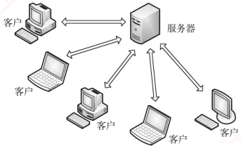
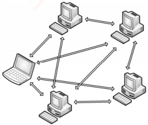

## 6.1 网络应用模型

网络应用模型是计算机网络中用于描述应用程序之间通信方式和结构的框架，主要包括客户/服务器模型（C/S）和对等模型（P2P）两种。

### 6.1.1 客户/服务器模型

### 考点追踪 C/S 模型和 P2P 模型的特点（2019）

在客户/服务器（Client/Server，C/S）模型中，存在一个始终处于开启状态的主机，称为服务器，它负责响应来自多个称为客户的主机的服务请求，如图6.1所示。其工作流程如下：

1）服务器持续处于接收请求的状态。

2）客户主动发起服务请求，并等待接收处理结果。

3）服务器收到请求后，解析并处理该请求，将结果返回给客户。

服务器上运行着专门提供某种服务的程序，能够同时处理多个来自远程或本地客户程序的请求。客户程序必须事先知道服务器程序的地址；而服务器程序启动后便一直不断运行着，被动等待并接收来自各地客户程序的请求。因此，服务器程序无须知道客户程序的地址。
客户/服务器模型的主要特征：客户是服务请求方，服务器是服务提供方。例如，在 Web 应用中，始终运行的 Web 服务器响应运行在客户上的浏览器所发出的请求。当 Web 服务器收到来自客户对某一对象的请求时，会将该对象发送回客户作为响应。采用 C/S 模型的常见应用包括 Web、文件传输协议（FTP）和电子邮件（SMTP/POP3/IMAP）等。

客户/服务器模型的主要特点还包括：

1）网络中各计算机的地位不平等。服务器可通过用户权限控制来管理客户，整个网络的管理工作由少数服务器集中承担，因此管理更加集中和便捷。

2）客户之间通常不直接通信。例如，在 Web 应用中，两个浏览器不会直接交换数据。

3）可扩展性不佳。受服务器性能和网络带宽的制约，单个服务器支持的客户数量有限。

### 6.1.2 P2P 模型

在 C/S 模型中，服务器的性能决定了整个系统的吞吐能力，当面临大量用户请求时，服务器极易成为系统瓶颈。对等（Peer-to-Peer，P2P）模型的思想是：网络中的内容不再集中存储于中心服务器；每个节点同时具备下载和上传的能力，其权利与义务大体是对等的，如图 6.2 所示。

图6.1 C/S 模型

图 6.2 P2P 模型

在 P2P 模型中，各计算机没有固定的客户和服务器角色划分。任意两台计算机——称为对等方（Peer），均可直接相互通信。从实现机制上看，P2P 模型本质上仍基于客户/服务器模式：每个节点访问其他节点资源时扮演客户角色，为其他节点提供资源时又充当服务器角色。

与 C/S 模型相比，P2P 模型的优点主要体现如下：

1）减轻了中心服务器的计算和带宽压力，消除了对单一服务器的依赖，可将任务分散到众多节点上，从而大幅提升系统的整体效率和资源利用率。

2）多个节点之间可直接通信，无须通过中心服务器中转。

3）可扩展性好。传统服务器受限于处理能力和带宽，只能响应有限数量的并发请求，而P2P网络的容量随节点数量的增加而自然增长

4）网络健壮性强。单个节点的失效通常不会影响其他节点的正常运行。

P2P 模型也存在缺点。节点在获取服务的同时，还需为其他节点提供服务，这会占用较多的系统资源（如 CPU、内存和磁盘 I/O），可能影响本机性能。例如，频繁进行 P2P 下载会对硬盘造成较大负担。据某些互联网调研机构统计，在某些年份，P2P 应用曾占互联网流量的 50%～90%，导致网络严重拥塞。因此，各互联网服务提供商（ISP）通常对 P2P 应用持限制或反对态度。
