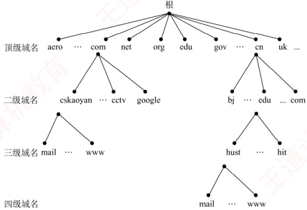
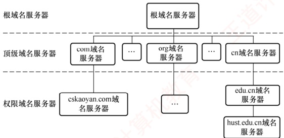
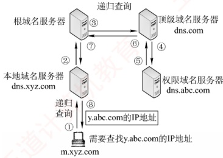
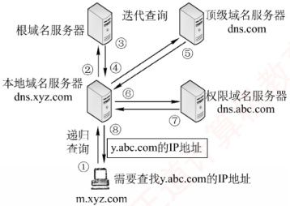

## 6.2 域名系统

### 考点追踪 DNS使用的传输层及以下协议（2018、2021）

域名系统（Domain Name System，DNS）是互联网使用的命名系统，用于将便于人们记忆、具有特定含义的主机名（如 www.cskaoyan.com）转换为便于机器处理的 IP 地址。相比难记的数字形式，人们更倾向于使用具有特定含义的字符串来标识互联网上的计算机。DNS 采用客户/服务器模型，其协议运行在 UDP 之上，使用 53 号端口。

从概念上，DNS可分为三部分：层次域名空间、域名服务器和解析器。

### 6.2.1 层次域名空间

互联网采用层次树状结构的命名方法。按照这种命名方法，任何连接到互联网的主机或路由器都拥有唯一的层次结构名称，即域名（Domain Name）。域（Domain）是名字空间中一个可被管理的划分。域可以进一步划分为子域，子域还可以继续细分，从而形成顶级域、二级域、三级域等层次结构。每个域名由一系列标号组成，各标号之间用点（“.”）分隔。

如图 6.3 所示是王道论坛提供 WWW 服务的服务器域名，它由三个标号组成，其中标号 com 是顶级域名，标号 cskaoyan 是二级域名，标号 www 是三级域名。

图 6.3 一个域名的例子

关于域名中的标号，有以下几点需要注意：

1）标号中的英文字母不区分大小写。

2）标号中除连字符（-）外，不得使用其他标点符号。

3）每个标号不超过63个字符，整个域名（含分隔点）的总长度不得超过255个字符。

4）级别最低的域名写在最左边，级别最高的顶级域名写在最右边。

顶级域名（Top Level Domain，TLD）主要分为以下三大类：

1）国家顶级域名（ccTLD）。代表国家的域名，如“.cn”表示中国，“.us”表示美国。
2）通用顶级域名（gTLD）。常见的包括“.com”（公司）、“.net”（网络服务机构）、“.org”（非营利性组织）、“.edu”（教育机构）和“.gov”（国家或政府机构）等。

3）基础结构域名（arpa）。用于反向域名解析，即将IP地址转换为对应的域名。

图6.4展示了域名空间的树状结构。

图 6.4 域名空间的树状结构

在域名系统中，各级域名由其上一级的域名管理机构管理。顶级域名由互联网名称与数字地址分配机构（ICANN）管理。国家顶级域名下的二级域名由相应国家自行规定和管理。每个组织还可以将其所辖的域进一步划分为若干子域，并将这些子域委托给其他组织管理。例如，负责管理cn域的中国将edu.cn子域授权给中国教育和科研计算机网（CERNET）进行管理。

### 6.2.2 域名服务器

域名到 IP 地址的解析是由运行在域名服务器上的程序完成的。一个服务器负责管辖（或具有管理权限）的范围称为区，其范围小于或等于域。一个区内的所有节点必须是连通的，每个区都设有相应的权限域名服务器（也称授权域名服务器），用于保存该区中所有主机的域名到 IP 地址的映射信息。每个域名服务器不仅要能解析部分域名到 IP 地址的映射，还要能维护指向其他域名服务器的信息；当自身无法完成解析时，要能知道向哪个服务器进一步查询。

DNS 使用大量的域名服务器，它们按层次结构组织。没有任何一台域名服务器包含互联网上所有主机的映射，相反，这些映射分布在所有域名服务器上。有四种类型的域名服务器。

#### 1. 根域名服务器

根域名服务器是 DNS 层次结构中的最高层级。所有根域名服务器都知道全部顶级域名服务器的域名和 IP 地址。无论哪个本地域名服务器需要解析任意域名，只要自身无法解析，就首先向根域名服务器发起查询。全球共有 13 个根域名服务器，每个根域名服务器实际上都是由多个冗余服务器组成的集群，以提高可靠性和性能。根域名服务器用来管辖顶级域（如.com），它通常并不直接将待查询的域名解析为 IP 地址，而是返回下一步应查询的顶级域名服务器的地址。

#### 2. 顶级域名服务器

顶级域名服务器负责管理在其下注册的所有二级域名。例如，.com 顶级域名服务器管理所有以.com 结尾的域名。当收到 DNS 查询请求时，它会返回相应的响应（可能是最终的解析结果，
即目标 IP 地址；也可能是下一步应当查找的域名服务器的 IP 地址）。

#### 3. 权限域名服务器（授权域名服务器）

权限域名服务器负责管理特定区的域名信息。每个主机必须在所属区的权限服务器处登记，该服务器总能将其管辖的主机名解析为对应的IP地址。为提高可靠性，通常建议每个区配置至少两个权限域名服务器。实际上，许多本地域名服务器也同时承担权限域名服务器的角色。

#### 4. 本地域名服务器

本地域名服务器在域名系统中扮演关键角色。每家互联网服务提供商（ISP）、一所大学甚至大学中的各个院系，通常都会部署自己的本地域名服务器。当主机发起 DNS 查询请求时，该请求首先被发送给其配置的本地域名服务器。事实上，在 Windows 系统中配置 “本地连接” 时所填写的 DNS 服务器地址，就是该主机所用的本地域名服务器地址。

DNS 的层次结构如图 6.5 所示。

图 6.5 DNS 的层次结构

### 6.2.3 域名解析过程

### 考点追踪 DNS 协议的功能与意义（2021）

域名解析是指将域名转换为 IP 地址的过程。当客户端需要进行域名解析时，会通过本机的 DNS 客户端构造一个 DNS 请求报文，并以 UDP 数据报的形式发送给本地域名服务器。

域名解析有两种方式：递归查询和迭代查询。

#### （1） 主机向本地域名服务器的查询都采用递归查询

在递归查询中，若本地域名服务器不知道被查询域名的IP地址，则它会以DNS客户的身份，代替主机向其他根域名服务器继续发出查询请求，而不是让主机自行进行后续查询。无论后续采用何种查询方式，主机向本地域名服务器的查询都采用递归查询。

#### （2）本地域名服务器向其他域名服务器可采用递归查询或迭代查询

### 考点追踪 DNS 递归查询机制（2010）

递归查询的过程如图 6.6(a) 所示，本地域名服务器只需向根域名服务器发起一次查询，后续的查询过程由各级域名服务器之间递归完成［步骤③～⑥］。最终，根域名服务器将请求的 IP 地址返回给本地域名服务器（步骤⑦），再由本地域名服务器将结果返回给原始主机（步骤⑧）。由于这种方式会给根域名服务器带来过重负载，实际中几乎不被采用。

### 考点追踪 DNS 迭代查询机制（2016、2020）

本地域名服务器向根域名服务器的查询通常采用迭代查询。当根域名服务器收到本地域名服
务器的迭代查询请求时，要么直接给出所查询的 IP 地址，要么告诉本地域名服务器：“你下一步应向哪个顶级域名服务器查询”。随后，由本地域名服务器向该顶级域名服务器发起新的查询请求。同样，顶级域名服务器收到请求后，要么直接给出所查询的 IP 地址，要么告诉本地域名服务器下一步应当向哪个权限域名服务器查询。如此逐级查询，直到获得目标 IP 地址，最后由本地域名服务器将结果返回给发起查询的主机，如图 6.6(b) 所示。

(a)本地域名服务器采用递归查询

(b) 本地域名服务器采用迭代查询

图 6.6 两种域名解析方式工作原理

下面举例说明域名解析的过程。假设某客户希望获取主机 y.abc.com 的 IP 地址，整个域名解析过程（最多涉及 8 个 UDP 报文：4 个查询报文和 4 个回答报文）如下：

① 客户向其本地域名服务器发送 DNS 请求报文（递归查询）。

②本地域名服务器收到请求后，先查询本地缓存；若未命中，则以DNS客户身份向根域名服务器发送解析请求报文（迭代查询）。

③ 根域名服务器收到请求后，识别该域名属于.com 顶级域，返回.com 顶级域名服务器 dns.com 的 IP 地址。

④ 本地域名服务器向顶级域名服务器 dns.com 发送解析请求报文（迭代查询）。

⑤ 顶级域名服务器 dns.com 收到请求后，识别该域名属于 abc.com 区，返回其权限域名服务器 dns.abc.com 的 IP 地址。

⑥ 本地域名服务器向权限域名服务器 dns.abc.com 发送解析请求报文（迭代查询）。

⑦ 权限域名服务器 dns.abc.com 收到请求后，返回 y.abc.com 对应的 IP 地址。

⑧ 本地域名服务器将结果保存到本地缓存，并返回给客户。

为提高 DNS 查询效率并减少互联网上的查询流量，域名服务器广泛使用 DNS 高速缓存，用于存储近期查询过的域名与 IP 地址的映射。当后续收到相同域名的查询时，服务器可直接从缓存返回结果，无须再次发起完整的解析流程。由于主机名与 IP 地址的映射关系并非永久有效，DNS 缓存中的记录会设置生存时间（TTL），到期后自动失效并被清除。此外，主机端也常维护本地 DNS 缓存，在运行过程中缓存最近访问过的域名。只有当本地缓存未命中时，才会向 DNS 服务器发起查询，从而进一步提升解析速度并减轻网络负载。
