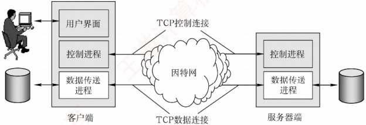

## 6.3 文件传输协议

### 6.3.1 FTP 的工作原理

文件传输协议（File Transfer Protocol，FTP）是互联网上使用最广泛的文件传输协议。FTP 提供交互式访问，允许用户指定文件的类型与格式，并支持对文件设置存取权限。它屏蔽了不同计算机系统的底层细节，因此适用于在异构网络中的任意两台计算机之间可靠地传送文件。

FTP 主要提供以下功能：

① 支持不同类型主机系统（硬件、操作系统等均可不同）之间的文件传输。

② 通过用户权限管理，提供对远程 FTP 服务器上文件的管理能力。

③ 通过匿名（anonymous）FTP 方式，实现公用文件的共享。

### 考点追踪 FTP 在传输层使用的协议（2009、2018）

FTP 采用客户/服务器工作模式，基于 TCP 提供可靠的传输服务。一个 FTP 服务器进程可同时为多个客户进程提供服务。服务器进程由两部分组成：一个主进程，负责接收新请求；另外有若干从属进程，分别处理单个客户的请求。其工作步骤如下：

① 打开熟知端口21（控制端口），供客户进程连接。

② 等待客户进程发起连接请求。

③ 启动从属进程处理该请求，处理完毕后从属进程终止。

④ 主进程返回等待状态，继续接收其他客户请求。主进程与从属进程并发执行。

FTP 是有状态协议，服务器需在整个会话期间维护用户的状态信息。例如，必须将用户账户与控制连接相关联，并跟踪用户在远程目录树中的当前位置。

### 6.3.2 控制连接与数据连接

### 考点追踪 FTP 控制连接和数据连接的特点（2017、2023）

FTP 在工作时使用两个并行的 TCP 连接（见图 6.7）：控制连接（服务器端口 21）和数据连
接（服务器端口20）。采用两个独立端口有助于协议的清晰实现。

图 6.7 控制连接和数据连接

#### 1. 控制连接

### 考点追踪 FTP 控制连接的功能（2009）

服务器监听 21 号端口，等待客户连接。建立在此端口上的连接称为控制连接，用于传输控制命令（如登录、目录操作、传送命令等）。FTP 客户通过控制连接向服务器发送文件传送请求，但控制连接本身不用于传输文件数据。在文件传输过程中，仍可通过控制连接发送中断等指令，因此控制连接在整个会话期间保持打开状态。

#### 2. 数据连接

当服务器的控制进程收到客户发来的文件传输请求后，会创建一个数据传送进程并建立数据连接。该连接用于客户端与服务器端的数据传送进程之间的通信，实际完成文件内容的传输。传输结束后，数据连接关闭，数据传送进程随之终止。

数据连接支持两种传输模式：主动模式（PORT）和被动模式（PASV）。

PORT 模式：客户端首先连接服务器的 21 号端口，并完成登录。需要传输数据时，客户端随机选择一个本地端口，并通过 PORT 命令将该端口告知服务器。随后，服务器通过 20 号端口主动连接到客户端指定的端口以传输数据。

PASV 模式：客户端登录后发送 PASV 命令。服务器收到后，在本地随机开放一个端口，并通过控制连接将该端口号返回给客户端。客户端再主动连接到该端口以传输数据。

可见，两种模式的区别在于：是服务器主动连接客户端（主动模式）还是服务器被动响应客户端的连接（被动模式），由客户端决定。

**注意**

许多教材未详细介绍这两种模式。若无特别说明，可默认采用 **主动模式**。

由于 FTP 使用独立的控制连接传输命令，其控制信息属于带外（Out-of-band）传送。使用 FTP 修改远程文件时，需先将文件下载到本地，修改后再传回服务器，整个过程涉及两次完整传输，效率较低。网络文件系统（NFS）采用不同的思路：它允许进程直接打开远程文件，并在指定位置进行读/写操作。这样，用户只需传输大文件中的特定片段，而无须复制整个文件。
