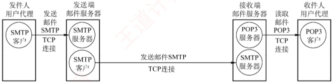
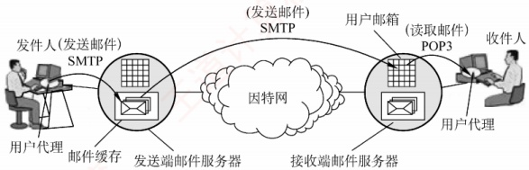
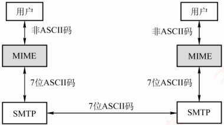

## 6.4 电子邮件

### 6.4.1 电子邮件系统的组成结构

自从互联网普及以来，电子邮件便迅速流行起来。作为一种异步通信方式，电子邮件不要求通信双方同时在线。发送端将邮件发送至收件人所用的邮件服务器，并存入其邮箱，收件人可随时登录自己的邮件服务器读取邮件。

完整的电子邮件系统应包含如图 6.8 所示的三个主要组成部分：用户代理（User Agent）、邮件服务器，以及电子邮件所依赖的协议（如 SMTP、POP3 或 IMAP 等）。

图 6.8 电子邮件系统的主要组成部分

用户代理（UA）：这是用户与电子邮件系统之间的接口。用户代理为用户提供友好的操作界面，用于发送和接收邮件，至少应具备撰写、显示和处理邮件等基本功能。通常，用户代理是运行在个人计算机上的电子邮件客户端软件，如 Outlook、Foxmail 等。

邮件服务器：负责邮件的发送与接收，并向发件人反馈邮件传送状态（如已投递、被拒收或丢失等）。邮件服务器采用客户/服务器模式工作，但需具备双重角色：既能作为服务器接收邮件，又能作为客户发送邮件。例如，当邮件服务器A向邮件服务器B发送邮件时，A扮演SMTP客户，B则作为SMTP服务器；反之亦然。

### 考点追踪 邮件发送和读取协议的功能（2012）

邮件发送协议和读取协议：用户代理使用邮件发送协议向邮件服务器发送邮件，或在邮件服务器之间传递邮件，典型代表是 SMTP；用户代理使用邮件读取协议从邮件服务器获取邮件，如 POP3 或 IMAP。注意，SMTP 采用推（Push）的方式，即用户代理或发送端邮件服务器主动将邮件推送至目标服务器；而 POP3 采用拉（Pull）的方式，即用户代理读取邮件时，主动向服务器发起请求，拉取邮箱中的邮件。
电子邮件的发送与接收过程可简化为如图6.9所示。

图 6.9 电子邮件的发送、接收过程

下面简单介绍电子邮件的收发过程。

① 发件人通过用户代理撰写和编辑待发送的邮件。

② 邮件撰写完后，发件人点击“发送”按钮，后续发送工作由用户代理自动完成。用户代理使用 SMTP 协议将邮件传送给发送端的邮件服务器。

③ 发送端邮件服务器将邮件暂存在邮件缓存队列中，等待发送。

④ 发送端邮件服务器的 SMTP 客户端与接收端邮件服务器的 SMTP 服务器建立 TCP 连接，并依次将缓存队列中的邮件直接发送至接收端邮件服务器。

⑤ 接收端邮件服务器中的 SMTP 服务器进程收到邮件后，将其存入对应收件人的邮箱，等待收件人读取。

⑥ 当收件人准备查收邮件时，启动用户代理，通过 POP3（或 IMAP）协议从接收端邮件服务器的邮箱中下载邮件（前提是邮箱中有新邮件）。

### 6.4.2 电子邮件格式与 MIME

#### 1. 电子邮件格式

一封电子邮件由信封和内容两大部分组成，其中邮件内容又分为首部和主体两部分。RFC 822规定了邮件首部的格式，而主体部分则由用户自由撰写。用户只需填写首部信息，邮件系统便会自动从中提取所需信息并生成信封，无须用户手动填写信封内容。

邮件内容的首部由若干首部行构成，每行由一个关键字、冒号及对应的值组成。其中有些关键字是必需的，有些则是可选的。最重要的关键字包括 To 和 Subject。

To 是必填关键字，用于指定一个或多个收件人的电子邮件地址。电子邮件地址的格式为：收件人邮箱名@邮箱所在主机的域名，例如 abc@cskaoyan.com。其中，邮箱名 abc 在 cskaoyan.com 所对应的邮件服务器上必须是唯一的，从而确保该地址在整个互联网范围内是唯一的。

Subject 是可选关键字，用于标明邮件的主题，简要反映邮件的主要内容。

此外，还有一个必填的关键字是 From，但通常由邮件系统自动填充，用户一般无须手动输入。首部与主体之间以一个空行分隔。典型的邮件内容示例如下：

From: fh@hit.edu.cn
To: abc@cskaoyan.com
Subject: Say hello to Internet

___首部
blahblah…
...
___主体
#### 2. 多用途互联网邮件扩展（MIME）

### 考点追踪 SMTP 协议的特点（2018）

由于 SMTP 协议仅支持传输 7 位 ASCII 码文本邮件，因此无法直接传送非英语字符（如中文、俄文，甚至带重音符号的法文或德文），也无法传输可执行文件或其他二进制对象。为解决这一限制，提出了多用途互联网邮件扩展（Multipurpose Internet Mail Extensions，MIME）。

MIME 并未修改或取代 SMTP，而是在其基础上进行扩展。当发送端需要传输包含非 ASCII 数据的邮件时，不能直接通过 SMTP 发送，而要先用 MIME 将非 ASCII 数据编码为 ASCII 格式，再交由 SMTP 传输。接收端收到邮件后，再通过 MIME 对 ASCII 数据进行解码还原，进而恢复原始的非 ASCII 内容。MIME 与 SMTP 的关系如图 6.10 所示。

图 6.10 SMTP 与 MIME 的关系

MIME 主要包括以下三部分内容：

① 定义了 5 个新的首部字段：MIME 版本、内容描述、内容标识、传送编码和内容类型。

②标准化了多种邮件内容的格式，为多媒体电子邮件的表示方法提供了统一规范。

③ 定义了传送编码机制，能够对任意类型的内容进行编码转换，而不会被邮件系统改变。

### 6.4.3 SMTP 和 POP3

#### 1. SMTP

### 考点追踪 SMTP 协议的功能与特点（2013-2015、2025）

简单邮件传输协议（Simple Mail Transfer Protocol，SMTP）是一种用于提供可靠且高效电子邮件传输的协议，它规范了两个相互通信的SMTP进程之间如何交换信息。SMTP采用客户/服务器模式：负责发送邮件的进程作为SMTP客户，而负责接收邮件的进程则作为SMTP服务器。SMTP基于TCP连接，使用熟知端口号25。其通信过程可分为以下三个阶段。

#### （1） 连接建立

当发件人的邮件被送入发送端邮件服务器的缓存队列后，SMTP客户会定期扫描该队列。一旦发现待发邮件，便主动与接收端邮件服务器的SMTP服务器建立TCP连接（目标端口为25）。连接成功后，接收端SMTP服务器首先发送220 Service ready（服务就绪）。随后，SMTP客户向服务器发送HFI.O命令，并附上发送端的主机名，以标识自身身份。

要注意的是，SMTP不使用中间邮件服务器进行中转。TCP连接始终在发送端与接收端的邮件服务器之间直接建立，不论二者的地理位置相距多远，也不论数据需要经过多少个路由器。若接收端邮件服务器因故障暂时无法响应，则发送端邮件服务器将等待一段时间后重新尝试连接。

#### （2） 邮件传送

连接建立后，即可开始邮件传输。该过程以 MAIL 命令开始，其后跟随发件人地址。例如，
MAIL FROM: <fh@hit.edu.cn>。若 SMTP 服务器已准备好接收邮件，则返回 250 OK。随后，客户端发送一个或多个 RCPT 命令，格式为 RCPT TO: <收件人地址>。每个 RCPT 命令都会触发服务器的响应，如 250 OK（连接成功）或 550 No such user here（无此用户）。

RCPT 命令的作用是预先验证收件人地址的有效性，确保接收端系统已做好接收准备，进而避免在发送长篇邮件后才发现地址错误，造成通信资源浪费。

收到所有 RCPT 命令的肯定响应后，客户端发送 DATA 命令，表示即将传送邮件内容。服务器正常情况下会回复：354 Start mail input; end with <CRLF>.<CRLF>。<CRLF>。<CRLF>表示回车换行符。此后，SMTP 客户开始逐行发送邮件内容，并用<CRLF><CRLF>作为邮件内容的结束标志。

#### （3） 连接释放

邮件发送完成后，SMTP 客户应发送 QUIT 命令。SMTP 服务器返回的信息是 221（服务关闭），表示同意释放 TCP 连接。至此，本次邮件传送过程全部结束。

#### 2. POP3 和 IMAP

### 考点追踪 POP3 协议的功能与特点（2015、2018、2025）

邮局协议（Post Office Protocol，POP）是一种结构简单但功能有限的邮件读取协议，目前使用的是 POP3 版。POP3 同样采用客户/服务器模式，在传输层基于 TCP，使用端口号 110。

用户代理需运行 POP3 客户程序，对应的邮件服务器则运行 POP3 服务器程序。POP3 支持两种工作模式：① 下载并保留，用户从服务器读取邮件后，邮件仍保留在服务器上，可供后续再次访问；② 下载并删除，邮件一旦被成功读取，即从服务器上删除。

另一种邮件读取协议是互联网报文存取协议（IMAP）。与 POP3 相比，IMAP 的功能更强大：它支持用户在服务器端创建文件夹、在不同文件夹之间移动邮件，以及对远程邮箱中的邮件进行搜索等在线操作。为此，IMAP 服务器需要维护用户的会话状态信息。

此外，IMAP 还支持选择性获取邮件内容，即用户代理可以只下载邮件的特定部分。例如只获取其首部，或只提取多部分 MIME 邮件中的某部分。这一特性在低带宽环境下尤为实用：用户无须下载整封包含音频、视频等大附件的邮件，即可快速浏览或筛选内容。

此外，随着万维网（WWW）的普及，出现了大量基于 Web 的电子邮件服务，如 Hotmail、Gmail 等。这类服务的特点是，用户浏览器与邮件服务器之间的交互（包括发送和读取邮件）均通过 HTTP 完成，而仅在不同邮件服务器之间传递邮件时才使用 SMTP。
