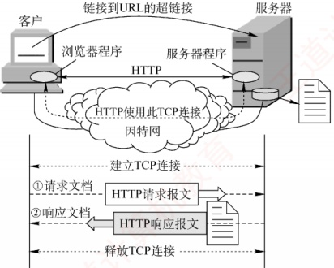
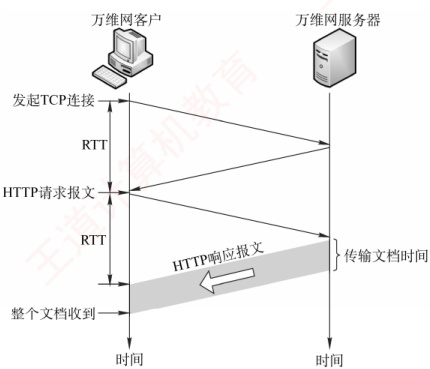
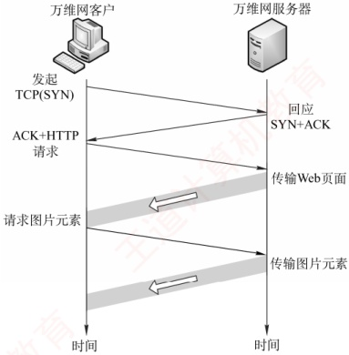
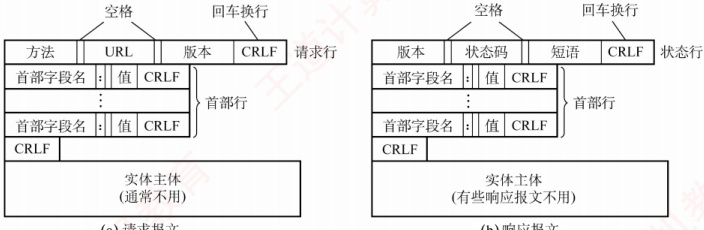
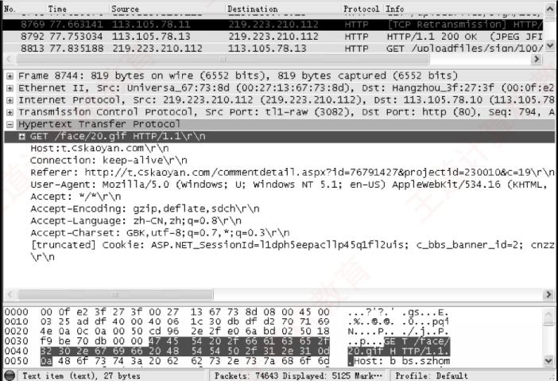

## 6.5 万维网

### 6.5.1 万维网的概念与组成结构

万维网（World Wide Web，WWW）是一个分布式、联机式的信息存储空间。在这个空间中，任何有用的事物都被称为资源，并由一个统一资源定位符（URL）唯一标识。这些资源通过超文本传输协议（HTTP）传送给用户，用户只需单击超链接即可获取所需内容。

万维网通过超链接的方式，能够非常便捷地从互联网上的一个站点跳转到另一个站点，从而主动、按需地获取丰富的信息。超文本标记语言（HTML）使网页设计者能够方便地通过超链接从本页面的某处指向互联网上的任何其他页面，并在用户的计算机屏幕上显示这些内容。
### 考点追踪 HTTP 使用的传输层协议（2018）

万维网的核心由以下三个标准构成：

1）统一资源定位符（URL）。用于标识万维网上的各类文档，确保每个文档在整个万维网范围内拥有唯一的URL标识符。

2）超文本传输协议（HTTP）。一种应用层协议，基于 TCP 连接提供可靠的数据传输。HTTP 是万维网客户程序与服务器程序之间交互时必须严格遵循的通信协议。

3）超文本标记语言（HTML）。一种用于描述文档结构的标记语言，通过预定义的标记对页面中的各种信息（包括文字、声音、图像、视频等）及其格式进行组织和呈现。

URL 是对互联网上可获取资源的位置及访问方式的一种简洁表示，可视为传统文件名在网络范围内的扩展。URL 的一般形式为

 $$<协议>:\begin{aligned}&//< 主机 >:\begin{aligned}&\lessdot<端口 \end{aligned}>/\left<路径 \right>。\end{aligned}$$

<协议>指明获取资源所用的协议，常见的有 http、https、ftp 等；<主机>是存放资源的主机在互联网中的域名或 IP 地址；<端口>和<路径>在某些情况下可以省略（如 HTTP 默认端口为 80，路径默认为根目录）。URL 中的字符通常不区分大小写。

万维网是由无数网络站点和网页组成的集合，构成了互联网最主要的应用部分（互联网还包括电子邮件、Usenet和新闻组等）。万维网采用客户/服务器模式工作：用户主机上运行的浏览器作为万维网客户程序，而存放万维网文档的主机则运行服务器程序，该主机被称为万维网服务器。客户程序向服务器发起请求，服务器则将用户请求的网页文档返回给客户端。

### 6.5.2 超文本传输协议

超文本传输协议（HTTP）定义了浏览器（万维网客户进程）如何向万维网服务器请求文档，以及服务器如何将文档传送给浏览器。从协议层次来看，HTTP 是一种面向事务（transaction-oriented）的应用层协议，规定了浏览器与服务器之间请求与响应的格式和交互规则，是万维网上可靠交换各类文件（包括文本、声音、图像等多媒体内容）的重要基础。

#### 1. HTTP 的操作过程

从协议执行流程来看，当浏览器要访问某个 WWW 服务器时，首先需完成对该服务器域名的解析。一旦获得其 IP 地址，浏览器便通过 TCP 向该服务器发起连接建立请求。

万维网的大致工作过程如图 6.11 所示。



图 6.11 万维网的工作过程

每个万维网站点都运行一个服务器进程，持续监听 TCP 端口 80（默认）。当监听到连接请求时，服务器便与浏览器建立 TCP 连接。随后，浏览器向服务器发送 HTTP 请求，以获取指定的 Web 页面。服务器收到请求后，组装所请求页面所需的资源，并通过 HTTP 响应返回给浏览器。浏览器对收到的内容进行解析，并将最终的 Web 页面呈现给用户。最后，TCP 连接被释放。

### 考点追踪 Web 浏览涉及的核心协议栈（2014、2021）

用户单击鼠标后所发生的事件顺序如下（以访问清华大学网站为例）：

1）用户在浏览器地址栏中输入 URL：http://www.tsinghua.edu.cn/index.htm。

2）浏览器向 DNS 服务器请求解析 www.tsinghua.edu.cn 的 IP 地址。

3）DNS 系统返回清华大学服务器的 IP 地址。

4）浏览器与该服务器建立 TCP 连接（默认端口号为 80）。

5）浏览器发出 HTTP 请求：GET /index.htm。

6）服务器通过 HTTP 响应把文件 index.htm 发送给浏览器。

7）释放 TCP 连接。

8）浏览器解析 index.htm 文件，并将 Web 页面显示给用户。

上述过程仅为简化描述。实际上，整个通信可能涉及 TCP/IP 体系结构中的多种协议：应用层的 DHCP、DNS 和 HTTP，传输层的 UDP 与 TCP，网际层的 IP 和 ARP，以及数据链路层的 CSMA/CD 协议或 PPP（涉及 ISP 接入或广域网传输时）等。本节主要聚焦于 HTTP。

#### 2. HTTP 的特点

HTTP 使用 TCP 作为传输层协议，从而保证了数据的可靠传输。因此，HTTP 无须关心数据在传输过程中是否丢失或如何重传。但需特别注意：HTTP 本身是无连接的。也就是说，尽管底层使用了 TCP 连接，但在交换 HTTP 报文之前，并不需要建立专门的 “HTTP 连接”。

此外，HTTP 是无状态的。这意味着，当同一客户第二次访问服务器上的某个页面时，服务器的响应与第一次完全相同，因为它并不记录此前与该客户的交互历史。

### 考点追踪 Cookie 的工作原理（2015）

HTTP 的无状态特性简化了服务器设计，使其更易于支持大量并发请求。在实际应用中，通常结合 Cookie 与数据库来实现用户行为跟踪（如记录用户最近浏览的商品等）。

Cookie 的工作原理：当用户首次访问某个启用 Cookie 的网站时，服务器会为其生成唯一的 Cookie 识别码，如 “12345”，并以此为索引在后端数据库中创建一个记录，用于存储该用户的访问信息。随后，服务器在 HTTP 响应报文中添加一个 Set-cookie 首部行：“Set-cookie:12345”。用户代理（浏览器）收到响应后，会将 Cookie 识别码连同服务器域名一起保存在其本地的 Cookie 文件中。当用户再次访问该网站时，浏览器会在 HTTP 请求报文中自动附加一个 Cookie 首部行：“Cookie:12345”。服务器根据 Cookie 识别码即可从数据库中检索出该用户的活动记录，从而提供一些个性化服务，例如基于历史浏览记录向用户推荐新商品等。

HTTP/1.0 仅支持非持续连接，而其升级版本 HTTP/1.1 支持持续连接（默认启用）。

### 考点追踪 HTTP/1.0 页面加载时延分析（2020、2024）

在非持续连接模式下，每个网页元素（如 JPEG 图像、Flash 动画等）的传输都需要单独建立一个 TCP 连接，如图 6.12 所示（客户端通常在 TCP 第三次握手的 ACK 报文中捎带 HTTP 请求；若未捎带，则会紧随其后立即发送，其间的时间间隔可以忽略不计）。请求一个 Web 文档所需的时间 = 文档传输时间（与文档大小成正比）+ 2×RTT（一个 RTT 用于完成建立 TCP 连接的前两次握手，另一个 RTT 用于发送请求并接收响应）。每个对象的获取都需承担 2RTT 的开销，为
减小时延，现代浏览器通常创建多个并行 TCP 连接，以同时请求多个对象。

所谓持续连接，是指服务器在发送响应后仍保持该 TCP 连接，使得同一客户可继续通过该连接发送后续的 HTTP 请求并接收响应，如图 6.13 所示。在实际应用中，浏览器先通过该连接请求并接收 Web 页面（通常是 HTML 文档），解析后发现其中引用的图像等资源，即可复用该连接请求这些资源，从而避免为每个资源重新建连接的开销。



图 6.12 请求一个万维网文档所需的时间



图 6.13 使用持续连接（非流水线）

HTTP/1.1 的持续连接又分为非流水线和流水线两种工作方式。

### 考点追踪 HTTP/1.1 页面加载时延分析（2011、2022）

在非流水线方式中，客户端必须等待前一个响应到达后才能发送下一个请求，导致服务器发送完一个对象后，TCP连接处于空闲状态，造成资源浪费。而在流水线方式中，客户可连续发送多个对象的请求，服务器也能连续发送响应。若所有请求与响应均能连续传输，则获取全部引用对象仅需1RTT，而不像非流水线方式下那样，每个对象均需1RTT。这种方式显著减少了连接空闲时间，提升了效率。需要注意的是，由于HTTP基于TCP，实际传输时间还受TCP发送窗口和拥塞控制机制的影响 $^{①}$。

#### 3. HTTP 的报文结构

### 考点追踪 HTTP 常用请求方法及功能（2015）

HTTP 是面向文本的（Text-Oriented），其报文中的每个字段均为 ASCII 字符串，且字段长度不固定。HTTP 报文分为两类：

请求报文：从客户向服务器发送的请求报文，如图 6.14(a) 所示。

响应报文：从服务器到客户的回答，如图6.14(b)所示。

如图 6.14 所示，两类报文均由三部分组成，区别仅在于开始行的不同。

开始行：请求报文中的开始行称为请求行，响应报文中的开始行称为状态行。开始行的三个字段之间以空格分隔，行末以回车换行符（CRLF）结束。

首部行：用于传递关于浏览器、服务器或报文主体的附加信息。首部可包含多行，也可为空。每行由“字段名：值”构成，行末同样以CRLF结束。所有首部行结束后，还需
要用一个空行（仅含 CRLF）分隔首部行与后面的实体主体。

实体主体：请求报文中通常没有这个字段；响应报文中也可能没有这个字段。



(a) 请求报文

(b)响应报文

图 6.14 HTTP 的报文结构

请求行包含三个字段：方法、请求资源的 URL 和 HTTP 版本。其中，“方法”指明对目标资源的操作类型，本质上是一条命令。表 6.1 列出了常用的几种方法。

表6.1 HTTP 请求报文中常用的几个方法

| 方法（操作） | 意 义 |
| --- | --- |
| GET | 请求读取由 URL 标识的信息 |
| HEAD | 请求读取由 URL 标识的信息的首部 |
| POST | 给服务器添加信息（如注释） |
| PUT | 在指定 URL 处存储一个文档 |
| DELETE | 删除由 URL 标识的资源 |
| CONNECT | 用于代理服务器 |

下面是一个典型的 HTTP 请求报文：

```c
GET /bbs/index.htm HTTP/1.1 {指明方法“GET”、相对URL、HTTP 版本}

Host: www.cskaoyan.com {指明服务器的域名}

Connection: Keep-Alive {要求服务器在发送完被请求的文档后保持这条连接}

User-Agent: Mozilla/5.0 {表明用户代理是浏览器 Mozilla/5.0}

Accept-Language: cn {表示用户希望优先得到中文版本的文档} {请求报文的最后还有一个空行}
```

第1行是请求行，其中使用的是相对URL，因为下面的Host首部行已指明服务器域名。第3行“Connection: Keep-Alive”告诉服务器使用持续连接，即要求其在发送完文档后保持该TCP连接；若需使用非持续连接，则应将该首部行设为“Connection: close”。

HTTP 响应报文的第 1 行是状态行，包含三个内容：HTTP 版本、状态码和解释状态码的短语。以下是 HTTP 响应报文中常见的三种状态行：

```c
HTTP/1.1 202 Accepted {接受请求}

HTTP/1.1 400 Bad Request {错误的请求}

HTTP/1.1 404 Not Found {找不到页面}
```

#### 4. 代理服务器

代理服务器（proxy server）将近期的一些请求与响应暂存在本地磁盘上，也称为万维网高速缓存（Web cache）。新请求到达时，若代理服务器发现该请求与暂存的请求相同，便直接返回缓
存的响应，而无须再次通过互联网访问原始服务器。代理服务器可部署在客户端、服务器端或网络中间节点上。在内网中设置代理服务器后，就能将相当大一部分的通信流量限制在内网内部，从而显著减少内网通往互联网的链路负载，降低访问互联网的延迟。

#### 5. HTTP 请求报文举例

图 6.15 展示了使用 Wireshark 软件捕获的一个 HTTP 请求报文。



图 6.15 用 Wireshark 捕获的一个 HTTP 请求报文

根据帧的结构定义，在图 6.15 的以太网数据帧中，第 1～6 字节为目的 MAC 地址（默认网关地址），值为 00-0f-e2-3f-27-3f；第 7～12 字节为源 MAC 地址（本机地址），值为 00-27-13-67-73-8d；第 13～14 字节为类型字段，值为 08 00，表示上层协议为 IP。第 15～34 字节（共 20B）为 IP 数据报首部，其中第 27～30 字节为源 IP 地址，十六进制数为 db df d2 70，转换成十进制数为 219.223.210.112；第 31～34 字节为目的 IP 地址，十六进制为 71 69 4e 0a，转换成十进制数为 113.105.78.10。第 35～54 字节（共 20B）为 TCP 报文段首部。

从第 55 字节开始为 TCP 数据部分（图中阴影区域），即应用层传递下来的数据（本例中为 HTTP 请求报文）。其中，GET 对应请求行的方法，/face/20.gif 为请求的 URL，HTTP/1.1 为协议版本。左侧数字为对应字符的 ASCII 码值，例如：'G' = 0x47、'E' = 0x45、'T' = 0x54 等。建议读者自行了解图 6.15 中的请求报文各首部字段的含义，或动手抓包实践分析。

常见应用层协议小结如表6.2所示。

表6.2 常见应用层协议小结

| 应用程序 | FTP 数据连接 | FTP 控制连接 | TELNET | SMTP | DNS | TFTP | HTTP | POP3 | SNMP |
| --- | --- | --- | --- | --- | --- | --- | --- | --- | --- |
| 使用协议 | TCP | TCP | TCP | TCP | UDP | UDP | TCP | TCP | UDP |
| 熟知端口号 | 20 | 21 | 23 | 25 | 53 | 69 | 80 | 110 | 161 |

